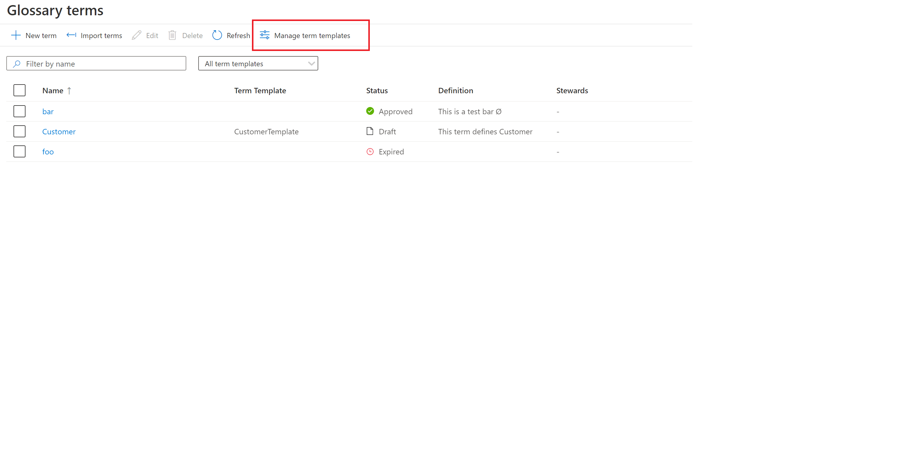
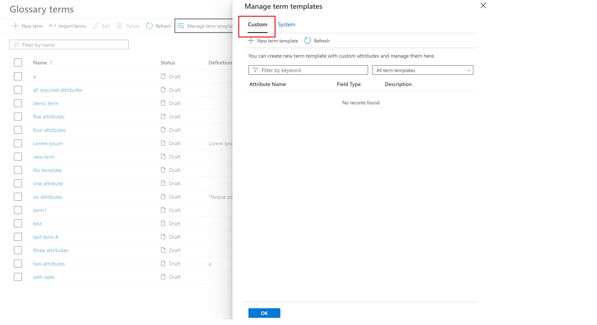
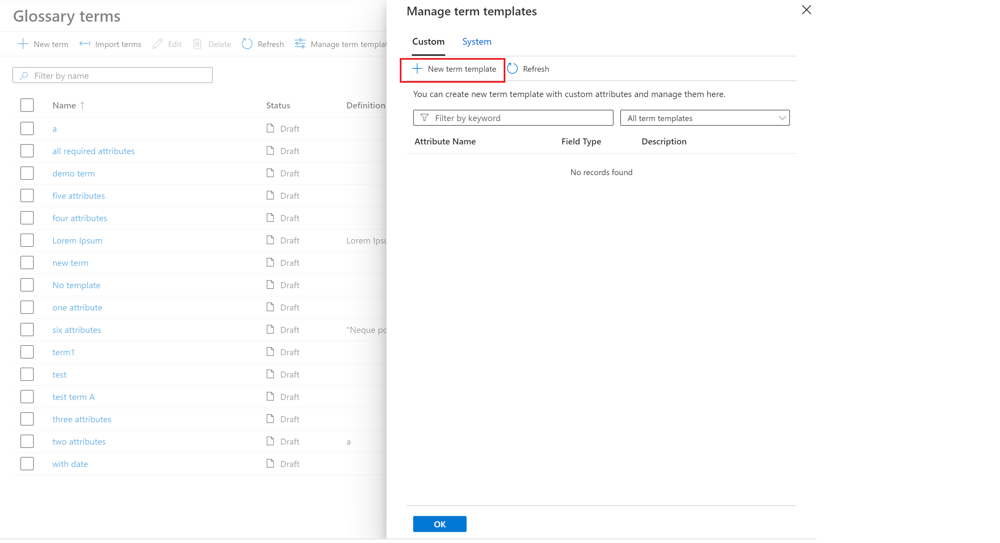
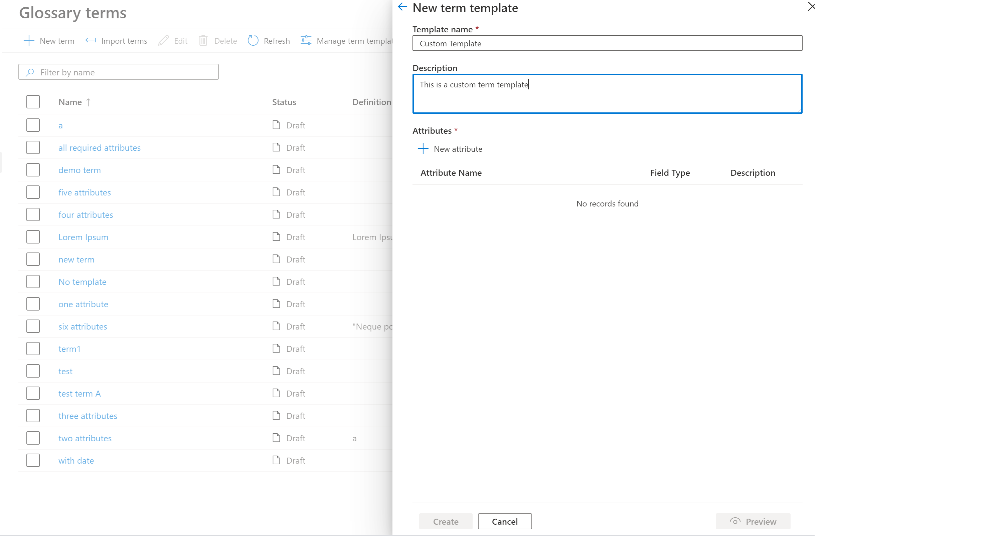
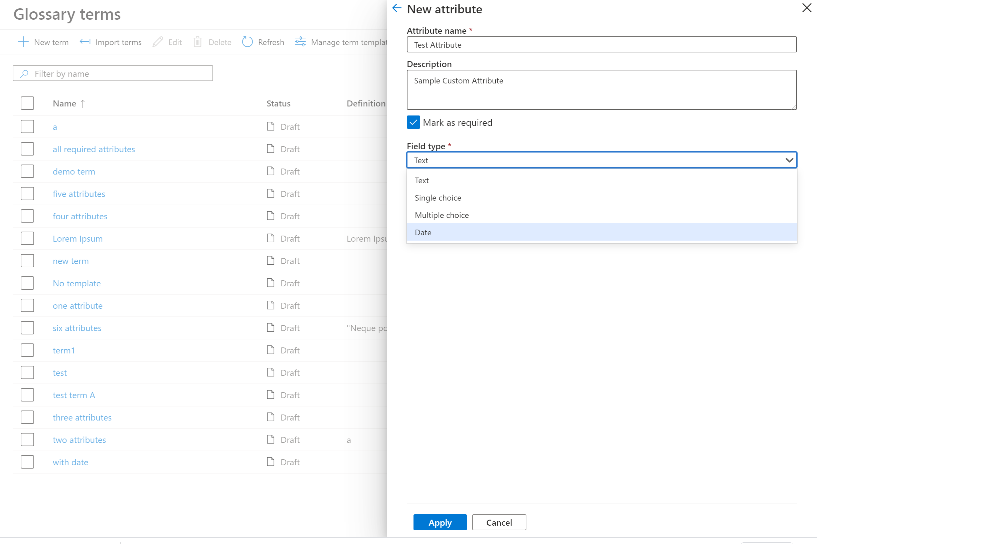
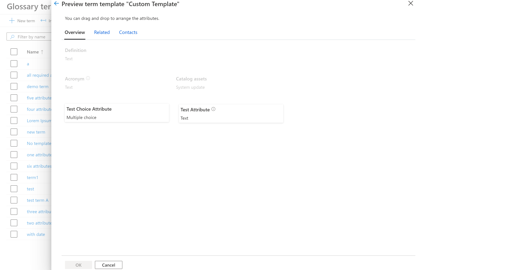
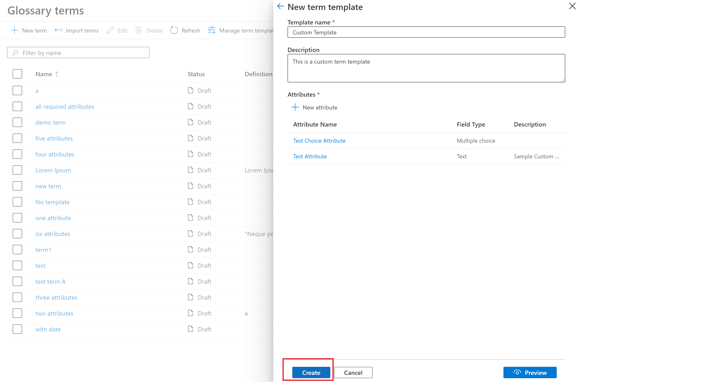
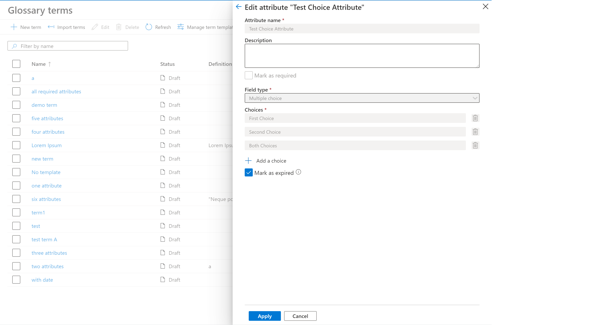

# How to manage term templates for business glossary

This guide outlines how to create a term template and custom attributes which can be associated to glossary terms.

## Manage term templates and custom attributes

This feature allows customers to templatize terms. You can create custom attributes, group them together and apply a template while creating terms. Once a term is created the template associated with the term cannot be changed. 

1. On the Terms List page, select **Manage term templates**. 

  

2. This page will show both system as well as custom attributes. Select the **custom** tab to create/edit term templates.

   

3. Select **New Term Template** and enter template name and description.

   

   

4. Select **New Attribute** to create a new custom attribute for the term template. You need to enter attribute name, description, field type (Text/Single Choice/Multi Choice/ Date). The attribute can also be marked as required. The custom attribute name must be unique within a term template but can be same name can be reused across templates. You can also select default value for Text field types.
		
   
	
5. Once all the custom attributes are created, select **Preview** to arrange the sequence of custom attributes. You can drag and drop custom attributes in the desired sequence.

   

6. Once all the custom attributes are defined, select **Create** to create a term template with custom attributes.

   

7. The exisiting custom attributes can be marked as expired by checking **Mark as Expired**. Once expired, the attribute cannot be re-activated. The expired attribute will be greyed out for existing terms and the all the new terms	created with the term template with expired attribute will not show that attribute.

   