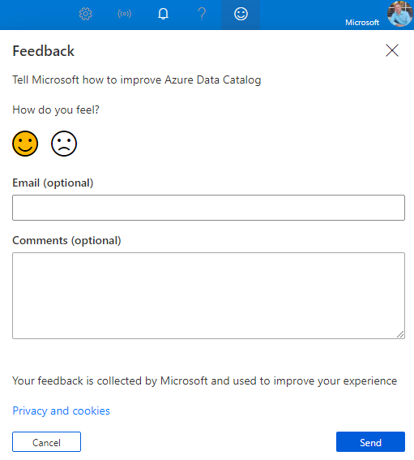
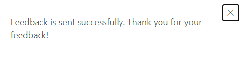

# Provide feedback on Babylon preview

Babylon Private Preview is a great opportunity for you to let us know what is and is not working well for you. By providing direct feedback to Microsoft, you can help us understand what Project Babylon functionality you value and what we need to change.

You can provide feedback in any of three ways:

1.  Send email to *BabylonDiscussion@Microsoft.com*. You message goes directly to the entire Babylon team.

2.  Use the feedback feature in the Babylon user interface.

3.  Participate in Microsoft-sponsored research studies, scheduled
    webinars, and other feedback opportunities.

## Use the smiley face in the feedback feature

The two smiley face options suggest the type of feedback you might want to provide: 

 
* Ask questions about how a feature or certain functionality works or is planned to work. Be sure to prefix your feedback with “QUESTION:”. 
* Provide specific feedback on what works well for you.

 
* Provide specific feedback on something that isn’t working well.
* Provide additional details about any changes you might suggest. Be sure to prefix your feedback with “SUGGESTION:”.

> [!TIP]
> If you’re reporting a bug, it’s helpful to include your email address. You can also email us at *BabylonDiscussion@Microsoft.com*. You can attach any screenshots, provide steps for reproducing the issue, and detail any conditions that might apply. Be sure to prefix your feedback with “BUG:”. 

## Leave feedback

The feedback control is at the top of your browser window, next to your sign-in name.

1. Select the smiley face to open the **Feedback** pane.

   

1. Select either of the two smiley face options:

   

1. Share with us your email address or leave the box blank for anonymity.

1. Leave your feedback in the **Comments** section.

1. Select **Send**.

   After you've submitted your feedback, a confirmation message is displayed.

   
