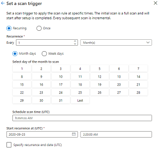

# Register and scan an Azure SQL Database

This article outlines how to register an Azure SQL Database data source in Babylon and set up a scan on it.

## Supported Capabilities

The Azure SQL Database data source supports the following functionality:

- **Full and incremental scans** to capture metadata and classification in Azure SQL Database.

- **Lineage** between data assets for ADF copy and dataflow activities.

## Prerequisites

1. Create a new Babylon account if you don't already have one.

1. Networking access between the Babylon account and Azure SQL Database.

1. Authentication to scan Azure SQL Database. There are three authentication methods that Babylon supports today:

    > [!Note]
    > Only the server-level principal login (created by the provisioning process) or members of the `loginmanager` database role in the master database can create new logins. It takes about 15 minutes after granting permission, the Babylon account should have the appropriate permissions to be able to scan the resource(s).
    
   1. **SQL authentication:** You can follow the instructions in [CREATE LOGIN](https://docs.microsoft.com/sql/t-sql/statements/create-login-transact-sql?view=azuresqldb-current&preserve-view=true#examples-1) to create a login for Azure SQL Database. 

   1. **Service Principal:** You need to [create an Azure AD application and service principal that can access resources if you don't have one already](https://docs.microsoft.com/azure/active-directory/develop/howto-create-service-principal-portal). In addition, you must also create an Azure AD user in Azure SQL Database by following the prerequisites and tutorial on [Create Azure AD users using Azure AD applications](https://docs.microsoft.com/azure/azure-sql/database/authentication-aad-service-principal-tutorial). Example SQL syntax to create user and grant permission:
   
   ```sql
   CREATE USER [ServicePrincipalName] FROM EXTERNAL PROVIDER
   GO

   EXEC sp_addrolemember 'db_owner', [ServicePrincipalName]
   GO
   ```

   > [!Note]
   > Babylon will need the **Application (client) ID** and the **client secret** in order to scan.

   1. **Managed Identity:** Your Babylon account has its own Managed Identity which is basically your Babylon name when you created it. You must create an Azure AD user in Azure SQL Database with the exact Babylon's Managed Identity name by following the prerequisites and tutorial on [Create Azure AD users using Azure AD applications](https://docs.microsoft.com/azure/azure-sql/database/authentication-aad-service-principal-tutorial). Example SQL syntax to create user and grant permission:
   
   ```sql
   CREATE USER [BabylonManagedIdentity] FROM EXTERNAL PROVIDER
   GO

   EXEC sp_addrolemember 'db_owner', [BabylonManagedIdentity]
   GO
   ```

1. The authentication must have permission to get metadata for the database, schemas and tables. It must also be able to query the tables to sample for classification. The recommendation is to assign `db_owner` permission to the identity.

## Register an Azure SQL Database data source

1. Navigate to your Babylon catalog.

2. Select on **Manage your data** tile on the home page.


3. Select on **Data sources** under the Sources and scanning section.

4. Select **New** to register a new data source. 

5. Select **Azure SQL Database** and then **Continue**

    

6. Pick the server name from the dropdown menu from your Azure subscription or provide a friendly name and server endpoint with port number via manual enter. Then select **Finish** to register the data source.

    

    E.g. `foobar.database.windows.net,1433`

## Creating and running a scan

1. Navigate to the management center and select **Data sources** under the **Sources and scanning** section

1. Select the Azure SQL Database data source that you registered.

1. Select **+ New scan**

1. Select the authentication method. For 

   1. **SQL authentication:** You will need database name, user name and password.

      

   1. **Service Principal:** Select Service Principal from the dropdown menu and provide database name service principal ID which is your **Application client (ID)** and service principal key which is your **client secret**.
   
      

      > [!Note]
      > If Test connection fails, you need to go back to the **Prerequisites** step to confirm if the appropriate permission is assigned to the service principal. In addition, the server name must have port number to successfully connect.

   1. **Managed Identity:** You just need to select Managed Identity from the drop down menu and test connection.
   
      

1. You can scope your scan to specific schemas by checking the appropriate items in the list.

    

1. Choose your scan trigger. You can set up a schedule or run the scan once.

    

1. The select a scan rule set for you scan. You can choose between the system default, the existing custom ones or create a new one inline.

    

1. Review your scan and select **Save and run**.

## Viewing your scans and scan runs

1. Navigate to the management center. Select **Data sources** under the Sources and scanning section 

1. Select the Azure SQL Database data source.

2. Select the scan whose results you are interested to view.

3. You can view all the scan runs along with metrics and status for each scan run.

## Manage your scans

1. Navigate to the management center. Select **Data sources** under the Sources and scanning section then select on the Azure SQL Database data source.

2. Select the scan you would like to manage. You can edit the scan by selecting on the edit.

    

3. You can delete your scan by selecting on delete.

> [!NOTE]
> Deleting your scan does not delete your assets from previous Azure SQL Database scans.