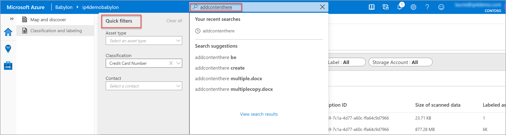
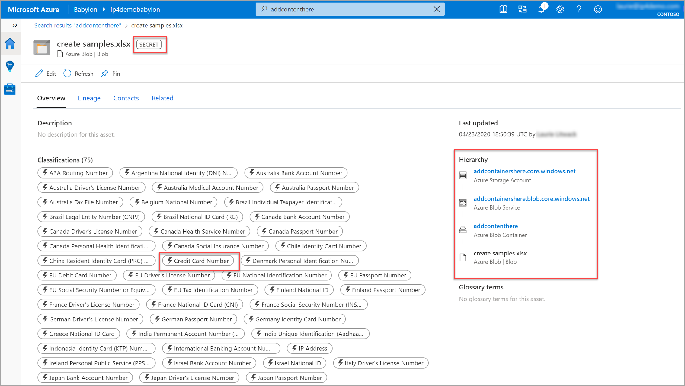

# Sensitivity label insights about your data from Project Babylon 

The how-to guide provides an explanation of how to access, view and filter security insights in the form of sensitivity labels on your data in Azure Blob Storage, Azure files, ADLS GEN 1, and ADLS GEN 2.

Make sure you've followed the explanations about [setting up Azure resources](scan-azure-data-sources-portal.md) and populating the relevant accounts with your test data before getting starting with Babylon insights.

You'll also need to set up and complete a scan on the test data in each data source before you begin. Follow the instructions for scanning test data in [Azure resources](scan-azure-data-sources-portal.md). 

In this how-to guide, you'll learn how to:
> [!div class="checklist"]
> Launch your Babylon account from Azure. 
> View insights on your data. 
> View and filter sensitivity labels.
> Learn how to review and search sensitivity labeling of your data estate. 
 
After making sure your Azure Blob Storage is created, contains test data, and scanning test data succeeded, let's get started.  

> [!NOTE]
> If you're blocked at any point in this process, send an email to BabylonDiscussion@microsoft.com for support.

## Babylon insights

### Use Babylon insights

In Babylon, classifications are similar to subject tags and are used to mark and identify content of a specific type found within your data estate during scanning. Sensitivity labels are used to identify the categories of classification types within your organizational data, and the group the policies you wish to apply to each category. Babylon makes use of the same sensitive information types as Microsoft 365, allowing you to stretch your existing security policies and protection across your entire content and data estate.  

1. Go to the **Babylon** [instance screen in the Azure portal](https://aka.ms/babylonportal). Select your Babylon account.

1. When the Babylon blade is open, click the **Launch Babylon** account tile in the **Get Started** section.  

    

1. With Babylon open, click the **View insights** tile to access your insights area.

    
    
1. Within insights, select the **Classification and labeling** blade.
    

### Sensitivity labels

After learning about the classifications identified by Babylon on your scanned data, now you'll want to review the sensitivity labels applied to your data estate.  

**To view sensitivity labels**:

1. From the main classification and labeling menu, click the **View all labels** link at the bottom of the **Top labels** tile. 

    

1. The visual sensitivity label report tiles show **top labels** found during the chosen time span, **labels found over time**, and **labels detected by file type**.

    

1. From the label list at the bottom of the report, select a label type, such a **Secret**, to review all data scanned with that label, in the time period selected. 

1. In the data source drilldown page, select to filter a label or multiple labels to change your results. 

    

**To view source data file from a label search:**

After filtering labels to find the data of interest, you can filter the data further by using the **Quick filter** option to get to the source data file. 

1. In the search menu of the data source drilldown page,  enter the name of a data source to perform a **Quick filter** for relevant labels. In the following example, we used the quick filter to look at a data source with the **Secret** label.

    

1. In the search results page, you see the filters you chose applied in the **Quick filter** option, and the data file results of your search in the main window. 

    

1. Selecting one of the search results shows the labels and all classifications related to that data source. A hierarchy of the file in your data storage structure is also provided to assist with data estate management and ownership determination. 

    

## Sensitivity label integration with Microsoft 365 compliance

Close integration with information protection offered in Microsoft 365 means Babylon offers easy and direct ways to scan your entire data estate, receive classification and labeling of your content as well as integrated content protection based on those labels and classifications. 

> [!NOTE]
> For sensitivity labels to be active in Babylon, you'll need published global labels, and **auto-classification** in Microsoft 365 must be turned on. 

**Review sensitivity labels**:

Sensitivity labels are used to classify emails, documents, site and more. When sensitivity labels are applied to content (whether manually or automatically, such as the labels applied with Babylon scanning) the content is then protected based on the settings you have chosen for each sensitivity label. 

Sensitivity labels can be used to encrypt files, add content marking, control and prevent user access and much more. 

To review your sensitivity labels and their policies:

1. Open the [Microsoft 365 compliance site](https://compliance.microsoft.com) and select the **Information protection** tab. 

1. In the list of labels, select the label to review. For the purpose of this how-to, select the **Secret** label. 

    

1. The sensitivity label editing wizard takes you through the label basics of label **Name**, **description**, **Encryption level** and **Content marking** you wish to apply, as well as the option to **Auto-label for Office apps**. 

    In the example shown, **auto-labeling** is turned on as required, and content that matches the credit card information description selected will be automatically labeled as specified. 

    

## Next steps

Learn more from Babylon reports
> [!div class="nextstepaction"]
> [Classification insights](./classification-insights.md)

> [!div class="nextstepaction"]
> [File extension insights](file-extension-insights.md)