# Babylon connector for Amazon S3  

This how-to guide provides an explanation of how to use Babylon to scan your unstructured data currently stored in Amazon S3 Standard buckets, discover what types of sensitive information exist in the data and identify and surface for easy information protection, and data compliance, in which Amazon S3 Buckets the data is currently stored.

For this service, using Babylon, you'll provide a Microsoft account with secure access to AWS, where the Babylon scanner will run. The Babylon scanner uses the access you granted to your Amazon S3 buckets to read your data, and then reports only the scanning results (metadata and classification) back to Azure. Analysis and review capabilities of your data scan results are presented in your Babylon classification and labeling reports.

In this how-to guide, you'll learn about:
- **Project scope**
- **Configuration**
- **Scanning**
- **Review results** 
 
> [!TIP]
> If you're blocked at any point in your setup and configuration of the Babylon connector for Amazon S3 service, contact your Microsoft PM team contact. For all other Babylon related questions, refer to the existing Babylon documentation, or speak to a member of the Babylon product team for guidance.

## Scope 

The scope detailed below is specific and limited to **Babylon connector for Amazon S3** part of the Babylon service. 

- The Babylon connector for Amazon S3 scanner service is currently deployed in the US Ohio region.  
- Babylon scanner service currently supports up to 100 GB of data per tenant.
- Babylon scanner service currently supports the following file types:
   - Microsoft Office files 
     - .pdf, .txt, .csv, .ppt, .odt, .odp, .ods, .pps, .doc, .dot, .pot, .xlc, .xls, .xlt, .docx, .docm, .pptx, .pptm, .ppsx, .xlsx, .xlsm, .xlsb, and 
   - Other file types 
     - .csv, .tsv, .psv, .ssv, .json, .xml, .txt

## Create Babylon account

If you already have a Babylon account, you can skip these instructions and continue to Babylon connector for Amazon S3 [configuration](#configuration). 

If you need to create a Babylon account, follow the instructions in [Create an Azure Babylon account instance](create-catalog-portal.md#create-an-azure-babylon-account-instance). After creating your account, return here to complete configuration and begin using Babylon connector for Amazon S3.  

## Configuration 

Complete the following steps to set up and configure your Babylon and AWS accounts, and begin scanning your Amazon S3 buckets. 

The configuration process includes:

- Allowing scan access to your AWS S3 buckets
- Set-up and configuration of Babylon to scan your Amazon S3 buckets
- Starting your first scans

## Configure Amazon S3 bucket scanning for Babylon  

To complete configuring access for this service to your Amazon S3 buckets, follow these steps in your Babylon account. 

1. Launch the Babylon portal using the dedicated Babylon connector for Amazon S3 URL provided to you by the Babylon connector product management team. 
    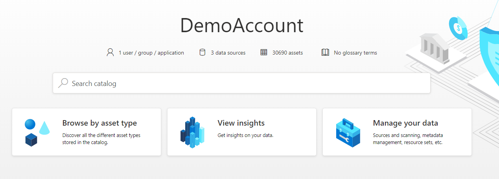
 
1. Open the Azure Babylon **Management Center**, **Data Sources** page and select **+ New**, choose **New data source** and from the **All** tab,  select **Amazon S3**, then select **Continue**. 
    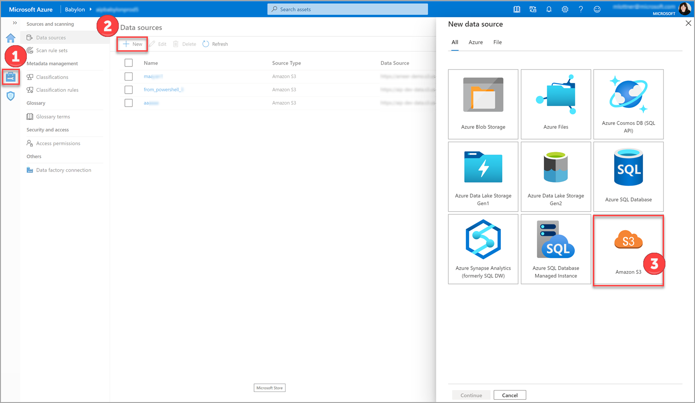

1. In the page that opens, give the new Amazon S3 bucket a **Friendly name** of your choice, then copy the [Bucket name](#retrieve-your-amazon-s3-bucket-url) and [Role ARN](#create-a-new-role-in-aws-for-babylon) you previously copied from your Amazon account into their respective fields. When you're done, select **Finish**. 
    
1. Your new Amazon S3 bucket is now ready for scanning in Babylon.

### Give Babylon scan access to your Amazon S3 buckets

In order for Babylon to be able to scan your Amazon S3 buckets, you’ll need to set up your Microsoft scanner account in AWS, and then grant it the access permissions required within Amazon. Follow these easy steps to allow Babylon scan access to your standard Amazon S3 buckets:

For Amazon S3 buckets that are protected with AWS-KMS encryption, complete the following process and then refer to [Configure scanning of encrypted Amazon S3 buckets](#configure-scanning-of-encrypted-amazon-s3-buckets) for specific instructions. 

### Create a new role in AWS for Babylon

1.	Open your **Amazon Web Services** console, and under **Security, Identity, and Compliance**, select **IAM**.
1. Choose **Roles** and then **Create role**.
1. Choose **Another AWS account**. In the **Account ID** field, paste the following value as your **Microsoft Account ID** 181328463391.
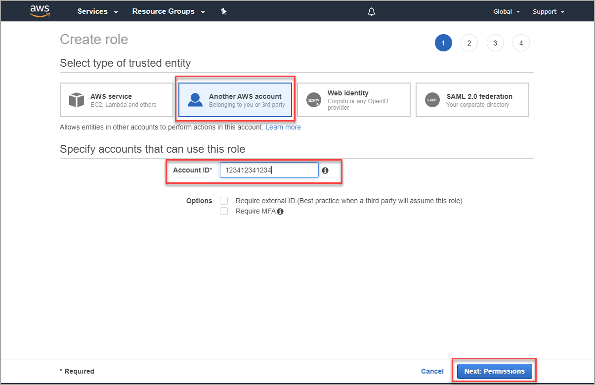
1. In the permissions step, filter permissions to **S3** and select **AmazonS3ReadOnlyAccess**, then select **Next:Tags**.

1. In the **Add Tag** option, you can optionally choose to  create a meaningful tag for this new role. Useful tags enable you to organize, track, and control access for each role you create. When finished, click **Next:Review** to review the role details and complete creation.
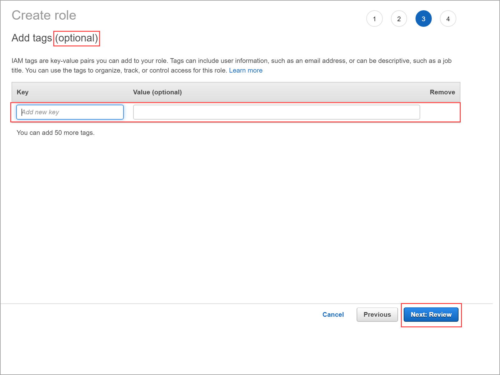 
1. In the **Review** screen, review the role details to confirm all details, confirm the correct policy was attached, optionally add a description to identify the purpose of the role, then click **Create role** to finish creating the new role.  
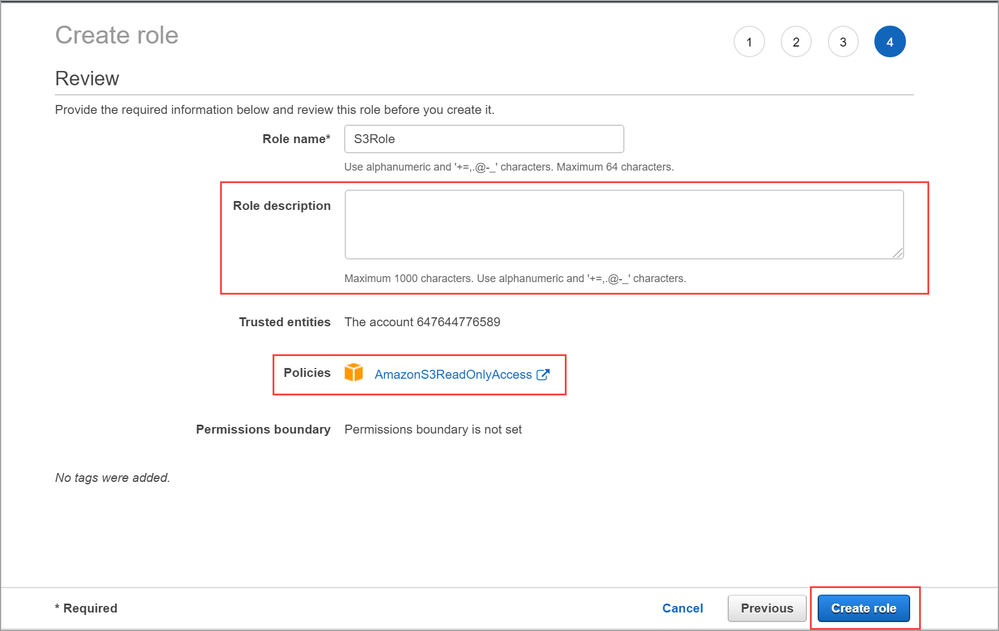   

### Copy new Role Amazon Resource Name (ARN) to Babylon 

After creating the role, you'll need to locate and copy the related Role ARN to Babylon.

1. From the Identity and Access Management (IAM) Dashboard, select, and open the new role you created in the previous step.
1. On the role **Summary** page, select the copy option for the **Role ARN**. 

1. Place the copied **Role ARN** into the Babylon **Role ARN** field for the Amazon S3 bucket you wish to scan.  

> [!TIP]
>  If you have an Amazon S3 bucket that uses AWS-KMS encryption, you’ll also need to map the policy you created for that bucket. Learn more in the next section which explains how to Configure scanning encrypted Amazon S3 buckets. 

### Configure scanning of encrypted Amazon S3 buckets

AWS buckets support different encryption types. For buckets that use **AWS-KMS** encryption, special configuration is required to enable scanning. For buckets that use no encryption, AES-256 or AWS-KMS S3 encryption, skip this section and continue to [Retrieving your Bucket URL from Amazon](#retrieve-your-amazon-s3-bucket-url). 

**To check the type of encryption used in your Amazon S3 buckets:** 

1. Open your Amazon S3 **Buckets** menu.
    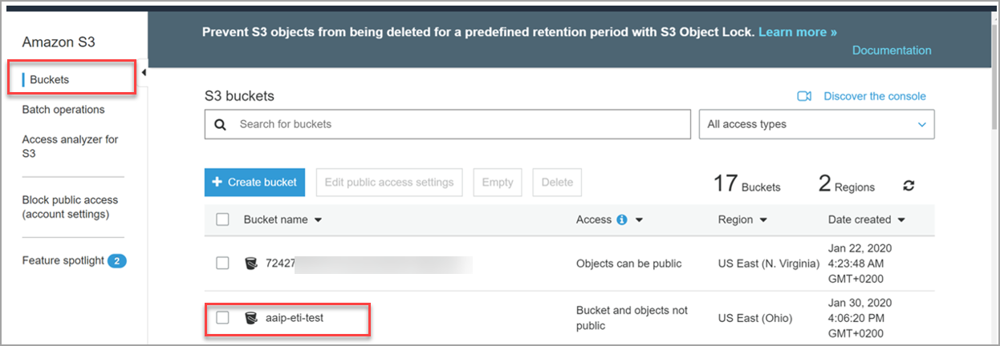 
1. Select a bucket to check the encryption type and then select **Properties**.
1. Select **Default encryption**.
    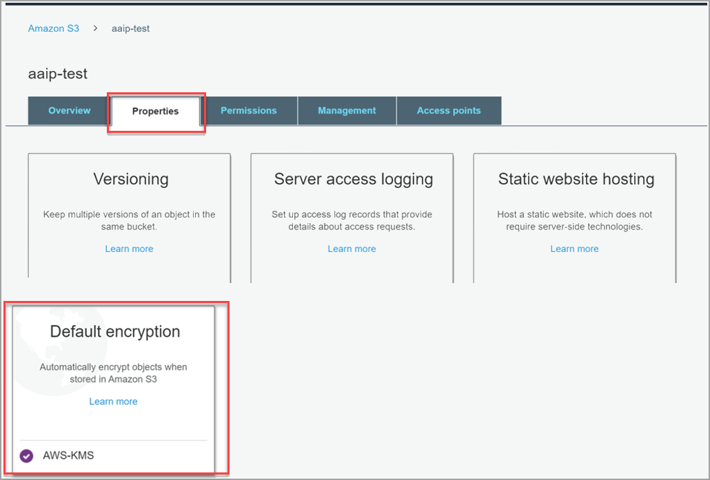
- Within default encryption, the following options are listed:
    - None (no encryption applied)
    - Encrypted with **AES-256**
    - Encrypted with **AWS-KMS**

- If the bucket you selected is configured with either **No encryption** or **AES-256**, you'll skip the rest of this section and proceed to scanning according to [Configuring AWS scanning](#give-babylon-scan-access-to-your-amazon-s3-buckets) . 
- If your bucket is encrypted with **AWS-KMS**, you’ll need to configure scanning your encrypted bucket by adding a new policy that allows the scanner to decrypt the bucket before starting the scan. Remember that decryption is *only* performed for the purpose of scanning.   

To add the new policy that will allow scanning of a bucket encrypted with custom **AWS-KMS**:
1. Go to **Services** >  **IAM** >  **Policies**. 
    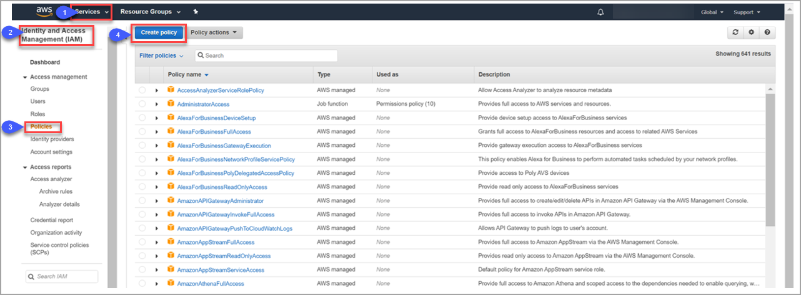 
1. Select **Create Policy,** and in the **Service** option, select **KMS.** 
    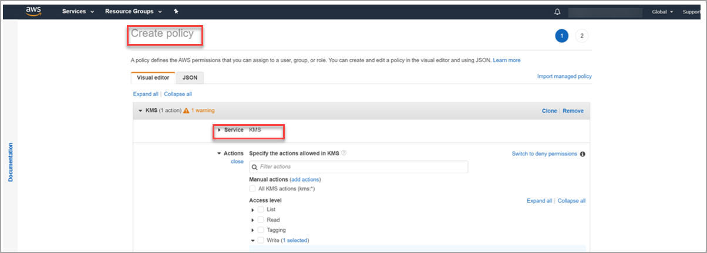
1. Under **Access level**, select **Write**, and check only the **Decrypt** option. 
    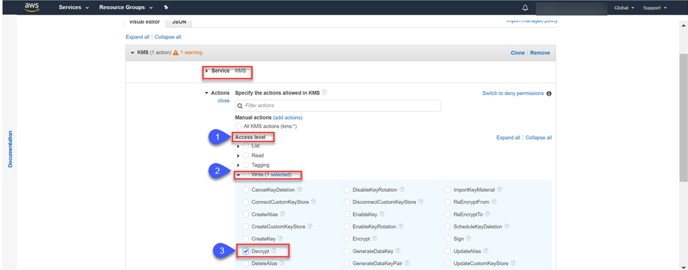
1. Under **Resource** choose a specific resource or select **All resources**.  
1. Select **Review policy** and make sure to give the new policy a meaningful name, then select **Create policy**. 
    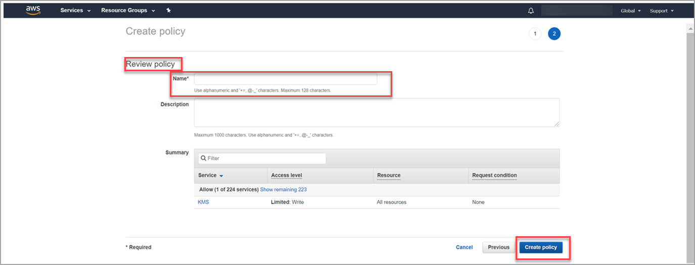
1. The newly created policy is added to your list of policies.
1. Go to **IAM** > **Roles** – now choose the role you added for scanning. 
    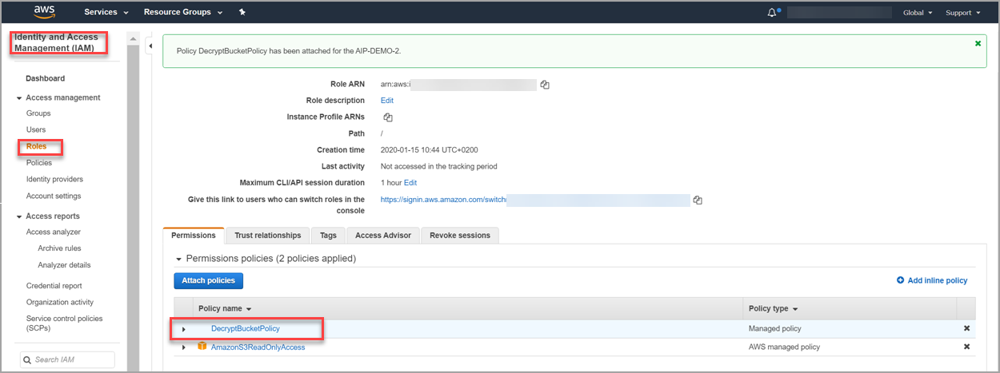
1. Click **Attach policies**.  
1. In the **Attach Permissions** page that opens, filter, and choose your newly created policy and attach the new policy to this role. When the policy is selected, select **Attach policy**. 
    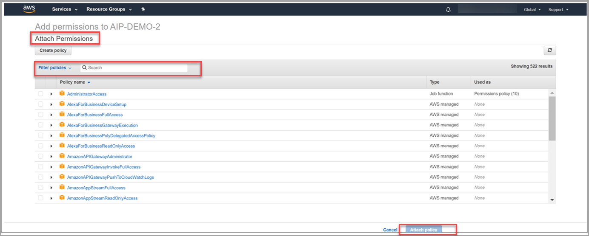
10.	In the summary page you’ll see the new policy attached to the role, together with the **Amazon S3ReadOnlyAccess** Policy.

After completing these steps, make sure to retrieve your [Bucket URL](#retrieve-your-amazon-s3-bucket-url), and you can then proceed with scanning an encrypted Amazon S3 bucket using this role. 
 
### Retrieve your Amazon S3 bucket URL

To complete scanning configuration within Babylon, you’ll need to retrieve your Amazon S3 bucket name. This procedure explains how to complete that process.  

After creating the Role ARN for the bucket you wish to scan, you’ll then retrieve and copy the Bucket URL in order to be able to create a mapped Amazon S3 bucket resource within Babylon. 

To retrieve the **Bucket URL**, from your AWS Account:
1. Open your **AWS Management Console** and from the **Storage** menu, select **S3**. 
1. From the S3 **Buckets** list, copy the name of the bucket you wish to scan. 
1. To copy the bucket name, select the bucket in the checklist, and then copy the name from the bucket description panel on the right.
    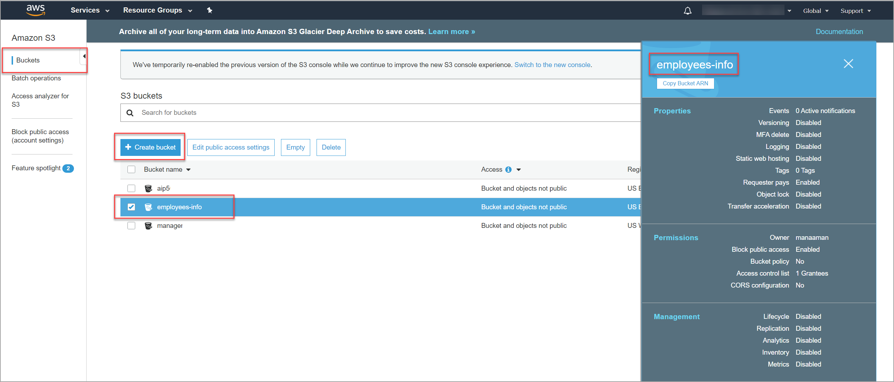  

> [!NOTE]
> The correct format for the Amazon S3 bucket name to insert into Babylon is: **s3://\<bucketname>**. Use the bucket name you copied in the previous step in place of \<bucketname>.

### Start scanning your first Amazon S3 bucket in Babylon

After adding your Amazon S3 bucket as a data source in the previous step, it is time to start your first scan. 

1. Click on the newly created data source in the **Data sources** list. 
1. Click **New scan**, then add the scan name and select **Role ARN** as the authentication method. 
    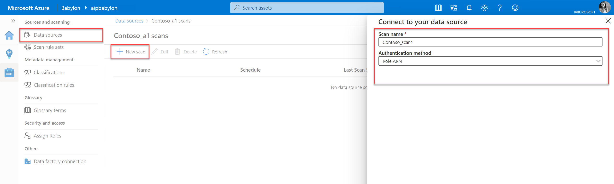

1. **Set the scan trigger** by selecting the **Scan schedule** of your choice for your scan. Click **Continue**. 
    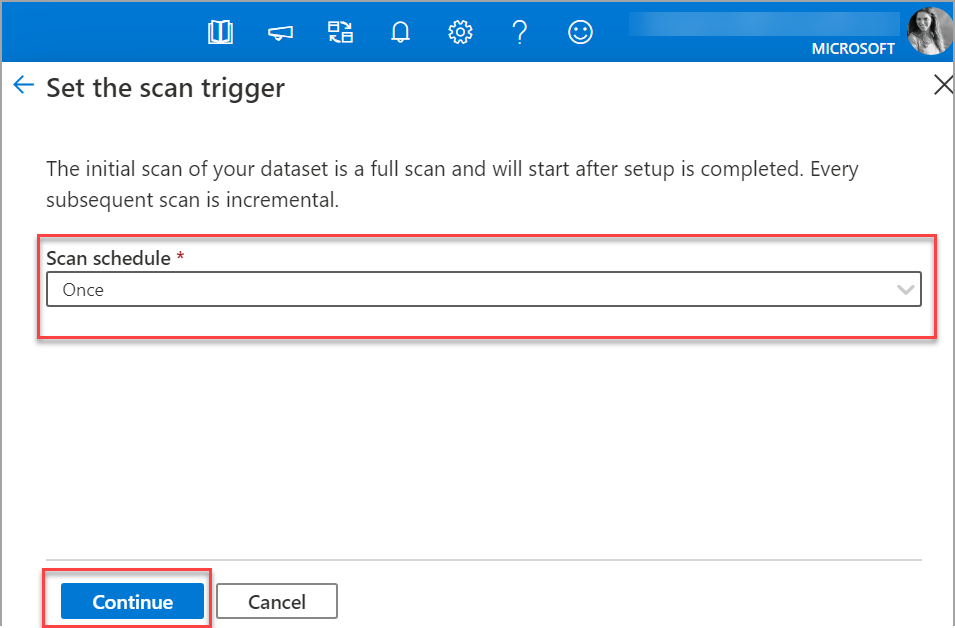
1. Choose **Set scan rule set**. Create a new **new scan rule set**, then click **Continue**. 
    
 
1.	Click Save and Run to start the scan. 
    

> [!TIP]
> Scanning can take up to 24 hours to complete. You'll be able to review your **Insight Reports** and search the catalog 24 hours after you started each scan. 

## Explore Babylon scanning results

Explore your Babylon scanning results to gain data insights, information protection capabilities across your entire data estate. 

### Search the Babylon data catalog and filter for Amazon S3 buckets

To learn more about filtering and searching your Amazon S3 buckets within the data catalog, see the [data client overview](./catalog-client-overview.md#search). 

Search **catalog**:
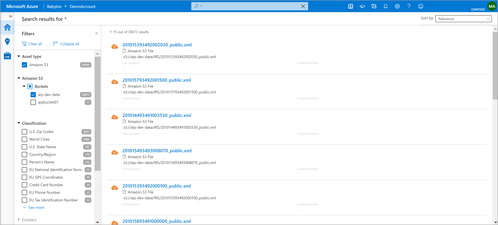

Search **file overview**:

Search **Amazon S3 bucket overview**: 
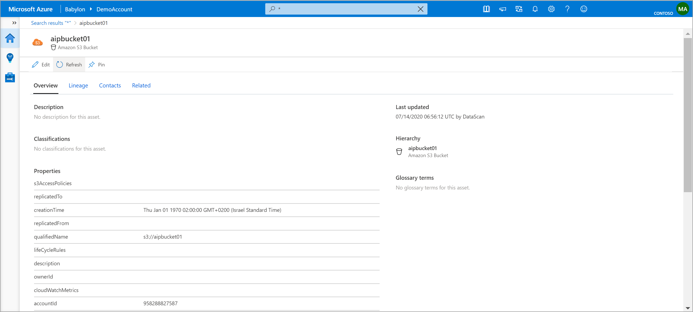

### Map and discover Amazon S3 bucket insights 

The map and discover insights report includes your Amazon S3 scanning results along with the rest of the scanned results from your Azure data sources. See [Babylon mapping and discovery](./map-discover.md) for more information. 

### Classification and labeling insight reports

The Babylon classification and labeling reports also include the scanning results of your Amazon S3 buckets. To see your Amazon S3 bucket data, an additional Amazon S3 **asset type** filter was added to existing Babylon reports.

To learn more, see:

- [Classification insights about your data from Project Babylon](classification-insights.md)
- [File extension insights about your data from Project Babylon](file-extension-insights.md)
- [Sensitivity label insights about your data from Project Babylon](sensitivity-insights.md)

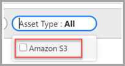

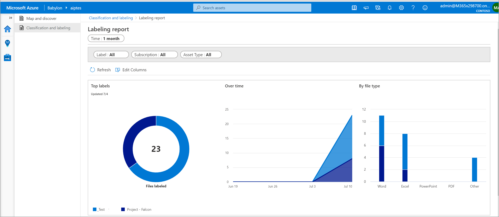

## Limitations

The limitations described here are specific and limited to **Babylon connector for Amazon S3** part of the Babylon service. 

1. The **Cancel scan run** option is not supported for Amazon S3 data sources, although it appears in Babylon screens.
    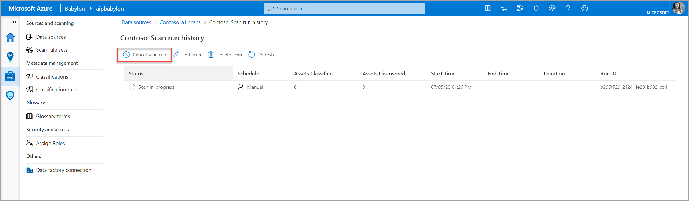
1. This service is currently deployed in the US Ohio region. Your data created in Amazon S3 buckets not in this region will be transferred to this region. Customers will be charged for all related data transfer charges according to the region of their bucket.  

1. The **Custom classification rules** option is not supported by Babylon connector for Amazon S3, even though the option appears in the Babylon interface. 
    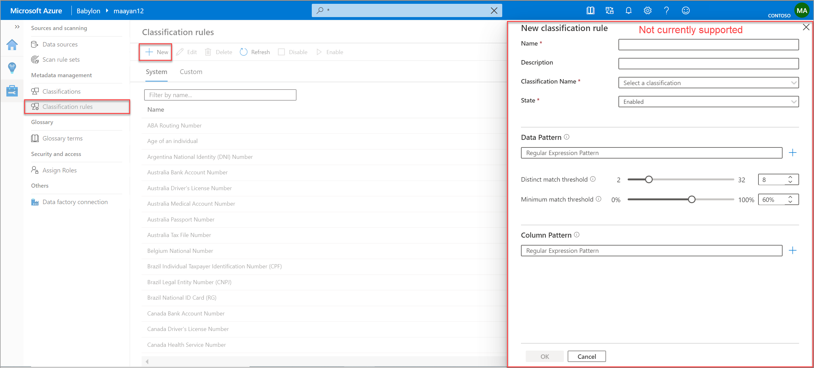
1. **Custom file extensions** are not currently supported for Amazon S3 data sources, although the option appears in Babylon screens. 

    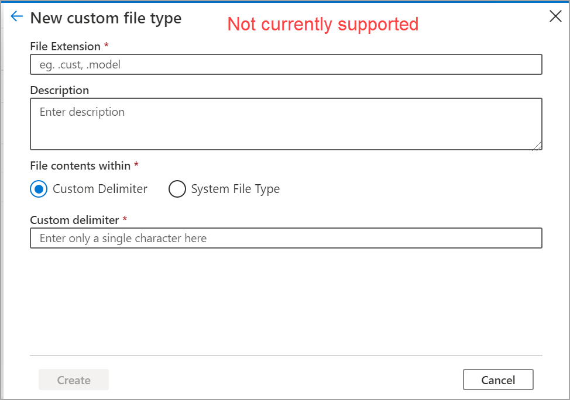
    
    Support for additional file types is planned for a future version.
1.  Resource deletion detection is not currently available. 
1. [Resource sets](./concept-resource-sets.md) are not currently supported. 
1. Scans are limited to the first 20MB of any file, and files larger than 500MB are skipped entirely. 

For other general Babylon service limitations, refer to the general [public preview limitation page](./product-limitations.md).  

## Next steps

Learn more about classification and labeling reporting in Babylon.
> [!div class="nextstepaction"]
> [Classification reporting](classification-insights.md)
> [File extension reporting](file-extension-insights.md)
> [Sensitivity label reporting](sensitivity-insights.md)
