# Tutorial: Starter Kit #1 - Scan data into Babylon

The starter kit gives you a quick tour of how Babylon works and what it can do. To make it easy for you to experiment
and explore, the starter kit will create a *simulated data
estate* for you. The client-side code will:
* Create an Azure Blob storage account. 
* Populate that account with test data. 
* Create an Azure Data Lake Storage Gen2 account. 
* Create an Azure Data Factory instance. 
* Associate the Data Factory instance to Babylon. 
* Set up and trigger a copy activity pipeline between the Blob storage and Data Lake Storage Gen2 accounts. 
* Push the associated lineage from Data Factory to Babylon. 

After this infrastructure is created, the starter kit will then walk you through
setting up scans on the Azure Blob storage and Data Lake Storage Gen2 accounts. This environment will
be reused through the rest of the tutorial.


In this tutorial, you learn how to:
> [!div class="checklist"]
> * Create a Babylon instance.
> * Have the right setup to complete this tutorial and the next tutorials in the series.
> * Scan data into a catalog.

> [!NOTE]
> If you're blocked at any point, send an email to BabylonDiscussion\@microsoft.com.

## Prerequisites

1. The starter kit requires running client-side code
that will work only on Windows. If this prevents you
from running the starter kit, contact
BabylonDiscussion\@microsoft.com.

1. [Create a Babylon account](create-catalog-portal.md)

## Install and set up the starter kit 

### What the starter kit client software will do

Running the starter kit script will do the following on your behalf:

1. Creates an Azure Data Factory account.
    {YourResourceGroupName}**adcfactory** is the name of the factory
    that will be created in your subscription.
1. Associates the newly created Azure Data Factory account to the Data Catalog
    instance whose name you passed in.
1. Creates an Azure Blob storage account. {YourResourceGroupName}**adcblob** is
    the name of the blob that will be created in your subscription. The script then
    populates the new Blob storage account with simulated .tsv, .csv, .ssv, and .json data.
    The data is put inside a folder structure with the form of *yyyy/mm/dd/foo*.csv.
1. Creates an Azure Data Lake Storage Gen2 account. {YourResourceGroupName}**adcadls**
    is the name of the Data Lake Storage Gen2 account that will be created in your
    subscription.
1. Triggers a Data Factory copy activity in your newly created Azure Data Factory
    account to copy data from the newly created Blob storage account to the Data Lake Storage Gen2
    account.
1. Pushes the lineage associated with the copy activity into the
    catalog.

### Preparing your Windows machine to run the starter kit's client software

Use the following steps to set up the starter kit on your Windows machine:

1. [Download the .zip file](./Assets/starterKitV2.zip) that contains the starter kit to your computer under a local folder. Once you navigate to this link, please hit the 'Download' button.

    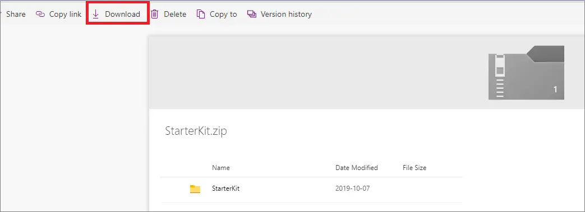
1. Extract the contents of the .zip file to a location of your choice. An example is C:\\CatalogStarterKit\\StarterKit.
1. Select the **Start** menu and type **PowerShell**. Right-click **Windows PowerShell** and select **Run as administrator**.

   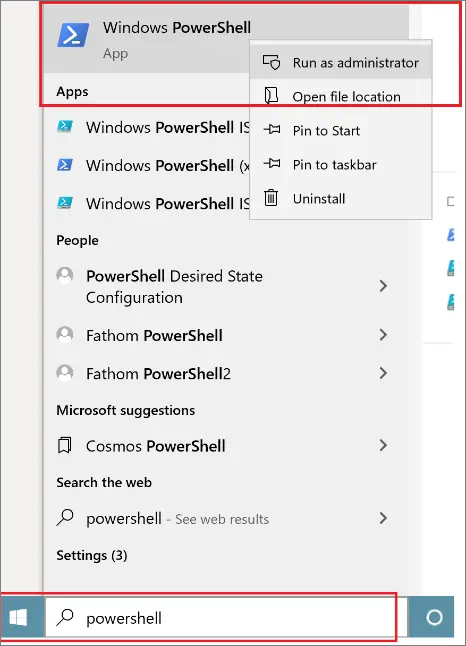
1. In the PowerShell window, paste the following command and replace *{PathtoStarterKit}* with the folder path of the extracted file. Then select the Enter key.

   ```dir -Path "*\{PathtoStarterkit\}"* -Recurse \| Unblock-File```

   For example:

   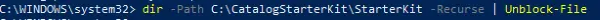
   
1. In the PowerShell window, paste the following command and select the Enter key to install the Azure cmdlets.

   ```Install-Module -Name Az -AllowClobber -Scope CurrentUser```
1. If you get the prompt "NuGet provider is required to continue," type **Y** and select the Enter key.

   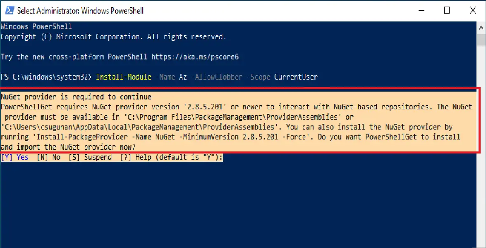
1. If you get an "Untrusted repository" prompt, then type **A** and select the Enter key.

   

It might take up to a minute for PowerShell to install the
required modules. When that's done, you're ready to run the catalog
scripts documented in the next section.

## Run the starter kit script

### <a id="collecting-data" /> Collect the data needed to run the script
Before you run the PowerShell scripts to bootstrap the catalog,
use the following steps to get the values for arguments to be
used later in the script. 

Make a note of all these values in
Notepad or elsewhere.

- Tenant ID 
  - In the [Azure portal](https://portal.azure.com), select the hamburger (  ) menu in the upper-left corner, and then select **Azure Active Directory**. Scroll down to the **Manage** section, select **Properties**, and then select the copy icon (  ) for  **Directory ID**. That's your tenant ID. Save this value.
- SubscriptionId
  - Go to the [Azure portal](https://portal.azure.com), search on the name of the Babylon instance that you created in the search bar, and select its entry in the search results. In the overview section, you'll see the GUID for the subscription ID. Make a note of the value.
  
    >[!NOTE] 
    > Make sure you're using the same subscription as the one in which you created the catalog. This is the same subscription that we placed in the allow list for you.
- PathtoStarterKit
  - This is the Windows file folder path in which the starter kit's .zip file is downloaded and extracted.
- Data catalog name
  - This is the name of the Babylon account that you created in [Create a Babylon account](create-catalog-portal.md).
- ResourceGroup
  - Come up with a new resource group name. Resource group names must be unique with your subscription, all lowercase, and made up of just A-Z and 0-9 characters.

> [!IMPORTANT]
> If your organization has a strict policy on naming resource groups (for example, it must contain special characters), override it or reach out to <BabylonDiscussion@microsoft.com> for a workaround.

### Make sure the person who is running the scripts has the right permissions on the catalog

> [!NOTE]
> If you created the Babylon account yourself, you're automatically an admin and at least an Azure contributor, so you can skip this section.

Make sure that the person running the
script is added as an admin to the Babylon account created in [Create a Babylon account](create-catalog-portal.md). 
Use the following steps to add them as an admin:

1. On the catalog home page, select the **Management Center** icon on the left. You can browse to the catalog home page via one of these methods:
   - Go to https://web.babylon.azure.com/resource/<Your Babylon's Name>.
   - Go to https://portal.azure.com, search for your Babylon's name, select the Babylon's name, and then select the **Launch babylon account** button. 
1. Select the **Access permissions** section in the Management Center.

   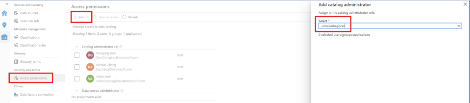
1. Click on +Add at the top of the page, select 'Catalog administrator' and type the name or email of the person you want to add, and then select **Apply.**

### Run the client-side setup scripts

After the catalog configuration is complete, run the scripts in this
section to create the assets.

1. __Go to the starter kit folder__: In the PowerShell window, paste the following command. Replace *{PathtoStarterKit}* with the folder path of the *extracted file*, and then select the Enter key. 

   ```
   cd *{PathtoStarterKit}*
   ```

1. __Allow yourself to run PowerShell scripts__: Run the following command to make sure you can run the PowerShell script: 
    
   ```
   Set-ExecutionPolicy -ExecutionPolicy Unrestricted
   ```

1. __Connect to Azure__: Paste the following command in the
    PowerShell window and replace the *{TenantID}* and *{SubsID}* placeholders. Then select the Enter key. Be sure to connect to the same subscription as the one you created earlier for your catalog. 
    
   ```
   .\\RunStarterKit.ps1 -ConnectToAzure -TenantId {TenantID}
   -SubscriptionId {SubsID}
   ```

   You might be requested to sign in by using your Azure Active Directory credentials as follows:

   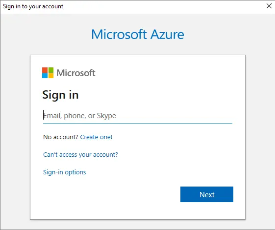

1. __Ingest data__: Paste the following command in the PowerShell window. Replace the *{CatalogName}*, *{TenantID}*, *{SubsID}*, and *{NewResourceGroupName}* placeholders with the [previously collected values](#collecting-data). Running the command will run the starter kit.

   ```
   .\\RunStarterKit.ps1 -CatalogName {CatalogName} -TenantId
   {TenantID} -SubscriptionId {SubsID} -ResourceGroup
   {NewResourceGroupName}
   ```

It can take up to 10 minutes for the environment to be set up. While this is happening,
various windows may pop up. There's no further
action for you to take while the code runs. *But don't close the BlobDataCreator.exe
window until it finishes.* When it finishes, the window will automatically
close. 

When you get the line "Executing Copy pipeline
xxxxxxxxxx-487e-4fc4-9628-92dd8c2c732b," wait for another
instance of BlobDataCreator.exe to start and finish running. This window
will automatically close when it's done.

After the process has finished, a resource group by the name you gave
while running the PowerShell command will have been created. The Azure Data Factory,
Blob storage, and Data Lake Storage Gen2 accounts will all be in this
resource group. The group will be contained in the specific subscription.

## Scanning data into the catalog

The catalog can reflect the state of all the data that a company owns (the
data estate) through mechanisms like scanning, lineage,
portal, and API. In this section, we'll look at scanning. Scanning is a
process by which the catalog can connect directly to a data
source on a schedule specified by the user. Goals include examining what's
inside, extracting schema, and attempting to understand semantics. In this
section, we'll set up a scan of the content we just generated.

The setup script created two data sources that we can scan into the catalog,
Azure Blob storage and Azure Data Lake Storage Gen2. Let's first scan Blob storage.

1. Select **Management Center** on your catalog's webpage.

   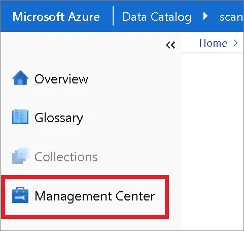
1. Select the **Data sources** section.

   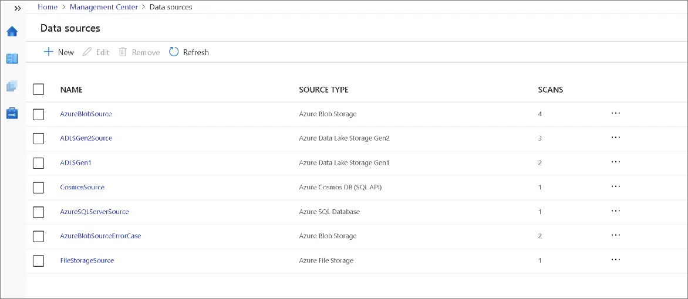
1. Select **+New** to add a new data source.

   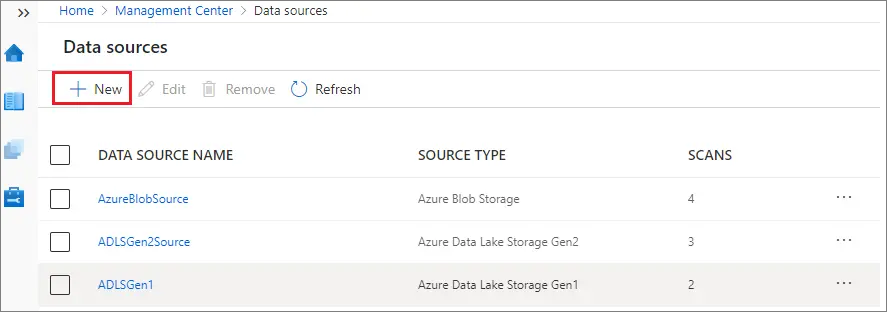
1. Select **Azure Blob Storage** > **Continue**.

   
1. Enter the name of the Azure Blob storage account that you specified, and then select **Finish**. The name will look like {YourResourceGroupName}**adcblob**.

   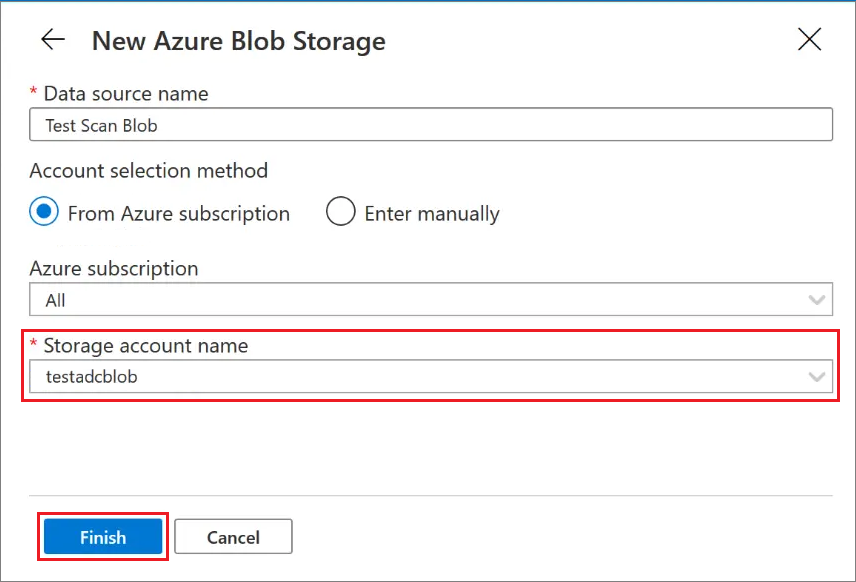
1. You've added information about the blob account to the catalog, but you haven't set up a scan. To set up the scan, select **setup scan** in the created entry.

   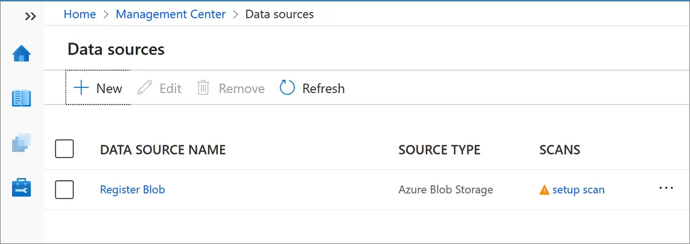
1. Enter a scan name, and use the drop-down list to select **Account Key** as the authentication method.

   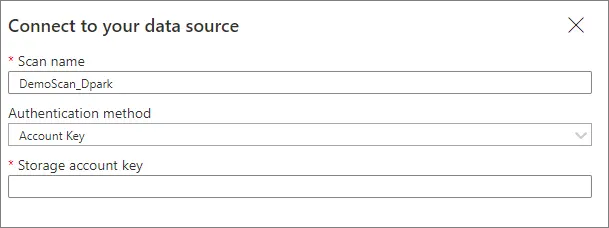
1. To give the scanners permissions to scan, you need the storage account key:
   1. Go to the [Azure portal](https://portal.azure.com) and search for the name of the Azure Blob storage account that you created as part of running the script.
   1. Select **Access keys** () under **Settings**, and copy the value of key1 from this page.

   
1. Select **Continue**.
1. We now need to decide how frequently the scan should run. For now, we'll start with once. For **Scan schedule**, select **Once**. Then select **Continue**.

   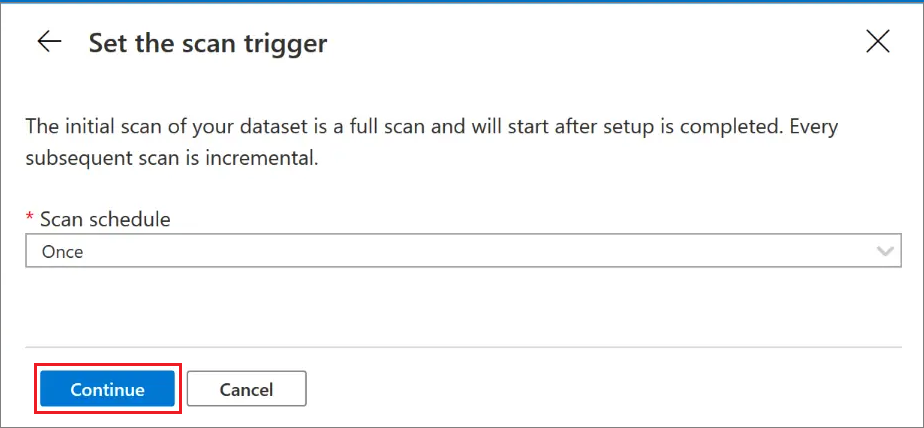
1. Select **Finish** to complete setting up the scan.

The **Finish** button should have returned us to the
**Data sources** screen. We're already in the right place, so let's set up the second scan for
the Azure Data Lake Storage Gen2 account. 

1. Select **+ New**.

   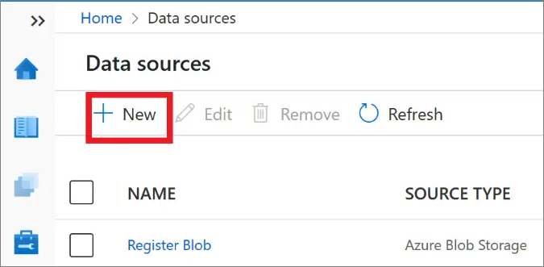
1. Select **Azure Data Lake Storage Gen2** > **Continue**.

   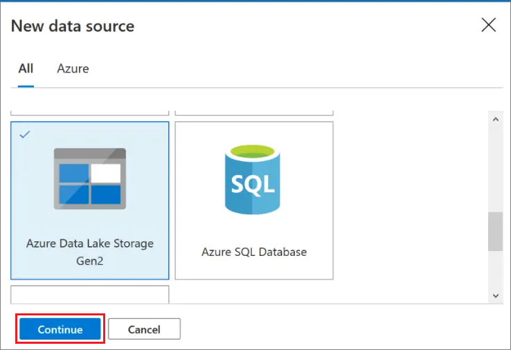
1. Select a data source name and enter the name of the
previously selected Azure Data Lake Storage Gen2 account. Your Azure Data Lake Storage Gen2 account should be named {YourResourceGroupName}**adcadls**.

   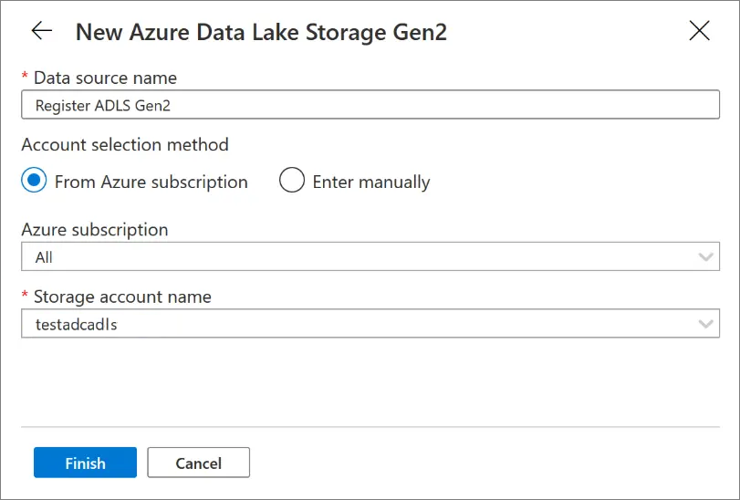
1. Select **setup scan** for the newly created registered data source.
1. Under **Connect to data source**, pick a name and select the
authentication method for **Account key**. Obtain the key in the same way
as in the earlier blob case. Then select **Continue**. Again, let's select
**Once** for **Scan schedule** and then select **Continue**. And in the
review dialog box, select **Finish**.

To verify that your scans have succeeded, go to **Management Center** > **Data Sources**, and then select the data source. You should see a
screen similar to the following one. (The scan can be in **queued** status for a
few seconds to a minute, and **in-progress** status for a few minutes
until it finishes.)

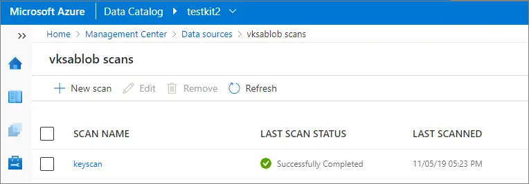

When you select the scan (**keyscan** in this case), after it's
complete, you'll get a screen like the following one with
details about the scan run:


## Summary

In this tutorial, you created a new catalog. Then you used a client-side tool to 
create a sample environment with Azure Blob storage, Azure Data Lake Storage Gen2, 
and Azure Data Factory instances. The tool then used Azure Data Factory to move data between Blob storage and Data Lake Storage Gen2. This generated lineage will be used in later parts of the starter kit. Finally, you set up two scans.

## Next steps

Advance to the next tutorial to learn how to navigate the home page and search for an asset.
> [!div class="nextstepaction"]
> [Tutorial: Starter Kit #2 - Home page and search](starter-kit-tutorial-2.md)
