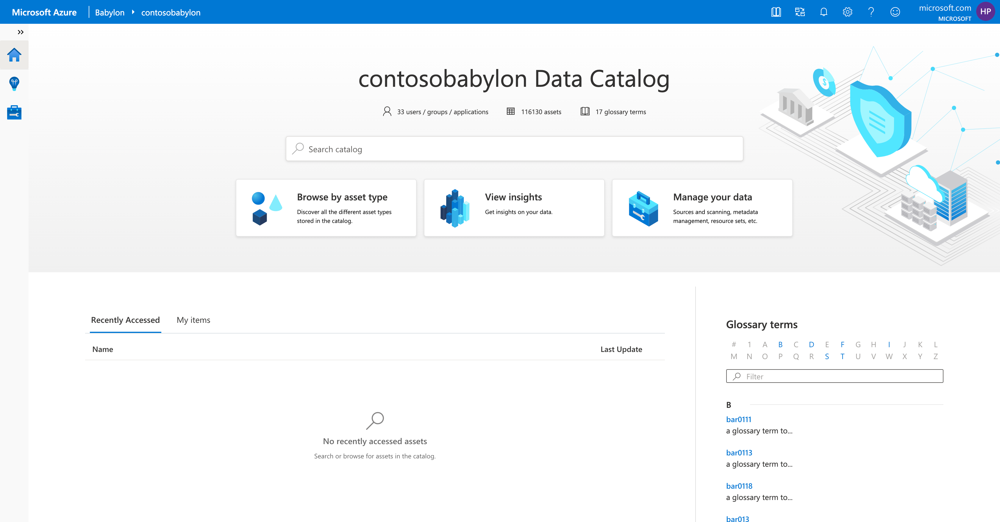
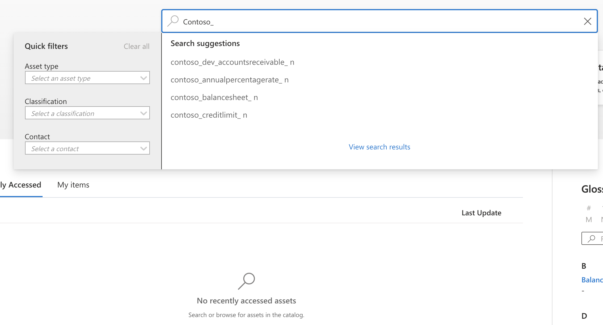
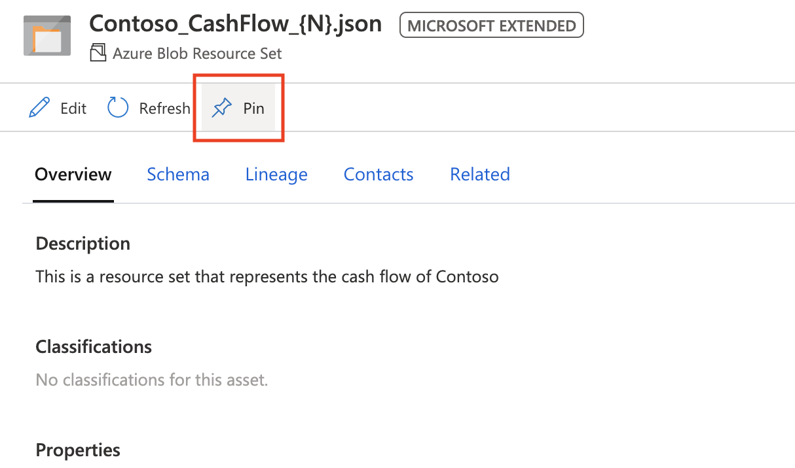

# Tutorial: Starter Kit #2 - Home page and search for an asset

Become familiar with Babylon by navigating the features of the home page and searching for an asset in the catalog.

In this tutorial, you'll learn how to:
> [!div class="checklist"]
> * Navigate the Data Catalog home page.
> * Search for an asset.

## Prerequisites

- An Azure account with an active subscription. If you don't already have an Azure subscription, [create a free account](https://azure.microsoft.com/free/?ref=microsoft.com&utm_source=microsoft.com&utm_medium=docs&utm_campaign=visualstudio) before you begin.
- Complete [Tutorial: Starter Kit #1 - Scan data into Babylon](starter-kit-tutorial-1.md).

## Navigate the Babylon home page

**Step 1**

Begin exploring the catalog by going to your Babylon portal at *https://web.babylon.azure.com/resource/\<your babylon account name\>*.

As shown in the following screenshot, the top of the home page displays the name of your catalog and a set of catalog analytics. Included are the number of users, data assets, and glossary terms. 

You can navigate to other areas by clicking on the three buttons: **Browse by asset type**, **View insights**, and **Manage your data**. 

The **2 data sources** are the Azure Blob storage and Azure Data Lake Storage Gen2 accounts that you set up in [Tutorial: Starter Kit #1 - Scan data into Babylon](starter-kit-tutorial-1.md). The assets will include all of your files in the data sources you setup. 

In below screenshot, there are over a hundred thousand assets in total and 17 glossary terms. This number will update as your organization scans and adds more terms to Babylon.

## Search for an asset

**Step 2**

Before you begin, here's a quick refresher on some fundamental terminology:

* **Asset**: A single object in the catalog that's concise and contains the definition of any entity in the data estate. Examples of entities include a SQL table, a Power BI report, and your data factory activity.
  
* **Schema**: Also known as columns or attributes that represent the structure of an asset or a resource set.

* **Resource set**: A single object in the catalog that represents many physical objects in storage. The objects usually share a common schema and, in most cases, a naming convention or folder structure. For example, the date format would be *yyyy/mm/dd*. To learn more, see [Resource sets in Babylon](./concept-resource-sets.md).  

* **Asset type**: A grouping of assets and resource sets under a logical name that usually maps to the name of the data platform.

In this step, you look for **Contoso** asset, pin it, and mark yourself as owner. 

> [!NOTE]
> You can replace **Contoso** table with any asset name that you scanned before. If you want use the asset you scanned separately, please try to change the keyword (such as **Customner**) instead.
> The steps below will be exactly the same regardless which asset you plan to use.

Here's how:

1. In the search box on your home page, start typing **Contoso_**.

   The list of options is displayed based on autocomplete suggestions. In the small icons next to the assets, these suggestions come in various asset types. The types are Azure Blob storage resource set, copy pipeline operation, and so on.

1. In the left pane, in the **Asset type** drop-down list, select **Azure Blob Resource Set**.

   All the suggestions are now of the same type as the Azure SQL resource set.

1. Continue typing to make the search term **Contoso_s**, and note how the suggestions evolve.

1. Finally, type **Contoso_CashFlow*** to find a single resource set of interest to you. If this particular asset doesn't exist in your catalog, choose another resource set.

    

1. Select **Contoso_CashFlow_{N}.json** or another resource set that starts with **Contoso**.

1. At the top right, select the **Pin** button, as shown in the following image:

    

1. Select the **Edit** button, and then do the following:

    a. Enter a **Description**.

    

    b. Navigate to **Contacts** tab. Under **Owner**, in the **Name** box, start typing your corporate email address. A name suggestion should be automatically displayed.   
    c. Under **Experts**, select **Add Expert**, enter a name (for example, your manager's name), and then select **Save**. 
    
    The Description, Owner name, and Expert name fields are now populated.

    

1. To return to the Babylon home page, select the **Home** (overview page) icon at the top left. The asset you created is displayed in both the **Recently Accessed** and **Pinned assets** lists.

   

1. To learn about the supported stores and classifications in Babylon, under **FAQ/Documentation** at the lower right, select the **Supported Stores and Classifications** link.

## What you've learned

In this tutorial, you learned how to navigate the home page. You viewed the analytics section at the top. You searched for an asset you're interested in and filtered this search by asset type. After you found the asset, you pinned it and made yourself the owner of it. You saw the asset displayed automatically in two places on the home page. You completed the tutorial by learning about the data sources and classifications that are supported in Babylon.

## Next steps

Advance to the next tutorial to learn how to browse for assets in Babylon and discover asset lineage.
> [!div class="nextstepaction"]
> [Tutorial: Starter Kit #3 - Browse assets and view their lineage](starter-kit-tutorial-3.md)
