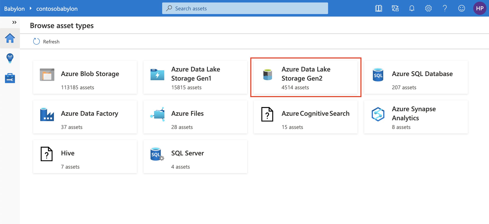
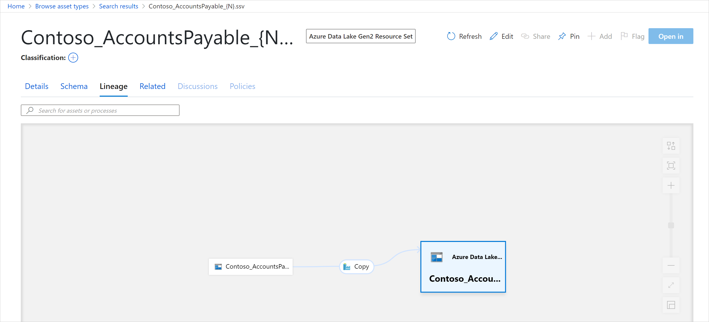

# Tutorial: Starter Kit #3 - Browse assets and view their lineage

Browsing Babylon is another powerful way to discover assets and view their important details, such as lineage. 

In this tutorial, you'll learn how to:
> [!div class="checklist"]
> * Browse for assets in the catalog.
> * View the lineage of assets. 

## Prerequisites

- An Azure account with an active subscription. If you don't already have an Azure subscription, [create a free account](https://azure.microsoft.com/free/?ref=microsoft.com&utm_source=microsoft.com&utm_medium=docs&utm_campaign=visualstudio) before you begin.
- Complete [Tutorial: Starter Kit #1 - Scan data into Babylon](starter-kit-tutorial-1.md).
- Complete [Tutorial: Starter Kit #2 - Home page and search for an asset](starter-kit-tutorial-2.md).

## Browse for assets in the catalog

In the preceding tutorial, you learned how search can help you discover assets in Data Catalog. Another way to discover assets in the catalog is by using the catalog's browsing experience.

1. Begin by going to your catalog portal at *https://web.babylon.azure.com/resource/\<your babylon account name\>*.

1. On the home page, select the **Browse by asset type** tile.

   A pane opens that displays a summary of all the asset types in your catalog.

1. To explore the various Azure Data Lake Gen2-type assets available in your catalog, select the **Azure Data Lake Gen2** tile.

   

1. You have a few options here: 

   a. You can sort the assets alphabetically using the **Sort by** drop-down list at the top right, select **Name**.

   

   b. You can also browse by changing the Filters from the left panel. There are many options: **Asset type, Classification, Label, Contact** and **Glossary term**.

   

1. Select the **Contoso_AccountsPayable_{N}** resource set. If this asset doesn't exist in your catalog, choose another resource set that starts with **Contoso_**.

## View the lineage of assets

On the asset details page, you can explore the source of this data.

1. Select the **Lineage** tab.

   The asset you selected is displayed. The lineage information that you're viewing clearly depicts that this resource set was copied from your Azure Blob storage account to Azure Data Lake Storage Gen2.

   

1. Select the other asset on this pane, and select the **switch to asset** link below it.

   You will observe that you switched into the Azure Blob resource set, which was the source of the Azure Data Lake Storage Gen2 resource set that you were originally browsing for. 
   
1. Select the **Details** tab to investigate the asset and confirm the details.

## What you've learned

In this tutorial, you learned how to browse by asset type. You learned how to determine lineage (associated with an Azure Data Factory copy activity) for an asset and to track how data is flowing through your data estate by using this feature. A fun exercise would be set up an Azure Data Factory data flow activity between your blob and Azure Data Lake Storage Gen2 and see how the lineage is presented in your catalog. Here's some documentation that can help you learn more:

[Azure Data Factory data flow activity](https://docs.microsoft.com/azure/data-factory/concepts-data-flow-overview)

## Next steps

Advance to the next tutorial to learn about resource sets, asset details, schema, and classification.
> [!div class="nextstepaction"]
> [Tutorial: Starter Kit #4 - Resource sets, asset details, schema, and classification](starter-kit-tutorial-4.md)
