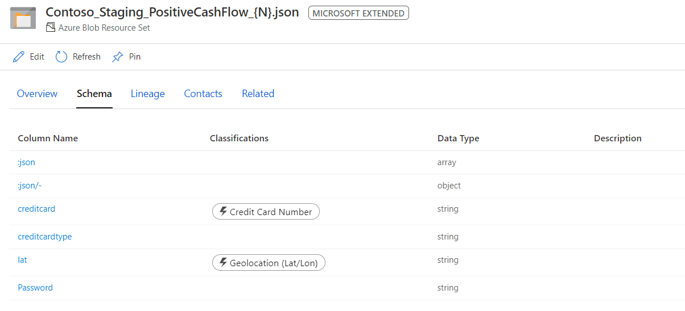
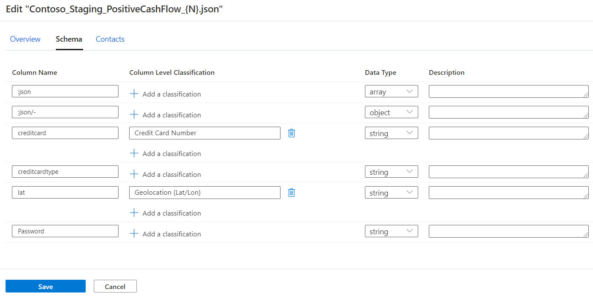

# Tutorial: Starter Kit #4 - Resource sets, asset details, schema, and classification

Explore the key components of your catalog: resource sets, asset details, schema, and classification.

In this tutorial, you'll learn how to:
> [!div class="checklist"]
> * Look at resource sets.
> * Look into asset details.
> * Look at schema and classifications.

## Prerequisites

* An Azure account with an active subscription. If you don't already have an Azure subscription, [create a free account](https://azure.microsoft.com/free/?ref=microsoft.com&utm_source=microsoft.com&utm_medium=docs&utm_campaign=visualstudio) before you begin.
* Complete [Tutorial: Starter Kit #1 - Scan data into Babylon](starter-kit-tutorial-1.md).
* Complete [Tutorial: Starter Kit #2 - Home page and search for an asset](starter-kit-tutorial-2.md ).
* Complete [Tutorial: Starter Kit #3 - Browse assets and view their lineage](starter-kit-tutorial-3.md ).

## Resource sets

### Step 1

Begin by going to your catalog portal at *https://web.babylon.azure.com/resource/\<your babylon account name\>*.

### Step 2

Find your favorite asset by entering **Contoso_staging_positivecashflow** in the search box. If you've completed the prerequisite tutorials 1, 2, and 3, you should see the details shown in the following screenshot. Observe each field carefully.

At the top, next to the asset name, is the **Asset type**, and in this case it's an Azure Blob resource set.

Reminder: What is a resource set?

> A resource set is a single object in the catalog that represents many physical objects in storage. The objects usually share a common schema and, in most cases, a naming convention or folder structure. For example, the date format would be *yyyy/mm/dd*. To learn more, see the "Resource Sets" section [on this page](concept-resource-sets.md).

## Asset details

Select the **Details** tab to display the *fully qualified domain name*, *description*, *glossary terms associated*, *experts*, and *owners* values. Under **Properties**, note especially the following two fields:

* **partitionCount**: Indicates the number of physical files that are associated with this resource set.
* **schemaCount**: Indicates the number of variations of schema that were found within this resource set.

> [!NOTE]
> These properties are populated within 24 hours after your scan is completed in [Tutorial #1](starter-kit-tutorial-1.md). We're currently working to resolve this limitation.

## Schema and classifications

### Step 3

Select the **Schema** tab. Observe the column names and the classifications that are associated with them. Also observe that the scan populated the properties automatically.

### Step 4

Edit the asset by selecting the **Edit** button at the top right. Select the **Classifications & schema** tab. Try adding some descriptions on the column or renaming the column to a more friendly name. You can also add a classification at the asset level by selecting the plus sign (+) icon below the **Classification** heading.

## What you've learned

In this tutorial, you learned how to view asset details. You learned how to view and edit schemas that are associated with an asset. And you looked at the classifications that the scanner automatically applies to the asset.

## Next steps

Advance to the next tutorial to learn about the glossary and how to define and import new terms for assets.
> [!div class="nextstepaction"]
> [Tutorial: Starter Kit #5 - Glossary, terms, and imports](starter-kit-tutorial-5.md)
