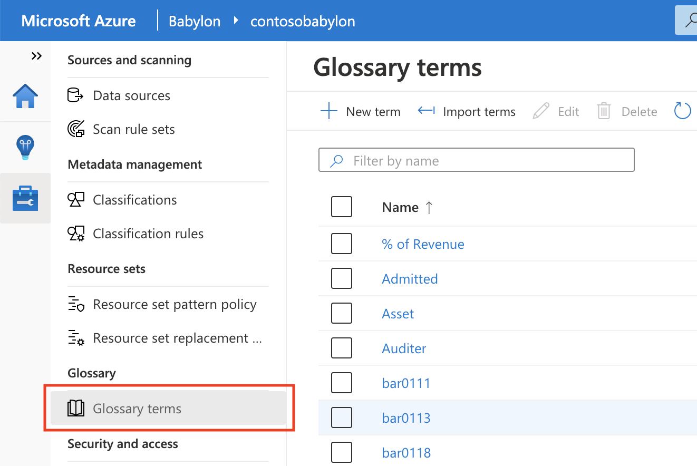
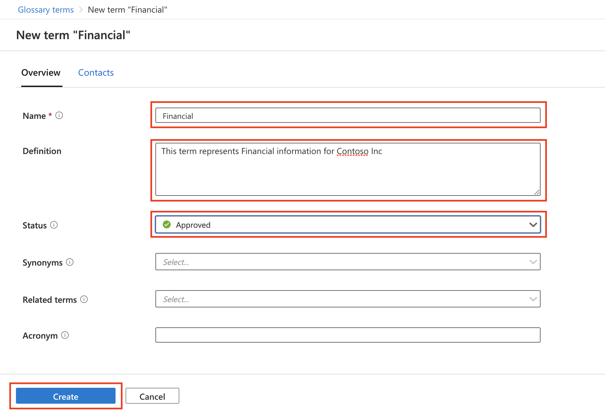
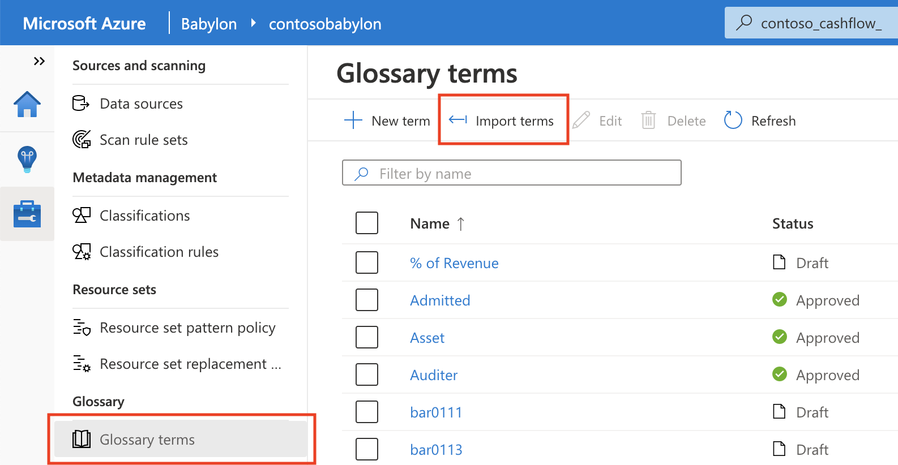
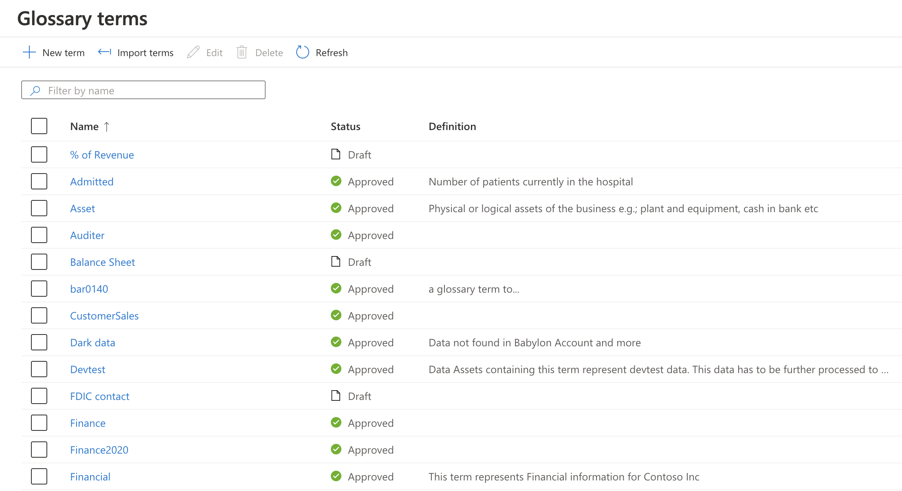

# Tutorial: Starter Kit #5 - Glossary, terms, and imports

A glossary is an important tool for maintaining and organizing your catalog. You build your glossary by defining new terms or importing a term list and then applying those terms to your assets.

In this tutorial, you'll learn how to:
> [!div class="checklist"]
> * Use your glossary.
> * Import glossary terms.

## Prerequisites

- An Azure account with an active subscription. If you don't already have an Azure subscription, [create a free account](https://azure.microsoft.com/free/?ref=microsoft.com&utm_source=microsoft.com&utm_medium=docs&utm_campaign=visualstudio) before you begin.
- Complete [Tutorial: Starter Kit #1 - Scan data into Babylon](starter-kit-tutorial-1.md).
- Complete [Tutorial: Starter Kit #2 - Home page and search for an asset](starter-kit-tutorial-2.md ).
- Complete [Tutorial: Starter Kit #3 - Browse assets and view their lineage](starter-kit-tutorial-3.md ).
- Complete [Tutorial: Starter Kit #4 - Resource sets, asset details, schema, and classification](starter-kit-tutorial-4.md ).

## Use your glossary

**Step 1**

Begin by going to your catalog portal at *https://web.babylon.azure.com/resource/\<your babylon account name\>*.

**Step 2** 

Go to your **Glossary** page by selecting the **Glossary terms** icon in the left pane.

**Step 3** 

Select **New term**.

Before you start creating a new term in the next section, review a summary of the fields:

- **Definition**: Write a definition of the term.

- **Synonyms**: Select other terms with the same or similar definitions.

- **Related Terms**: Select other terms in the glossary that are related to this one but have different definitions. Examples are technical terms that are related to a business term, a code name, or other terms that should be associated with the term.

- **Acronym**: Enter an abbreviated version of the term by using the initial letters of each word.

- **Status**: Assign a status to the term (*Draft*, *Alert*, *Approved*, or *Expired*).

**Step 4**

1. Fill out the form on the term details pages. Let's start by creating a new term, *Financial*.

    a. In the **Definition** box, enter *This term represents Financial information for Contoso Inc*.  
    b. In the **Status** drop-down list, select **Approved**.

1. Select **Review + Create**, and then select **Create**.

    

The next page displays a list of terms that includes *Financial*.

### Quick test

In [Tutorial #1](starter-kit-tutorial-1.md), you learned how to search for an asset that's of interest to you. Use the same steps now to find that asset (for example, **Contoso_staging_positivecashflow** or **Contoso_AccountsPayable**) as quickly as possible.

Great, now that you're on the asset details page of one of these assets, apply the glossary term you've just created.

**Step 5**

1. On the asset details page, select **Edit**.

1. In the **Business glossary term** drop-down list, select **Financial**.

1. Select **Save**.

   

   In the **Business Glossary** section, note that the term *Finance* was applied to the asset.

## Import glossary terms

**Step 6**

In this step, you import terms via a CSV file.

1. Use the starter kit template by [Downloading the .zip file](./Assets/starterKitV2.zip) (**You may have already downloaded and extracted this zip file in starter kit tutorial 1**), the file is named *StarterKitTerms.csv*, which contains a list of pre-populated terms that are relevant to your data estate. 

    To import terms in bulk, you can upload this pre-populated template to your glossary. You can also use this template to update existing terms later. 
    
1. To begin the import process, from the **Glossary**, select **Import terms**. 

    

1. In the **Import terms** window, select the **Folder** icon, and then go to the location where you downloaded *StarterKitTerms.csv*. 

1. Select the **Import** button to begin importing the terms.

   The import might take a minute. After it's finished, all the terms that are relevant to your data estate are displayed in the **Glossary** section.

   

1. View the newly imported terms to see how they're defined.

1. In the search box at the top of the page, search for **Contoso_dev**.

1. Use the process that you followed earlier in the tutorial to apply the term *Devtest* to one or more of the assets you found.

   You can create business or technical terms in the glossary. You can also annotate your assets by applying terms to them. 

## What you learned

In this tutorial, you learned how to define a new term and apply it to an asset. You learned how to import a list of terms by using a CSV file. And you learned how you can relate a term to other terms, create synonyms for it, and apply it to an asset.

*We hope you enjoyed learning about Babylon through our tutorials. Stay tuned for more of them. The next few will cover such topics as the enhanced scan setup experience, custom classification rules, and catalog-specific resource set patterns and policies.*
