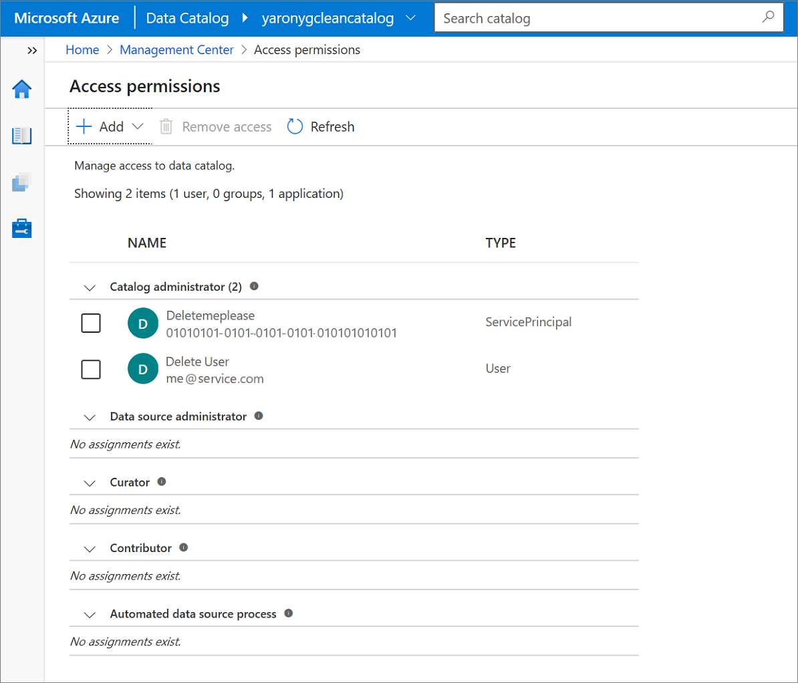

# Tutorial: Use the catalog's REST APIs

In this tutorial, you'll learn how to call the catalog's REST APIs. Anyone who wants to submit data to the catalog, include the catalog as part of automated processes, or build their own user experience on the catalog can use the REST APIs to do so.

In this tutorial, you learn how to:

> [!div class="checklist"]
> * Set up a service principal and configure it for use with your catalog.
> * Access API documentation.
> * Use Postman to call the REST APIs for quick testing purposes.
> * Generate a .NET client from Swagger.

## Prerequisites

To get started, you must have an existing catalog. If you don't have a catalog, see the [Quickstart for creating a Babylon account](create-catalog-portal.md).

## Prepare to call the REST APIs

To call the REST APIs, you need a service principal that the catalog
is configured to trust. When API calls are made to the catalog, we'll use the
service principal's identity.

### Create a service principal (application)

> [!NOTE]
> Customers who have used existing service principals (application IDs) have had a high rate of failure. We recommend creating a new service principal (application) for calling APIs.

For the API to make calls to the catalog, the client must have an
identity that the catalog recognizes. To make this work, we'll
first create an Azure service principal. To do this:

1. Go to the [Azure portal](https://portal.azure.com).
1. Type **Azure Active Directory** into the search bar and select the Azure Active Directory service in the search results.
1. Select **App registrations**.
1. Select **+ New application registration**, and then:
    1. Enter a name for the application (the service principal name).
    1. Select **Accounts in this organizational directory only ([Your Tenant's Name] only - Single tenant)**.
    1. For **Redirect URI**, select **Web** and enter any value. It doesn't have to be real.
    1. Select **Register**.
1. Copy down the display name and the application (client) ID. You'll need both.

   > [!NOTE]
   > The application ID is the `client_ID` value in the sample code.

To use the service principal (application), you need to get
its password. Here's how:

1. Follow the first three steps in the previous procedure.
1. Select your service principal (application) from the list.
1. Select **Certificates & secrets**.
1. Select **+ New client secret**.
1. Under **Add a client secret**, enter a description, select an expiration time, and then select **Add**.
1. From the results screen, the value column that matches your description is your password.

   > [!NOTE]
   > This is the `client_secret` value to be replaced in the sample code.

   

### Configure your selected catalog to trust the service principal (application)

Now we need to configure Babylon to trust this service principal.

1. Go to the **Babylon** [instance screen in the Azure portal](https://aka.ms/babylonportal).
1. Search for the name of your Babylon instance, and then select it.
1. In the portal pane for your Babylon instance, select **Open data catalog portal**.
1. On the left side, select the Management Center icon (
   ).
1. Select **Access permissions**.
1. Select **+ Add**, and then select **Catalog administrator**.
1. Enter the name of your service principal in the text box. This is the name that you entered as the application name in the previous section.
1. When the service principal/application name appears (along with an application ID), select it, and then select **Apply**.

Now we have configured the service principal as an application admin.
This will enable it to send content to the catalog.



### Swagger documentation

To view the API documentation, unzip [APIDocumentation.zip](./Assets/APIDocumentation.zip) and browse to index.html. Open the file with a browser (Edge or Chrome are preferred). This will direct you to the API documentation. You can click through the APIs on the left panel, find the details in the middle panel, and find examples in the right panel.

You might also want to go through Rest API Search Filter Documentation if you want to learn more about the advanced search/suggest API that Babylon provides. We're working on improving the Swagger to describe the customized search parameters. The AutoRest generated client doesn't currently support these parameters, and the temporary workaround is to follow the search-filter document to define filter classes in code as API call parameters. The index.html document has examples of these APIs.

## Get necessary values
You also need:
* Tenant ID 
  * In the [Azure portal](https://portal.azure.com), select the hamburger () menu in the upper-left corner, and then select **Azure Active Directory**. Scroll down to the **Manage** section, select **Properties**, and then select the copy icon () for  **Directory ID**. That's your tenant ID. Save this value.
* Atlas endpoint value
    * Go to the [Azure portal](https://portal.azure.com), type the name of your catalog in the 
search bar, and then select your catalog. Select **Overview**, and then select the copy icon 
next to **Atlas Endpoint**. Note that the copied value starts with "https://." This part of the 
string needs to be removed when you use it in the next procedure.
* Account Name
   * This is the name of your catalog, for example, if your Atlas Endpoint value is 
https://ThisIsMyCatalog.catalog.babylon.azure.com then your account name is ThisIsMyCatalog.

## Use the Postman client to call Babylon APIs

1. Install the [Postman](https://www.getpostman.com/) client.
1. Select **Import** (it might appear dimmed) at the top of the client and add the [Test.postman\_collection.json](./Assets/Test.postman_collection.json).
1. Go to **Collections**. Select **Test**, and you'll see two methods:
   1. Select **Get Token**, and then:
       1. In the URL next to POST, replace *{{your-tenant-id}}* with the tenant ID in the previous section. 
       1. Select the **Body** tab, and replace the placeholders in the path and body from the previous step. After you select **Send**, the response body will contain a JSON structure containing a name “access_token” and a quoted string value. Please copy the bearer token value (don’t include the quotes!), you will need it in the next step.
   1. Select **/v2/types/typedefs**, and then:
       1. Replace the placeholder in the path with your Atlas endpoint value from earlier. the response body will contain a JSON structure containing a name “access_token” and a quoted string value. Please copy the bearer token value (don’t include the quotes!), you will need it in the next step.
       1. Select the **Send** button, and you should get the response.

## Generate a .NET client and call Babylon APIs

### Install AutoRest

1. [Install Node.js](https://github.com/Azure/autorest/blob/master/docs/installing-autorest.md).
1. Open PowerShell and run the following command to install AutoRest:

   ```
   npm install -g autorest@3.0.6187
   ```

### Download rest-api-specs.zip and create the client
1. Download the [rest-api-specs.zip file](./Assets/rest-api-specs.zip).
1. Extract rest-api-specs.zip.
1. Run the following command in PowerShell from inside the **rest-api-specs** extracted folder:

   ```
   autorest --input-file=.\data-plane\preview\datacataloggen2.json --csharp --output-folder=Csharp_DataCatalogGen2 --namespace=DataCatalogGen2 --add-credentials
   ```

The output of this process should create a **Csharp\_DataCatalogGen2** folder in the **rest-api-specs** subfolder.

### Create a sample .NET console application

1. Open Visual Studio 2019. These instructions have been tested with the free community edition.
1. Create a new console app (.NET CORE) project. 
1. Write the code for the app. *Use the sample code from the next section.*
1. Replace accountName, servicePrincipalId, servicePrincipalKey and tenantId with the previous 
collected values.
1. Add a folder called **generated** under the project using the Solution Explorer in Visual Studio.
1. Copy the **Csharp\_DataCatalogGen2** folder that was created in the previous section (inside the rest-api-specs folder) into the **generated** folder. Make sure to do the copying using the file explorer or command line. This triggers Visual Studio to automatically add the files to the project.
1. Right-click the project in the Solution Explorer in Visual Studio and select **manage nuget packages**.
1. Select the **Browse** tab, search for **Microsoft.Rest.ClientRuntime**, select the search 
result, select the project in the search result screen, make sure the version is 2.3.21 and 
click install.
1. Build and run the application.

The sample code, if used as is, should return a count of how many type defs are in the catalog.
The sample code also shows how to handle role assignments, please see the DoRoleAssignmentOperations();
function for details.

For more information, see [Project Setup](https://github.com/Azure/autorest/blob/master/docs/client/proj-setup.md).

### Sample code to use the generated client in the console application

```csharp
using DataCatalogGen2;
using DataCatalogGen2.Models;
using Microsoft.Rest;
using Newtonsoft.Json;
using Newtonsoft.Json.Linq;
using System;
using System.Collections.Generic;
using System.Linq;
using System.Net.Http;
using System.Text;
using System.Threading.Tasks;

namespace BabylonSdkTest
{
    class Program
    {
        private static string accountName = "{account-name}";
        private static string servicePrincipalId = "{service-principal-id}";
        private static string servicePrincipalKey = "{service-principal-key}";
        private static string tenantId = "{tenant-id}";

        static void Main(string[] args)
        {
            Console.WriteLine("Babylon Client");

            // example for operating role assignments - need to replase the User Id in the code
            //DoRoleAssignmentOperations();

            // example for operating Atlas assets
            DoAtlasOperations();
        }

        private static void DoRoleAssignmentOperations()
        {
            string baseUri = string.Format("https://{0}.catalog.babylon.azure.com/api", accountName);

            // Get token and set auth            
            var svcClientCreds = new TokenCredentials(getToken(), "Bearer");
            var client = new DataCatalogGen2.DataCatalogClient(svcClientCreds);
            client.BaseUri = new System.Uri(baseUri);

            // add role assignment
            var roleAssignmentList = new JsonUpdateRoleAssignmentRequest(new List<JsonRoleAssignmentEntry>()
            {
                new JsonRoleAssignmentEntry("{User-A-ID}", "Catalog Admin"),
                new JsonRoleAssignmentEntry("{User-B-ID}", "Catalog Admin"),
            });
            client.RoleAssignmentREST.AddRoleAssignmentList(roleAssignmentList);
        }

        private static void DoAtlasOperations()
        {
            string baseUri = string.Format("https://{0}.catalog.babylon.azure.com/api/atlas", accountName);

            // Get token and set auth            
            var svcClientCreds = new TokenCredentials(getToken(), "Bearer");
            var client = new DataCatalogGen2.DataCatalogClient(svcClientCreds);
            client.BaseUri = new System.Uri(baseUri);

            // /v2/types/typedefs
            var result = client.TypesREST.GetAllTypeDefs();
            // Print Entity Def Count. Can try others in the result.
            Console.WriteLine("\nEntity Def Count:\n" + result.EntityDefs.Count);
            // Print all the type definitions. May be too long and trimmed in console.
            // Console.WriteLine("\nType Def:\n" + JObject.FromObject(result));
        }

        // Replace client_id and client_secret with application id and password value from service principal
        private static string getToken()
        {
            var values = new Dictionary<string, string>

            // The "resource" could be "https://projectbabylon.azure.net" or "73c2949e-da2d-457a-9607-fcc665198967"
            {
                { "grant_type", "client_credentials" },
                { "client_id", servicePrincipalId },
                { "client_secret", servicePrincipalKey },
                { "resource", "73c2949e-da2d-457a-9607-fcc665198967" }
            };

            string authUrl = string.Format("https://login.windows.net/{0}/oauth2/token", tenantId);

            var content = new FormUrlEncodedContent(values);

            HttpClient authClient = new HttpClient();
            var bearerResult = authClient.PostAsync(authUrl, content);
            bearerResult.Wait();
            var resultContent = bearerResult.Result.Content.ReadAsStringAsync();
            resultContent.Wait();
            var bearerToken = JObject.Parse(resultContent.Result)["access_token"].ToString();

            return bearerToken;
        }

    }
}
```

## Summary

In this tutorial, you learned how to:

> [!div class="checklist"]
> * Created a service principal.
> * Configured your catalog to trust it.
> * Downloaded and viewed the REST API documentation.
> * Called the REST API via Postman.
> * Created a .NET client to call the REST API.

## Next steps

> [!div class="nextstepaction"]
> [Catalog Analytics user guide](catalog-analytics-user-guide.md)
