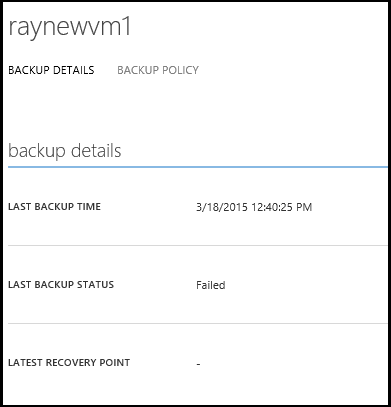
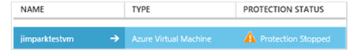

<properties
	pageTitle="Azure Backup - manage virtual machines"
	description="Learn how to manage an Azure virtual machine"
	services="backup"
	documentationCenter=""
	authors="jimpark"
	manager="jwhit"
	editor=""/>

<tags
	ms.service="backup"
	ms.workload="storage-backup-recovery"
	ms.tgt_pltfrm="na"
	ms.devlang="na"
	ms.topic="article"
	ms.date="05/11/2015"
	ms.author="jimpark"/>

# Manage virtual machines

## Manage protected virtual machines

1. To view and manage backup settings for a virtual machine click the **Protected Items** tab.

  - Click on the name of a protected item to see the **Backup Details** tab, which shows you information about the last backup.

        

2. To view and manage backup policy settings for a virtual machine click the **Policies** tab.

  - The **Backup Policies** tab shows you the existing policy. You can modify as needed. If you need to create a new policy click Create on the **Policies** page. Note that if you want to remove a policy it shouldn't have any virtual machines associated with it.

        

2. You can get more information about actions or status for a virtual machine on the **Jobs** page. Click a job in the list to get more details, or filter jobs for a specific virtual machine.

    

## Stop protecting virtual machines
If at any point you want to stop protecting a virtual machine:

1. Click on the **STOP PROTECTION** button on the bottom of the page.

    

    You can specify whether you want to delete the backup for the virtual machine that's currently in Azure Backup, and optionally specify a reason for auditing purposes. 

    

    The virtual machine will appear with the **Protection Stopped** status.

    

Note that if you didn't select to delete the associated backup data when you stopped protection for the virtual machine you can select the virtual machine in the Protected Items page and click **Delete**.

## Unregister virtual machines

If you want to remove the virtual machine from the backup vault:

1. Click on the **UNREGISTER** button at the bottom of the page.

    

    A toast notification will appear at the bottom of the screen requesting confirmation. Click **YES** to continue.

    

###Dashboard

On the Dashboard page you can review information about Azure virtual machines, their storage, and jobs associated with them in the last 24 hours. You can view backup status and any associated backup errors.

  
