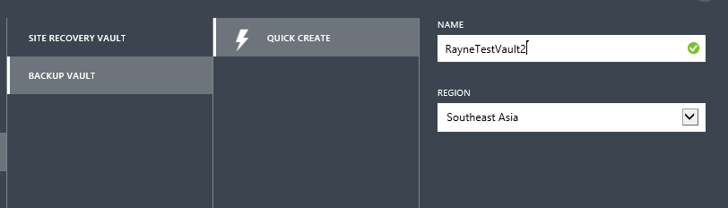
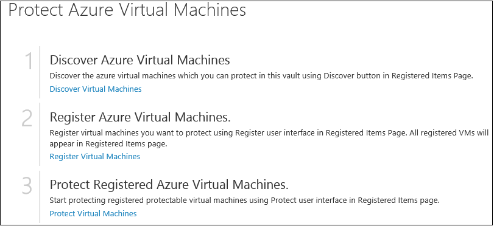
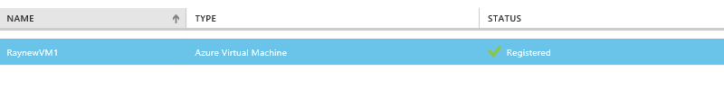
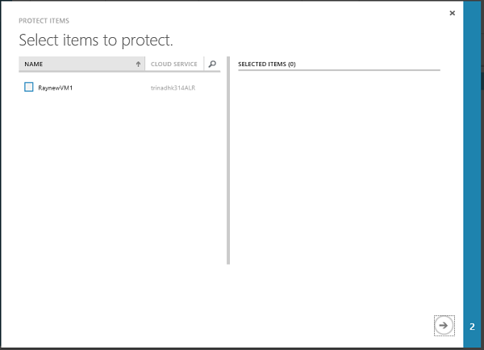
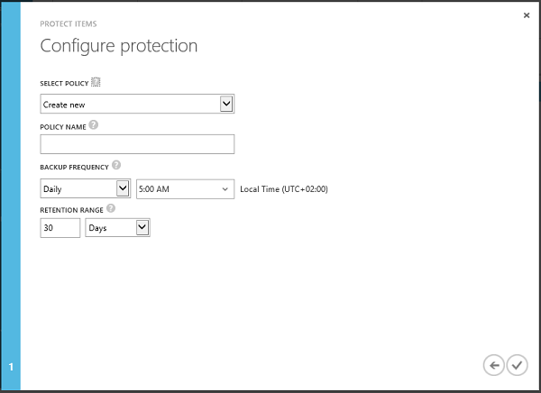
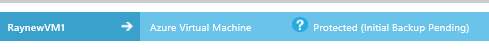
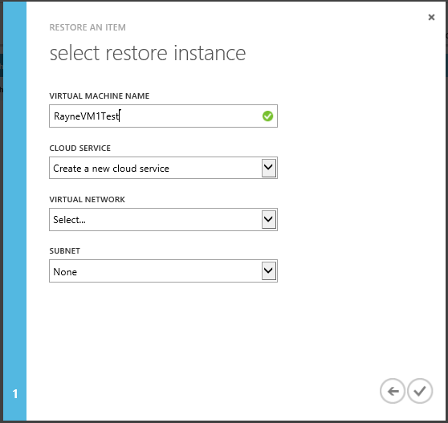
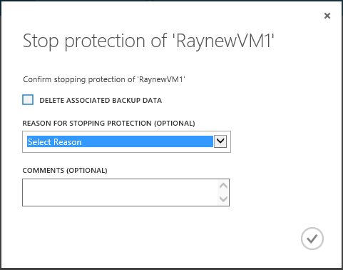

<properties 
	pageTitle="Back up Azure virtual machines with Azure Backup" 
	description="Use this walkthrough to deploy Azure Backup to back up Azure virtual machines." 
	services="backup" 
	documentationCenter="" 
	authors="raynew" 
	manager="jwhit" 
	editor="tysonn"/>

<tags 
	ms.service="backup" 
	ms.workload="storage-backup-recovery" 
	ms.tgt_pltfrm="na" 
	ms.devlang="na" 
	ms.topic="article" 
	ms.date="03/26/2015" 
	ms.author="raynew"/>
# Back up Azure virtual machines with Azure Backup

Use the Azure Backup service to protect data on your on-premises servers and Azure virtual machines from loss. This walkthrough describes how to backup your Azure virtual machines with Azure Backup.

## Overview

Using Azure Backup to backup data from your Azure virtual machines provides a number of business benefits:

- Azure Backup automates backup and recovery for your virtual machines
- It takes application consistent backups to ensure that recovered data starts from a consistent state.
- There's no downtime involved during virtual machine backup.
- You can back up Azure virtual machines that are running Windows or Linux
- Recovery points are available for easy restore in the Azure Backup vault.

## Before you start

You'll need an Azure account. If you don't have one start the with a [free trial](http://aka.ms/try-azure). You can also read about read about [Azure Backup pricing](hhttp://azure.microsoft.com/pricing/details/backup).
> [AZURE.NOTE] For the registration of your VMs to work they must be running before you attempt to register them.

## Create a vault

1. Sign in to the [Management Portal](https://portal.azure.com).
2. Click **Recovery Services** > **New** > **Data Services** > **Recovery Services** > **Backup Vault** > **Quick Create**. If have multiple subscriptions associated with your organizational account, choose the correct subscription to associate with the backup vault.
3. In **Name**, enter a friendly name to identify the vault.
4. In **Region**, select the geographic region for the vault. Note that the vault be in the same region as the virtual machines you want to protect. If you have virtual machines in different regions create a vault in each one.

	

3. Click **Create Vault**.

 	It can take a while for the backup vault to be created. Monitor status notifications at the bottom of the portal. A message confirms that the vault has been successfully created and it will be listed in the Recovery Services page as **Active**. 

	

## Register virtual machines

1. In the main Recovery Services page double-click the vault to open it.
2. On the Quick Start page click **Protect Azure Virtual Machine** > **Discover virtual machines** If you want more information about creating Azure virtual machines see:
	- [Create a virtual machine running Windows](virtual-machines-windows-tutorial.md)
	- [Create a virtual machine running Linux](virtual-machines-linux-tutorial.md)

	

3. Click **Registered Items** > **Register** >**Register Items**. Select the virtual machines and click the check mark to register them. The registration process deploys the Recovery Services extension on the virtual machine and enables backup. This extension enables Backup to take an  application-consistent backup with the Volume Shadow Copy Service (VSS), without needing to shut down the virtual machine. After registration finishes the virtual machine will appear on the page with a Registered status.

	

## Protect the virtual machine

1. On **Registered Items** tab select the virtual machine > **Protect** to open the **Protect Items** wizard.
2. On the **Select items to protect** page check the virtual machines for which you want to enable protection. 

		
 
3. On the **Configure protection** page you'll select a protection policy to apply to the virtual machine. A policy defines the backup schedule and how long the backup is retained in Azure Backup. If you define a new policy specify a name, how often the virtual machine should be backed up and how long the backed up virtual machine data should be retained in Azure Backup. You can retain a virtual machine for up to 30 days.

	

4. After protection is configured the virtual machine will appear on the **Protected Items** tab. It will appear with the Protected (initial backup pending) status until the initial backup finishes and then with a Protected status.

	
 
## Run a backup

After initial replication completes the virtual machine will be backed up in accordance with the policy schedule, or you can click **Backup Now** to run a manual backup.
Note that **Backup Now** uses the retention policy that's applied to the virtual machine Backup and creates a recovery point.
 
 
 
## Run a restore

1. To restore a virtual machine from the backup on the **Protected Items** page click **Restore** to open the **Restore an Item** wizard.
2. On the **Select a recovery point** page you can restore from the newest recovery point, or from a previous point in time. Available recovery points are highlighted on the calendar.

	

3.  On the **Select restore instance** page specify where you want to restore the virtual machine. You need to restore to an alternate location. Specify the alternate virtual machine name, and existing or new cloud service. Specify the target network and subnet as required. 

	

After restore you'll need to reconfigure the extensions and recreate the endpoints for the virtual machine in the Azure portal. 
 
## Manage protected virtual machines

1. To view and manage backup settings for a virtual machine click it **Protected Items** page.

	- The **Backup Details** tab shows you information about the last backup.

			

	- The **Backup Policy** tab shows you the existing policy. You can modify as needed. If you need to create a new policy click Create on the **Policies** page. Note that if you want to remove a policy it shouldn't have any virtual machines associated with it.

		

2. Get more information about actions or status for a virtual machine on the **Jobs** page. Click a job in the list to get more details, or filter jobs for a specific virtual machine.

	

3. If at any point you want to stop protecting a virtual machine select it and click **Stop Protection** on the **Protected Items** page. You can specify whether you want to delete the backup for the virtual machine that's currently in Azure Backup, and optionally specify a reason for auditing purposes. The virtual machine will appear with the **Protection Stopped** status.

	

 Note that if you didn't select to delete the backup when you stopped backup for the virtual machine you can select the virtual machine in the Protected Items page and click **Delete**. If you want to remove the virtual machine from the backup vault, stop it and then click **Unregister** to remove it completely. 

###Dashboard

On the Dashboard page you can review information about Azure virtual machines, their storage, and jobs associated with them in the last 24 hours. You can view backup status and any associated backup errors. 

