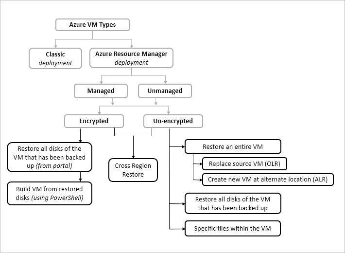

# About Azure VM restore

This article describes how the [Azure Backup service](./backup-overview.md) restores Azure virtual machines (VMs). There are a number of restore options. We'll discuss the various scenarios they support.

## Concepts

- **Recovery Point** (also known as **Restore Point**): A recovery point is a copy of the original data that's being backed up.

- **Tier (snapshot vs. vault)**:  Azure VM backup happens in two phases:

  - In phase 1, the snapshot taken is stored along with the disk. This is referred to as **snapshot tier**. Snapshot tier restores are faster (than restore from vault) because they eliminate the wait time for snapshots to copy to the vault before triggering the restore. So restore from the snapshot tier is also referred as [Instant Restore](./backup-instant-restore-capability.md).
  - In phase 2, the snapshot is transferred and stored in the vault managed by the Azure Backup service. This is referred to as **vault tier**.

- **Original Location Recovery (OLR)**: A recovery done from the restore point to the source Azure VM from where the backups were taken, replacing it with the state stored in the recovery point. This replaces the OS disk and the data disk(s) of the source VM.

- **Alternate-Location Recovery (ALR)**: A recovery done from the recovery point to a server other than the original server where the backups were taken.

- **Item Level Restore (ILR):** Restoring individual files or folders inside the VM from the recovery point

- **Availability (Replication types)**: Azure Backup offers three types of replication to keep your storage/data highly available:
  - [Locally redundant storage (LRS)](../storage/common/storage-redundancy.md#locally-redundant-storage) replicates your data three times (it creates three copies of your data) in a storage scale unit in a datacenter. All copies of the data exist within the same region. LRS is a low-cost option for protecting your data from local hardware failures.
  - [Geo-redundant storage (GRS)](../storage/common/storage-redundancy.md#geo-redundant-storage) is the default and recommended replication option. GRS replicates your data to a secondary region (hundreds of miles away from the primary location of the source data). GRS costs more than LRS, but GRS provides a higher level of durability for your data, even if there's a regional outage.
  - [Zone-redundant storage (ZRS)](../storage/common/storage-redundancy.md#zone-redundant-storage) replicates your data in [availability zones](../availability-zones/az-overview.md#availability-zones), guaranteeing data residency and resiliency in the same region. ZRS has no downtime. So your critical workloads that require [data residency](https://azure.microsoft.com/resources/achieving-compliant-data-residency-and-security-with-azure/), and must have no downtime, can be backed up in ZRS.

- **Cross-Region Restore (CRR)**: As one of the [restore options](./backup-azure-arm-restore-vms.md#restore-options), Cross Region Restore (CRR) allows you to restore Azure VMs in a secondary region, which is an [Azure paired region](../availability-zones/cross-region-replication-azure.md) You can restore your data in the secondary region at anytime,  during partial or full outages, or any other time you choose. 

## Restore scenarios

| **Scenario**                                                 | **What is done**                                             | **When to use**                                              |
| ------------------------------------------------------------ | ------------------------------------------------------------ | ------------------------------------------------------------ |
| [Restore to create a new virtual machine](./backup-azure-arm-restore-vms.md) | Restores the entire VM to OLR (if the source VM still exists) or ALR | <ul><li> If the source VM is lost or  corrupt, then you can restore entire VM  <li> You can create a copy of the  VM  <li> You can perform a restore  drill for audit or compliance  <li> If license for Marketplace Azure VM has expired, [create VM restore](./backup-azure-arm-restore-vms.md#create-a-vm) option can't be used.</ul> |
| [Restore disks of the VM](./backup-azure-arm-restore-vms.md#restore-disks) | Restore disks attached to the VM                             |  All disks: This option creates the template and restores the disk. You can edit this template  with special configurations (for example, availability sets) to meet your requirements  and then use both the template and restore the disk to recreate the VM. |
| [Restore specific files within the VM](./backup-azure-restore-files-from-vm.md) | Choose restore point, browse, select files, and restore them to the  same (or compatible) OS as the backed-up VM. |  If you know which specific  files to restore, then use this option instead of restoring the entire VM. |
| [Restore an encrypted VM](./backup-azure-vms-encryption.md) | From the portal, restore the disks and then use PowerShell to create the VM | <ul><li> [Encrypted VM with  Azure Active Directory](../virtual-machines/windows/disk-encryption-windows-aad.md)  <li> [Encrypted VM  without Azure AD](../virtual-machines/windows/disk-encryption-windows.md) <li> [Encrypted VM *with Azure AD* migrated to *without Azure AD*](../virtual-machines/windows/disk-encryption-faq.yml#can-i-migrate-vms-that-were-encrypted-with-an-azure-ad-app-to-encryption-without-an-azure-ad-app-)</ul> |
| [Cross Region Restore](./backup-azure-arm-restore-vms.md#cross-region-restore) | Create a new VM or restore disks to a  secondary region (Azure paired region) | <ul><li> **Full outage**:  With the cross region restore feature, there's no wait time to recover data in the secondary region. You can initiate restores in the secondary region even before Azure declares an outage. <li> **Partial outage**: Downtime can occur in specific storage clusters where Azure Backup stores your backed-up data or even in-network, connecting Azure Backup and storage clusters associated with your backed-up data. With Cross Region Restore, you can perform a restore in the secondary region using a replica of backed up data in the secondary region. <li> **No outage**: You can conduct business continuity and disaster recovery (BCDR) drills for audit or compliance purposes with the secondary region data. This allows you to perform a restore of backed up data in the secondary region even if there isn't a full or partial outage in the primary region for business continuity and disaster recovery drills.</ul>  |

## Next steps

- [Frequently asked questions about VM restore](./backup-azure-vm-backup-faq.yml)
- [Supported restore methods](./backup-support-matrix-iaas.md#supported-restore-methods)
- [Troubleshoot restore issues](./backup-azure-vms-troubleshoot.md#restore)
