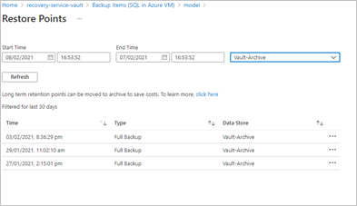
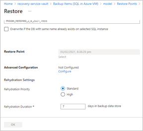
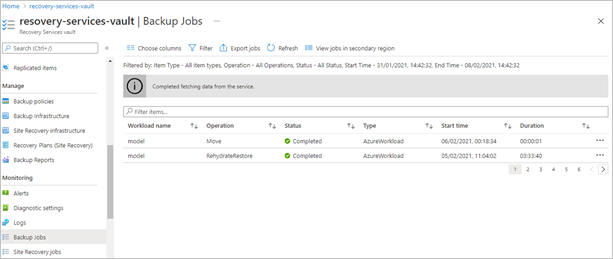

# Archive Tier support

Customers rely on Azure Backup for storing backup data including their Long-Term Retention (LTR) backup data with retention needs being defined by the organization's compliance rules. In most cases, the older backup data is rarely accessed and is only stored for compliance needs.

Azure Backup supports backup of long-term retention points in the archive tier, in addition to snapshots and the Standard tier.

## Scope

Supported workloads:

- Azure virtual machines
  - Only monthly and yearly recovery points. Daily and weekly recovery points aren't supported.
  - Age >= 3 months in Vault-Standard Tier
  - Retention left >= 6 months
  - No active daily and weekly dependencies
- SQL Server in Azure virtual machines
  - Only full recovery points. Logs and differentials aren't supported.
  - Age >= 45 days in Vault-Standard Tier
  - Retention left >= 6 months
  - No dependencies

Supported clients:

- The capability is provided using PowerShell

>[!Note]
>Archive Tier support for SQL Servers in Azure VMs is now generally available in North Europe, Central India, South East Asia, and Australia East. For the detailed list of supported regions, refer to the [support matrix](#support-matrix).    <br><br>    For the remaining regions for SQL Servers in Azure VMs, Archive Tier support is in limited public preview. Archive Tier support for Azure Virtual Machines is also in limited public preview. To sign up for limited public preview, use this [link](https://forms.office.com/Pages/ResponsePage.aspx?id=v4j5cvGGr0GRqy180BHbR463S33c54tEiJLEM6Enqb9UNU5CVTlLVFlGUkNXWVlMNlRPM1lJWUxLRy4u).

## Get started with PowerShell

1. Download the [latest](https://github.com/PowerShell/PowerShell/releases) version of PowerShell from GitHub.

1. Run the following command in PowerShell:
  
    ```azurepowershell
    install-module -name Az.RecoveryServices -Repository PSGallery -RequiredVersion 4.4.0 -AllowPrerelease -force
    ```

1. Connect to Azure using the [Connect-AzAccount](/powershell/module/az.accounts/connect-azaccount) cmdlet.
1. Sign into your subscription:

   `Set-AzContext -Subscription "SubscriptionName"`

1. Get the vault:

    `$vault =  Get-AzRecoveryServicesVault -ResourceGroupName "rgName" -Name "vaultName"`

1. Get the list of backup items:

    - For Azure virtual machines:

        `$BackupItemList = Get-AzRecoveryServicesBackupItem -vaultId $vault.ID -BackupManagementType "AzureVM" -WorkloadType "AzureVM"`

    - For SQL Server in Azure virtual machines:

        `$BackupItemList = Get-AzRecoveryServicesBackupItem -vaultId $vault.ID -BackupManagementType "AzureWorkload" -WorkloadType "MSSQL"`

1. Get the backup item.

    - For Azure virtual machines:

        `$bckItm = $BackupItemList | Where-Object {$_.Name -match '<vmName>'}`

    - For SQL Server in Azure virtual machines:

        `$bckItm = $BackupItemList | Where-Object {$_.Name -match '<dbName>' -and $_.ContainerName -match '<vmName>'}`

1. Add the date range for which you want to view the recovery  points. For example, if you want to view the recovery points from the last 124 days to last 95 days, use the following command:

   ```azurepowershell
    $startDate = (Get-Date).AddDays(-124)
    $endDate = (Get-Date).AddDays(-95) 

    ```
    >[!NOTE]
    >To view recovery points for a different time range, modify the start and the end date accordingly.
## Use PowerShell

### Check archivable recovery points

```azurepowershell
$rp = Get-AzRecoveryServicesBackupRecoveryPoint -VaultId $vault.ID -Item $bckItm -StartDate $startdate.ToUniversalTime() -EndDate $enddate.ToUniversalTime() -IsReadyForMove $true -TargetTier VaultArchive
```

This will list all recovery points associated with a particular backup item that are ready to be moved to archive (from the start date to the end date). You can also modify the start dates and the end dates.

### Check why a recovery point cannot be moved to archive

```azurepowershell
$rp = Get-AzRecoveryServicesBackupRecoveryPoint -VaultId $vault.ID -Item $bckItm -StartDate $startdate.ToUniversalTime() -EndDate $enddate.ToUniversalTime() -IsReadyForMove $false -TargetTier VaultArchive
$rp[0].RecoveryPointMoveReadinessInfo["ArchivedRP"]
```

Where `$rp[0]` is the recovery point for which you want to check why it's not archivable.

Sample output:

```output
IsReadyForMove  AdditionalInfo
--------------  --------------
False           Recovery-Point Type is not eligible for archive move as it is already moved to archive tier
```

### Check recommended set of archivable points (only for Azure VMs)

The recovery points associated with a virtual machine are incremental in nature. When a particular recovery point is moved to archive, it's converted into a full backup and then moved to archive. So the cost savings associated with moving to archive depends on the churn of the data source.

So Azure Backup has come up with a recommended set of recovery points that might result in cost savings if moved together.

>[!NOTE]
>The cost savings depends on a variety of reasons and might not be the same for any two instances.

```azurepowershell
$RecommendedRecoveryPointList = Get-AzRecoveryServicesBackupRecommendedArchivableRPGroup -Item $bckItm -VaultId $vault.ID
```

### Move to archive

```azurepowershell
Move-AzRecoveryServicesBackupRecoveryPoint -VaultId $vault.ID -RecoveryPoint $rp[0] -SourceTier VaultStandard -DestinationTier VaultArchive
```

Where, `$rp[0]` is the first recovery point in the list. If you want to move other recovery points, use `$rp[1]`, `$rp[2]`, and so on.

This command moves an archivable recovery point to archive. It returns a job that can be used to track the move operation both from portal and with PowerShell.

### View archived recovery points

This command returns all the archived recovery points.

```azurepowershell
$rp = Get-AzRecoveryServicesBackupRecoveryPoint -VaultId $vault.ID -Item $bckItm -Tier VaultArchive -StartDate $startdate.ToUniversalTime() -EndDate $enddate.ToUniversalTime()
```

### Restore with PowerShell

For recovery points in archive, Azure Backup provides an integrated restore methodology.

The integrated restore is a two-step process. The first step involves rehydrating the recovery points stored in archive and temporarily storing it in the vault-standard tier for a duration (also known as the rehydration duration) ranging from a period of 10 to 30 days. The default is 15 days. There are two different priorities of rehydration – Standard and High priority. Learn more about [rehydration priority](../storage/blobs/storage-blob-rehydration.md#rehydrate-an-archived-blob-to-an-online-tier).

>[!NOTE]
>
>- The rehydration duration once selected can't be changed and the rehydrated recovery points stays in the standard tier for the rehydration duration.
>- The additional step of rehydration incurs cost.

For more information about the various restore methods for Azure virtual machines, see [Restore an Azure VM with PowerShell](backup-azure-vms-automation.md#restore-an-azure-vm).

```azurepowershell
Restore-AzRecoveryServicesBackupItem -VaultLocation $vault.Location -RehydratePriority "Standard" -RehydrateDuration 15 -RecoveryPoint $rp -StorageAccountName "SampleSA" -StorageAccountResourceGroupName "SArgName" -TargetResourceGroupName $vault.ResourceGroupName -VaultId $vault.ID
```

To restore SQL Server, follow [these steps](backup-azure-sql-automation.md#restore-sql-dbs). The `Restore-AzRecoveryServicesBackupItem` command requires two additional parameters, **RehydrationDuration** and **RehydrationPriority**.

### View jobs from PowerShell

To view the move and restore jobs, use the following PowerShell cmdlet:

```azurepowershell
Get-AzRecoveryServicesBackupJob -VaultId $vault.ID
```

## Use the portal

### Check archived recovery point

You can now view all the recovery points that have been moved to archive.



### Restore in the portal

For recovery points that have been moved to archive, restore requires you add the parameters for rehydration duration and rehydration priority.



### View jobs in the portal



### Modify protection

There are two ways in which you can modify protection for a datasource:

- Modifying an existing policy
- Protecting the datasource with a new policy

In both cases, the new policy is applied to all the older recovery points, which are in standard tier, and those in archive tier. So older recovery points might get deleted if there's a change in the policy.

When the recovery points are moved to archive, they're subjected to an early deletion period of 180 days. The charges are prorated. If a recovery point that hasn’t stayed in archive for 180 days is deleted, it will incur cost equivalent to 180 minus the number of days it has spent in standard tier.

Recovery points that haven't stayed in archive for a minimum of six months will incur early deletion cost on deletion.

## Stop protection and delete data

Stop protection and delete data deletes all the recovery points. For recovery points in archive that haven't stayed for a duration of 180 days in archive tier, deletion of recovery points will lead to early deletion cost.

## Support matrix

| Workloads | Preview | Generally available |
| --- | --- | --- |
| SQL Server in Azure VM | East US, East US 2, Central US, South Central US, West US, West US 2, West Central US, North Central US, Brazil South, Canada East, Canada Central, West Europe, UK South, UK West, East Asia, Japan East, South India | Australia East, Central India, North Europe, South East Asia |
| Azure Virtual Machines | East US, East US 2, Central US, South Central US, West US, West US 2, West Central US, North Central US, Brazil South, Canada East, Canada Central, West Europe, UK South, UK West, East Asia, Japan East, South India, South East Asia, Australia East, Central India, North Europe | None |

## Error codes and troubleshooting steps

There are several error codes that come up when a recovery point can't be moved to archive.

### RecoveryPointTypeNotEligibleForArchive

**Error Message** - Recovery-Point Type is not eligible for Archive Move

**Description** – This error code is shown when the selected recovery point type isn't eligible to be moved to archive.

**Recommended action** – Check eligibility of the recovery point [here](#scope)

### RecoveryPointHaveActiveDependencies

**Error Message** - Recovery-Point having active dependencies for restore is not eligible for Archive Move

**Description –** The selected recovery point has active dependencies and so can’t be moved to archive.

**Recommended action** – Check eligibility of the recovery point [here](#scope)

### MinLifeSpanInStandardRequiredForArchive

**Error Message** - Recovery-Point is not eligible for Archive Move as lifespan spent in Vault-Standard-Tier is lesser than the required minimum

**Description** – The recovery point has to stay in Standard tier for a minimum of three months for Azure virtual machines, and 45 days for SQL Server in Azure virtual machines

**Recommended action** – Check eligibility of the recovery point [here](#scope)

### MinRemainingLifeSpanInArchiveRequired

**Error Message** - Recovery-Point remaining lifespan is lesser than the required minimum.

**Description** – The minimum lifespan required for a recovery point for archive move eligibility is six months.

**Recommended action** – Check eligibility of the recovery point [here](#scope)

### UserErrorRecoveryPointAlreadyInArchiveTier

**Error Message** - Recovery-Point is not eligible for archive move as it has already been moved to archive tier

**Description** – The selected recovery point is already in archive. So it’s not eligible to be moved to archive.

### UserErrorDatasourceTypeIsNotSupportedForRecommendationApi

**Error Message** - Datasource Type is not eligible for Recommendation API.

**Description** – Recommendation API is only applicable for Azure virtual machines. It’s not applicable for the selected datasource type.

### UserErrorRecoveryPointAlreadyRehydrated

**Error Message** - Recovery Point is already rehydrated. Rehydration is not allowed on this RP.

**Description** – The selected recovery point is already rehydrated.

### UserErrorRecoveryPointIsNotEligibleForArchiveMove

**Error Message** -Recovery-Point is not eligible for Archive Move.

**Description** – The selected recovery point isn't eligible for archive move.

### UserErrorRecoveryPointNotRehydrated

**Error** **message** - Archive Recovery Point is not rehydrated. Retry Restore after rehydration completed on Archive RP.

**Description** – The recovery point isn't rehydrated. Try restore after rehydrating the recovery point.

### UserErrorRecoveryPointRehydrationNotAllowed

**Error** **message**- Rehydration is only supported for Archive Recovery Points- Rehydration is only supported for Archive Recovery Points

**Description** – Rehydration isn’t allowed for the selected recovery point.

### UserErrorRecoveryPointRehydrationAlreadyInProgress

**Error message** – Rehydration is already In-Progress for Archive Recovery Point.

**Description** – The rehydration for the selected recovery point is already in progress.

### RPMoveNotSupportedDueToInsufficientRetention

**Error message** - Recovery point cannot be moved to Archive tier due to insufficient retention duration specified in policy

**Recommended Action** - Update policy on the protected item with appropriate retention setting, and try again.

### RPMoveReadinessToBeDetermined

**Error message** - We're still determining if this Recovery Point can be moved.

**Description** – The move readiness of the recovery point is yet to be determined.

**Recommended Action** - Check again after waiting for some time.

## Frequently asked questions

### What will happen to archive recovery points if I stop protection and retain data?

The recovery point will remain in archive forever. For more information, see [Impact of stop protection on recovery points](manage-recovery-points.md#impact-of-stop-protection-on-recovery-points).

### Is Cross Region restore supported from archive tier?

When you move your data in GRS vaults from standard tier to archive tier, the data moves into GRS archive. This is true even when Cross region restore is enabled. Once backup data moves into archive tier, you can’t restore the data into the paired region. However, during region failures, the backup data in secondary region will become available for restore. 

While restoring from recovery point in archive tier in primary region, the recovery point is copied to the Standard tier and is retained according to the rehydration duration, both in primary and secondary region. You can perform Cross region restore from these rehydrated recovery points.

## Next steps

- [Azure Backup pricing](azure-backup-pricing.md)
