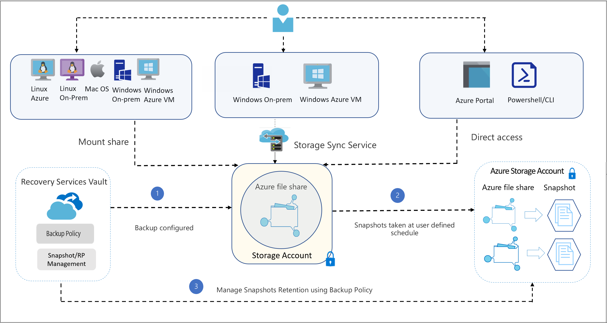

# About Azure file share backup

Azure file share backup is a native, cloud based backup solution that protects your data in the cloud and eliminates additional maintenance overheads involved in on-premises backup solutions. The Azure Backup service smoothly integrates with Azure File Sync, and allows you to centralize your file share data as well as your backups. This simple, reliable, and secure solution enables you to configure protection for your enterprise file shares in a few simple steps with an assurance that you can recover your data if any accidental deletion.

## Key benefits of Azure file share backup

* **Zero infrastructure**: No deployment is needed to configure protection for your file shares.
* **Customized retention**: You can configure backups with daily/weekly/monthly/yearly retention according to your requirements.
* **Built in management capabilities**: You can schedule backups and specify the desired retention period without the additional overhead of data pruning.
* **Instant restore**: Azure file share backup uses file share snapshots, so you can select just the files you want to restore instantly.
* **Alerting and reporting**: You can configure alerts for backup and restore failures and use the reporting solution provided by Azure Backup to get insights on backups across your files shares.
* **Protection against accidental deletion of file shares**: Azure Backup enables the [soft delete feature](../storage/files/storage-files-prevent-file-share-deletion.md) on a storage account level with a retention period of 14 days. Even if a malicious actor deletes the file share, the file share’s contents and recovery points (snapshots) are retained for a configurable retention period, allowing the successful and complete recovery of source contents and snapshots with no data loss.
* **Protection against accidental deletion of snapshots**: Azure Backup acquires a lease on the snapshots taken by scheduled/on-demand backup jobs. The lease acts as a lock that adds a layer of protection and secures the snapshots against accidental deletion.

## Architecture

## How the backup process works

1. The first step in configuring backup for Azure file shares is creating a Recovery Services vault. The vault gives you a consolidated view of the backups configured across different workloads.

2. Once you create a vault, the Azure Backup service discovers the storage accounts that can be registered with the vault. You can select the storage account hosting the file shares you want to protect.

3. After you select the storage account, the Azure Backup service lists the set of file shares present in the storage account and stores their names in the management layer catalog.

4. You then configure the backup policy (schedule and retention) according to your requirements, and select the file shares to back up. The Azure Backup service registers the schedules in the control plane to do scheduled backups.

5. Based on the policy specified, the Azure Backup scheduler triggers backups at the scheduled time. As part of that job, the file share snapshot is created using  the File share API. Only the snapshot URL is stored in the metadata store.

    >[!NOTE]
    >The file share data isn't transferred to the Backup service, since the Backup service creates and manages snapshots that are part of your storage account, and backups aren't transferred to the vault.

6. You can restore the Azure file share contents (individual files or the full share) from snapshots available on the source file share. Once the operation is triggered, the snapshot URL is retrieved from the metadata store and the data is listed and transferred from the source snapshot to the target file share of your choice.

7. If you're using Azure File Sync, the Backup service indicates to the Azure File Sync service the paths of the files being restored, which then triggers a background change detection process on these files. Any files that have changed are synced down to the server endpoint. This process happens in parallel with the original restore to the Azure file share.

8. The backup and restore job monitoring data is pushed to the Azure Backup Monitoring service. This allows you to monitor cloud backups for your file shares in a single dashboard. In addition, you can also configure alerts or email notifications when backup health is affected. Emails are sent via the Azure email service.

## Backup costs

There are two costs associated with Azure file share backup solution:

1. **Snapshot storage cost**: Storage charges incurred for snapshots are billed along with Azure Files usage according to the pricing details mentioned [here](https://azure.microsoft.com/pricing/details/storage/files/)

2. **Protected Instance fee**: Starting from September 1, 2020, you're charged a protected instance fee as per the [pricing details](https://azure.microsoft.com/pricing/details/backup/). The protected instance fee depends on the total size of protected file shares in a storage account.

To get detailed estimates for backing up Azure file shares, you can download the detailed [Azure Backup pricing estimator](https://aka.ms/AzureBackupCostEstimates).  

## How lease snapshot works?

When Azure Backup takes a snapshot, scheduled or on-demand, it adds a lock on the snapshot using the lease snapshot capability of the _Files_ platform. The lock protects the snapshots from accidental deletion, and the lock’s duration is infinite. If a file share has leased snapshots, the deletion is no more a one-click operation. Therefore, you also get protection against accidental deletion of the backed-up file share.

To protect a snapshot from deletion while restore operation is in progress, Azure Backup checks the lease status on the snapshot. If it's non-leased, it adds a lock by taking a lease on the snapshot.

The following diagram explains the lifecycle of the lease acquired by Azure Backup:

:::image type="content" source="./media/azure-file-share-backup-overview/backup-lease-lifecycle-diagram.png" alt-text="Diagram explaining the lifecycle of the lease acquired by Azure Backup." border="false":::

## Next steps

* Learn how to [Back up Azure file shares](backup-afs.md)
* Find answers to [Questions about backing up Azure Files](backup-azure-files-faq.yml)
