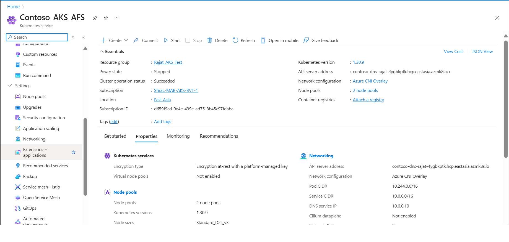
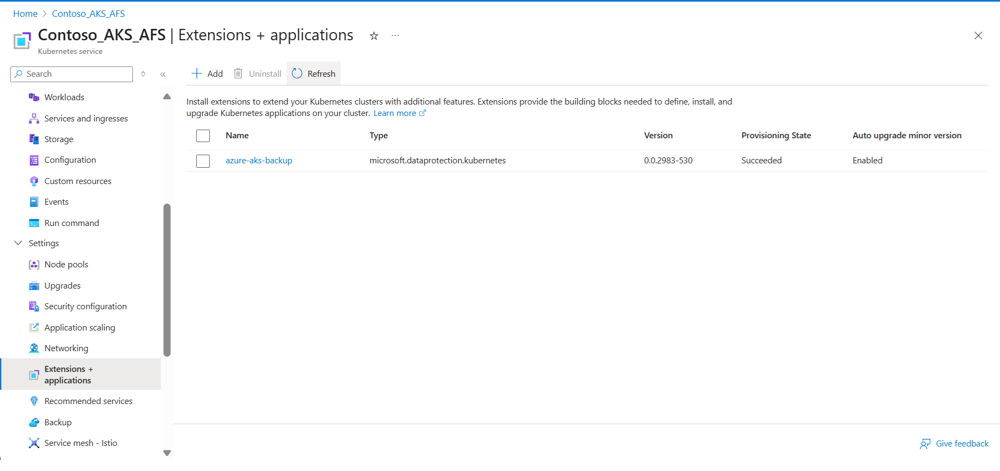
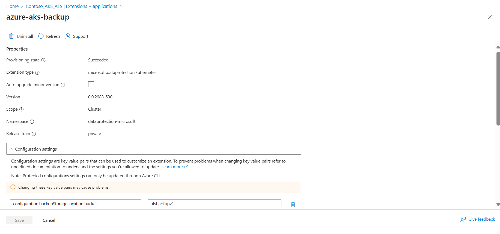
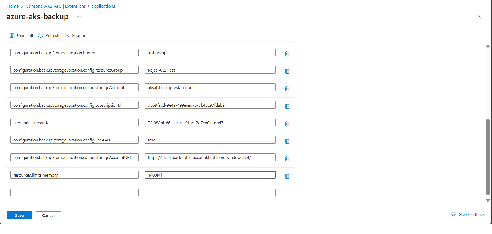

# Troubleshoot Azure Kubernetes Service backup and restore

This article provides troubleshooting steps that help you resolve Azure Kubernetes Service (AKS) backup, restore, and management errors.

## AKS Backup Extension installation error resolutions

### Scenario 1

**Error message**:

   ```Error
   {Helm installation from path [] for release [azure-aks-backup] failed with the following error: err [release azure-aks-backup failed, and has been uninstalled due to atomic being set: failed post-install: timed out waiting for the condition]} occurred while doing the operation: {Installing the extension} on the config"`
   ```


**Cause**: The extension is installed successfully, but the pods aren't spawning because the required compute and memory aren't available for the pods.

**Resolution**: To resolve the issue, increase the number of nodes in the cluster, allowing sufficient compute and memory to be available for the pods to spawn.
To scale node pool on Azure portal, follow these steps:

1. On the Azure portal, open the *AKS cluster*.
1. Go to **Node pools** under **Settings**.
1. Select **Scale node pool**, and then update the *minimum* and *maximum* values on the **Node count range**.
1. Select **Apply**.

### Scenario 2

**Error message**:

   ```Error
   BackupStorageLocation "default" is unavailable: rpc error: code = Unknown desc = azure.BearerAuthorizer#WithAuthorization: Failed to refresh the Token for request to https://management.azure.com/subscriptions/aaaa0a0a-bb1b-cc2c-dd3d-eeeeee4e4e4e/resourceGroups/AzureBackupRG_westeurope_1/providers/Microsoft.Storage/storageAccounts/devhayyabackup/listKeys?%24expand=kerb&api-version=2019-06-01: StatusCode=404 -- Original Error: adal: Refresh request failed. Status Code = '404'. Response body: no azure identity found for request clientID 4e95##### REDACTED #####0777`

   Endpoint http://169.254.169.254/metadata/identity/oauth2/token?api-version=2018-02-01&client_id=4e95dcc5-a769-4745-b2d9-
   ```

**Cause**: When you enable pod-managed identity on your AKS cluster, an *AzurePodIdentityException* named *aks-addon-exception* is added to the *kube-system* namespace. An *AzurePodIdentityException* allows pods with certain labels to access the Azure Instance Metadata Service (IMDS) endpoint are not intercepted by the NMI server.

The extension pods aren't exempt, and require the Microsoft Entra pod identity to be enabled manually.

**Resolution**: Create *pod-identity* exception in AKS cluster (that works only for *dataprotection-microsoft* namespace and for *not kube-system*). [Learn more](/cli/azure/aks/pod-identity/exception?view=azure-cli-latest&preserve-view=true#az-aks-pod-identity-exception-add).

1. Run the following command:

   ```azurecli-interactive
   az aks pod-identity exception add --resource-group shracrg --cluster-name shractestcluster --namespace dataprotection-microsoft --pod-labels app.kubernetes.io/name=dataprotection-microsoft-kubernetes
   ```

2. To verify *Azurepodidentityexceptions* in cluster, run the following command:

   ```azurecli-interactive
   kubectl get Azurepodidentityexceptions --all-namespaces
   ```

3. To assign the *Storage Blob Data Contributor* role to the extension identity, run the following command:

   >[!Note]
   >Ensure that you use the latest Terraform script version. [Learn more](quick-kubernetes-backup-terraform.md#prerequisites).

   ```azurecli-interactive
   az role assignment create --assignee-object-id $(az k8s-extension show --name azure-aks-backup --cluster-name aksclustername --resource-group aksclusterresourcegroup --cluster-type managedClusters --query aksAssignedIdentity.principalId --output tsv) --role 'Storage Blob Data Contributor' --scope /subscriptions/subscriptionid/resourceGroups/storageaccountresourcegroup/providers/Microsoft.Storage/storageAccounts/storageaccountname
   ```

### Scenario 3

**Error message**:

   ```Error
   {"Message":"Error in the getting the Configurations: error {Post \https://centralus.dp.kubernetesconfiguration.azure.com/subscriptions/ subscriptionid /resourceGroups/ aksclusterresourcegroup /provider/managedclusters/clusters/ aksclustername /configurations/getPendingConfigs?api-version=2021-11-01\: dial tcp: lookup centralus.dp.kubernetesconfiguration.azure.com on 10.63.136.10:53: no such host}","LogType":"ConfigAgentTrace","LogLevel":"Error","Environment":"prod","Role":"ClusterConfigAgent","Location":"centralus","ArmId":"/subscriptions/ subscriptionid /resourceGroups/ aksclusterresourcegroup /providers/Microsoft.ContainerService/managedclusters/ aksclustername ","CorrelationId":"","AgentName":"ConfigAgent","AgentVersion":"1.8.14","AgentTimestamp":"2023/01/19 20:24:16"}`
   ```
**Cause**: Specific FQDN/application rules are required to use cluster extensions in the AKS clusters. [Learn more](/azure/aks/outbound-rules-control-egress#cluster-extensions).

This error appears due to absence of these FQDN rules because of which configuration information from the Cluster Extensions service wasn't available.

**Resolution**: To resolve the issue, you need to create a *CoreDNS-custom override* for the *DP* endpoint to pass through the public network.

1. Get Existing CoreDNS-custom YAML in your cluster (save it on your local for reference later):

   ```azurecli-interactive
   kubectl get configmap coredns-custom -n kube-system -o yaml
   ```

2. Override mapping for centralus DP endpoint to Public IP (use the below YAML):
   
    ```yaml
    apiVersion: v1
    kind: ConfigMap
    metadata:
      name: coredns-custom 
      namespace: kube-system
    data:
        aksdp.override: |
              hosts { 
                  20.40.200.153 centralus.dp.kubernetesconfiguration.azure.com
                  fallthrough
               }
    ``` 
    Now run the below command to apply the update yaml file:

   ```azurecli-interactive
   kubectl apply -f corednsms.yaml
   ```

3. To force reload `coredns` pods, run the following command:

   ```azurecli-interactive
   kubectl delete pod --namespace kube-system -l k8s-app=kube-dns
   ```

4. To perform `NSlookup` from the *ExtensionAgent* pod to check if *coreDNS-custom* is working, run the following command:

   ```azurecli-interactive
   kubectl exec -i -t pod/extension-agent-<pod guid that's there in your cluster> -n kube-system -- nslookup centralus.dp.kubernetesconfiguration.azure.com
   ```

5. To check logs of the *ExtensionAgent* pod, run the following command:

   ```azurecli-interactive
   kubectl logs pod/extension-agent-<pod guid that’s there in your cluster> -n kube-system --tail=200
   ```

6. Delete and reinstall Backup Extension to initiate backup. 

### Scenario 4

**Error message**:

   ```Error
   "message": "Error: [ InnerError: [Helm installation failed : Unable to create/update Kubernetes resources for the extension : Recommendation Please check that there are no policies blocking the resource creation/update for the extension : InnerError [release azure-aks-backup failed, and has been uninstalled due to atomic being set: failed pre-install: job failed: BackoffLimitExceeded]]] occurred while doing the operation : [Create] on the config, For general troubleshooting visit: https://aka.ms/k8s-extensions-TSG, For more application specific troubleshooting visit: Facing trouble? Common errors and potential fixes are detailed in the Kubernetes Backup Troubleshooting Guide, available at https://www.aka.ms/aksclusterbackup",
   ```
The upgrade CRDs pre-install job is failing in the cluster.

**Cause**: Pods Unable to Communicate with Kube API Server

**Debug**

1. Check for any events in the cluster related to pod spawn issue.
```azurecli-interactive
kubectl events -n dataprotection-microsoft
```
2. Check the pods for dataprotection crds.
```azurecli-interactive
kubectl get pods -A | grep "dataprotection-microsoft-kubernetes-agent-upgrade-crds"
```
3. Check the pods logs.
```azurecli-interactive
kubectl logs -f --all-containers=true --timestamps=true -n dataprotection-microsoft <pod-name-from-prev-command>
```
Example log message:
```Error
2024-08-09T06:21:37.712646207Z Unable to connect to the server: dial tcp: lookup aks-test.hcp.westeurope.azmk8s.io: i/o timeout
2024-10-01T11:26:17.498523756Z Unable to connect to the server: dial tcp 10.146.34.10:443: i/o timeout
```
**Resolution**:
In this case, there is a Network/Calico policy or NSG that didn't allow dataprotection-microsoft pods to communicate with the API server. 
You should allow the dataprotection-microsoft namespace, and then reinstall the extension.

### Scenario 5

Extension Agent Failing to Communicate with Data Plane Endpoints leading to backup extension pods to not be deployed. 

**Error message**: 
The extension agent in your AKS cluster is failing to connect to Azure Kubernetes Configuration service data plane endpoints `*.dp.kubernetesconfiguration.azure.com` in your region. This failure is indicated by reviewing the logs of the `extension-agent` pod. You will likely see repeated 403 errors for requests to data plane endpoints

```
Error code: 403  
Message: This traffic is not authorized
```
This typically means that the traffic from the extension agent is being blocked or lacks the necessary authorization to reach the Azure service. This extension agent is requisite to install and run the backup extension in the AKS cluster.

**Cause**
This error occurs due to a conflict in private DNS resolution when both Azure Arc-enabled Kubernetes and an AKS managed cluster share the same virtual network (VNet) or private DNS server:

The shared VNet (or private DNS zone) contains a preexisting private endpoint for Azure Arc-enabled Kubernetes.

As a result, the data plane endpoint used by the AKS extension agent (e.g., *.dp.kubernetesconfiguration.azure.com) resolves to a private IP address (e.g., 10.x.x.x) instead of the intended public IP.

This misrouting causes the AKS extension agent to send traffic to an unintended private endpoint, leading to 403 Unauthorized errors. You can verify the resolved IP address of the data plane endpoint from within your AKS cluster using the following command:

```
kubectl exec -it -n kube-system extension-agent-<podGuid> --nslookup <region>.dp.kubernetesconfiguration.azure.com
```

Replace `region` with your specific Azure region (e.g., eastus, westeurope).

**Resolution**
To resolve this issue, consider the following approaches:

- **Use Separate VNets:** In case you are using both Azure Arc-enabled Kubernetes and AKS clusters, then deploy them in separate virtual networks to avoid DNS resolution conflicts caused by shared private endpoints.

- **Configure CoreDNS Override:** Override the CoreDNS settings in your AKS cluster to explicitly resolve the extension data plane endpoint to its public IP address. Refer to Scenario 3 in the documentation for detailed steps on configuring a CoreDNS override for the extension.

- **Verify Public IP Resolution:** Identify the correct public IP address of the extension data plane endpoint by using the nslookup command. Replace the region with your AKS cluster’s region:

 ```
 nslookup eastus2euap.dp.kubernetesconfiguration.azure.com
 ```

## Backup Extension post installation related errors

These error codes appear due to issues on the Backup Extension installed in the AKS cluster.


### KubernetesBackupListExtensionsError: 

**Cause**: Backup vault as part of a validation, checks if the cluster has backup extension installed. For this, the Vault MSI needs a reader permission on the AKS cluster allowing it to list all the extensions installed in the cluster. 

**Recommended action**: Reassign the Reader role to the Vault MSI (remove the existing role assignment and assign the Reader role again), because the Reader role assigned is missing the *list-extension* permission in it. If reassignment fails, use a different Backup vault to configure backup.

### UserErrorKubernetesBackupExtensionNotFoundError

**Cause**: Backup vault as part of validation, checks if the cluster has the Backup extension installed. Vault performs an operation to list the extensions installed in the cluster. If the Backup extension is absent in the list, this error appears.

**Recommended action**: Use the CL or Azure portal client to delete the extension, and then install the extension again.

### UserErrorKubernetesBackupExtensionHasErrors

**Cause**: The Backup extension installed in the cluster has some internal errors.

**Recommended action**: Use the CL or Azure portal client to delete the extension, and then install the extension again.

### UserErrorKubernetesBackupExtensionIdentityNotFound

**Cause**: AKS backup requires a Backup extension installed in the cluster. The extension along with its installation has a User Identity created called extension MSI. This MSI is created in the Resource Group comprising the node pools for the AKS cluster. This MSI gets the required Roles assigned to access Backup Storage location. The error code suggests that the Extension Identity is missing.

**Recommended action**: Use the CLI or the Azure portal client to delete the extension, and then install the extension again. A new identity is created along with the extension.

### KubernetesBackupCustomResourcesTrackingTimeOutError

**Cause**: Azure Backup for AKS requires a Backup extension to be installed in the cluster. To perform the backup and restore operations, custom resources are created in the cluster. The extension-spawn pods that perform backup related operations via these CRs. This error occurs when the extension isn't able to update the status of these CRs.

**Recommended action**: The health of the extension is required to be verified via running the command `kubectl get pods -n dataprotection.microsoft`. If the pods aren't in running state, then increase the number of nodes in the cluster by *1* or increase the compute limits. Then wait for a few minutes and run the command again, which should change the state of the pods to *running*. If the issue persists, delete and reinstall the extension.

### UserErrorBackupPluginPodRestartedDuringBackup

**Cause**: Azure Backup for AKS relies on pods deployed within the AKS cluster as part of the backup extension under the namespace `dataprotection-microsoft`. To perform backup and restore operations, these pods have specific CPU and memory requirements.

```
       1. Memory: requests - 128Mi, limits - 1280Mi
       2. CPU: requests - 500m, limits - 1000m
```

However, if the number of resources in the cluster exceeds 1000, the pods may require additional CPU and memory beyond the default reservation. If the required resources exceed the allocated limits, you might encounter a UserErrorBackupPluginPodRestartedDuringBackup error due to OOMKilled (Out of Memory) error during backup operation.

**Recommended action**: To ensure successful backup and restore operations, manually update the resource settings for the extension pods by following these steps:

1. Open the AKS cluster in the Azure portal.

    

1. Navigate to Extensions + Applications under Settings in the left-hand pane.

    

1. Click on the extension titled "azure-aks-backup".

    

1. Scroll down, add new value under configuration settings and then click Save. 
 
   `resources.limits.memory : 4400Mi`

    

After applying the changes, either wait for a scheduled backup to run or initiate an on-demand backup. If you still experience an OOMKilled failure, repeat the steps above and gradually increase memory limits and if it still persists increase `resources.limits.cpu` parameter also.

> [!NOTE]
>
> If the node where the extension pod is provisioned doesn't have the required CPU or memory, and you've only updated the resource limits, the pod may be repeatedly killed. To resolve this, update the configuration settings using `resources.requests.cpu` and `resources.requests.memory`. This ensures the pod is scheduled on a node that meets the requested resource requirements.

### UserErrorBackupPluginPodRestartedDuringRestore

**Cause**: Azure Backup for AKS relies on pods deployed within the AKS cluster as part of the backup extension under the namespace `dataprotection-microsoft`. To perform backup and restore operations, these pods have specific CPU and memory requirements.

```
       1. Memory: requests - 128Mi, limits - 1280Mi
       2. CPU: requests - 500m, limits - 1000m
```

However, if the number of resources in the cluster exceeds 1000, the pods may require additional CPU and memory beyond the default reservation. If the required resources exceed the allocated limits, you might encounter a UserErrorBackupPluginPodRestartedDuringRestore error due to OOMKilled (Out of Memory) error during restore operation.

**Recommended action**: To ensure successful backup and restore operations, manually update the resource settings for the extension pods by following these steps:

1. Open the AKS cluster in the Azure portal.

    

1. Navigate to Extensions + Applications under Settings in the left-hand pane.

    

1. Click on the extension titled "azure-aks-backup".

    

1. Scroll down, add new value under configuration settings and then click Save. 
 
   `resources.limits.memory : 4400Mi`

    

After applying the changes, either wait for a scheduled backup to run or initiate an on-demand backup. If you still experience an OOMKilled failure, repeat the steps above and gradually increase memory limits and if it still persists increase `resources.limits.cpu` parameter also.

> [!NOTE]
>
> If the node where the extension pod is provisioned doesn't have the required CPU or memory, and you've only updated the resource limits, the pod may be repeatedly killed. To resolve this, update the configuration settings using `resources.requests.cpu` and `resources.requests.memory`. This ensures the pod is scheduled on a node that meets the requested resource requirements.

### BackupPluginDeleteBackupOperationFailed

**Cause**: The Backup extension should be running to delete the backups. 

**Recommended action**: If the cluster is running, verify if the extension is running in a healthy state. Check if the extension pods are spawning, otherwise, increase the nodes. If that fails, try deleting and reinstalling the extension. If the backed-up cluster is deleted, then manually delete the snapshots and metadata.

### ExtensionTimedOutWaitingForBackupItemSync

**Cause**: The Backup extension waits for the backup items to be synced with the storage account.

**Recommended action**: If this error code appears, then either retry the backup operation or reinstall the extension.

## Backup storage location based errors

These error codes appear due to issues based on the Backup extension installed in the AKS cluster.

### UserErrorDeleteBackupFailedBackupStorageLocationReadOnly

**Cause**: The storage account provided as input during Backup extension installation is in *read only* state, which doesn't allow to delete the backup data from the blob container. 

**Recommended action**: Change the storage account state from *read only* to *write*.

### UserErrorDeleteBackupFailedBackupStorageLocationNotFound

**Cause**: During the extension installation, a Backup Storage Location is to be provided as input that includes a storage account and blob container. This error appears if the location is deleted or incorrectly added during extension installation.

**Recommended action**: Delete the Backup extension, and then reinstall it with correct storage account and blob container as input.

### UserErrorBackupFailedBackupStorageLocationReadOnly

**Cause**: The storage account provided as input during Backup extension installation is in *read only* state, which doesn't allow to write backup data on the blob container.

**Recommended action**: Change the storage account state from *read only* to *write*.

### UserErrorNoDefaultBackupStorageLocationFound

**Cause**: During extension installation, a Backup Storage Location is to be provided as input, which includes a storage account and blob container. The error appears if the location is deleted or incorrectly entered during extension installation.

**Recommended action**: Delete the Backup extension, and then reinstall it with correct storage account and blob container as input.

### UserErrorExtensionMSIMissingPermissionsOnBackupStorageLocation

**Cause**: The Backup extension should have the *Storage Blob Data Contributor* role on the Backup Storage Location (storage account). The Extension Identity gets this role assigned. 

**Recommended action**: If this role is missing, then use Azure portal or CLI to reassign this missing permission on the storage account.

### UserErrorBackupStorageLocationNotReady

**Cause**: During extension installation, a Backup Storage Location is to be provided as input that includes a storage account and blob container. The Backup extension should have *Storage Blob Data Contributor* role on the Backup Storage Location (storage account). The Extension Identity gets this role assigned.

**Recommended action**: The error appears if the Extension Identity doesn't have right permissions to access the storage account. This error appears if AKS backup extension is installed the first time when configuring protection operation. This happens for the time taken for the granted permissions to propagate to the AKS backup extension. As a workaround, wait an hour and retry the protection configuration. Otherwise, use Azure portal or CLI to reassign this missing permission on the storage account.

### UserErrorSnapshotResourceGroupHasLocks

**Cause**: This error code appears when a Delete or Read Lock has been applied on the Snapshot Resource Group provided as input for Backup Extension.

**Recommended action**: In case if you are configuring a new backup instance, use a resource group without a delete or read lock. If the backup instance already configured then remove the lock from the snapshot resource group. 

### KubernetesBackupGenericWarning

**Cause**: This error code indicates that a Kubernetes resource could not be backed up or restored, typically due to validation or dependency issues within the cluster. 

One commonly observed scenario is a failure during the restoration of Ingress resources due to issues with validating webhooks. A required service (e.g., fabp-ingress-nginx-controller-admission) is missing, preventing the webhook validate.nginx.ingress.kubernetes.io from executing properly. The validating webhook configuration exists but references a non-existent or misconfigured service. DNS resolution issues are preventing the webhook from reaching the intended endpoint. The cluster uses custom admission webhooks that were not backed up or recreated before the restore. The webhook configuration is obsolete or unnecessary for the restored cluster state.

**Recommended action**: 

- Verify if the missing service fabp-ingress-nginx-controller-admission exists using:

   ```json
   kubectl get svc -n ingress-basic
   ```

- If the service is missing, check deployment configurations and recreate it if necessary.

- Investigate potential DNS resolution issues by running:
   
  ```JSON  
  kubectl get endpoints -n ingress-basic

  nslookup fabp-ingress-nginx-controller-admission.ingress-basic.svc.cluster.local
  ```

- If the webhook validation is unnecessary, consider removing it using:

  ```json
  kubectl delete validatingwebhookconfiguration
  ```

- List all webhook configurations with:

  ```json
  kubectl get validatingwebhookconfigurations
  ```

- If the issue is resolved, manually restore the ingress by applying its YAML backup:

  ```json
  kubectl apply -f
  ```

>[!Note] 
>This warning can arise from multiple causes. If the above steps do not resolve your issue, consult the Kubernetes controller logs and webhook configuration for more specific error messages.

## Vaulted backup based errors

These error codes can appear while you enable AKS backup to store backups in a vault standard datastore.

### DppUserErrorVaultTierPolicyNotSupported

**Cause**: This error code appears when a backup policy is created with retention rule defined for vault-standard datastore for a Backup vault in a region where this datastore isn't supported.

**Recommended action**: Update the retention rule with vault-standard duration defined on Azure portal:

1. Select **Edit** icon next to the rule.

   :::image type="content" source="./media/azure-kubernetes-service-backup-troubleshoot/edit-backup-policy-for-vaulted-backup.png" alt-text="Screenshot shows how to edit the retention duration of the AKS backups." lightbox="./media/azure-kubernetes-service-backup-troubleshoot/edit-backup-policy-for-vaulted-backup.png":::

2. Clear the checkbox next the **Vault-standard**, and then select **Update**.

   :::image type="content" source="./media/azure-kubernetes-service-backup-troubleshoot/clear-vault-standard-checkbox.png" alt-text="Screenshot shows clearing the vault-standard checkbox." lightbox="./media/azure-kubernetes-service-backup-troubleshoot/clear-vault-standard-checkbox.png":::

3. Create a backup policy for operational tier backup (only snapshots for the AKS cluster).

## AKS backup and restore jobs completed with warnings

### UserErrorPVSnapshotDisallowedByPolicy

**Error code**: UserErrorPVSnapshotDisallowedByPolicy

**Cause**: An Azure policy is assigned over subscription that ceases the CSI driver to take the volume snapshot.

**Recommended action**: Remove the Azure Policy ceasing the disk snapshot operation, and then perform an on-demand backup.

### UserErrorPVSnapshotLimitReached

**Error code**: UserErrorPVSnapshotLimitReached

**Cause**: There is a limited number of snapshots for a Persistent Volume that can exist at a point-in-time. For Azure Disk-based Persistent Volumes, the limit is *500 snapshots*. This error appears when snapshots for specific Persistent Volumes aren't taken due to existence of snapshots higher than the supported limits.

**Recommended action**: Update the Backup Policy to reduce the retention duration and wait for Backup Vault to delete the older recovery points.

### CSISnapshottingTimedOut

**Error code**: CSISnapshottingTimedOut

**Cause**: Snapshot has failed because CSI Driver is getting timed out to fetch the snapshot handle.  

**Recommended action**: Review the logs and retry the operation to get successful snapshots by running an on-demand backup, or wait for next scheduled backup.

### UserErrorHookExecutionFailed

**Error code**: UserErrorHookExecutionFailed

**Cause**: When hooks applied to run along with backups and restores have encountered an error, and aren't successfully applied.

**Recommended action**: Review the logs, update the hooks, and then retry backup/restore operation.

### UserErrorNamespaceNotFound

**Error code**: UserErrorNamespaceNotFound

**Cause**: Namespaces provided in Backup Configuration is missing while performing backups. Either the namespace was wrongly provided or has been deleted.

**Recommended action**: Check if the Namespaces to be backed-up are correctly provided.

### UserErrorPVCHasNoVolume

**Error code**: UserErrorPVCHasNoVolume

**Cause**: The Persistent Volume Claim (PVC) in context doesn't have a Persistent Volume attached to it. So, the PVC won't be backed-up.

**Recommended action**: Attach a volume to the PVC, if it needs to be backed-up.

### UserErrorPVCNotBoundToVolume

**Error code**: UserErrorPVCNotBoundToVolume

**Cause**: The PVC in context is in *Pending* state and doesn't have a Persistent Volume attached to it. So, the PVC won't be backed-up. 

**Recommended action**: Attach a volume to the PVC, if it needs to be backed-up.

### UserErrorPVNotFound

**Error code**: UserErrorPVNotFound

**Cause**: The underlying storage medium for the Persistent Volume is missing. 

**Recommended action**: Check and attached a new Persistent Volume with actual storage medium attached.

### UserErrorStorageClassMissingForPVC

**Error code**: UserErrorStorageClassMissingForPVC

**Cause**: AKS backup checks for the storage class being used and skips the Persistent Volume from taking snapshots due to unavailability of the class. 

**Recommended action**: Update the PVC specifications with the storage class used.

### UserErrorSourceandTargetClusterCRDVersionMismatch

**Error code**: UserErrorSourceandTargetClusterCRDVersionMismatch

**Cause**: The source AKS cluster and Target AKS cluster during restore have different versions of *FlowSchema* and *PriorityLevelConfigurations CRs*. Some Kubernetes resources aren't restored due to the mismatch in cluster versions.

**Recommended action**: Use same cluster version for Target cluster as Source cluster or manually apply the CRs.

### LinkedAuthorizationFailed

**Error code**: LinkedAuthorizationFailed

**Cause**: To perform a restore operation, user needs to have a **read** permission over the backed-up AKS cluster. 

**Recommended action**: Assign Reader role on the source AKS cluster and then proceed to perform the restore operation. 

## Next steps

- [About Azure Kubernetes Service (AKS) backup](azure-kubernetes-service-backup-overview.md)
