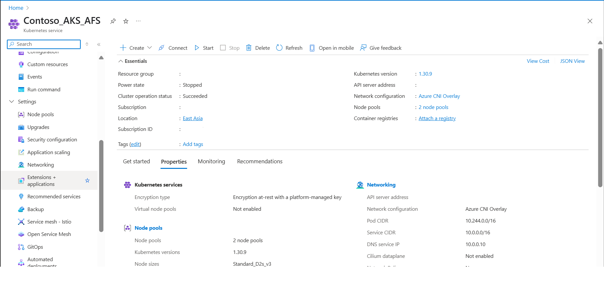
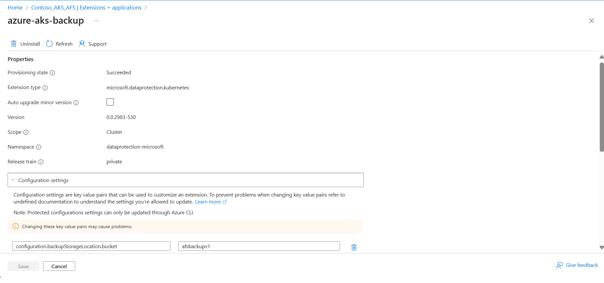
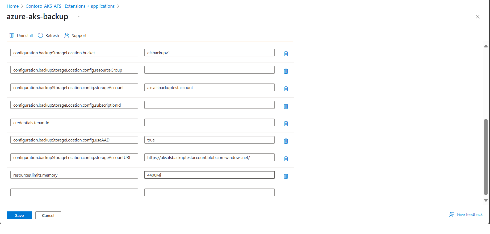

# Manage Azure Kubernetes Service backups using Azure Backup 

This article describes how to register resource providers on your subscriptions for using Backup Extension and Trusted Access. Also, it provides you with the Azure CLI commands to manage them.

Azure Backup now allows you to back up AKS clusters (cluster resources and persistent volumes attached to the cluster) using a backup extension, which must be installed in the cluster. AKS cluster requires Trusted Access enabled with Backup vault, so that the vault can communicate with the Backup Extension to perform backup and restore operations.

In addition, it helps to describe how to manage backup for the Azure Kubernetes Service clusters from the Azure portal.

## Resource provider registrations

Resource Provider registration is required for installing the Backup Extension, and initiating any backup and restore operation. You can  do this registration as a Subscription Owner. Generally, the Resource Provider is already registered in an Azure subscription. If not, register the `Microsoft.KubernetesConfiguration` resource provider.

After the registration is complete, you can perform backup and restore operations on all the cluster under the subscription.

### Register the Backup Extension

To install Backup Extension, you need to register `Microsoft.KubernetesConfiguration` resource provider on the subscription. To perform the registration, run the following command:

   ```azurecli-interactive
   az provider register --namespace Microsoft.KubernetesConfiguration
   ```

The registration can take up to *10 minutes*. To monitor the registration process, run the following command:

   ```azurecli-interactive
   az provider show --name Microsoft.KubernetesConfiguration --output table
   ```

## Backup Extension related operations

This section provides the set of Azure CLI commands to perform create, update, or delete operations on the Backup Extension. You can use the update command to change compute limits for the underlying Backup Extension Pods.

### Install Backup Extension

To install the Backup Extension, run the following command:

   ```azurecli-interactive
   az k8s-extension create --name azure-aks-backup --extension-type microsoft.dataprotection.kubernetes --scope cluster --cluster-type managedClusters --cluster-name <aksclustername> --resource-group <aksclusterrg> --release-train stable --configuration-settings blobContainer=<containername> storageAccount=<storageaccountname> storageAccountResourceGroup=<storageaccountrg> storageAccountSubscriptionId=<subscriptionid>
   ```

### View Backup Extension installation status

To view the progress of Backup Extension installation, use the following command:

   ```azurecli-interactive
   az k8s-extension show --name azure-aks-backup --cluster-type managedClusters --cluster-name <aksclustername> --resource-group <aksclusterrg>
   ```

### Update resources in Backup Extension

To update blob container, CPU, and memory in the Backup Extension, use the following command:

   ```azurecli-interactive
   az k8s-extension update --name azure-aks-backup --cluster-type managedClusters --cluster-name <aksclustername> --resource-group <aksclusterrg> --release-train stable --configuration-settings [blobContainer=<containername> storageAccount=<storageaccountname> storageAccountResourceGroup=<storageaccountrg> storageAccountSubscriptionId=<subscriptionid>] [cpuLimit=1] [memoryLimit=1Gi]
   
   []: denotes the 3 different sub-groups of updates possible (discard the brackets while using the command)

   ```

### Delete Backup Extension installation operation

To stop the Backup Extension install operation, use the following command:

   ```azurecli-interactive
   az k8s-extension delete --name azure-aks-backup --cluster-type managedClusters --cluster-name <aksclustername> --resource-group <aksclusterrg>
   ```

### Grant permission on storage account

The backup extension creates a User Assigned Managed Identity in the cluster's managed resource group. This identity needs to be provided *Storage Blob Data Contributor Permission* on storage account by running the following command:

   ```azurecli-interactive
   az role assignment create --assignee-object-id $(az k8s-extension show --name azure-aks-backup --cluster-name <aksclustername> --resource-group <aksclusterrg> --cluster-type managedClusters --query aksAssignedIdentity.principalId --output tsv) --role 'Storage Blob Data Contributor' --scope /subscriptions/<subscriptionid>/resourceGroups/<storageaccountrg>/providers/Microsoft.Storage/storageAccounts/<storageaccountname> 
   ```


## Trusted Access related operations

To enable Trusted Access between Backup vault and AKS cluster, use the following Azure CLI command:

   ```azurecli-interactive
   az aks trustedaccess rolebinding create \
   --resource-group <aksclusterrg> \
   --cluster-name <aksclustername> \
   --name <randomRoleBindingName> \
   --source-resource-id $(az dataprotection backup-vault show --resource-group <vaultrg> --vault <VaultName> --query id -o tsv) \
   --roles Microsoft.DataProtection/backupVaults/backup-operator   
   ```

Learn more about [other commands related to Trusted Access](/azure/aks/trusted-access-feature#trusted-access-feature-overview).

## Manage operations using the Azure portal

This section describes several Azure Backup supported management operations that make it easy to manage Azure Kubernetes Service cluster backups.

### Adjusting CPU and Memory for Azure Backup for AKS

Azure Backup for AKS relies on pods deployed within the AKS cluster as part of the backup extension under the namespace `dataprotection-microsoft`. To perform backup and restore operations, these pods have specific CPU and memory requirements.

#### Default Resource Reservations

```
       1. Memory: requests - 256Mi, limits - 1280Mi
       2. CPU: requests - 500m, limits - 1000m
```

However, if the number of resources in the cluster exceeds 1000, the extension pod `dataprotection-microsoft-kubernetes-agent` may require additional CPU and memory beyond the default reservation. If the required resources exceed the allocated limits, you might encounter a UserErrorBackupPluginPodRestartedDuringBackup or UserErrorBackupPluginPodRestartedDuringRestore error due to OOMKilled (Out of Memory) error during backup or restore operation.

#### Resolving OOMKilled Errors by Increasing CPU and Memory

To ensure successful backup and restore operations, manually update the resource settings for the extension pods by following these steps:

1. Open the AKS cluster in the Azure portal.

    

1. Navigate to Extensions + Applications under Settings in the left-hand pane.

    

1. Click on the extension titled "azure-aks-backup".

    

1. Scroll down, add new value under configuration settings and then click Save. 
 
   `resources.limits.memory : 4400Mi`

    

> [!NOTE]
>
> If the node where the extension pod is provisioned doesn't have the required CPU or memory, and you've only updated the resource limits, the pod may be repeatedly killed. To resolve this, update the configuration settings using `resources.requests.cpu` and `resources.requests.memory`. This ensures the pod is scheduled on a node that meets the requested resource requirements.

 
#### Verifying the Changes

After applying the changes, either wait for a scheduled backup to run or initiate an on-demand backup. If you still experience an OOMKilled failure, repeat the steps above and gradually increase memory limits and if it still persists increase `resources.limits.cpu` parameter also.

### Monitor a backup operation

The Azure Backup service creates a job for scheduled backups or if you trigger on-demand backup operation for tracking. To view the backup job status:

1. Go to the **Azure Business Continuity Center** and select **Protected Items** under **Protection Inventory**.

   The **Protected Items** blade shows all the backup instances created across the subscriptions. Use the filters to access the backup instance you would like to take a look at. Select on the protected item and open it.

   :::image type="content" source="./media/backup-managed-disks/jobs-dashboard.png" alt-text="Screenshot shows the jobs dashboard." lightbox="./media/backup-managed-disks/jobs-dashboard.png":::

1. Now select on the **Associated Items** to open up the dashboard for the backup instance. Here you can see the backup jobs for the last seven days. 

1. To view the status of the backup operation, select **View all** to show ongoing and past jobs of this backup instance.

   

1. Review the list of backup and restore jobs and their status. Select a job from the list of jobs to view job details.

   

### Monitor a restore operation

After you trigger the restore operation, the backup service creates a job for tracking. Azure Backup displays notifications about the job in the portal. To view the restore job progress:

1. Go to the **Azure Business Continuity Center** and select **Protected Items** under **Protection Inventory**.

   The **Protected Items** blade shows all the backup instances created across the subscriptions. Use the filters to access the backup instance you would like to take a look at. Select on the protected item and open it.

   :::image type="content" source="./media/backup-managed-disks/jobs-dashboard.png" alt-text="Screenshot shows the jobs dashboard." lightbox="./media/backup-managed-disks/jobs-dashboard.png":::

1. Now select on the **Associated Items** to open up the dashboard for the backup instance. Here you can see the backup jobs for the last seven days. 

1. To view the status of the restore operation, select **View all** to show ongoing and past jobs of this backup instance.

    

1. Review the list of backup and restore jobs and their status. Select a job from the list of jobs to view job details.

    


### Monitor backup and restore jobs with the completed with warnings status

When a scheduled or an on-demand backup or restore operation is performed, a job is created corresponding to the operation to track its progress. If there is a failure, these jobs allow you to identify error codes and fix issues to run a successful job later. 

For AKS backup, backup and restore jobs can show the status **Completed with Warnings**. This status appears when the backup and restore operation isn't fully successful due to issues in user-defined configurations or internal state of the workload.

:::image type="content" source="./media/azure-kubernetes-service-cluster-manage-backups/backup-restore-jobs-completed-with-warnings.png" alt-text="Screenshot shows the backup and restore jobs completed with warnings." lightbox="./media/azure-kubernetes-service-cluster-manage-backups/backup-restore-jobs-completed-with-warnings.png":::

For example, if a backup job for an AKS cluster completes with the status **Completed with Warnings**, a restore point is created, but it does not have all the resources in the cluster backed-up as per the backup configuration. The job shows warning details, providing the *issues* and *resources* that were impacted during the operation. 

To view these warnings, select **View Details** next to **Warning Details**.

:::image type="content" source="./media/azure-kubernetes-service-cluster-manage-backups/example-backup-job-with-warning-details.png" alt-text="Screenshot shows the job warming details." lightbox="./media/azure-kubernetes-service-cluster-manage-backups/example-backup-job-with-warning-details.png"::: 

Learn [how to identify and resolve the error](azure-kubernetes-service-backup-troubleshoot.md#aks-backup-extension-installation-error-resolutions). 


### Change policy

You can change the associated policy with a backup instance.

1. Select the **Backup Instance** -> **Change Policy**.


   :::image type="content" source="./media/manage-azure-database-postgresql/change-policy.png" alt-text="Screenshot showing the option to change policy.":::
   
1. Select the new policy that you wish to apply to the database.

   :::image type="content" source="./media/manage-azure-database-postgresql/reassign-policy.png" alt-text="Screenshot showing the option to reassign policy.":::

> [!NOTE]
>
> Changing a backup policy assigned to a backup instance does not affect existing recovery points and their retention duration. The updated retention settings will apply only to new recovery points created after the policy change.


### Stop Protection

There are three ways by which you can stop protecting an Azure Disk:

- **Stop Protection and Retain Data (Retain forever)**: This option helps you stop all future backup jobs from protecting your cluster. However, Azure Backup service retains the recovery points that are backed-up forever. You need to pay to keep the recovery points in the vault (see [Azure Backup pricing](https://azure.microsoft.com/pricing/details/backup/) for details). You are able to restore the disk, if needed. To resume cluster protection, use the **Resume backup** option.

- **Stop Protection and Retain Data (Retain as per Policy)**: This option helps you stop all future backup jobs from protecting your cluster. The recovery points are retained as per policy and will be chargeable according to [Azure Backup pricing](https://azure.microsoft.com/pricing/details/backup/). However, the latest recovery point is retained forever.

- **Stop Protection and Delete Data**: This option helps you stop all future backup jobs from protecting your clusters and delete all the recovery points. You won't be able to restore the disk or use the **Resume backup** option.

> [!NOTE]
>
> Even if AKS Backup is stopped or backups fail, the last restore point is always retained beyond the defined retention period, ensuring at least one restore point remains available.

#### Stop Protection and Retain Data

1. Go to the **Azure Business Continuity Center** and select **Protected Items** under **Protection Inventory**.

   The **Protected Items** blade shows all the backup instances created across the subscriptions. Use the filters to access the backup instance you would like to take a look at. Select on the protected item and open it.

   :::image type="content" source="./media/backup-managed-disks/jobs-dashboard.png" alt-text="Screenshot shows the jobs dashboard." lightbox="./media/backup-managed-disks/jobs-dashboard.png":::

1. Now select on the **Associated Items** to open up the dashboard for the backup instance. 

1. Select **Stop Backup**.

   :::image type="content" source="./media/manage-azure-managed-disks/select-disk-backup-instance-to-stop-inline.png" alt-text="Screenshot showing the selection of the Azure disk backup instance to be stopped." lightbox="./media/manage-azure-managed-disks/select-disk-backup-instance-to-stop-expanded.png":::
 
1. Select one of the following data retention options:

   1. Retain forever
   1. Retain as per policy
 
   :::image type="content" source="./media/manage-azure-managed-disks/data-retention-options-for-disk-inline.png" alt-text="Screenshot showing the options to stop disk backup instance protection." lightbox="./media/manage-azure-managed-disks/data-retention-options-for-disk-expanded.png":::

   You can also select the reason for stopping backups  from the drop-down list.

1. Select **Stop Backup**.

1. Select **Confirm** to stop data protection.

   :::image type="content" source="./media/manage-azure-managed-disks/confirm-stopping-disk-backup-inline.png" alt-text="Screenshot showing the options for disk backup instance retention to be selected." lightbox="./media/manage-azure-managed-disks/confirm-stopping-disk-backup-expanded.png":::

#### Stop Protection and Delete Data

1. Go to the **Azure Business Continuity Center** and select **Protected Items** under **Protection Inventory**.

   The **Protected Items** blade shows all the backup instances created across the subscriptions. Use the filters to access the backup instance you would like to take a look at. Select on the protected item and open it.

   :::image type="content" source="./media/backup-managed-disks/jobs-dashboard.png" alt-text="Screenshot shows the jobs dashboard." lightbox="./media/backup-managed-disks/jobs-dashboard.png":::

1. Now select on the **Associated Items** to open up the dashboard for the backup instance. 

1. Select **Stop Backup**.

1. Select **Delete Backup Data**.

   Provide the name of the backup instance, reason for deletion, and any other comments.

   :::image type="content" source="./media/manage-azure-managed-disks/details-to-stop-disk-backup-inline.png" alt-text="Screenshot for the confirmation for stopping disk backup." lightbox="./media/manage-azure-managed-disks/details-to-stop-disk-backup-expanded.png":::

1. Select **Stop Backup**.

1. Select **Confirm** to stop data protection.

   :::image type="content" source="./media/manage-azure-managed-disks/confirm-stopping-disk-backup-inline.png" alt-text="Screenshot showing the options for disk backup instance retention to be selected." lightbox="./media/manage-azure-managed-disks/confirm-stopping-disk-backup-expanded.png":::

### Resume Protection

If you have selected the **Stop Protection and Retain data** option, you can resume protection for your clusters.

>[!Note]
>When you resume protecting a backup instance, the existing backup policy will start applying to new recovery points only. Recovery points that have already expired based on their original retention duration, as defined by the backup policy in effect at the time of their creation, will be cleaned up.

Use the following steps:

1. Go to the **Azure Business Continuity Center** and select **Protected Items** under **Protection Inventory**.

   The **Protected Items** blade shows all the backup instances created across the subscriptions. Use the filters to access the backup instance you would like to take a look at. Select on the protected item and open it.

   :::image type="content" source="./media/backup-managed-disks/jobs-dashboard.png" alt-text="Screenshot shows the jobs dashboard." lightbox="./media/backup-managed-disks/jobs-dashboard.png":::

1. Now select on the **Associated Items** to open up the dashboard for the backup instance. 

1. Select **Resume Backup**.

   :::image type="content" source="./media/manage-azure-managed-disks/resume-disk-protection-inline.png" alt-text="Screenshot showing the option to resume protection of disk." lightbox="./media/manage-azure-managed-disks/resume-disk-protection-expanded.png":::

1. Select **Resume backup**.

   :::image type="content" source="./media/manage-azure-managed-disks/resume-disk-backup-inline.png" alt-text="Screenshot showing the option to resume disk backup." lightbox="./media/manage-azure-managed-disks/resume-disk-backup-expanded.png":::

### Delete Backup Instance

If you choose to stop all scheduled backup jobs and delete all existing backups, use **Delete Backup Instance**.

To delete an AKS cluster backup instance, follow these steps:

1. Select **Delete** on the backup instance screen.

   :::image type="content" source="./media/manage-azure-managed-disks/initiate-deleting-backup-instance-inline.png" alt-text="Screenshot showing the process to delete a backup instance." lightbox="./media/manage-azure-managed-disks/initiate-deleting-backup-instance-expanded.png":::

1. Provide confirmation details including name of the Backup instance, reason for deletion, and other comments.

   :::image type="content" source="./media/manage-azure-managed-disks/confirm-deleting-backup-instance-inline.png" alt-text="Screenshot showing to confirm the deletion of backup instances." lightbox="./media/manage-azure-managed-disks/confirm-deleting-backup-instance-expanded.png":::

1. Select **Delete** to confirm and proceed with deleting backup instance.


## Next steps

- Back up Azure Kubernetes Service cluster using [Azure portal]](azure-kubernetes-service-cluster-backup.md), [Azure PowerShell](azure-kubernetes-service-cluster-backup-using-powershell.md)
- [Restore Azure Kubernetes Service cluster](azure-kubernetes-service-cluster-restore.md)
- [Supported scenarios for backing up Azure Kubernetes Service cluster](azure-kubernetes-service-cluster-backup-support-matrix.md)
