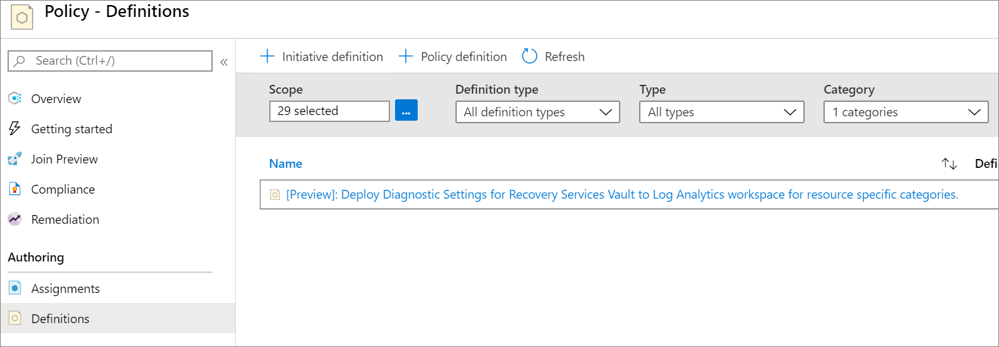
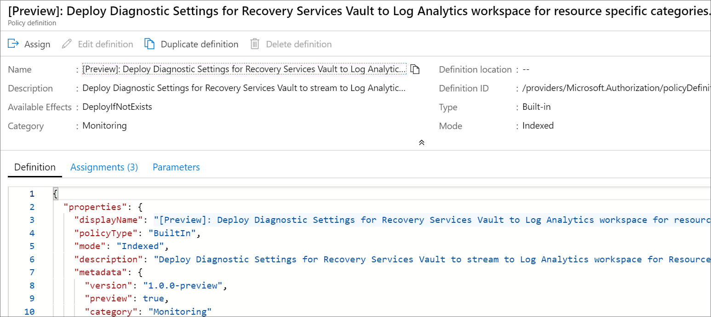
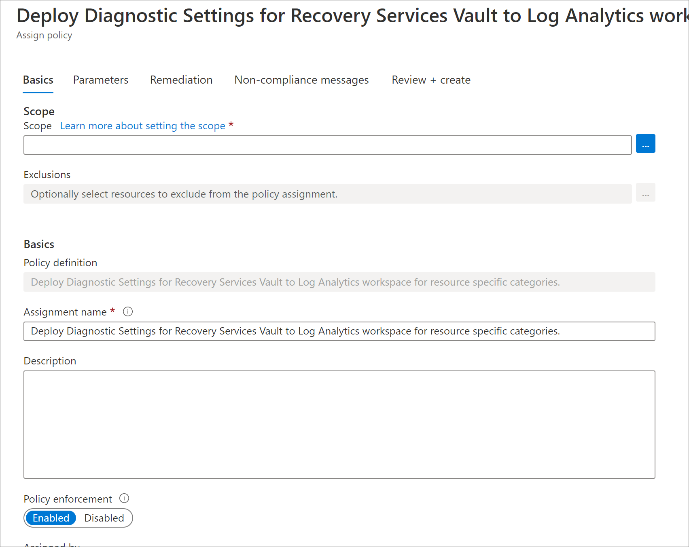
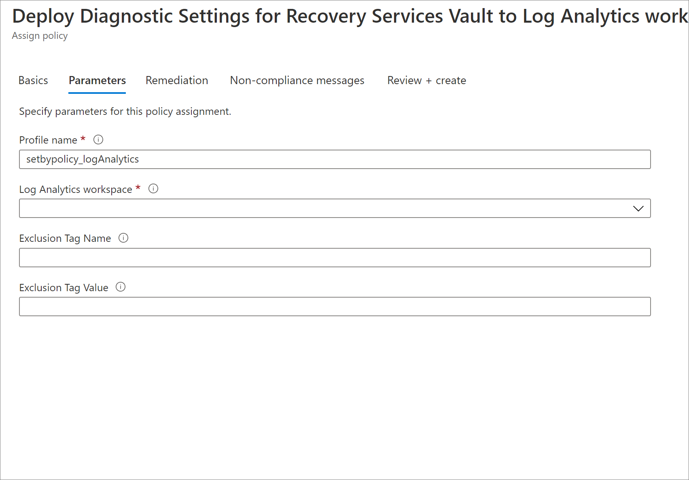
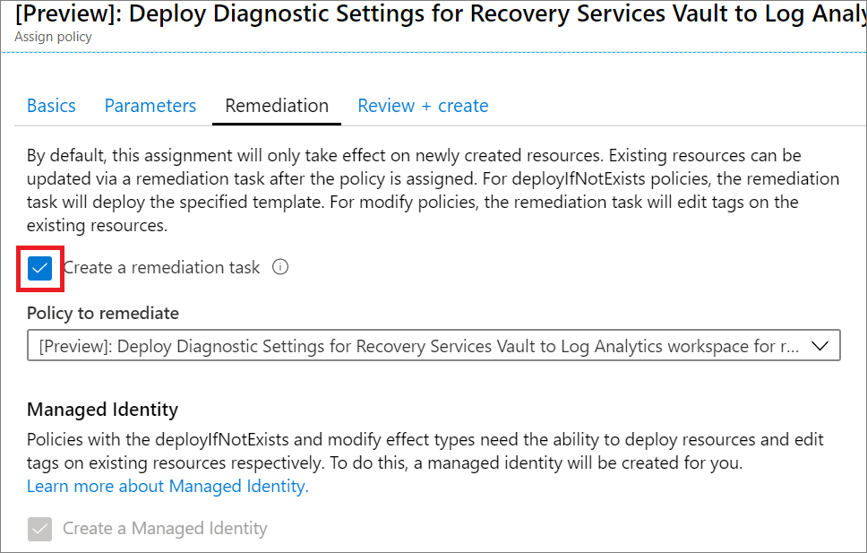

# Configure Vault Diagnostics settings at scale

The reporting solution provided by Azure Backup leverages Log Analytics (LA). For the data of any given vault to be sent to LA, a [diagnostics setting](https://docs.microsoft.com/azure/backup/backup-azure-diagnostic-events) needs to be created for that vault.

Often, adding a diagnostics setting manually per vault can be a cumbersome task. In addition, any new vault created also needs to have diagnostics settings enabled in order to be able to view reports for this vault.

To simplify the creation of diagnostics settings at scale (with LA as the destination), Azure Backup provides a built-in [Azure Policy](https://docs.microsoft.com/azure/governance/policy/). This policy adds an LA diagnostics setting to all vaults in a given subscription or resource group. The following sections provide instructions on how to use this policy.

## Supported Scenarios

* The policy can be applied at one time to all Recovery Services vaults in a particular subscription (or to a resource group within the subscription). The user assigning the policy needs to have 'Owner' access to the subscription to which the policy is assigned.

* The LA Workspace as specified by the user (to which diagnostics data will be sent to) can be in a different subscription from the vaults to which the policy is assigned. The user needs to have 'Reader', 'Contributor' or 'Owner' access to the subscription in which the specified LA Workspace exists.

* Management Group scope is currently unsupported.

* The built-in policy is currently not available in national clouds.

## Assigning the built-in policy to a scope

To assign the policy for vaults in the required scope, follow the steps below:

1. Sign in to the Azure portal and navigate to the **Policy** Dashboard.
2. Select **Definitions** in the left menu to get a list of all built-in policies across Azure Resources.
3. Filter the list for **Category=Monitoring**. Locate the policy named **[Preview]: Deploy Diagnostic Settings for Recovery Services Vault to Log Analytics workspace for resource specific categories**.

    

4. Click on the name of the policy. You will be redirected to the detailed definition for this policy.

    

5. Click on the **Assign** button at the top of the blade. This redirects you to the **Assign Policy** blade.

6. Under **Basics**, click on the three dots next to the **Scope** field. This opens up a right context blade where you can select the subscription for the policy to be applied on. You can also optionally select a resource group, so that the policy is applied only for vaults in a particular resource group.

    

7. Under **Parameters**, enter the following information:

    * **Profile Name** - The name that will be assigned to the diagnostics settings created by the policy.
    * **Log Analytics Workspace** - The Log Analytics Workspace to which the diagnostics setting should be associated. Diagnostics data of all vaults in the scope of the Policy assignment will be pushed to the specified LA Workspace.

    * **Exclusion Tag Name (optional) and Exclusion Tag Value (optional)** - You can choose to exclude vaults containing a certain tag name and value from the policy assignment. For example, if you do **not** want a diagnostics setting to be added to those vaults which have a tag 'isTest' set to the value 'yes', you must enter 'isTest' in the **Exclusion Tag Name** field and 'yes' in the **Exclusion Tag Value** field. If any (or both) of these two fields are left empty, the policy will be applied to all relevant vaults irrespective of the tags they contain.

    

8. **Create a remediation task** - Once the policy is assigned to a scope, any new vaults created in that scope automatically get LA diagnostics settings configured (within 30 minutes from the time of creation of the vault). To add a diagnostics setting to existing vaults in the scope, you can trigger a remediation task at policy assignment time. To trigger a remediation task, select the checkbox **Create a Remediation task**.

    

9. Navigate to the **Review+Create** tab and click **Create**.

## Under what conditions will the remediation task apply to a vault?

The remediation task is applied to vaults that are non-compliant according to the definition of the policy. A vault is non-compliant if it satisfies either of the following conditions:

* No diagnostics setting is present for the vault.
* Diagnostic settings are present for the vault but neither of the settings has **all of** the Resource specific events enabled with LA as destination, and **Resource specific** selected in the toggle.

So even if a user has a vault with the AzureBackupReport event enabled in AzureDiagnostics mode (which is supported by Backup Reports), the remediation task will still apply to this vault, since the Resource specific mode is the recommended way of creating diagnostics settings, [going forward](https://docs.microsoft.com/azure/backup/backup-azure-diagnostic-events#legacy-event).

Further, if a user has a vault with only a subset of the six Resource specific events enabled, the remediation task will apply for this vault, since Backup Reports will work as expected only if all of the six Resource specific events are enabled.

> [!NOTE]
>
> If a vault has an existing diagnostics setting with a **subset of Resource specific** categories enabled, configured to send data to a particular LA Workspace, say 'Workspace X', then the remediation task will fail (for that vault alone) if the destination LA Workspace provided in the Policy assignment is the **same** 'Workspace X'.
>
>This is because, if the events enabled by two different diagnostics settings on the same resource **overlap** in some form, then the settings cannot have the same LA Workspace as the destination. You will have to manually resolve this failure, by navigating to the relevant vault and configuring a diagnostics setting with a different LA Workspace as the destination.
>
> Note that the remediation task will **not** fail if the existing diagnostics setting as only AzureBackupReport enabled with Workspace X as the destination, since in this case, there will be no overlap between the events enabled by the existing setting and the events enabled by the setting created by the remediation task.

## Next Steps

* [Learn how to use Backup Reports](https://docs.microsoft.com/azure/backup/configure-reports)
* [Learn more about Azure Policy](https://docs.microsoft.com/azure/governance/policy/)
* [Use Azure Policy to auto-enable backup for all VMs in a give scope](https://docs.microsoft.com/azure/backup/backup-azure-auto-enable-backup)
