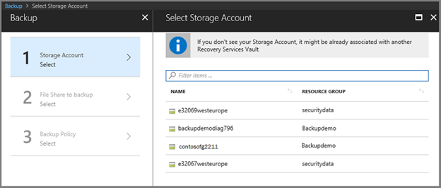
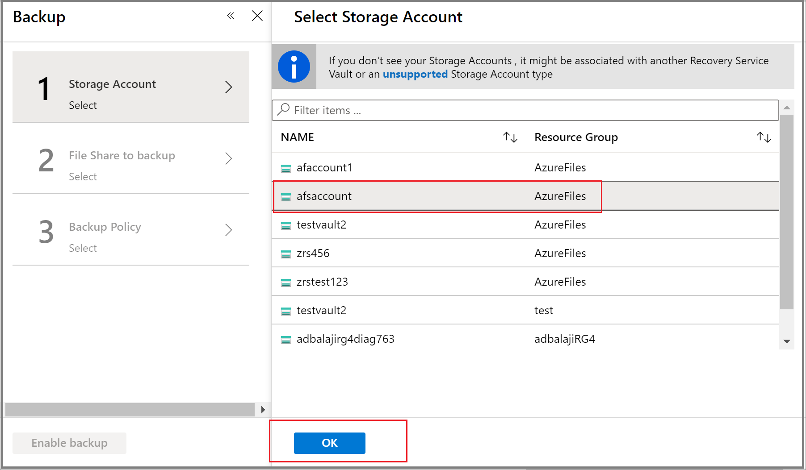
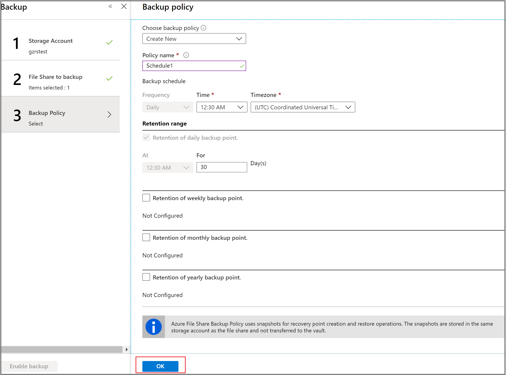

# Back up Azure file shares in a Recovery Services Vault

This article explains how to use the Azure portal to back up [Azure file shares](https://docs.microsoft.com/azure/storage/files/storage-files-introduction).

In this guide, you'll learn how to:

* Create a Recovery Services vault
* Discover fileshares and configure backups
* Run an on-demand backup job to create a restore point

## Prerequisites

* Identify or create a [Recovery Services vault](#create-a-recovery-services-vault) in the same region as the storage account hosting the file share.

* Ensure that the file share is present in one of the [supported Storage Account types](#limitations-for-azure-file-share-backup-during-preview).

## Limitations for Azure file share backup during Preview

Backup for Azure file shares is in Preview. Azure file shares in both general-purpose v1 and general-purpose v2 storage accounts are supported. These are the limitations for backing-up Azure file shares:

* Support for Backup of Azure file shares in storage accounts with [zone redundant storage](https://docs.microsoft.com/azure/storage/common/storage-redundancy-zrs) (ZRS) replication is currently limited to [these regions](https://docs.microsoft.com/azure/backup/backup-azure-files-faq#in-which-geos-can-i-back-up-azure-file-shares).
* Azure Backup currently supports configuring scheduled once-daily backups of Azure file shares.
* The maximum number of scheduled backups per day is one.
* The maximum number of on-demand backups per day is four.
* Use [resource locks](https://docs.microsoft.com/cli/azure/resource/lock?view=azure-cli-latest) on the storage account to prevent accidental deletion of backups in your Recovery Services vault.
* Do not delete snapshots created by Azure Backup. Deleting snapshots can result in loss of recovery points and/or restore failures.
* Do not delete file shares that are protected by Azure Backup. The current solution will delete all snapshots taken by Azure Backup once the file share is deleted and therefore all restore points will be lost.

[!INCLUDE [How to create a Recovery Services vault](../../includes/backup-create-rs-vault.md)]

## Modify storage replication

By default, vaults use [geo-redundant storage (GRS)](https://docs.microsoft.com/azure/storage/common/storage-redundancy-grs).

* If the vault is your primary backup mechanism, we recommend you use GRS.

* You can use [locally redundant storage (LRS)](https://docs.microsoft.com/azure/storage/common/storage-redundancy-lrs?toc=%2fazure%2fstorage%2fblobs%2ftoc.json) as a low-cost option.

Modify the storage replication type as follows:

1. In the new vault, click **Properties** in the **Settings** section.

2. In **Properties**, under **Backup Configuration**, click **Update**.

3. Select the storage replication type, and click **Save**.

    

> [!NOTE]
> You can't modify the storage replication type after the vault is set up and contains backup items. If you want to do this, you need to recreate the vault.
>

## Discover File Shares and configure backup

1. In the [Azure portal](https://portal.azure.com/), open the Recovery Services vault you want to use to back up the file share.

2. In the **Recovery Services vault** dashboard, select  **+Backup**.

   

   a. In **Backup Goal**, set **Where is your workload running?** to **Azure**.

    

    b.    In **What do you want to backup**, select **Azure File Share** from the drop-down menu.

    c.    Click **Backup** to register the Azure File Share extension in the vault.

      

3. Once you click **Backup**, the Backup blade opens and prompts you to select a Storage account from a list of discovered supported Storage accounts. They are either associated with this vault or present in the same region as the vault, but not yet associated to any Recovery Services vault.

   

4. From the list of discovered storage accounts, select an account, and click **OK**. Azure searches the storage account for files shares that can be backed up. If you recently added your file shares and do not see them in the list, give some time for the file shares to appear.

    

5. From the **File Shares** list, select one or more of the file shares you want to back up, and click **OK**.

6. After choosing your File Shares, the **Backup** menu switches to  **Backup policy**. From this menu, either select an existing backup policy, or create a new one, and then click **Enable Backup**.

    

After establishing a backup policy, a snapshot of the File Shares will be taken at the scheduled time, and the recovery point is retained for the chosen period.

## Create an on-demand backup

Occasionally, you may want to generate a backup snapshot, or recovery point, outside of the times scheduled in the backup policy. A common reason to generate an on-demand backup is right after you've configured the backup policy. Based on the schedule in the backup policy, it may be hours or days until a snapshot is taken. To protect your data until the backup policy engages, initiate an on-demand backup. Creating an on-demand backup is often required before you make planned changes to your file shares.

### To create an on-demand backup

1. Open the Recovery Services vault you used to back up your file share, and click **Backup Items** under the **Protected Items** section of the **Overview** blade.

   

2. Once you click **Backup Items**, a new blade listing all **Backup Management Types** will be displayed next to the **Overview** blade as follows:

   

3. From the list of **Backup Management Types**, select **Azure Storage (Azure Files)**. You will see a list of all the file shares and the corresponding storage accounts backed up using this vault.

   

4. From the list of Azure file shares, select the desired file share. The **Backup Item** details appear. From the **Backup Item** menu, click **Backup now**. Because this is an on-demand backup job, there is no retention policy associated with the recovery point.

   

5. The **Backup Now** blade opens. Specify the last day you want to retain the recovery point. You can have a maximum retention of 10 years for an on-demand backup.

   

6. Click **Ok** to confirm the on-demand backup job run.

7. Monitor the portal notifications to keep a track of backup job run completion. You can monitor the job progress in the vault dashboard > **Backup Jobs** > **In progress**.

## Next steps

* Learn how to [Restore Azure file shares](restore-afs.md)

* Learn how to [Manage Azure file share backups](manage-afs-backup.md)
