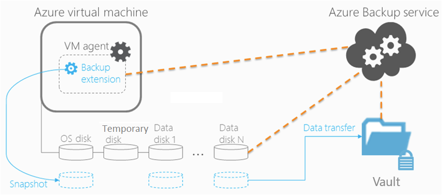

# Azure Backup architecture

You can use the [Azure Backup service](backup-overview.md) to back up data to the Microsoft Azure cloud. This article summarizes Azure Backup architecture, components, and processes. 

## What does Azure Backup do?

Azure Backup backs up data, machine state, and workloads running on on-premises machines and Azure VMs. There are a number of Azure Backup scenarios.

- **Back up on-premises machines**:
    - You can back up on-premises machines directly to Azure using Azure Backup.
    - You can protect on-premises machines with System Center Data Protection Manager (DPM) or Microsoft Azure Backup Server (MABS), and then in turn back up the protected data on DPM/MABS to Azure using Azure Backup.
- **Back up Azure VMs**:
    - You can back up Azure VMs directly with Azure Backup.
    - You can protect Azure VMs with DPM or MABS running in Azure, and then in turn back up the protected data on DPM/MABS data with Azure Backup.

Learn more about [what you can back up](backup-overview.md), and [supported backup scenarios](backup-support-matrix.md).

## Where is data backed up?

Azure Backup stores backed up data in a Recovery Services vault. A vault is an online storage entity in Azure, that's used to hold data such as backup copies, recovery points, and backup policies.

- Recovery Services vaults make it easy to organize your backup data, while minimizing management overhead.
- In each Azure subscription, you can create up to 500 Recovery Services vaults. 
- You can monitor backed up items in a vault, including Azure VMs and on-premises machines.
- You can manage vault access with Azure [role-based access control (RBAC)](https://docs.microsoft.com/azure/role-based-access-control/role-assignments-portal).
- You specify how data in the vault is replicated for redundancy:
    - **LRS**: You can use locally-redundant storage (LRS) to protects against failure in a datacenter. LRS replicates data to a storage scale unit. [Learn more](https://docs.microsoft.com/azure/storage/common/storage-redundancy-lrs).
    - **GRS**: You can use geo-redundant storage (GRS): Protects against region-wide outages. It replicates your data to a secondary region. [Learn more](https://docs.microsoft.com/azure/storage/common/storage-redundancy-grs). 
    - By default, Recovery Services vaults for Backup use GRS. 

## How does Azure Backup work?

Azure Backup runs backup jobs based on a default or customized backup policy. The way in which Azure Backup takes a backup depends on the scenario.

**Scenario** | **Details** 
--- | ---
**Directly back up on-premises machines** | To directly back up on-premises machines, Azure Backup uses the Microsoft Azure Recovery Services (MARS) agent. The agent is installed on each machine you want to back up.    This type of backup isn't available for on-premises Linux machines. 
**Directly back up Azure VMs** | To directly back up Azure VMs, an Azure VM extension is installed on the VM the first time a back up runs for the VM. 
**Back up machines and apps protected by DPM or MABS** | In this scenario, the machine/app is first backed up to DPM or MABS local storage. Then, the data in DPM/MABS is backed up to the vault by Azure Backup. On-premises machines can be protected by DPM/MABS running on-premises. Azure VMs can be protected by DPM/MABS running in Azure.

[Get an overview](backup-overview.md), and see [what's supported](backup-support-matrix.md) for each scenario.

### Backup agents

Azure Backup provides different agents, depending on the type of backup.

**Agent** | **Details** 
--- | --- 
**Microsoft Azure Recovery Services (MARS) agent** | This agent runs on individual on-premises Windows Servers to back up files, folders, and system state   This agent runs on DPM/MABS servers to back up the DPM/MABS local storage disk. Machines and apps are backed up locally to this DPM/MABS disk.
**Azure VM extension** | To back up Azure VMs, a backup extension is added to the Azure VM agent running on the VMs. 

## Backup types

**Backup type** | **Details** | **Usage**
--- | --- | ---
**Full** | A backup contains the entire data source.   Full backup takes more network bandwidth. | Used for initial backup.
**Differential** |  Stores the blocks that changed since the initial full backup. Uses a smaller amount of network and storage, and doesn't retain redundant copies of unchanged data.   Inefficient because data blocks unchanged between subsequent backups are transferred and stored. | Not used by Azure Backup.
**Incremental** | High storage and network efficiency. Stores only blocks of data that changed since the previous backup.    No need to With incremental backup, there is no need to supplement with full backups. | Used by DPM/MABS for disk backups, and used in all backups to Azure.

### Comparison

Storage consumption, recovery time objective (RTO), and network consumption varies for each type of backup. The following image shows a comparison of backup types.
- Data source A is composed of 10 storage blocks A1-A10, which are backed up monthly.
- Blocks A2, A3, A4, and A9 change in the first month, and block A5 changes in the next month.
- For differential backups, in the second month, changed blocks A2, A3, A4, and A9 are backed up. In the third month, these same blocks are backed up again, along with changed block A5. The changed blocks continue to be backed up until the next full backup happens.
- For incremental backups, after taking the full backup in the first month, blocks A2, A3, A4, and A9 are marked as changed, and transferred to the second month. In the third month, only changed block A5 is marked and transferred. 

## Backup features

The following table summarizes features for different types of backup.

**Feature** | **On-premises Windows machines (direct)** | **Azure VMs** | **Machines/apps with DPM/MABS**
--- | --- | --- | ---
Back up to vault | ![Yes][green] | ![Yes][green] | ![Yes][green] 
Backup to DPM/MABS disk then Azure | | | ![Yes][green] 
Compress data sent for backup | ![Yes][green] | No compression is used when transferring data. Storage is inflated slightly, but restoration is faster.  | ![Yes][green] 
Run incremental backup |![Yes][green] |![Yes][green] |![Yes][green] 
Back up deduplicated disks | | | ![Partially][yellow]   For DPM/MABS servers deployed on-premises only. 

## Architecture: Direct backup of on-premises Windows machines

1. To set up the scenario, you download and install the Microsoft Azure Recovery Services (MARS) agent on the machine, select what to back up, when backups will run, and how long they'll be kept in Azure.
2. The initial backup runs in accordance with your backup settings.
3. The MARS agent uses the Windows Volume Shadow Copy (VSS) service to take a point-in-time snapshot of the volumes selected for backup.
    - The MARS agent only uses the Windows System Write to capture the snapshot.
    - The agent doesn't use any application VSS writers and thus doesn't capture app-consistent snapshots.
3. After taking the snapshot with VSS, the MARS agent creates a VHD in the cache folder you specified when you configured the backup, and stores checksums for each data blocks. 
4. Incremental backups run in accordance with the schedule you specify, unless you run an ad-hoc backup.
5. In incremental backups, changed files are identified and a new VHD is created. It's compressed and encrypted, and sent to the vault.
6. After the incremental backup finishes, the new VHD is merged with the VHD created after the initial replication, providing the latest state to be used for comparison for ongoing backup. 

## Architecture: Direct backup of Azure VMs

1. When you enable backup for an Azure VM, a backup runs in accordance with the schedule you specify.
2. During the first backup, a backup extension is installed on VM if it's running.
    - For Windows VMs the VMSnapshot extension is installed.
    - For Linux VMs the VMSnapshot Linux extension is installed.
3. The extension takes a storage level snapshot. 
    - For Windows VMs that are running, Backup coordinates with VSS to take an app-consistent snapshot of the VM. By default Backup takes full VSS backups. If Backup is unable to take an app-consistent snapshot, then it takes a file-consistent snapshot.
    - For Linux VMs Backup takes a file-consistent backup. For app-consistent snapshots you need to manually customize pre/post scripts.
    - Backup is optimized by backing up each VM disk in parallel. For each disk being backed up, Azure Backup reads the blocks on disk and stores only the changed data. 
4. After the snapshot is taken, the data is transferred to the vault. 
    - Only blocks of data that have changed since the last backup are copied.
    - Data isn't encrypted. Azure Backup can back up Azure VMs that are encrypted using Azure Disk Encryption (ADE).
    - Snapshot data might not be immediately copied to the vault. It might take some hours at peak times. Total backup time for a VM will be less that 24 hours for daily backup policies.
5. After data has been sent to the vault, the snapshot is removed, and a recovery point is created.

## Architecture: Back up to DPM/MABS

1. You install the DPM or MABS protection agent on machines you want to protect, and add the machines to a DPM protection group.
    - To protect on-premises machines, the DPM or MABS server must be located on-premises.
    - To protect Azure VMs, the DPM or MABS server must be located in Azure, running as an Azure VM.
    - Using DPM/MABS you can protect back up volumes, shares, files, and folder. You can protect machines system state/bare-metal, and protect specific apps with app-aware backup settings.
2. When you set up protection for a machine or app in DPM, you select to back up to the DPM local disk for short-term storage, and to Azure (online protection). You also specify when the backup to local DPM/MABS storage should run, and when the online backup to Azure should run.
3. The disk of the protected workload is backed up to the local DPM disks, and to Azure, in accordance with the schedule you specified.
4. The online backup to the vault is handled by the MARS agent running on the DPM/MABS server.

## Azure VM storage

- Azure VMs use disks to store their operating system, apps, and data.
- Azure VMs have at least two disks. One for the operating system, and a temporary disk. They can also have data disks for app data. Disks are stored as VHDs.
- VHDs are stored as page blobs in standard or premium storage accounts in Azure.
    - Standard storage: Reliable, low-cost disk support for VMs running workloads that aren't sensitive to latency. Standard storage can use standard SSD disks or standard SSD disks).
    - Premium storage: High-performance disk support. Uses premium SSD disks.
- There are different performance tiers for disks:
    - Standard HDD disk: Backed by HDDs, and used for cost-effective storage.
    - Standard SSD disk: Combines element of premium SSD disks and standard HDD disks, offering more consistent performance and reliability than HDD, but still cost-effective.
    - Premium SSD disk: Backed by SSD, providing high-performance and low-latency for VMs running I/O intensive workloads.
- Disks can be managed or unmanaged:
    - Unmanaged disks: Traditional types of disks used by VMs. For these disks, you create your own storage account and specify it when you create the disk. You have to figure out how to maximize storage resources for your VMs.
    - Managed disks: Azure handles creating and managing storage accounts for you. You specify the disk size and performance tier, and Azure creates, manage disks for you. Azure handles storage as you add disks and scale VMs.

Read more:

- Learn more about disk storage for [Windows](../virtual-machines/windows/about-disks-and-vhds.md) and [Linux](../virtual-machines/linux/about-disks-and-vhds.md) VMs.
- Learn about [standard](../virtual-machines/windows/standard-storage.md) and [premium](../virtual-machines/windows/premium-storage.md) storage.

### Backing up and restoring Azure VMs with premium storage 

You can back up Azure VMs using premium storage with Azure Backup:

- While backing up VMs with premium storage, the Backup service creates a temporary staging location, named "AzureBackup-", in the storage account. The size of the staging location is equal to the size of the recovery point snapshot.
- Make sure that the premium storage account has adequate free space to accommodate the temporary staging location. [Learn more](../virtual-machines/windows/premium-storage.md#scalability-and-performance-targets). Don't modify the staging location.
- After the backup job finishes, the staging location is deleted.
- The price of storage used for the staging location is consistent with [premium storage pricing](../virtual-machines/windows/premium-storage.md#pricing-and-billing).

When you restore Azure VMs using premium storage, you can restore them to premium or standard storage. Typically you would restore to premium, but it might be cost effective to restore to standard if you only need a subset of files from the VM.

### Backing up and restoring managed disks

You can back up Azure VMs with managed disks.
- You back up VMs with managed disks in the same way that you do any other Azure VM. You can back up the VM directly from the virtual machine settings, or you can enable backup for VMs in the Recovery Services vault.
- You can back up VMs on managed disks through RestorePoint collections built on top of managed disks.
- Azure Backup also supports backing up managed disk VMs encrypted using Azure Disk encryption (ADE).

When you restore VMs with managed disks, you can restore to a complete VM with managed disks, or to a storage account.
- Azure handles the managed disks during the restore process, and with the storage account option, you manage the storage account that's created during the restore.
- If you restore a managed VM that's encrypted, the VM keys and secrets should exit in the key vault before you start the restore process.

## Next steps

- [Review](backup-support-matrix.md) the support matrix to learn about supported features and limitations for backup scenarios.
- Set up backup for one of the scenarios:
    - [Back up Azure VMs](backup-azure-arm-vms-prepare.md)
    - [Back up Windows machines directly](tutorial-backup-windows-server-to-azure.md), without a backup server.
    - [Set up MABS](backup-azure-microsoft-azure-backup.md) for backup to Azure, and then back up workloads to MABS.
    - [Set up DPM](backup-azure-dpm-introduction.md) for backup to Azure, and then back up workloads to DPM.

[green]: ./media/backup-architecture/green.png
[yellow]: ./media/backup-architecture/yellow.png
[red]: ./media/backup-architecture/red.png

