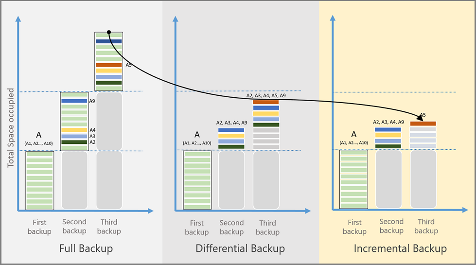
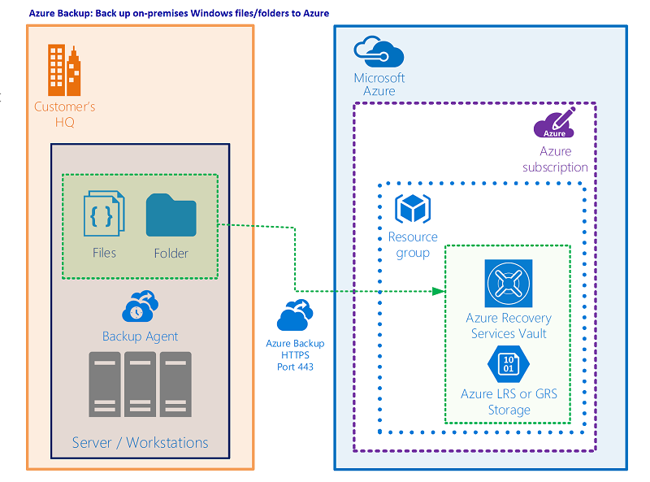
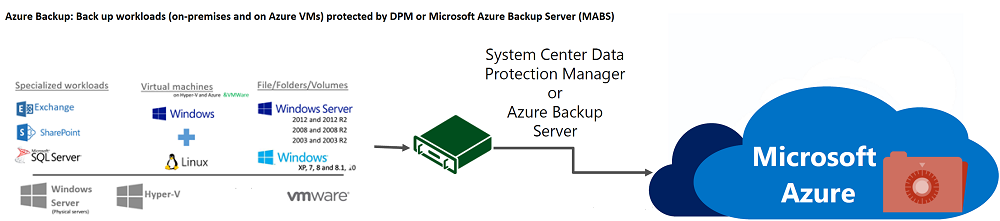

# Azure Backup architecture and components

You can use the [Azure Backup service](backup-overview.md) to back up data to the Microsoft Azure cloud platform. This article summarizes Azure Backup architecture, components, and processes.

## What does Azure Backup do?

Azure Backup backs up the data, machine state, and workloads running on on-premises machines and Azure virtual machine (VM) instances. There are a number of Azure Backup scenarios.

## How does Azure Backup work?

You can back up machines and data by using a number of methods:

- **Back up on-premises machines**:
  - You can back up on-premises Windows machines directly to Azure by using the Azure Backup Microsoft Azure Recovery Services (MARS) agent. Linux machines aren't supported.
  - You can back up on-premises machines to a backup server - either System Center Data Protection Manager (DPM) or Microsoft Azure Backup Server (MABS). You can then back up the backup server to a Recovery Services vault in Azure.

- **Back up Azure VMs**:
  - You can back up Azure VMs directly. Azure Backup installs a backup extension to the Azure VM agent that's running on the VM. This extension backs up the entire VM.
  - You can back up specific files and folders on the Azure VM by running the MARS agent.
  - You can back up Azure VMs to the MABS that's running in Azure, and you can then back up the MABS to a Recovery Services vault.

Learn more about [what you can back up](backup-overview.md) and about [supported backup scenarios](backup-support-matrix.md).

## Where is data backed up?

Azure Backup stores backed-up data in vaults - Recovery Services vaults and Backup vaults. A vault is an online-storage entity in Azure that's used to hold data, such as backup copies, recovery points, and backup policies.

Vaults have the following features:

- Vaults make it easy to organize your backup data, while minimizing management overhead.
- You can monitor backed-up items in a vault, including Azure VMs and on-premises machines.
- You can manage vault access with [Azure role-based access control (Azure RBAC)](../role-based-access-control/role-assignments-portal.md).
- You specify how data in the vault is replicated for redundancy:
  - **Locally redundant storage (LRS)**: To protect against failure in a datacenter, you can use LRS. LRS replicates data to a storage scale unit. [Learn more](../storage/common/storage-redundancy.md#locally-redundant-storage).
  - **Geo-redundant storage (GRS)**: To protect against region-wide outages, you can use GRS. GRS replicates your data to a secondary region. [Learn more](../storage/common/storage-redundancy.md#geo-redundant-storage).
  - **Zone-redundant storage (ZRS)**: replicates your data in [availability zones](../availability-zones/az-overview.md#availability-zones), guaranteeing data residency and resiliency in the same region. [Learn more](../storage/common/storage-redundancy.md#zone-redundant-storage)
  - By default, Recovery Services vaults use GRS.

Recovery Services vaults have the following additional features:

- In each Azure subscription, you can create up to 500 vaults.

## Backup agents

Azure Backup provides different backup agents, depending on what type of machine is being backed up:

**Agent** | **Details**
--- | ---
**MARS agent** | <ul><li>Runs on individual on-premises Windows Server machines to back up files, folders, and the system state.</li> <li>Runs on Azure VMs to back up files, folders, and the system state.</li> <li>Runs on DPM/MABS servers to back up the DPM/MABS local storage disk to Azure.</li></ul>
**Azure VM extension** | Runs on Azure VMs to back them up to a vault.

## Backup types

The following table explains the different types of backups and when they're used:

**Backup type** | **Details** | **Usage**
--- | --- | ---
**Full** | A full backup contains the entire data source. Takes more network bandwidth than differential or incremental backups. | Used for initial backup.
**Differential** |  A differential backup stores the blocks that changed since the initial full backup. Uses a smaller amount of network and storage, and doesn't keep redundant copies of unchanged data.   Inefficient because data blocks that are unchanged between later backups are transferred and stored. | Not used by Azure Backup.
**Incremental** | An incremental backup stores only the blocks of data that changed since the previous backup. High storage and network efficiency.    With incremental backup, there's no need to supplement with full backups. | Used by DPM/MABS for disk backups, and used in all backups to Azure. Not used for SQL Server backup.

## SQL Server backup types

The following table explains the different types of backups used for SQL Server databases and how often they're used:

**Backup type** | **Details** | **Usage**
--- | --- | ---
**Full backup** | A full database backup backs up the entire database. It contains all the data in a specific database or in a set of filegroups or files. A full backup also contains enough logs to recover that data. | At most, you can trigger one full backup per day.   You can choose to make a full backup on a daily or weekly interval.
**Differential backup** | A differential backup is based on the most recent, previous full-data backup.   It captures only the data that's changed since the full backup. |  At most, you can trigger one differential backup per day.   You can't configure a full backup and a differential backup on the same day.
**Transaction log backup** | A log backup enables point-in-time restoration up to a specific second. | At most, you can configure transactional log backups every 15 minutes.

### Comparison of backup types

Storage consumption, recovery time objective (RTO), and network consumption varies for each type of backup. The following image shows a comparison of the backup types:

- Data source A is composed of 10 storage blocks, A1-A10, which are backed up monthly.
- Blocks A2, A3, A4, and A9 change in the first month, and block A5 changes in the next month.
- For differential backups, in the second month changed blocks A2, A3, A4, and A9 are backed up. In the third month, these same blocks are backed up again, along with changed block A5. The changed blocks continue to be backed up until the next full backup happens.
- For incremental backups, in the second month blocks A2, A3, A4, and A9 are marked as changed and transferred. In the third month, only changed block A5 is marked and transferred.

## Backup features

The following table summarizes the supported features for the different types of backup:

**Feature** | **Direct Backup of Files and Folders (using MARS Agent)** | **Azure VM Backup** | **Machines or apps with DPM/MABS**
--- | --- | --- | ---
Back up to vault | ![Yes][green] | ![Yes][green] | ![Yes][green]
Back up to DPM/MABS disk, then to Azure | | | ![Yes][green]
Compress data sent for backup | ![Yes][green] | No compression is used when transferring data. Storage is inflated slightly, but restoration is faster.  | ![Yes][green]
Run incremental backup |![Yes][green] |![Yes][green] |![Yes][green]
Back up deduplicated disks | | | ![Partially][yellow]   For DPM/MABS servers deployed on-premises only.

## Backup policy essentials

- A backup policy is created per vault.
- A backup policy can be created for the backup of following workloads: Azure VMs, SQL in Azure VMs, SAP HANA in Azure VMs and Azure file shares. The policy for files and folder backup using the MARS agent is specified in the MARS console.
  - Azure File Share
- A policy can be assigned to many resources. An Azure VM backup policy can be used to protect many Azure VMs.
- A policy consists of two components
  - Schedule: When to take the backup
  - Retention: For how long each backup should be retained.
- Schedule can be defined as "daily" or "weekly" with a specific point of time.
- Retention can be defined for "daily", "weekly", "monthly", "yearly" backup points.
  - "weekly" refers to a backup on a certain day of the week
  - "monthly" refers a backup on a certain day of the month
  - "yearly" refers to a backup on a certain day of the year
- Retention for "monthly", "yearly" backup points is referred to as Long Term Retention (LTR)
- When a vault is created, a "DefaultPolicy" is also created and can be used to back up resources.
- Any changes made to the retention period of a backup policy will be applied retroactively to all the older recovery points aside from the new ones.

### Impact of policy change on recovery points

- **Retention duration is increased / decreased:** When the retention duration is changed, the new retention duration is applied to the existing recovery points as well. As a result, some of the recovery points will be cleaned up. If the retention period is increased, the existing recovery points will have an increased retention as well.
- **Changed from daily to weekly:** When the scheduled backups are changed from daily to weekly,  the existing daily recovery points are cleaned up.
- **Changed from weekly to daily:** The existing weekly backups will be retained based on the number of days remaining according to the current retention policy.

### Additional reference

- Azure VM machine: How to [create](./backup-azure-vms-first-look-arm.md#back-up-from-azure-vm-settings) and [modify](./backup-azure-manage-vms.md#manage-backup-policy-for-a-vm) policy.
- SQL Server database in Azure VM machine: How to [create](./backup-sql-server-database-azure-vms.md#create-a-backup-policy) and [modify](./manage-monitor-sql-database-backup.md#modify-policy) policy.
- Azure File share: How to [create](./backup-afs.md) and [modify](./manage-afs-backup.md#modify-policy) policy.
- SAP HANA: How to [create](./backup-azure-sap-hana-database.md#create-a-backup-policy) and [modify](./sap-hana-db-manage.md#change-policy) policy.
- MARS: How to [create](./backup-windows-with-mars-agent.md#create-a-backup-policy) and [modify](./backup-azure-manage-mars.md#modify-a-backup-policy) policy.
- [Are there any limitations on scheduling backup based on the type of workload?](./backup-azure-backup-faq.yml#are-there-limits-on-backup-scheduling-)
- [What happens to the existing recovery points if I change the retention policy?](./backup-azure-backup-faq.yml#what-happens-when-i-change-my-backup-policy-)

## Architecture: Built-in Azure VM Backup

[!INCLUDE [azure-vm-backup-process.md](../../includes/azure-vm-backup-process.md)]

## Architecture: Direct backup of on-premises Windows Server machines or Azure VM files or folders

1. To set up the scenario, you download and install the MARS agent on the machine. You then select what to back up, when backups will run, and how long they'll be kept in Azure.
1. The initial backup runs according to your backup settings.
1. The MARS agent uses VSS to take a point-in-time snapshot of the volumes selected for backup.
    - The MARS agent uses only the Windows system write operation to capture the snapshot.
    - Because the agent doesn't use any application VSS writers, it doesn't capture app-consistent snapshots.
1. After taking the snapshot with VSS, the MARS agent creates a virtual hard disk (VHD) in the cache folder you specified when you configured the backup. The agent also stores checksums for each data block. These are later used to detect changed blocks for subsequent incremental backups.
1. Incremental backups run according to the schedule you specify, unless you run an on-demand backup.
1. In incremental backups, changed files are identified and a new VHD is created. The VHD is compressed and encrypted, and then it's sent to the vault.
1. After the incremental backup finishes, the new VHD is merged with the VHD created after the initial replication. This merged VHD provides the latest state to be used for comparison for ongoing backup.

## Architecture: Back up to DPM/MABS

1. You install the DPM or MABS protection agent on machines you want to protect. You then add the machines to a DPM protection group.
    - To protect on-premises machines, the DPM or MABS server must be located on-premises.
    - To protect Azure VMs, the MABS server must be located in Azure, running as an Azure VM.
    - With DPM/MABS, you can protect backup volumes, shares, files, and folders. You can also protect a machine's system state (bare metal), and you can protect specific apps with app-aware backup settings.
1. When you set up protection for a machine or app in DPM/MABS, you select to back up to the MABS/DPM local disk for short-term storage and to Azure for online protection. You also specify when the backup to local DPM/MABS storage should run and when the online backup to Azure should run.
1. The disk of the protected workload is backed up to the local MABS/DPM disks, according to the schedule you specified.
1. The DPM/MABS disks are backed up to the vault by the MARS agent that's running on the DPM/MABS server.

## Azure VM storage

Azure VMs use disks to store their operating system, apps, and data. Each Azure VM has at least two disks: a disk for the operating system and a temporary disk. Azure VMs can also have data disks for app data. Disks are stored as VHDs.

- VHDs are stored as page blobs in standard or premium storage accounts in Azure:
  - **Standard storage:** Reliable, low-cost disk support for VMs running workloads that aren't sensitive to latency. Standard storage can use standard solid-state drive (SSD) disks or standard hard disk drive (HDD) disks.
  - **Premium storage:** High-performance disk support. Uses premium SSD disks.
- There are different performance tiers for disks:
  - **Standard HDD disk:** Backed by HDDs, and used for cost-effective storage.
  - **Standard SSD disk:** Combines elements of premium SSD disks and standard HDD disks. Offers more consistent performance and reliability than HDD, but still cost-effective.
  - **Premium SSD disk:** Backed by SSDs, and provides high-performance and low-latency for VMs that are running I/O-intensive workloads.
- Disks can be managed or unmanaged:
  - **Unmanaged disks:** Traditional type of disks used by VMs. For these disks, you create your own storage account and specify it when you create the disk. You then need to figure out how to maximize storage resources for your VMs.
  - **Managed disks:** Azure creates and manages the storage accounts for you. You specify the disk size and performance tier, and Azure creates managed disks for you. As you add disks and scale VMs, Azure handles the storage accounts.

For more information about disk storage and the available disk types for VMs, see these articles:

- [Azure managed disks for Linux VMs](../virtual-machines/managed-disks-overview.md)
- [Available disk types for VMs](../virtual-machines/disks-types.md)

### Back up and restore Azure VMs with premium storage

You can back up Azure VMs by using premium storage with Azure Backup:

- During the process of backing up VMs with premium storage, the Backup service creates a temporary staging location, named *AzureBackup-*, in the storage account. The size of the staging location equals the size of the recovery point snapshot.
- Make sure that the premium storage account has adequate free space to accommodate the temporary staging location. For more information, see [Scalability targets for premium page blob storage accounts](../storage/blobs/scalability-targets-premium-page-blobs.md). Don't modify the staging location.
- After the backup job finishes, the staging location is deleted.
- The price of storage used for the staging location is consistent with [premium storage pricing](../virtual-machines/disks-types.md#billing).

When you restore Azure VMs by using premium storage, you can restore them to premium or standard storage. Typically, you would restore them to premium storage. But if you need only a subset of files from the VM, it might be cost effective to restore them to standard storage.

### Back up and restore managed disks

You can back up Azure VMs with managed disks:

- You back up VMs with managed disks in the same way that you do any other Azure VM. You can back up the VM directly from the virtual machine settings, or you can enable backup for VMs in the Recovery Services vault.
- You can back up VMs on managed disks through RestorePoint collections built on top of managed disks.
- Azure Backup also supports backing up VMs with managed disks that were encrypted by using Azure Disk Encryption.

When you restore VMs with managed disks, you can restore to a complete VM with managed disks or to a storage account:

- During the restore process, Azure handles the managed disks. If you're using the storage account option, you manage the storage account that's created during the restore process.
- If you restore a managed VM that's encrypted, make sure the VM's keys and secrets exist in the key vault before you start the restore process.

## Next steps

- Review the support matrix to [learn about supported features and limitations for backup scenarios](backup-support-matrix.md).
- Set up backup for one of these scenarios:
  - [Back up Azure VMs](backup-azure-arm-vms-prepare.md).
  - [Back up Windows machines directly](tutorial-backup-windows-server-to-azure.md), without a backup server.
  - [Set up MABS](backup-azure-microsoft-azure-backup.md) for backup to Azure, and then back up workloads to MABS.
  - [Set up DPM](backup-azure-dpm-introduction.md) for backup to Azure, and then back up workloads to DPM.

[green]: ./media/backup-architecture/green.png
[yellow]: ./media/backup-architecture/yellow.png
[red]: ./media/backup-architecture/red.png
