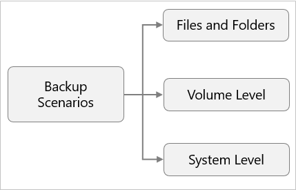
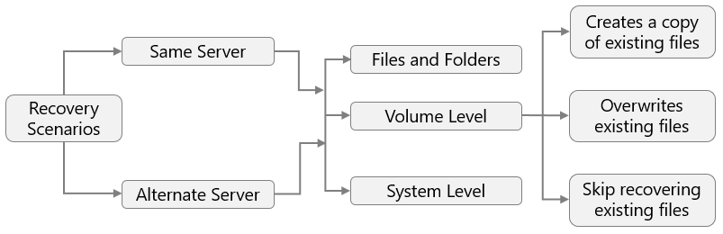
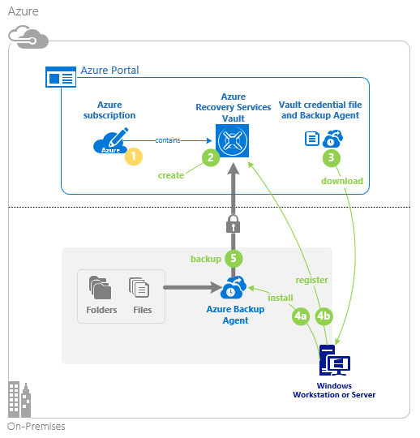

# About the Microsoft Azure Recovery Services (MARS) agent

This article describes how the Azure Backup service uses the Microsoft Azure Recovery Services (MARS) agent to back up and restore files, folders, and the volume or system state from an on-premises computer to Azure.

## Backup scenarios

The MARS agent supports the following backup scenarios:

- **Files and Folders**: Selectively protect Windows files and folders.
- **Volume Level**: Protect an entire Windows volume of your machine.
- **System Level**: Protect an entire Windows system state.

### Additional scenarios

- **Back up specific files and folders within Azure virtual machines**: The primary method for backing up Azure virtual machines (VMs) is to use an Azure Backup extension on the VM. The extension backs up the entire VM. If you want to back up specific files and folders within a VM, you can install the MARS agent in the Azure VMs. For more information, see [Architecture: Built-in Azure VM Backup](./backup-architecture.md#architecture-built-in-azure-vm-backup).

- **Offline seeding**: Initial full backups of data to Azure typically transfer large amounts of data and require more network bandwidth. Subsequent backups transfer only the delta, or incremental, amount of data. Azure Backup compresses the initial backups. Through the process of *offline seeding*, Azure Backup can use disks to upload the compressed initial backup data offline to Azure. For more information, see [Azure Backup offline-backup using Azure Data Box](offline-backup-azure-data-box.md).

## Restore scenarios

The MARS agent supports the following restore scenarios:

- **Same Server**: The server on which the backup was originally created.
  - **Files and Folders**: Choose the individual files and folders that you want to restore.
  - **Volume Level**: Choose the volume and recovery point that you want to restore. Then restore it to the same location or an alternate location on the same machine.  Create a copy of existing files, overwrite existing files, or skip recovering existing files.
  - **System Level**: Choose the system state and recovery point to restore to the same machine at a specified location.

- **Alternate Server**: A server other than the server where the backup was taken.
  - **Files and Folders**: Choose the individual files and folders whose recovery point you want to restore to a target machine.
  - **Volume Level**: Choose the volume and recovery point that you want to restore to another location. Create a copy of existing files, overwrite existing files, or skip recovering existing files.
  - **System Level**: Choose the system state and recovery point to restore as a System State file to an alternate machine.

## Backup process

1. From the Azure portal, create a [Recovery Services vault](install-mars-agent.md#create-a-recovery-services-vault), and choose files, folders, and the system state from the **Backup goals**.
2. [Download the Recovery Services vault credentials and agent installer](./install-mars-agent.md#download-the-mars-agent) to an on-premises machine.

3. [Install the agent](./install-mars-agent.md#install-and-register-the-agent) and use the downloaded vault credentials to register the machine to the Recovery Services vault.
4. From the agent console on the client, [configure the backup](./backup-windows-with-mars-agent.md#create-a-backup-policy) to specify what to back up, when to back up (the schedule), how long the backups should be retained in Azure (the retention policy) and start protecting.

### Additional information

- The **Initial Backup** (first backup) runs according to your backup settings.  The MARS agent uses VSS to take a point-in-time snapshot of the volumes selected for backup. The agent only uses the Windows System Writer operation to capture the snapshot. It doesn't use any application VSS writers, and doesn't capture app-consistent snapshots. After taking the snapshot with VSS, the MARS agent creates a virtual hard disk (VHD) in the cache folder you specified when you configured the backup. The agent also stores checksums for each data block.

- **Incremental backups** (subsequent backups) run according to the schedule you specify. During incremental backups, changed files are identified and a new VHD is created. The VHD is compressed and encrypted, and then it's sent to the vault. After the incremental backup finishes, the new VHD is merged with the VHD created after the initial replication. This merged VHD provides the latest state to be used for comparison for ongoing backup.

- The MARS agent can run the backup job in **optimized mode** using the USN (Update Sequence Number) change journal, or in **unoptimized mode** by checking for changes in directories or files via scanning the entire volume. Unoptimized mode is slower because the agent has to scan each file on the volume and compare it against the metadata to determine the changed files.  The **Initial backup** will always run in unoptimized mode. If the previous backup failed, then the next scheduled backup job will run in unoptimized mode. To learn more about these modes and how to verify them, refer to [this article](backup-azure-troubleshoot-slow-backup-performance-issue.md#cause-backup-job-running-in-unoptimized-mode).

## Next steps

[MARS agent support matrix](./backup-support-matrix-mars-agent.md)

[MARS agent FAQ](./backup-azure-file-folder-backup-faq.yml)
