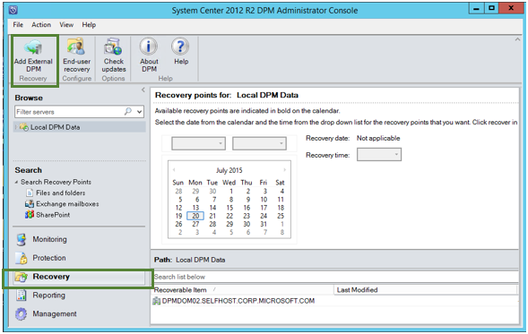
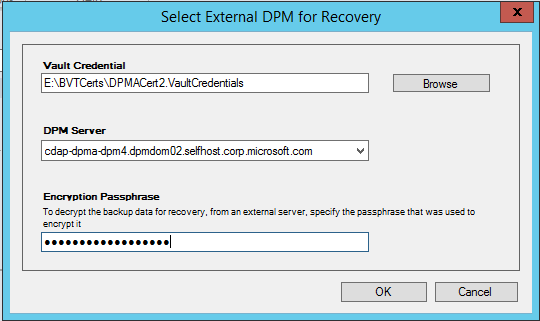
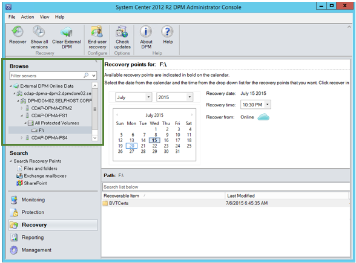
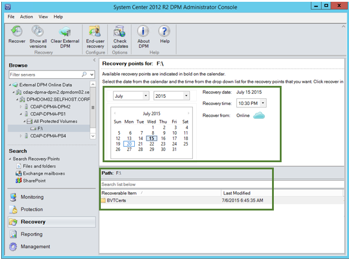
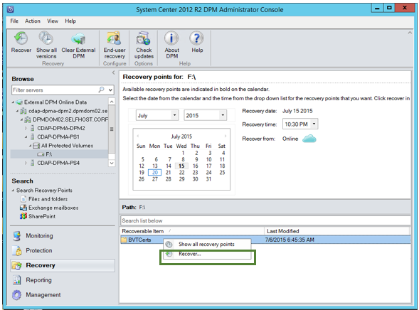
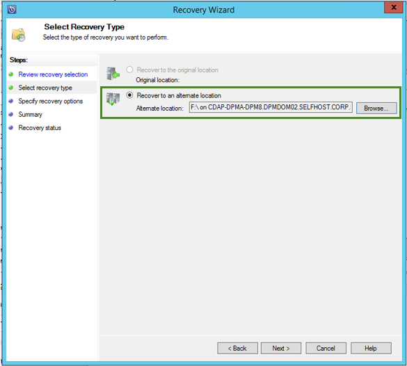
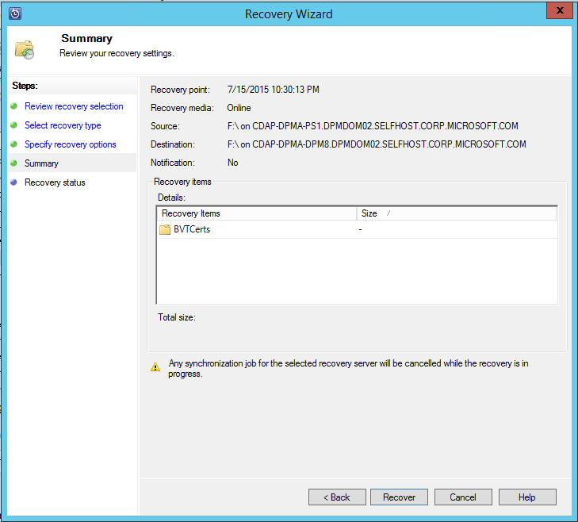
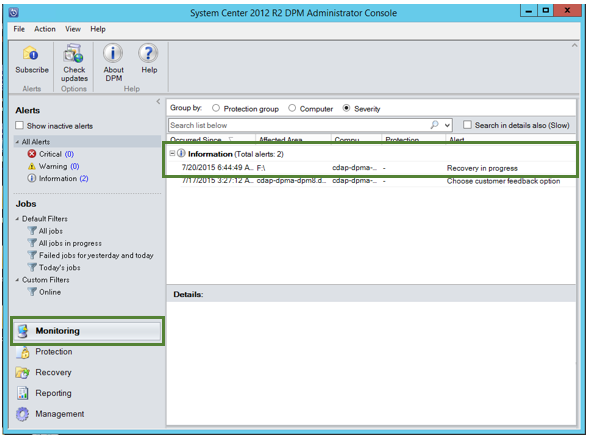
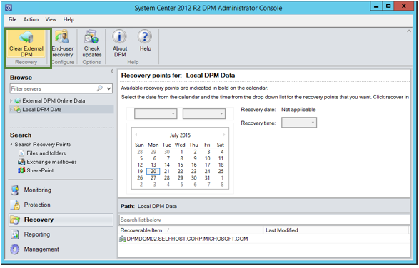

# Recover data from Azure Backup Server

You can use Azure Backup Server to recover the data you've backed up to a Recovery Services vault. The process for doing so is integrated into the Azure Backup Server management console, and is similar to the recovery workflow for other Azure Backup components.

> [!NOTE]
> This article is applicable for [System Center Data Protection Manager 2012 R2 with UR7 or later](https://support.microsoft.com/kb/3065246), combined with the [latest Azure Backup agent](https://aka.ms/azurebackup_agent).
>
>

To recover data from an Azure Backup Server:

1. From the **Recovery** tab of the Azure Backup Server management console, click **'Add External DPM'** (at the top left of the screen).

    
2. Download new **vault credentials** from the vault associated with the **Azure Backup Server** where the data is being recovered, choose the Azure Backup Server from the list of Azure Backup Servers registered with the Recovery Services vault, and provide the **encryption passphrase** associated with the server whose data is being recovered.

    

   > [!NOTE]
   > Only Azure Backup Servers associated with the same registration vault can recover each other’s data.
   >
   >

    Once the External Azure Backup Server is successfully added, you can browse the data of the external server and the local Azure Backup Server from the **Recovery** tab.
3. Browse the available list of production servers protected by the external Azure Backup Server and select the appropriate data source.

    
4. Select **the month and year** from the **Recovery points** drop down, select the required **Recovery date** for when the recovery point was created, and select the **Recovery time**.

    A list of files and folders appears in the bottom pane, which can be browsed and recovered to any location.

    
5. Right-click the appropriate item and click **Recover**.

    
6. Review the **Recover Selection**. Verify the data and time of the backup copy being recovered, as well as the source from which the backup copy was created. If the selection is incorrect, click **Cancel** to navigate back to recovery tab to select appropriate recovery point. If the selection is correct, click **Next**.

    
7. Select **Recover to an alternate location**. **Browse** to the correct location for the recovery.

    
8. Choose the option related to **create copy**, **Skip**, or **Overwrite**.

   * **Create copy** - creates a copy of the file if there is a name collision.
   * **Skip** - if there is a name collision, does not recover the file, which leaves the original file.
   * **Overwrite** - if there is a name collision, overwrites the existing copy of the file.

     Choose the appropriate option to **Restore security**. You can apply the security settings of the destination computer where the data is being recovered or the security settings that were applicable to product at the time the recovery point was created.

     Identify whether a **Notification** is sent, once the recovery successfully completes.

     
9. The **Summary** screen lists the options chosen so far. Once you click **‘Recover’**, the data is recovered to the appropriate on-premises location.

    

   > [!NOTE]
   > The recovery job can be monitored in the **Monitoring** tab of the Azure Backup Server.
   >
   >

    
10. You can click **Clear External DPM** on the **Recovery** tab of the DPM server to remove the view of the external DPM server.

    

## Troubleshooting error messages

| No. | Error Message | Troubleshooting steps |
|:---:|:--- |:--- |
| 1. |This server is not registered to the vault specified by the vault credential. |**Cause:** This error appears when the vault credential file selected does not belong to the Recovery Services vault associated with Azure Backup Server on which the recovery is attempted.   **Resolution:** Download the vault credential file from the Recovery Services vault to which the Azure Backup Server is registered. |
| 2. |Either the recoverable data is not available or the selected server is not a DPM server. |**Cause:** There are no other Azure Backup Servers registered to the Recovery Services vault, or the servers have not yet uploaded the metadata, or the selected server is not an Azure Backup Server (using Windows Server or Windows Client).   **Resolution:** If there are other Azure Backup Servers registered to the Recovery Services vault, ensure that the latest Azure Backup agent is installed.  If there are other Azure Backup Servers registered to the Recovery Services vault, wait for a day after installation to start the recovery process. The nightly job will upload the metadata for all the protected backups to cloud. The data will be available for recovery. |
| 3. |No other DPM server is registered to this vault. |**Cause:** There are no other Azure Backup Servers  that are registered to the vault from which the recovery is being attempted. **Resolution:** If there are other Azure Backup Servers registered to the Recovery Services vault, ensure that the latest Azure Backup agent is installed. If there are other Azure Backup Servers registered to the Recovery Services vault, wait for a day after installation to start the recovery process. The nightly job uploads the metadata for all protected backups to cloud. The data will be available for recovery. |
| 4. |The encryption passphrase provided does not match with passphrase associated with the following server: **\<server name>** |**Cause:** The encryption passphrase used in the process of encrypting the data from the Azure Backup Server’s data that is being recovered does not match the encryption passphrase provided. The agent is unable to decrypt the data, and so the recovery fails. **Resolution:** Please provide the exact same encryption passphrase associated with the Azure Backup Server whose data is being recovered. |

## Next steps

Read the other FAQs:

* [Common questions](backup-azure-vm-backup-faq.md) about Azure VM backups
* [Common questions](backup-azure-file-folder-backup-faq.md) about the Azure Backup agent
