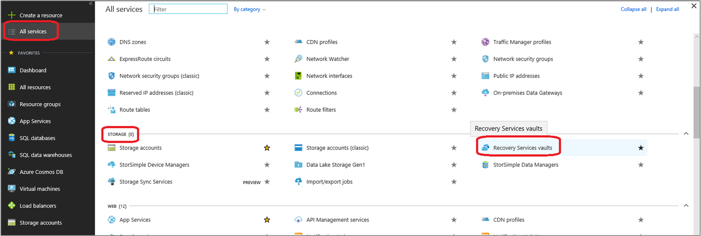
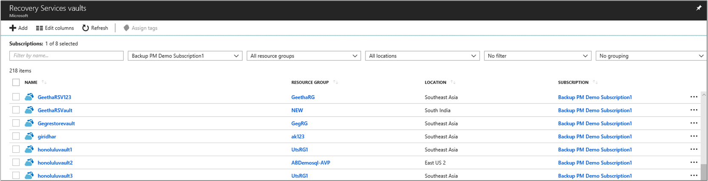
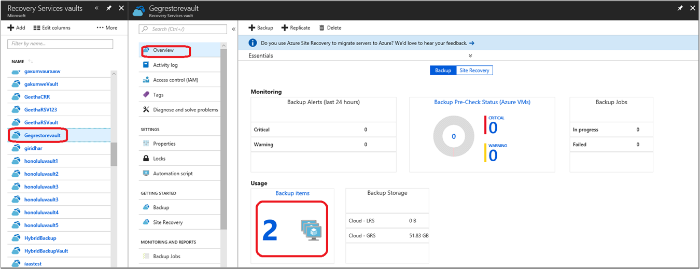
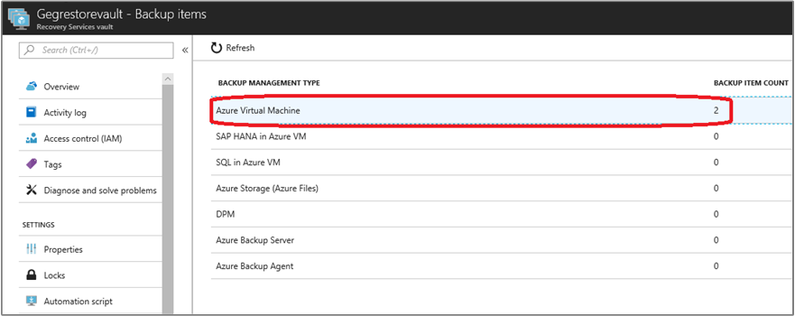
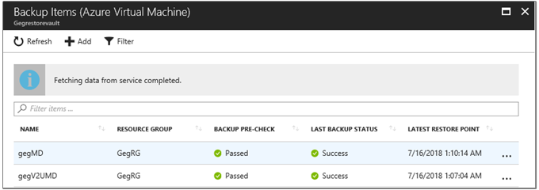
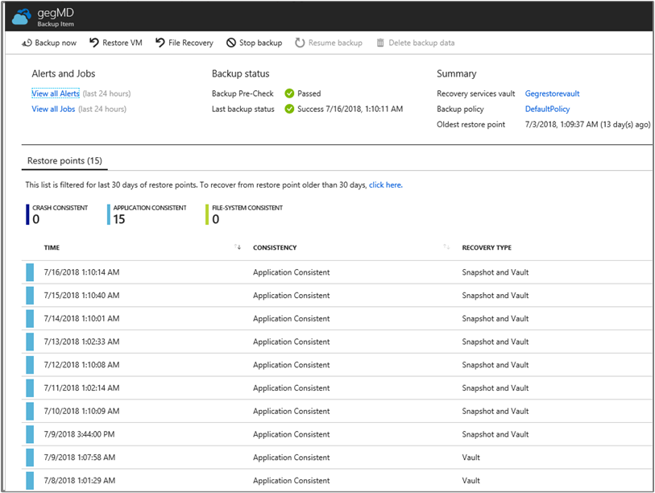
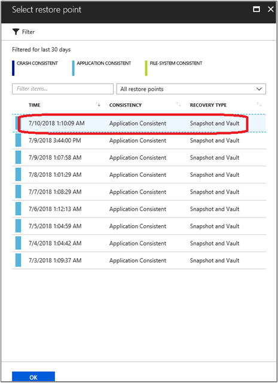
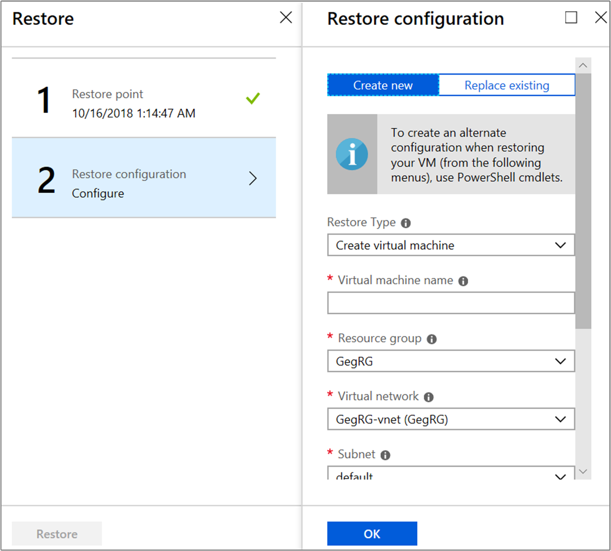
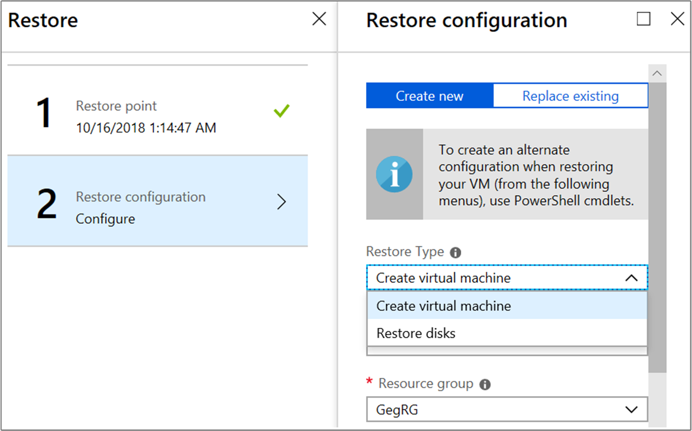

# Use the Azure portal to restore virtual machines
Protect your data by taking snapshots of your data at defined intervals. These snapshots are known as recovery points, and they're stored in Recovery Services vaults. If it's necessary to repair or rebuild a virtual machine (VM), you can restore the VM from any of the saved recovery points. When you restore a recovery point, you can:

* Create a new VM, which is a point-in-time representation of your backed-up VM.
* Restore disks, and use the template that comes with the process to customize the restored VM, or do an individual file recovery.

This article explains how to restore a VM to a new VM or restore all backed-up disks. For individual file recovery, see [Recover files from an Azure VM backup](backup-azure-restore-files-from-vm.md).

> [!NOTE]
> Azure has two deployment models for creating and working with resources: [Azure Resource Manager and classic](../azure-resource-manager/resource-manager-deployment-model.md). This article provides the information and procedures used to restore deployed VMs by using the Resource Manager model.
>
>

Restoring a VM or all disks from VM backup involves two steps:

* Select a restore point for restore.
* Select the restore type, create a new VM or restore disks, and specify the required parameters.

## Select a restore point for restore
1. Sign in to the [Azure portal](http://portal.azure.com/).

2. On the Azure menu, select **All services**. In the list of services, type **Recovery Services** or go to **STORAGE** where the **Recovery Service vaults** is listed, select it.

    

3. The list of vaults in the subscription is displayed.

    

4. From the list of Recovery Service vaults, select the vault associated with the VM you want to restore. When you select the vault, its dashboard opens.

    

5. In the vault dashboard, on the **Backup Items** tile, select **Azure Virtual Machine**.

    

6. The **Backup Items** blade with the list of Azure VMs is opened.

    

7. From the list, select a VM to open the dashboard. The VM dashboard opens to the monitoring area, which contains the **Recovery points**. All VM level operations like **Backup now**, **File recovery**, **Stop backup** can be performed from this blade.
Restore can be performed in many ways from this blade. Note that This blade lists only the last 30 days recovery points.

    a) Right click on the recovery point in this blade (less than 30 days) and initiate **Restore VM**.

    b) To restore recovery points greater than 30 days Click here provided in the blade can be used.

    c) **Restore VM** in the menu header provides an option to list and filter the VMs in customized dates as preferred.

    Use the Filter to alter the time range of the restore points displayed. By default, restore points of all consistencies are displayed. Modify the All restore points filter to select a specific restore point consistency. For more information about each type of restoration point, see [Data consistency](backup-azure-vms-introduction.md#data-consistency).

    Restore point consistency options:
    - Crash consistent restore points
    - Application consistent restore points
    - File-system consistent restore points
    - All restore points

  

    >  [!NOTE]
    > Recovery Type represent if it is in customer storage account, in vault or both. Learn more about [Instant recovery point](https://azure.microsoft.com/blog/large-disk-support/).

8. On the **Restore** blade, select **Restore point**.

    

    The **Restore** blade shows that the restore point is set on clicking **OK**.
9. If you're not already there, go to the **Restore** blade. Ensure that a [restore point is selected](#select-a-restore-point-for-restore), and select **Restore configuration**. The **Restore configuration** blade opens.

## Choose a VM restore configuration
After you select the restore point, choose a VM restore configuration. To configure the restored VM, you can use the Azure portal or PowerShell.

1. If you're not already there, go to the **Restore** blade. Ensure that a [restore point is selected](#select-a-restore-point-for-restore), and select **Restore configuration**. The **Restore configuration** blade opens.
2. This blade currently has two options one being **Create New** which is default and the other is **Replace existing** which is in-place restore to replace the disk(s) only retaining the existing configurations and extensions.

> [!NOTE]
> We are working on replacing the entire VM with the disk(s), network settings, configurations and extensions in the next few months.
>
>

 In the **Create New** option which restores to the data to new VM or new disk(s), you have two choices:

 

 - **Create virtual machine**
 - **Restore disks**

The portal provides a **Quick Create** option for a restored VM. To customize the VM configuration or the names of the resources created as part of creating a new VM choice, use PowerShell or the portal to restore backed-up disks. Use PowerShell commands to attach them to your choice of VM configuration. Or you can use the template that comes with restored disks to customize the restored VM. For information on how to restore a VM that has multiple NICs or is under a load balancer, see [Restore a VM with special network configurations](#restore-vms-with-special-network-configurations). If your Windows VM uses [HUB licensing](../virtual-machines/windows/hybrid-use-benefit-licensing.md), restore disks and use PowerShell/Template as specified in this article to create the VM. Make sure that you specify the **License Type** as "Windows_Server" while you create the VM to avail HUB benefits on the restored VM. Note this can be done later after the creation of VM as well.

## Create a new VM from a restore point
1. On the **Restore configuration** blade mentioned in the before section, enter or select values for each of the following fields:

    a. **Restore Type**. Create a virtual machine.

    b. **Virtual machine name**. Enter the VM name which doesn’t exists in the subscription.

    c. **Resource group**. Use an existing resource group or create a new one. If you're restoring a classic VM, use this field to specify the name of a new cloud service. If you're creating a new resource group/cloud service, the name must be globally unique. Typically, the cloud service name is associated with a public-facing URL: for example, [cloudservice].cloudapp.net. If you attempt to use a name for the cloud resource group/cloud service already in use, Azure assigns the resource group/cloud service the same name as the VM. Azure displays resource groups/cloud services and VMs not associated with any affinity groups. For more information, see [How to migrate from affinity groups to a regional virtual network](../virtual-network/virtual-networks-migrate-to-regional-vnet.md).

    d. **Virtual network**. Select the virtual network when you create VM. The field provides all virtual networks associated with the subscription. The resource group of the VM is displayed in parentheses.

    e. **Subnet**. If the virtual network has subnets, the first subnet is selected by default. If there are additional subnets, select the subnet you want.

    f. **Storage Location**. Storage accounts are the staging location. This menu lists the storage accounts in the same location as the Recovery Services vault. Storage accounts that are zone redundant aren't supported. If there are no storage accounts with the same location as the Recovery Services vault, you must create one before you start the restore operation. The storage account's replication type is displayed in parentheses.

    

    > [!NOTE]
    > * A virtual network is optional for a classic VM and mandatory for Resource Manager-deployed VM.

    > * Storage type provided in storage account (premium or standard) in staging location decides the restore disk storage type. We currently don't support a mixed mode of disks when restoring.
    >
    >

2. On the **Restore configuration** blade, select **OK** to finalize the restore configuration. On the **Restore** blade, select **Restore** to trigger the restore operation.

## Restore backed-up disks
Restore type value **Restore disk** in **Restore configuration** blade enables to create a VM with customized configurations. While restoring disks, Storage account to be selected should be in the same location as Recovery services vault. It is mandatory to create a storage account, if there are no storage accounts with the same location as the Recovery Services vault. ZRS Storage accounts are not supported. Replication type of Storage Account is displayed in parentheses.

Post restore operation, use below:
* [Use the template to customize the restored VM](#use-templates-to-customize-restore-vm)
* [Use the restored disks to attach to an existing VM](../virtual-machines/windows/attach-managed-disk-portal.md)
* [Create a new VM by using PowerShell from restored disks](./backup-azure-vms-automation.md#restore-an-azure-vm)

On the **Restore configuration** blade, select **OK** to finalize the restore configuration. On the **Restore** blade, select **Restore** to trigger the restore operation.

In **Place Restore** is being done through the tab **Replace Existing**.

## Replace existing disks from a restore point
**Replace existing** option helps to replace existing disks in the current VM with the selected restore point. This operation can be only performed if current VM exists. If it was deleted because of any reasons, this operation cannot be performed; alternatively, we recommend you to do **Create new** VM or disks to continue with restore operations. During this operation, as a precautionary measure, we backup the data before initiating the replace disks operations. This creates a snapshot and also a recovery point in the vault with retention period as scheduled in the configured backup policy. If the restore point has disks more/less than the current VM, then the number of disks in the restore point will only reflect in the VM. **Replace existing** option is currently unsupported for Unmanaged Disks and Encrypted VMs. It is also unsupported for [generalized VMs](https://docs.microsoft.com/azure/virtual-machines/windows/capture-image-resource) and for VMs created using [custom images](https://azure.microsoft.com/resources/videos/create-a-custom-virtual-machine-image-in-azure-resource-manager-with-powershell/).  

 On the **Restore Configuration** blade, the only input which needs to be selected is **Staging Location**.

   

 a. **Restore Type**. Replace Disk(s) representing that the restore point selected will replace the disk(s) in existing VM.

 b. **Staging Location**. Storage accounts are the staging location for managed disks. This menu lists the storage accounts in the same location as the Recovery Services vault. Storage accounts that are zone redundant aren't supported. If there are no storage accounts with the same location as the Recovery Services vault, you must create one before you start the restore operation. The storage account's replication type is displayed in parentheses.

## Track the restore operation
After you trigger the restore operation, the backup service creates a job for tracking the restore operation. The backup service also creates and temporarily displays the notification in the **Notifications** area of the portal. If you don't see the notification, select the **Notifications** symbol to view your notifications.

Click on the hyperlink of the notifications to go to **BackupJobs** list. All the details of the operations for a given job is available in the **BackupJobs** lists. You can go to **BackupJobs** from the vault dashboard by clicking the Backup Jobs tile, select **Azure virtual machine** to display the jobs associated with the vault.

The **Backup jobs** blade opens and displays the list of jobs.

## Use templates to customize a restored VM
After the [restore disks operation is finished](#Track-the-restore-operation), use the template that was generated as part of the restore operation to create a new VM with a configuration different from the backup configuration. You also can use it to customize names of resources that were created during the process of creating a new VM from a restore point.

To get the template that was generated as part of the restore disks option:

1. Go to the **Restore Job Details** corresponding to the job.

2. On the **Restore Job Details** screen, select **Deploy Template** to initiate template deployment.

3. On the **Deploy template** blade for custom deployment, use template deployment to [edit and deploy the template](../azure-resource-manager/resource-group-template-deploy-portal.md#deploy-resources-from-custom-template) or append more customizations by [authoring a template](../azure-resource-manager/resource-group-authoring-templates.md) before you deploy.

  

4. After you enter the required values, accept the **Terms and Conditions** and select **Purchase**.

  

## Post-restore steps
* If you use a cloud-init-based Linux distribution, such as Ubuntu, for security reasons, the password is blocked post restore. Use the VMAccess extension on the restored VM to [reset the password](../virtual-machines/linux/reset-password.md). We recommend using SSH keys on these distributions to avoid resetting the password post restore.
* Extensions present during the backup configuration are installed, but they won't be enabled. If you see an issue, reinstall the extensions.
* If the backed-up VM has static IP post restore, the restored VM has a dynamic IP to avoid conflict when you create a restored VM. Learn more about how you can [add a static IP to a restored VM](../virtual-network/virtual-networks-reserved-private-ip.md#how-to-add-a-static-internal-ip-to-an-existing-vm).
* A restored VM doesn't have an availability value set. We recommend using the restore disks option to [add an availability set](../virtual-machines/windows/tutorial-availability-sets.md) when you create a VM from PowerShell or templates by using restored disks.

## Backup for restored VMs
If you restored a VM to the same resource group with the same name as the originally backed-up VM, backup continues on the VM post restore. If you restored the VM to a different resource group or you specified a different name for the restored VM, the VM is treated as if it's a new VM. You need to set up backup for the restored VM.

## Restore a VM during an Azure datacenter disaster
Azure Backup allows restoring backed-up VMs to the paired datacenter in case the primary datacenter where VMs are running experiences a disaster and you configured the backup vault to be geo-redundant. During such scenarios, select a storage account, which is present in a paired datacenter. The rest of the restore process remains the same. Backup uses the compute service from the paired geo to create the restored VM. For more information, see [Azure datacenter resiliency](../resiliency/resiliency-technical-guidance-recovery-loss-azure-region.md).

## Restore domain controller VMs
Backup of domain controller (DC) VMs is a supported scenario with Backup. However, you must be careful during the restore process. The correct restore process depends on the structure of the domain. In the simplest case, you have a single DC in a single domain. More commonly for production loads, you have a single domain with multiple DCs, perhaps with some DCs on-premises. Finally, you might have a forest with multiple domains.

From an Active Directory perspective, the Azure VM is like any other VM on a modern supported hypervisor. The major difference with on-premises hypervisors is that there's no VM console available in Azure. A console is required for certain scenarios, such as recovering by using a bare-metal recovery (BMR)-type backup. However, VM restore from the backup vault is a full replacement for BMR. Directory Services Restore Mode (DSRM) is also available, so all Active Directory recovery scenarios are viable. For more information, see [Backup and restore considerations for virtualized domain controllers](https://technet.microsoft.com/library/virtual_active_directory_domain_controller_virtualization_hyperv(v=ws.10).aspx#backup_and_restore_considerations_for_virtualized_domain_controllers) and [Planning for Active Directory forest recovery](https://technet.microsoft.com/library/planning-active-directory-forest-recovery(v=ws.10).aspx).

### Single DC in a single domain
The VM can be restored (like any other VM) from the Azure portal or by using PowerShell.

### Multiple DCs in a single domain
When other DCs of the same domain can be reached over the network, the DC can be restored like any VM. If it's the last remaining DC in the domain, or a recovery in an isolated network is performed, a forest recovery procedure must be followed.

### Multiple domains in one forest
When other DCs of the same domain can be reached over the network, the DC can be restored like any VM. In all other cases, we recommend a forest recovery.

## Restore VMs with special network configurations
It's possible to back up and restore VMs with the following special network configurations. However, these configurations require some special consideration while going through the restore process:

* VMs under load balancers (internal and external)
* VMs with multiple reserved IPs
* VMs with multiple NICs

> [!IMPORTANT]
> When you create the special network configuration for VMs, you must use PowerShell to create VMs from the restored disks.
>
>

To fully re-create the VMs after restoring to disk, follow these steps:

1. Restore the disks from a Recovery Services vault by using [PowerShell](backup-azure-vms-automation.md#restore-an-azure-vm).

1. Create the VM configuration required for load balancer/multiple NIC/multiple reserved IP by using the PowerShell cmdlets. Use it to create the VM with the configuration you want:

   a. Create a VM in the cloud service with an [internal load balancer](https://azure.microsoft.com/documentation/articles/load-balancer-internal-getstarted/).

   b. Create a VM to connect to an [internet-facing load balancer](https://azure.microsoft.com/documentation/articles/load-balancer-internet-getstarted/).

   c. Create a VM with [multiple NICs](../virtual-machines/windows/multiple-nics.md).

   d. Create a VM with [multiple reserved IPs](../virtual-network/virtual-network-multiple-ip-addresses-powershell.md).

## Next steps
Now that you can restore your VMs, see the troubleshooting article for information on common errors with VMs. Also, check out the article on managing tasks with your VMs.

* [Troubleshooting errors](backup-azure-vms-troubleshoot.md#restore)
* [Manage virtual machines](backup-azure-manage-vms.md)
