# How to restore Azure VM data in Azure portal

This article describes how to restore Azure VM data from the recovery points stored in [Azure Backup](backup-overview.md) Recovery Services vaults.

## Restore options

Azure Backup provides several ways to restore a VM.

**Restore option** | **Details**
--- | ---
**Create a new VM** | Quickly creates and gets a basic VM up and running from a restore point.<br/><br/> You can specify a name for the VM and select the resource group and virtual network (VNet) in which it will be placed. The new VM must be created in the same region as the source VM.<br><br>If a VM restore fails because an Azure VM SKU wasn't available in the specified region of Azure, or because of any other issues, Azure Backup still restores the disks in the specified resource group.
**Restore disk** | Restores a VM disk, which can then be used to create a new VM.<br/><br/> Azure Backup provides a template to help you customize and create a VM. <br/><br> The restore job generates a template that you can download and use to specify custom VM settings, and create a VM.<br/><br/> The disks are copied to the Resource Group you specify.<br/><br/> Alternatively, you can attach the disk to an existing VM, or create a new VM using PowerShell.<br/><br/> This option is useful if you want to customize the VM, add configuration settings that weren't there at the time of backup, or add settings that must be configured using the template or PowerShell.
**Replace existing** | You can restore a disk, and use it to replace a disk on the existing VM.<br/><br/> The current VM must exist. If it's been deleted, this option can't be used.<br/><br/> Azure Backup takes a snapshot of the existing VM before replacing the disk. The snapshot is copied to the vault and retained in accordance with the retention policy.　<br/><br/> When you choose a Vault-Standard recovery point, a VHD file with the content of the chosen recovery point is also created in the staging location you specify. Existing disks connected to the VM are replaced with the selected restore point. <br/><br/> After the replace disk operation, the original disk is retained in the resource group. You can choose to manually delete the original disks if they aren't needed. <br/><br/>Replace existing is supported for unencrypted managed VMs, including VMs [created using custom images](https://azure.microsoft.com/resources/videos/create-a-custom-virtual-machine-image-in-azure-resource-manager-with-powershell/). It's unsupported for classic VMs, unmanaged VMs, and [generalized VMs](../virtual-machines/windows/upload-generalized-managed.md).<br/><br/> If the restore point has more or less disks than the current VM, then the number of disks in the restore point will only reflect the VM configuration.<br><br> Replace existing is also supported for VMs with linked resources, like [user-assigned managed-identity](../active-directory/managed-identities-azure-resources/overview.md) or [Key Vault](../key-vault/general/overview.md).
**Cross Region (secondary region)** | Cross Region restore can be used to restore Azure VMs in the secondary region, which is an [Azure paired region](../availability-zones/cross-region-replication-azure.md).<br><br> You can restore all the Azure VMs for the selected recovery point if the backup is done in the secondary region.<br><br> During the backup, snapshots aren't replicated to the secondary region. Only the data stored in the vault is replicated. So secondary region restores are only [vault tier](about-azure-vm-restore.md#concepts) restores. The restore time for the secondary region will be almost the same as the vault tier restore time for the primary region.  <br><br> This feature is available for the options below:<br><br> - [Create a VM](#create-a-vm) <br> - [Restore Disks](#restore-disks) <br><br> We don't currently support the [Replace existing disks](#replace-existing-disks) option.<br><br> Permissions<br> The restore operation on secondary region can be performed by Backup Admins and App admins.
**Cross Subscription Restore** | Allows you to restore Azure Virtual Machines or disks to a different subscription within the same tenant as the source subscription (as per the Azure RBAC capabilities) from restore points.  <br><br> Allowed only if the [Cross Subscription Restore property](backup-azure-arm-restore-vms.md#cross-subscription-restore-preview) is enabled for your Recovery Services vault.  <br><br>  Works with [Cross Region Restore](backup-azure-arm-restore-vms.md#cross-region-restore) and [Cross Zonal Restore](backup-azure-arm-restore-vms.md#create-a-vm).   <br><br>   You can trigger Cross Subscription Restore for managed virtual machines only. <br><br> Cross Subscription Restore is supported for [Restore with Managed System Identities (MSI)](backup-azure-arm-restore-vms.md#restore-vms-with-managed-identities). <br><br> It's unsupported for [snapshots tier](backup-azure-vms-introduction.md#snapshot-creation) recovery points. <br><br>  It's unsupported for [unmanaged VMs](#restoring-unmanaged-vms-and-disks-as-managed) and [ADE encrypted VMs](backup-azure-vms-encryption.md#encryption-support-using-ade).
**Cross Zonal Restore** |	Allows you to restore Azure Virtual Machines or disks pinned to any zone to different available zones (as per the Azure RBAC capabilities) from restore points. Note that when you select a zone to restore, it selects the [logical zone](../reliability/availability-zones-overview.md#zonal-and-zone-redundant-services) (and not the physical zone) as per the Azure subscription you will use to restore to.           <br><br> You can trigger Cross Zonal Restore for managed virtual machines only. <br><br> Cross Zonal Restore is supported for [Restore with Managed System Identities (MSI)](#restore-vms-with-managed-identities). <br><br> Cross Zonal Restore supports restore of an Azure zone pinned/non-zone pinned VM from a vault with Zonal-redundant storage (ZRS) enabled. Learn [how to set Storage Redundancy](backup-create-rs-vault.md#set-storage-redundancy). <br><br> It's supported to restore an Azure zone pinned VM only from a [vault with Cross Region Restore (CRR)](backup-create-rs-vault.md#set-storage-redundancy) (if the secondary region supports zones) or Zone Redundant Storage (ZRS) enabled. <br><br> Cross Zonal Restore is supported from [secondary regions](#restore-in-secondary-region). <br><br> It's unsupported from [snapshots](backup-azure-vms-introduction.md#snapshot-creation) restore point. <br><br> It's unsupported for [Encrypted Azure VMs](backup-azure-vms-introduction.md#encryption-of-azure-vm-backups).

>[!Tip]
>To receive alerts/notifications when a restore operation fails, use [Azure Monitor alerts for Azure Backup](backup-azure-monitoring-built-in-monitor.md#azure-monitor-alerts-for-azure-backup). This helps you to monitor such failures and take necessary actions to remediate the issues.

>[!NOTE]
>You can also recover specific files and folders on an Azure VM. [Learn more](backup-azure-restore-files-from-vm.md).

## Storage accounts

Some details about storage accounts:

- **Create VM**: When you create a new VM with managed disks, nothing is placed in the storage account you specify. If using unmanaged disks, the VHD files for the VM's disks will be placed in the storage account you specify.
- **Restore disk**: The restore job generates a template that you can download and use to specify custom VM settings. This template is placed in the specified storage account. VHD files are also copied to the storage account, when you restore managed disks of size less than 4 TB, from a Vault-Standard recovery point, or when you restore unmanaged disks. The files are then copied to Managed storage. To avoid unnecessary charge, delete the VHD files from the Staging Storage Account. 
- **Replace disk**: When you replace a managed disk from a Vault-Standard recovery point and the disk size is less than 4 TB, a VHD file with the data from the chosen recovery point is created in the specified storage account. After the replace disk operation, the disks of the source Azure VM are left in the specified Resource group for your operation and the VHDs are stored in the specified storage account. You can choose to delete or retain these VHDs and disks.
- **Storage account location**: The storage account must be in the same region as the vault. Only these accounts are displayed. If there are no storage accounts in the location, you need to create one.
- **Storage type**: Blob storage isn't supported.
- **Storage redundancy**: Zone redundant storage (ZRS) isn't supported. The replication and redundancy information for the account is shown in parentheses after the account name.
- **Premium storage**:
  - When you restore non-premium VMs, premium storage accounts aren't supported.
  - When you restore managed VMs, premium storage accounts configured with network rules aren't supported.

## Before you start

To restore a VM (create a new VM), make sure you have the correct Azure role-based access control (Azure RBAC) [permissions](backup-rbac-rs-vault.md#mapping-backup-built-in-roles-to-backup-management-actions) for the Restore VM operation.

If you don't have permissions, you can [restore a disk](#restore-disks), and then after the disk is restored, you can [use the template](#use-templates-to-customize-a-restored-vm) that was generated as part of the restore operation to create a new VM.

[!INCLUDE [backup-center.md](../../includes/backup-center.md)]

## Select a restore point

1. Navigate to **Backup center** in the Azure portal and click **Restore** from the **Overview** tab.

    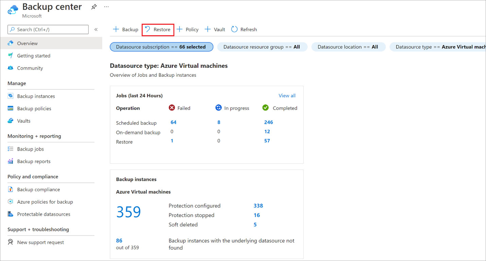

1. Select **Azure Virtual machines** as the **Datasource type**, and then  select a Backup instance.

    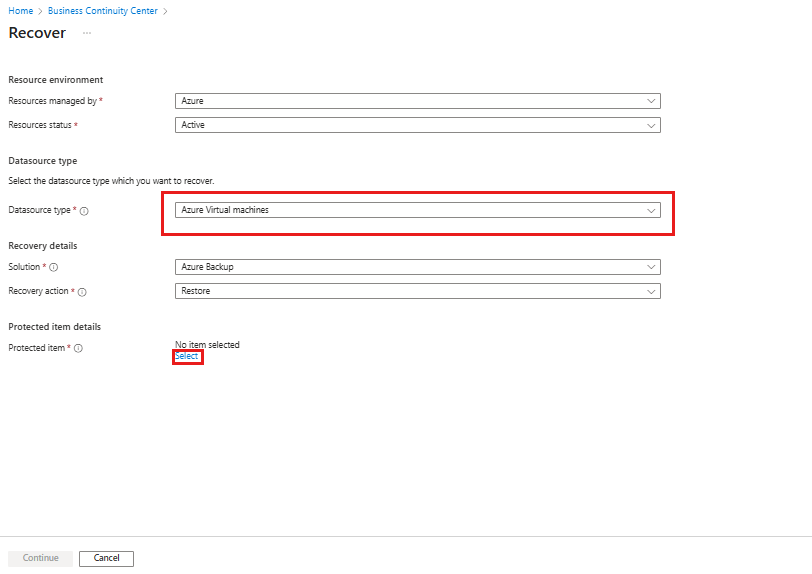

1. Select a VM and click **Continue**.
1. In the next screen that appears, select a restore point to use for the recovery.

    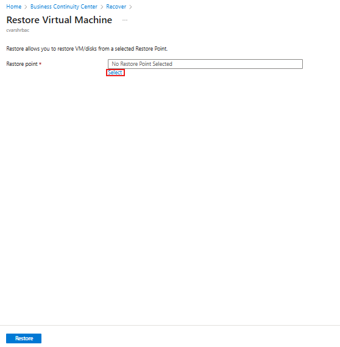


## Choose a VM restore configuration

1. In **Restore Virtual Machine**, select a restore option:
    - **Create new**: Use this option if you want to create a new VM. You can create a VM with simple settings, or restore a disk and create a customized VM.
    - **Replace existing**: Use this option if you want to replace disks on an existing VM.

        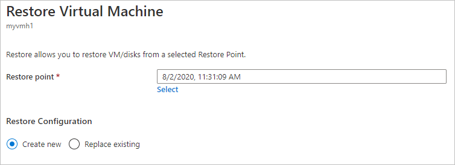

1. Specify settings for your selected restore option.

>[!Note]
>Use the **Replace existing** option only when the **Transfer Data to Vault** subtask in the job details shows successfully completed. Otherwise, use the **Create New** option for the latest recovery point restoration.

## Create a VM

As one of the [restore options](#restore-options), you can create a VM quickly with basic settings from a restore point.

1. In **Restore Virtual Machine** > **Create new** > **Restore Type**, select **Create new virtual machine**.
1. In **Virtual machine name**, specify a VM that doesn't exist in the subscription.
1. In **Resource group**, select an existing resource group for the new VM, or create a new one with a globally unique name. If you assign a name that already exists, Azure assigns the group the same name as the VM.
1. In **Virtual network**, select the VNet in which the VM will be placed. All VNets associated with the subscription in the same location as the vault, which is active and not attached with any affinity group, are displayed. Select the subnet.

   The first subnet is selected by default.

1. In **Staging Location**, specify the storage account for the VM. [Learn more](#storage-accounts).

    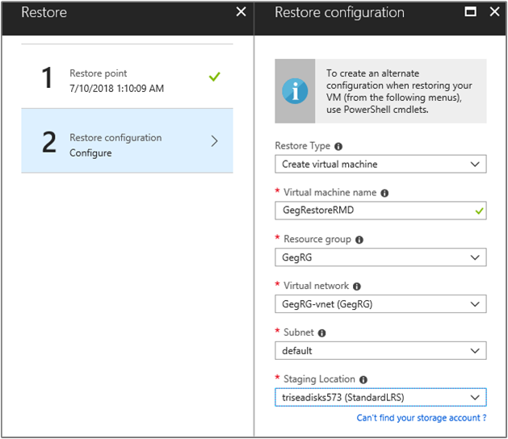

1. Choose the required subscription from the **Subscription** drop-down list to restore an Azure VM to a different subscription.

   Azure Backup now supports Cross Subscription Restore (CSR), you can now restore an Azure VM using a recovery point from default subscription to another. Default subscription is the subscription where recovery point is available.

   The following screenshot lists all subscriptions under the tenant where you've permissions, which enable you to restore the Azure VM to another subscription.

   :::image type="content" source="./media/backup-azure-arm-restore-vms/backup-azure-cross-subscription-restore.png" alt-text="Screenshot showing the list of all subscriptions under the tenant where you have permissions.":::

1. Choose the required zone from the **Availability Zone** drop-down list to restore an Azure VM pinned to any zone to a different zone.

   Azure Backup now supports Cross Zonal Restore (CZR), you can now restore an Azure VM from the default zone to any available zones. Default zone is the zone in which Azure VM is running.

   The following screenshot lists all zones that enable you to restore Azure VM to another zone.

   :::image type="content" source="./media/backup-azure-arm-restore-vms/azure-virtual-machine-cross-zonal-restore.png" alt-text="Screenshot showing you how to select an available zone for VM restore.":::

   >[!Note]
   >Azure Backup supports CZR only for vaults with ZRS or CRR redundancy.


1. Select **Restore** to trigger the restore operation.

>[!Note]
>Before you modify any NSG settings, ensure the VM restore operation is complete. Learn about [tracking the restore operation](#track-the-restore-operation).

## Restore disks

As one of the [restore options](#restore-options), you can create a disk from a restore point. Then with the disk, you can do one of the following actions:

- Use the template that's generated during the restore operation to customize settings, and trigger VM deployment. You edit the default template settings, and submit the template for VM deployment.
- [Attach restored disks](../virtual-machines/windows/attach-managed-disk-portal.md) to an existing VM.
- [Create a new VM](./backup-azure-vms-automation.md#create-a-vm-from-restored-disks) from the restored disks using PowerShell.

1. In **Restore configuration** > **Create new** > **Restore Type**, select **Restore disks**. 
1. In **Resource group**, select an existing resource group for the restored disks, or create a new one with a globally unique name.
1. In **Staging location**, specify the storage account. The template file is stored here, and VHD files are also created in some scenarios. [Learn more](#storage-accounts).

   :::image type="content" source="./media/backup-azure-arm-restore-vms/trigger-restore-operation-disks.png" alt-text="Screenshot showing to select Resource disks.":::

1. Choose the required subscription from the **Subscription** drop-down list to restore the VM disks to a different subscription.

   Azure Backup now supports Cross Subscription Restore (CSR). Like Azure VM, you can now restore Azure VM disks using a recovery point from default subscription to another. Default subscription is the subscription where recovery point is available.

1. Choose the required zone from the **Availability Zone** drop-down list to restore the VM disks to a different zone.

   Azure Backup now supports Cross Zonal Restore (CZR). Like Azure VM, you can now restore Azure VM disks from the default zone to any available zones. Default zone is the zone in which the VM disks reside.

   >[!Note]
   >Azure Backup supports CZR only for vaults with ZRS or CRR redundancy.

1. Select **Restore** to trigger the restore operation.

When your virtual machine uses managed disks and you select the **Create virtual machine** option, Azure Backup doesn't use the specified storage account. In the case of **Restore disks** and **Instant Restore**, the storage account is used only for storing the template. Managed disks are created in the specified resource group. When your virtual machine uses unmanaged disks, they're restored as blobs to the storage account.

While you restore disks for a Managed VM from a Vault-Standard recovery point, it restores the Managed disk and Azure Resource Manager (ARM) templates, along with the VHD files of the disks in staging location. If you restore disks from an Instant recovery point, it restores the Managed disks and ARM templates only.

>[!Note]
>- For restoring disk from a Vault-Standard recovery point that is/was greater than 4 TB, Azure Backup doesn't restore the VHD files.
>- For information on managed/premium disk performance after restored via Azure Backup, see the [Latency](../virtual-machines/premium-storage-performance.md#latency) section.

### Use templates to customize a restored VM

After the disk is restored, use the template that was generated as part of the restore operation to customize and create a new VM:

1. In **Backup Jobs**, select the relevant restore job.

1. In **Restore**, select **Deploy Template** to initiate template deployment.

    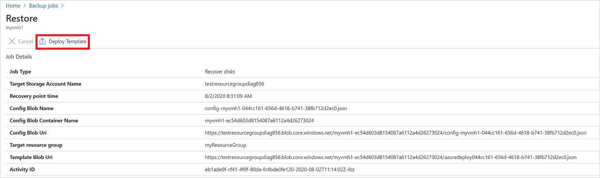
   
   >[!Note]
   >For a shared access signature (SAS) that has **Allow storage account key access** set to disabled, the template won't deploy when you select **Deploy Template**.

1. To customize the VM setting provided in the template, select **Edit template**. If you want to add more customizations, select **Edit parameters**.
    - [Learn more](../azure-resource-manager/templates/deploy-portal.md#deploy-resources-from-custom-template) about deploying resources from a custom template.
    - [Learn more](../azure-resource-manager/templates/syntax.md) about authoring templates.

   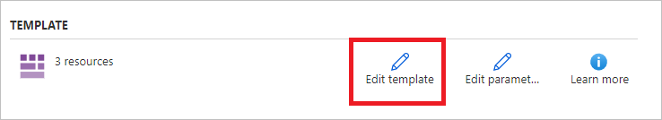

1. Enter the custom values for the VM, accept the **Terms and Conditions** and select **Purchase**.

   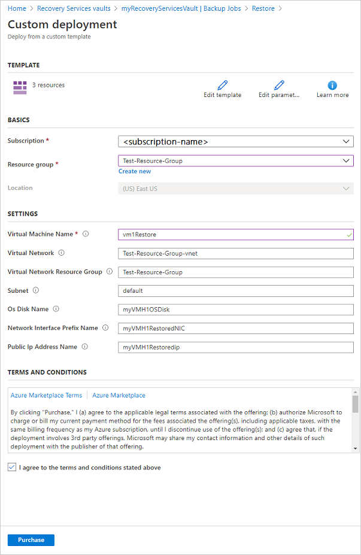

## Replace existing disks

As one of the [restore options](#restore-options), you can replace an existing VM disk with the selected restore point. [Review](#restore-options) all restore options.

1. In **Restore configuration**, select **Replace existing**.
1. In **Restore Type**, select **Replace disk/s**. This is the restore point that will be used replace existing VM disks.
1. In **Staging Location**, specify a storage account. VHD files are created here in some scenarios. [Learn more](#storage-accounts).

   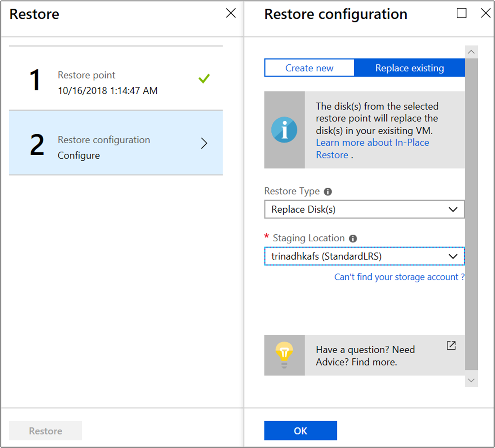

## Cross Region Restore

As one of the [restore options](#restore-options), Cross Region Restore (CRR) allows you to restore Azure VMs in a secondary region, which is an Azure paired region.

To begin using the feature, read the [Before You Begin section](./backup-create-rs-vault.md#set-cross-region-restore).

To see if CRR is enabled, follow the instructions in [Configure Cross Region Restore](backup-create-rs-vault.md#set-cross-region-restore).

>[!Note]
>Cross-region restore is currently not supported for machines running on Ultra disks. [Learn more about Ultra disk backup supportability](backup-support-matrix-iaas.md#ultra-disk-backup).

### View backup items in secondary region

If CRR is enabled, you can view the backup items in the secondary region.

1. From the portal, go to **Recovery Services vault** > **Backup items**.
1. Select **Secondary Region** to view the items in the secondary region.

>[!NOTE]
>Only Backup Management Types supporting the CRR feature will be shown in the list. Currently, only support for restoring secondary region data to a secondary region is allowed.<br></br>CRR for Azure VMs is supported for Azure Managed VMs (including encrypted Azure VMs). See the [management types that support Cross Region Restore](./backup-support-matrix.md#cross-region-restore).

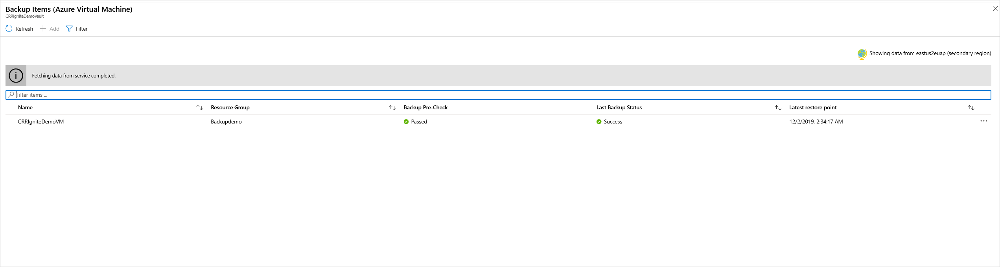

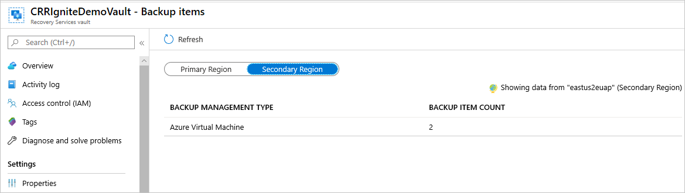

### Restore in secondary region

The secondary region restore user experience will be similar to the primary region restore user experience. When configuring details in the Restore Configuration pane to configure your restore, you'll be prompted to provide only secondary region parameters.

Currently, secondary region [RPO](azure-backup-glossary.md#rpo-recovery-point-objective) is _36 hours_. This is because the RPO in the primary region is _24 hours_ and can take up to _12 hours_ to replicate the backup data from the primary to the secondary region.

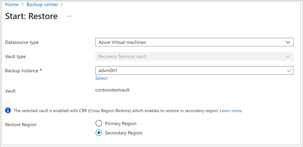

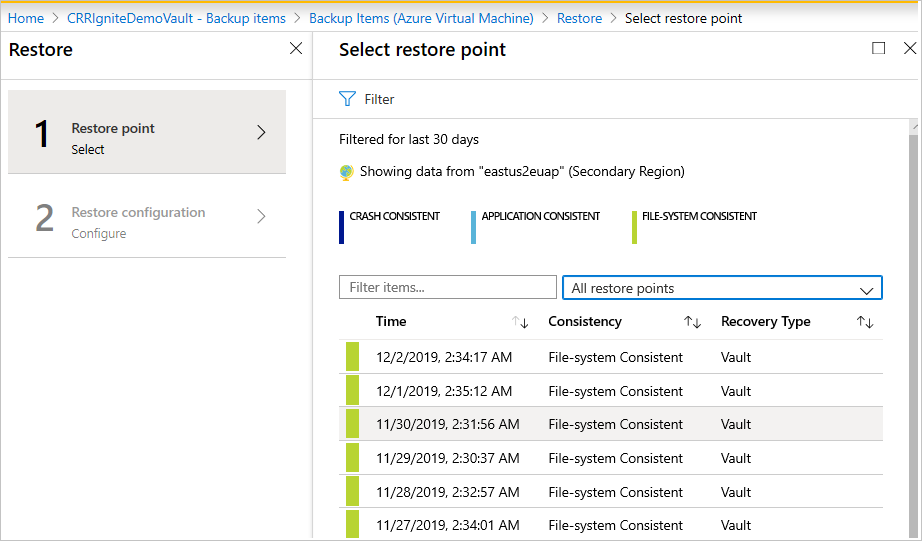

- To restore and create a VM, refer to [Create a VM](#create-a-vm).
- To restore as a disk, refer to [Restore disks](#restore-disks).

>[!NOTE]
>
>- The Cross Region Restore feature restores CMK (customer-managed keys) enabled Azure VMs, which aren't backed-up in a CMK enabled Recovery Services vault, as non-CMK enabled VMs in the secondary region.
>- The Azure roles needed to restore in the secondary region are the same as those in the primary region.
>- While restoring an Azure VM, Azure Backup configures the virtual network settings in the secondary region automatically. If you are [restoring disks](#restore-disks) while deploying the template, ensure to provide the virtual network settings, corresponding to the secondary region.
>- If VNet/Subnet is not available in the primary region or is not configured in the secondary region, Azure portal doesn't auto-populate any default values during restore operation.
>- For Cross Region Restores, the **Staging Location** (that is the storage account location) must be in the region that the Recovery Services vault treats as the *secondary* region. For example, a Recovery Services vault is located in East US 2 region (with Geo-Redundancy and Cross Region Restore enabled). This means that the *secondary* region would be *Central US*. Therefore, you need to create a storage account in *Central US* to perform a Cross Region Restore of the VM. <br> Learn more about [Azure cross-region replication pairings for all geographies](../availability-zones/cross-region-replication-azure.md).


[Azure zone pinned VMs](../virtual-machines/windows/create-portal-availability-zone.md) can be restored in any [availability zones](../availability-zones/az-overview.md) of the same region.

In the restore process, you'll see the option **Availability Zone.** You'll see your default zone first. To choose a different zone, choose the number of the zone of your choice. If the pinned zone is unavailable, you won't be able to restore the data to another zone because the backed-up data isn't zonally replicated. The restore in availability zones is possible from recovery points in vault tier only.

In summary, the **Availability Zone** will only appear when
 - The source VM is zone pinned and is NOT encrypted
 - The recovery point is present in vault tier only (Snapshots only or snapshot and vault tier are not supported)
 - The recovery option is to either create a new VM or to restore disks (replace disks option replaces source data and hence the availability zone option is not applicable)
 - Creating VM/disks in the same region when vault's storage redundancy is ZRS (Doesn't work when vault's storage redundancy is GRS even though the source VM is zone pinned)
 - Creating VM/disks in the paired region when vault's storage redundancy is enabled for Cross-Region-Restore AND if the paired region supports zones


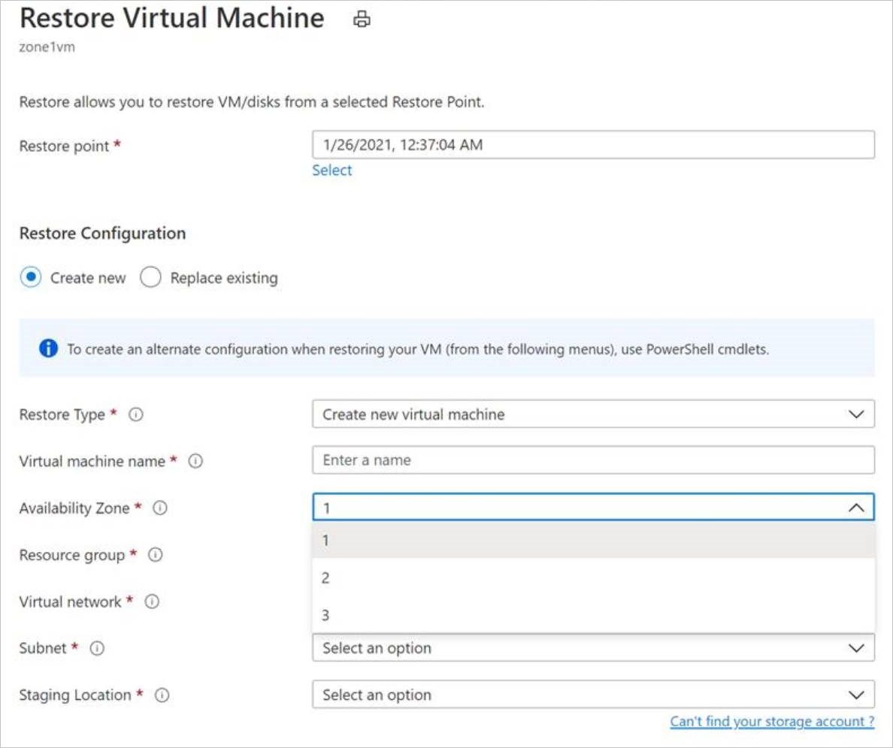

>[!Note]
>Cross region restore jobs once triggered, can't be canceled.

### Monitoring secondary region restore jobs

1. From the portal, go to **Recovery Services vault** > **Backup Jobs**
1. Select **Secondary Region** to view the items in the secondary region.

    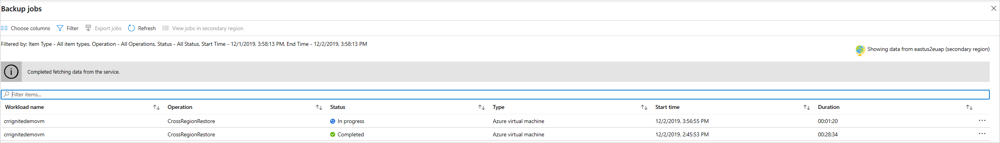

## Cross Subscription Restore (preview)

Azure Backup now allows you to perform Cross Subscription Restore (CSR), which helps you to restore Azure VMs in a subscription that is different from the default one. Default subscription contains the recovery points.

This feature is enabled for Recovery Services vault by default. However, there may be instances when you may need to block Cross Subscription Restore based on your cloud infrastructure. So, you can enable, disable, or permanently disable Cross Subscription Restore for the existing vaults by going to *Vault* > **Properties** > **Cross Subscription Restore**.

:::image type="content" source="./media/backup-azure-arm-restore-vms/cross-subscription-restore-for-virtual-machines-inline.png" alt-text="Screenshot shows how to modify cross-subscription restore settings." lightbox="./media/backup-azure-arm-restore-vms/cross-subscription-restore-for-virtual-machines-expanded.png":::

>[!Note]
>- CSR once permanently disabled on a vault can't be re-enabled because it's an irreversible operation. 
>- If CSR is disabled but not permanently disabled, then you can reverse the operation by selecting *Vault* > **Properties** > **Cross Subscription Restore** > **Enable**.
>- If a Recovery Services vault is moved to a different subscription when CSR is disabled or permanently disabled, restore to the original subscription fails.

## Restoring unmanaged VMs and disks as managed

You're provided with an option to restore [unmanaged disks](../storage/common/storage-disaster-recovery-guidance.md#azure-unmanaged-disks) as [managed disks](../virtual-machines/managed-disks-overview.md) during restore. By default, the unmanaged VMs / disks are restored as unmanaged VMs / disks. However, if you choose to restore as managed VMs / disks, it's now possible to do so. These restore operations aren't triggered from the snapshot phase but only from the vault phase. This feature isn't available for unmanaged encrypted VMs.


## Restore VMs with special configurations

There are many common scenarios in which you might need to restore VMs.

**Scenario** | **Guidance**
--- | ---
**Restore VMs using Hybrid Use Benefit** | If a Windows VM uses [Hybrid Use Benefit (HUB) licensing](../virtual-machines/windows/hybrid-use-benefit-licensing.md), restore the disks, and create a new VM using the provided template (with **License Type** set to **Windows_Server**), or PowerShell.  This setting can also be applied after creating the VM.
**Restore VMs during an Azure datacenter disaster** | If the vault uses GRS and the primary datacenter for the VM goes down, Azure Backup supports restoring backed-up VMs to the paired datacenter. You select a storage account in the paired datacenter, and restore as normal. Azure Backup uses the compute service in the paired region to create the restored VM. [Learn more](/azure/architecture/resiliency/recovery-loss-azure-region) about datacenter resiliency.<br><br> If the vault uses GRS, you can choose the new feature, [Cross Region Restore](#cross-region-restore). This lets you restore to a second region in either full or partial outage scenarios, or even if there's no outage at all.
**Bare-metal restore** | The major difference between Azure VMs and on-premises hypervisors is that there's no VM console available in Azure. A console is required for certain scenarios, such as recovering by using a bare-metal recovery (BMR)-type backup. However, VM restore from the vault is a full replacement for BMR.
**Restore VMs with special network configurations** | Special network configurations include VMs using internal or external load balancing, using multiple NICS, or multiple reserved IP addresses. You restore these VMs by using the [restore disk option](#restore-disks). This option makes a copy of the VHDs into the specified storage account, and you can then create a VM with an [internal](../load-balancer/quickstart-load-balancer-standard-internal-powershell.md) or [external](../load-balancer/quickstart-load-balancer-standard-public-powershell.md) load balancer, [multiple NICS](../virtual-machines/windows/multiple-nics.md), or [multiple reserved IP addresses](../virtual-network/ip-services/virtual-network-multiple-ip-addresses-powershell.md), in accordance with your configuration.
**Network Security Group (NSG) on NIC/Subnet** | Azure VM backup supports Backup and Restore of NSG information at vnet, subnet, and NIC level.
**Zone Pinned VMs** | If you back up an Azure VM that's pinned to a zone (with Azure Backup), then you can restore it in the same zone where it was pinned. [Learn more](../availability-zones/az-overview.md)
**Restore VM in any availability set** | When you restore a VM from the portal, there's no option to choose an availability set. A restored VM doesn't have an availability set. If you use the restore disk option, then you can [specify an availability set](../virtual-machines/windows/tutorial-availability-sets.md) when you create a VM from the disk using the provided template or PowerShell.
**Restore special VMs such as SQL VMs** | If you're backing up a SQL VM using Azure VM backup and then use the restore VM option or create a VM after restoring disks, then the newly created VM must be registered with the SQL provider as mentioned [here](/azure/azure-sql/virtual-machines/windows/sql-agent-extension-manually-register-single-vm?tabs=azure-cli%2cbash). This will convert the restored VM into a SQL VM.

### Restore domain controller VMs

**Scenario** | **Guidance**
--- | ---
**Restore a single domain controller VM in a single domain** | Restore the VM like any other VM. Note that:<br/><br/> From an Active Directory perspective, the Azure VM is like any other VM.<br/><br/> Directory Services Restore Mode (DSRM) is also available, so all Active Directory recovery scenarios are viable. [Learn more](#post-restore-steps) about backup and restore considerations for virtualized domain controllers.
**Restore multiple domain controller VMs in a single domain** | If other domain controllers in the same domain can be reached over the network, the domain controller can be restored like any VM. If it's the last remaining domain controller in the domain, or a recovery in an isolated network is performed, use a [forest recovery](/windows-server/identity/ad-ds/manage/ad-forest-recovery-single-domain-in-multidomain-recovery).
**Restore a single domain controller VM in a multiple domain configuration** |  Restore the disks and create a VM by [using PowerShell](backup-azure-vms-automation.md#restore-the-disks)  
**Restore multiple domains in one forest** | We recommend a [forest recovery](/windows-server/identity/ad-ds/manage/ad-forest-recovery-single-domain-in-multidomain-recovery).

For more information, see [Back up and restore Active Directory domain controllers](active-directory-backup-restore.md).

## Restore VMs with managed identities

Managed identities eliminate the need for the user to maintain the credentials. Managed identities provide an identity for applications to use when connecting to resources that support Microsoft Entra authentication.  

Azure Backup offers the flexibility to restore the managed Azure VM with [managed identities](../active-directory/managed-identities-azure-resources/overview.md). You can choose to select [system-managed identities](../active-directory/managed-identities-azure-resources/overview.md#managed-identity-types) or user-managed identities as shown in the figure below. This is introduced as one of the input parameters in the [**Restore configuration** blade](#create-a-vm) of Azure VM. Managed identities used as one of the input parameters is only used for accessing the storage accounts, which are used as staging location during restore and not for any other Azure resource controlling. These managed identities have to be associated to the vault.

:::image type="content" source="./media/backup-azure-arm-restore-vms/select-system-managed-identities-or-user-managed-identities.png" alt-text="Screenshot for choice to select system-managed identities or user-managed identities.":::

If you choose to select system-assigned or user-assigned managed identities, check for the below actions for managed identity on the target staging Storage Account.

```json
"permissions": [
            {
                "actions": [
                    "Microsoft.Authorization/*/read",
                    "Microsoft.Storage/storageAccounts/blobServices/containers/delete",
                    "Microsoft.Storage/storageAccounts/blobServices/containers/read",
                    "Microsoft.Storage/storageAccounts/blobServices/containers/write"
                ],
                "notActions": [],
                "dataActions": [
                    "Microsoft.Storage/storageAccounts/blobServices/containers/blobs/delete",
                    "Microsoft.Storage/storageAccounts/blobServices/containers/blobs/read",
                    "Microsoft.Storage/storageAccounts/blobServices/containers/blobs/write",
                    "Microsoft.Storage/storageAccounts/blobServices/containers/blobs/add/action"
                ],
                "notDataActions": []
            }
```

Or, add the role assignment on the staging location (Storage Account) to have [Storage account Backup Contributor](./blob-backup-configure-manage.md#grant-permissions-to-the-backup-vault-on-storage-accounts) and [Storage Blob data Contributor](../role-based-access-control/built-in-roles.md#storage-blob-data-contributor) for the successful restore operation.

:::image type="content" source="./media/backup-azure-arm-restore-vms/add-role-assignment-on-staging-location.png" alt-text="Screenshot for adding the role assignment on the staging location.":::

You can also select the [user-managed identity](../active-directory/managed-identities-azure-resources/how-to-manage-ua-identity-portal.md) by providing the input as their MSI Resource ID as provided in the figure below.   

:::image type="content" source="./media/backup-azure-arm-restore-vms/select-user-managed-identity-by-providing-input-as-msi-resource-id.png" alt-text="Screenshot for selecting the user-managed identity by providing the input as their MSI Resource ID.":::

>[!Note]
>The support is available for only managed VMs, and not supported for classic VMs and unmanaged VMs. For the [storage accounts that are restricted with firewalls](../storage/common/storage-network-security.md?tabs=azure-portal), system MSI is only supported.
>
>Cross Region Restore isn't supported with managed identities.
>
>Currently, this is available in all Azure public and national cloud regions.

## Track the restore operation

After you trigger the restore operation, the backup service creates a job for tracking. Azure Backup displays notifications about the job in the portal. If they aren't visible, select the **Notifications** symbol, and then select **More events in the activity log** to see the Restore Process Status.


 Track restore as follows:

1. To view operations for the job, select the notifications hyperlink. Alternatively, in the vault, select **Backup jobs**, and then select the relevant VM.

    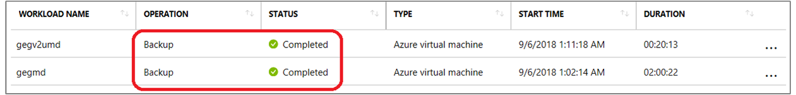

1. To monitor restore progress, select any restore job with a status of **In-progress**. This displays the progress bar, which displays information about the restore progress:

    - **Estimated time of restore**: Initially provides the time taken to complete the restore operation. As the operation progresses, the time taken reduces and reaches zero when the restore operation finishes.
    - **Percentage of restore**. Shows the percentage of restore operation that's done.
    - **Number of bytes transferred**: If you're restoring by creating a new VM, it shows the bytes that were transferred against the total number of bytes to be transferred.

## Post-restore steps

There are a few things to note after restoring a VM:

- Extensions present during the backup configuration are installed, but not enabled. If you see an issue, reinstall the extensions. In the case of disk replacement, reinstallation of extensions is not required.
- If the backed-up VM had a static IP address, the restored VM will have a dynamic IP address to avoid conflict. You can [add a static IP address to the restored VM](/powershell/module/az.network/set-aznetworkinterfaceipconfig#description).
- A restored VM doesn't have an availability set. If you use the restore disk option, then you can [specify an availability set](../virtual-machines/windows/tutorial-availability-sets.md) when you create a VM from the disk using the provided template or PowerShell.
- If you use a cloud-init-based Linux distribution, such as Ubuntu, for security reasons the password is blocked after the restore. Use the `VMAccess` extension on the restored VM to [reset the password](/troubleshoot/azure/virtual-machines/reset-password). We recommend using SSH keys on these distributions, so you don't need to reset the password after the restore.
- If you're unable to access a VM once restored because the VM has a broken relationship with the domain controller, then follow the steps below to bring up the VM:
  - Attach OS disk as a data disk to a recovered VM.
  - Manually install VM agent if Azure Agent is found to be unresponsive by following this [link](/troubleshoot/azure/virtual-machines/install-vm-agent-offline).
  - Enable Serial Console access on VM to allow command-line access to VM

  ```cmd
    bcdedit /store <drive letter>:\boot\bcd /enum
    bcdedit /store <VOLUME LETTER WHERE THE BCD FOLDER IS>:\boot\bcd /set {bootmgr} displaybootmenu yes
    bcdedit /store <VOLUME LETTER WHERE THE BCD FOLDER IS>:\boot\bcd /set {bootmgr} timeout 5
    bcdedit /store <VOLUME LETTER WHERE THE BCD FOLDER IS>:\boot\bcd /set {bootmgr} bootems yes
    bcdedit /store <VOLUME LETTER WHERE THE BCD FOLDER IS>:\boot\bcd /ems {<<BOOT LOADER IDENTIFIER>>} ON
    bcdedit /store <VOLUME LETTER WHERE THE BCD FOLDER IS>:\boot\bcd /emssettings EMSPORT:1 EMSBAUDRATE:115200
    ```

  - When the VM is rebuilt use Azure portal to reset local administrator account and password
  - Use Serial console access and CMD to disjoin VM from domain

    ```cmd
    cmd /c "netdom remove <<MachineName>> /domain:<<DomainName>> /userD:<<DomainAdminhere>> /passwordD:<<PasswordHere>> /reboot:10 /Force"
    ```

- Once the VM is disjoined and restarted, you'll be able to successfully RDP to the VM with local admin credentials and rejoin VM back to domain successfully.

## Backing up restored VMs

- If you restored a VM to the same resource group with the same name as the originally backed-up VM, backup continues on the VM after restore.
- If you restored the VM to a different resource group or you specified a different name for the restored VM, you need to set up backup for the restored VM.

## Next steps

- If you experience difficulties during the restore process, [review](backup-azure-vms-troubleshoot.md#restore) common issues and errors.
- After the VM is restored, learn about [managing virtual machines](backup-azure-manage-vms.md)
