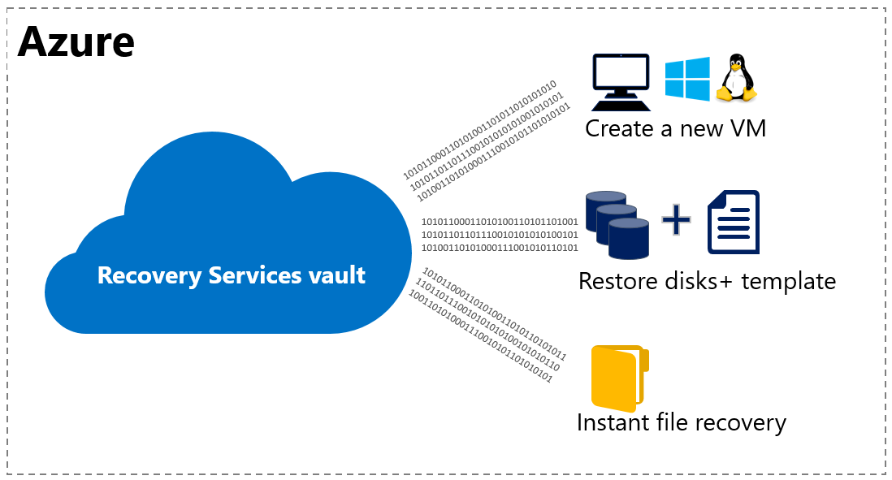
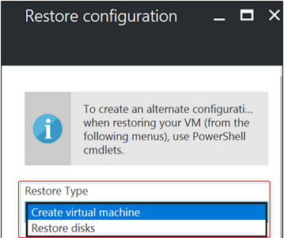
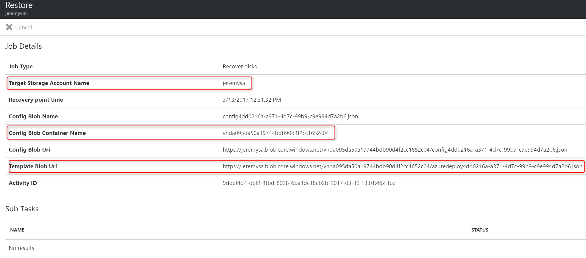
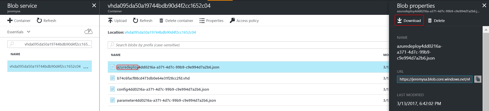
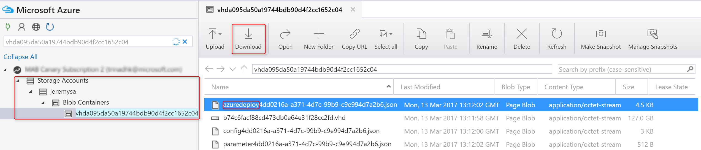
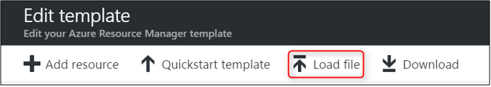
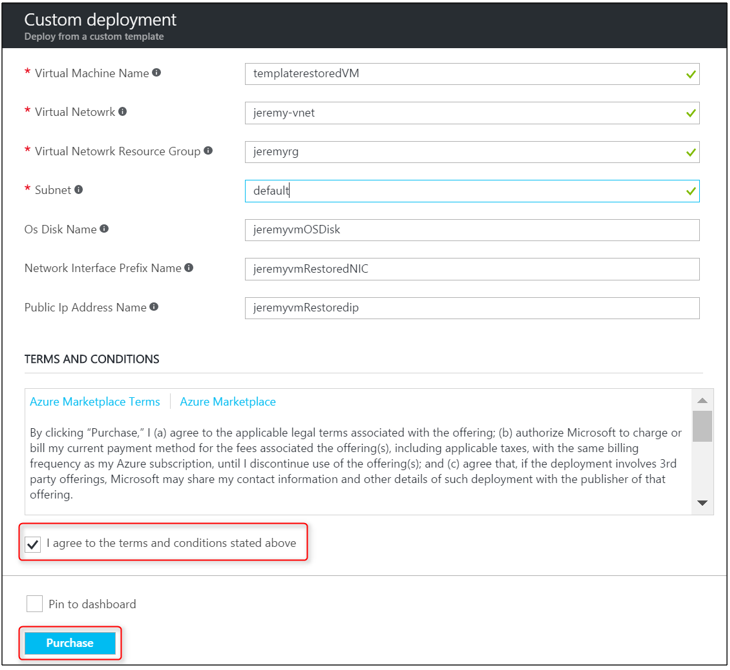

# Use Azure portal to restore virtual machines
> [!div class="op_single_selector"]
> * [Restore VMs in Classic portal](backup-azure-restore-vms.md)
> * [Restore VMs in Azure portal](backup-azure-arm-restore-vms.md)
>
>

Protect your data by taking snapshots of your data at defined intervals. These snapshots are known as recovery points, and they are stored in recovery services vaults. If or when it is necessary to repair or rebuild a VM, you can restore the VM from any of the saved recovery points. When you restore a recovery point, you can create a new VM which is a point-in-time representation of your backed-up VM, or restore disks and use the template that comes along with it to customize the restored VM or do an individual file recovery. This article explains how to restore a VM to a new VM or restore all backed-up disks. For individual file recovery, refer to [Recover files from Azure VM backup](backup-azure-restore-files-from-vm.md)

> [!NOTE]
> Azure has two deployment models for creating and working with resources: [Resource Manager and classic](../azure-resource-manager/resource-manager-deployment-model.md). This article provides the information and procedures for restoring VMs deployed using the Resource Manager model.
>
>

Restoring a VM or all disks from VM backup involves two steps:

1. Select a restore point for restore
2. Selecting the restore type - create a new VM or restore disks and specify required parameters. 

## Select restore point for restore
1. Sign in to the [Azure portal](http://portal.azure.com/)
2. On the Azure menu, click **Browse** and in the list of services, type **Recovery Services**. The list of services adjusts to what you type. When you see **Recovery Services vaults**, select it.

    

    The list of vaults in the subscription is displayed.

    
3. From the list, select the vault associated with the VM you want to restore. When you click the vault, its dashboard opens.

    
4. Now that you're in the vault dashboard. On the **Backup Items** tile, click **Azure Virtual Machines** to display the VMs associated with the vault.

    

    The **Backup Items** blade opens and displays the list of Azure virtual machines.

    
5. From the list, select a VM to open the dashboard. The VM dashboard opens to the Monitoring area, which contains the Restore points tile.

    
6. On the VM dashboard menu, click **Restore**

    

    The Restore blade opens.

    
7. On the **Restore** blade, click **Restore point** to open the **Select Restore point** blade.

    

    By default, the dialog displays all restore points from the last 30 days. Use the **Filter** to alter the time range of the restore points displayed. By default, restore points of all consistency are displayed. Modify **All Restore points** filter to select a specific consistency of restore points. For more information about each type of restoration point, see the explanation of [Data consistency](backup-azure-vms-introduction.md#data-consistency).  

   * **Restore point consistency** from this list choose:
     * Crash consistent restore points,
     * Application consistent restore points,
     * File system consistent restore points
     * All restore points.  
8. Choose a Restore point and click **OK**.

    

    The **Restore** blade shows the Restore point is set.

    
9. On the **Restore** blade, **Restore configuration** opens automatically after restore point is set.

## Choosing a VM restore configuration
Now that you have selected the restore point, choose a configuration for your restore VM. Your choices for configuring the restored VM are to use: Azure portal or PowerShell.

1. If you are not already there, go to the **Restore** blade. Ensure a [Restore point has been selected](#select-restore-point-for-restore), and click **Restore configuration** to open the **Recovery configuration** blade.

    
2. On the **Restore configuration** blade, you have two choices:
   * Restore full virtual machine
   * Restore backed up disks

Portal provides a Quick Create option for restored VM. If you want to customize the VM configuration or names of the resources created as part of create a new VM choice, use PowerShell or portal to restore backed up disks and use PowerShell commands to attach them to choice of VM configuration or use template that comes with restore disks to customize the restored VM. See [Restoring a VM with special network configurations](#restoring-vms-with-special-network-configurations) for details on how to restore VM which has multiple NICs or under load balancer. If your Windows VM uses [HUB licensing](../virtual-machines/windows/hybrid-use-benefit-licensing.md), you need to restore disks and use PowerShell/Template as specified below to create the VM and make sure that you specify LicenseType as "Windows_Server" while creating VM to avail HUB benefits on restored VM. 
 
## Create a new VM from restore point
If you are not already there, [select a restore point](#restoring-vms-with-special-network-configurations) before proceeding to creating a new VM from restore point. Once restore point is selected, on the **Restore configuration** blade, enter or select values for each of the following fields:

* **Restore Type** - Create virtual machine.
* **Virtual machine name** - Provide a name for the VM. The name must be unique to the resource group (for a Resource Manager-deployed VM) or cloud service (for a Classic VM). You cannot replace the virtual machine if it already exists in the subscription.
* **Resource group** - Use an existing resource group, or create a new one. If you are restoring a Classic VM, use this field to specify the name of a new cloud service. If you are creating a new resource group/cloud service, the name must be globally unique. Typically, the cloud service name is associated with a public-facing URL - for example: [cloudservice].cloudapp.net. If you attempt to use a name for the cloud resource group/cloud service that has already been used, Azure assigns the resource group/cloud service the same name as the VM. Azure displays resource groups/cloud services and VMs not associated with any affinity groups. For more information, see [How to migrate from Affinity Groups to a Regional Virtual Network (VNet)](../virtual-network/virtual-networks-migrate-to-regional-vnet.md).
* **Virtual Network** - Select the virtual network (VNET) when creating the VM. The field provides all VNETs associated with the subscription. Resource group of the VM is displayed in parentheses.
* **Subnet** - If the VNET has subnets, the first subnet is selected by default. If there are additional subnets, select the desired subnet.
* **Storage account** - This menu lists the storage accounts in the same location as the Recovery Services vault. Storage accounts that are Zone redundant are not supported. If there are no storage accounts with the same location as the Recovery Services vault, you must create one before starting the restore operation. The storage account's replication type is mentioned in parentheses.

> [!NOTE]
> 1. If you are restoring a Resource Manager-deployed VM, you must identify a virtual network (VNET). A virtual network (VNET) is optional for a Classic VM.
> 2. If you are restoring VMs with managed disks, make sure that storage account selected is not enabled for Storage Service Encryption(SSE) in its lifetime.
> 3. Based on the storage type of storage account selected(premium or standard), all disks restored will be either premium or standard disks. We currently don't support mixed mode of disks when restoring.  
>
>

On the **Restore configuration** blade, click **OK** to finalize the restore configuration. On the **Restore** blade, click **Restore** to trigger the restore operation.

## Restore backed up disks
If you would like to customize the virtual machine you would like to create from backed up disks than what is present in restore configuration blade, select **Restore disks** as value for **Restore Type**. This choice asks for a storage account where disks from backups are copied to. When choosing a storage account, select an account that shares the same location as the Recovery Services vault. Storage accounts that are Zone redundant are not supported. If there are no storage accounts with the same location as the Recovery Services vault, you must create one before starting the restore operation. The storage account's replication type is mentioned in parentheses.

After restore operation is completed, you can:
* [Use template to customize the restored VM](#use-templates-to-customize-restore-vm)
* [Use the restored disks to attach to an existing virtual machine](../virtual-machines/windows/attach-disk-portal.md)
* [Create a new virtual machine using PowerShell from restored disks.](./backup-azure-vms-automation.md#restore-an-azure-vm)

On the **Restore configuration** blade, click **OK** to finalize the restore configuration. On the **Restore** blade, click **Restore** to trigger the restore operation.

## Track the restore operation
Once you trigger the restore operation, the Backup service creates a job for tracking the restore operation. The Backup service also creates and temporarily displays the notification in Notifications area of portal. If you do not see the notification, you can always click the Notifications icon to view your notifications.

To view the operation while it is processing, or to view when it completed, open the Backup jobs list.

1. On the Azure menu, click **Browse** and in the list of services, type **Recovery Services**. The list of services adjusts to what you type. When you see **Recovery Services vaults**, select it.

    

    The list of vaults in the subscription is displayed.

    
2. From the list, select the vault associated with the VM you restored. When you click the vault, its dashboard opens.
3. In the vault dashboard on the **Backup Jobs** tile, click **Azure Virtual Machines** to display the jobs associated with the vault.

    

    The **Backup Jobs** blade opens and displays the list of jobs.

    
    
## Use templates to customize restore vm
Once [restore disks operation is completed](#Track-the-restore-operation), you can use the template that is generated as part of restore operation to create a new VM with a configuration different from backup configuration or to customize names of resources created as create a new vm from restore point. 

> [!NOTE]
> Templates will be added as part of Restore Disks for recovery points taken after 1st March, 2017. They are applicable for non-encrypted and non-managed disk VMs. Support for encrypted VMs and Managed Disk VMs is coming in upcoming releases. 
>
>

To get the template generated as part of restore disks option,

1. Go to restore job details corresponding to the job. 
2. This will list the template uri from which you can download the template. Please note the container name from values. 

     
     
3. Note down the target storage account name, container name, template blob uri from values. Go to *target storage account > select Blobs > Containers* and go to file and download the file that starts with name *azuredeploy*.

    
    
   Alternatively, you can use [Azure Storage explorer](http://storageexplorer.com/) to go to corresponding subscription > target storage account > Blob Containers and select the container name noted in above step. On the right side pane that shows files inside the container, download the file that starts with name *azuredeploy*. 
   
   
     
Once template is downloaded, use template deployment to [edit and deploy the template](../azure-resource-manager/resource-group-template-deploy-portal.md#deploy-resources-from-custom-template) or append more customizations by [authoring a template](../azure-resource-manager/resource-group-authoring-templates.md) before you deploy. You can use Load file option to deploy the template downloaded above. 

   
   
After entering the required values, accept the *Terms and Conditions* and click on **Purchase**.

   

## Post-Restore steps
* If you are using a cloud-init based Linux distribution such as Ubuntu, for security reasons, password is blocked post restore. Please use VMAccess extension on the restored VM to [reset the password](../virtual-machines/linux/classic/reset-access.md). We recommend using SSH keys on these distributions to avoid resetting password post restore.
* Extensions present during the backup config will be installed, however they won't be enabled. Please reinstall extensions if you see any issue. 
* If the backed-up VM has static IP, post restore, restored VM will have a dynamic IP to avoid conflict when creating restored VM. Learn more on how you can [add a static IP to restored VM](../virtual-network/virtual-networks-reserved-private-ip.md#how-to-add-a-static-internal-ip-to-an-existing-vm)
* Restored VM will not have availability value set. We recommend using restore disks option and [adding availability set](../virtual-machines/windows/create-availability-set.md#use-powershell-to-create-an-availability-set) when creating a VM from PowerShell or templates using restored disks. 

## Backup for restored VMs
If you have restored VM to same Resource Group with the same name as originally backed up VM, backup continues on the VM post restore. If you have either restored VM to a different Resource group or specified a different name for restored VM, this is treated as a new VM and you need to setup backup for restored VM.

## Restoring a VM during Azure dataCenter disaster
Azure Backup allows restoring backed up VMs to the paired data center in case the primary data center where VMs are running experiences disaster and you configured Backup vault to be geo-redundant. During such scenarios, you need to select a storage account, which is present in paired data center and rest of the restore process remains same. Azure Backup uses Compute service from paired geo to create the restored virtual machine. Learn more about [Azure Data center resiliency](../resiliency/resiliency-technical-guidance-recovery-loss-azure-region.md)

## Restoring Domain Controller VMs
Backup of Domain Controller (DC) virtual machines is a supported scenario with Azure Backup. However, care must be taken during
the restore process. The correct restore process depends on the structure of the domain. In the simplest case you have a single DC in a single domain. More commonly for production loads, you will have a single domain with multiple DCs, perhaps with some DCs on premises. Finally, you may have a forest with multiple domains. 

From an Active Directory perspective the Azure VM is like any other VM on a modern supported hypervisor. The major difference with on-premises hypervisors is that there is no VM console available in Azure. A console is required for certain scenarios such as recovering using a Bare Metal Recovery (BMR) type backup. However, VM restore from the backup vault is a full replacement for BMR. Active Directory Restore Mode (DSRM) is also available, so all Active Directory recovery scenarios are viable. For more background information, please check [Backup and Restore considerations for virtualized Domain Controllers](https://technet.microsoft.com/en-us/library/virtual_active_directory_domain_controller_virtualization_hyperv(v=ws.10).aspx#backup_and_restore_considerations_for_virtualized_domain_controllers) and [Planning for Active Directory Forest Recovery](https://technet.microsoft.com/en-us/library/planning-active-directory-forest-recovery(v=ws.10).aspx).

### Single DC in a single domain
The VM can be restored (like any other VM) from the Azure portal or using PowerShell.

### Multiple DCs in a single domain
When other DCs of the same domain can be reached over the network, the DC can be restored like any VM. If it is the last remaining DC in the domain, or a recovery in an isolated network is performed, a forest recovery procedure must be followed.

### Multiple domains in one forest
When other DCs of the same domain can be reached over the network, the DC can be restored like any VM. However, in all other cases a forest recovery is recommended.

## Restoring VMs with special network configurations
It is possible to back up and restore VMs with the following special network configurations. However, these configurations require some special consideration while going through the restore process.

* VMs under load balancer (internal and external)
* VMs with multiple reserved IPs
* VMs with multiple NICs

> [!IMPORTANT]
> When creating the special network configuration for VMs, you must use PowerShell to create VMs from the disks restored.
>
>

To fully recreate the virtual machines after restoring to disk, follow these steps:

1. Restore the disks from a recovery services vault using [PowerShell](backup-azure-vms-automation.md#restore-an-azure-vm)
2. Create the VM configuration required for load balancer/multiple NIC/multiple reserved IP using the PowerShell cmdlets and use it to create the VM of desired configuration.

   * Create VM in cloud service with [Internal Load balancer ](https://azure.microsoft.com/documentation/articles/load-balancer-internal-getstarted/)
   * Create VM to connect to [Internet facing load balancer](https://azure.microsoft.com/en-us/documentation/articles/load-balancer-internet-getstarted/)
   * Create VM with [multiple NICs](https://azure.microsoft.com/documentation/articles/virtual-networks-multiple-nics/)
   * Create VM with [multiple reserved IPs](https://azure.microsoft.com/documentation/articles/virtual-networks-reserved-public-ip/)

## Next steps
Now that you can restore your VMs, see the troubleshooting article for information on common errors with VMs. Also, check out the article on managing tasks with your VMs.

* [Troubleshooting errors](backup-azure-vms-troubleshoot.md#restore)
* [Manage virtual machines](backup-azure-manage-vms.md)
