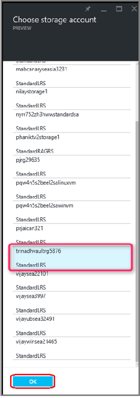
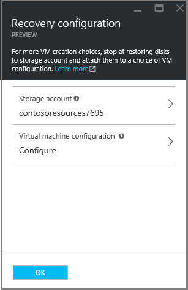
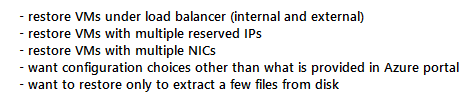
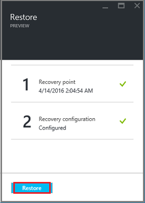
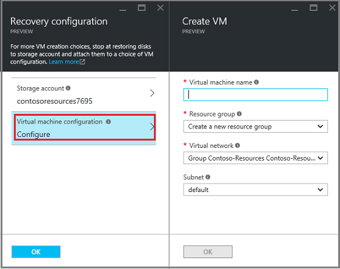
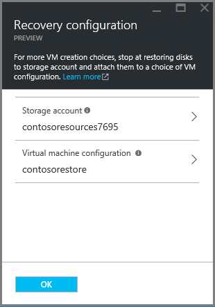
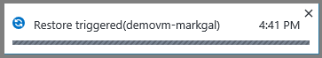
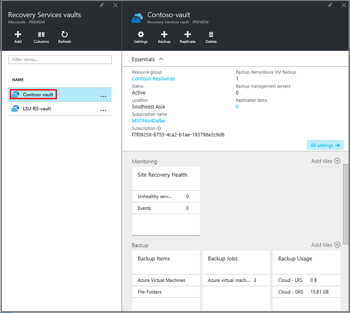

<properties
	pageTitle="Restore virtual machines from backup using Azure portal | Microsoft Azure"
	description="Restore an Azure virtual machine from a recovery point using Azure portal"
	services="backup"
	documentationCenter=""
	authors="markgalioto"
	manager="jwhit"
	editor=""
	keywords="restore backup; how to restore; recovery point;"/>

<tags
	ms.service="backup"
	ms.workload="storage-backup-recovery"
	ms.tgt_pltfrm="na"
	ms.devlang="na"
	ms.topic="article"
	ms.date="04/19/2016"
	ms.author="trinadhk; jimpark;"/>

# Use Azure portal to restore virtual machines

> [AZURE.SELECTOR]
- [Restore VMs in Classic portal](backup-azure-restore-vms.md)
- [Restore VMs in Azure portal](backup-azure-arm-restore-vms.md)

You protect your data with the Backup service by taking snapshots of your data at defined intervals. These snapshots are known as recovery points, and they are stored in recovery services vaults. If or when it is necessary to repair or rebuild a VM, you can restore the VM from any of the saved recovery points. When you restore a recovery point, you return or revert the VM to the state when the recovery point was taken. This article explains how to restore a VM.

> [AZURE.NOTE] Azure has two deployment models for creating and working with resources: [Resource Manager and classic](../resource-manager-deployment-model.md). This article provides the information and procedures for restoring VMs deployed using the Resource Manager model.

## Restore a recovery point

1. Sign in to the [Azure portal](http://ms.portal.azure.com/)

2. On the Azure menu, click **Browse** and in the list of services, type **Recovery Services**. The list of services adjusts to what you type. When you see **Recovery Services vaults**, select it.

    

    The list of vaults in the subscription is displayed.

    

3. From the list, select the vault associated with the VM you want to restore. When you click the vault, its dashboard opens.

    

4. Now that you're in the vault dashboard. On the **Backup Items** tile, click **Azure Virtual Machines** to display the VMs associated with the vault.

    

    The **Backup Items** blade opens and displays the list of Azure virtual machines.

    

5. From the list, select a VM to open the dashboard.

    

    The VM dashboard opens to the Monitoring area which contains the Recovery points tile.

    

6. On the VM dashboard menu, click **Restore**

    

    The Restore blade opens.

    

7. On the **Restore** blade, click **Recovery point** to open the **Select Recovery point** blade.

    

    By default, the dialog displays all recovery points from the last 30 days. Edit the **Period**, **Year**, and **Restore point consistency** lists as you like. For more information about each type of restoration point, see the explanation of [Data consistency](./backup-azure-vms-introduction.md#data-consistency).  
    - **Period** is the months of the year, or the last 30 days.
    - **Year** is the specific year.
    - **Restore point consistency** from this list choose:
        - Crash consistent restore points,
        - Application consistent restore points,
        - File system consistent restore points
        - All restore points.  

8. Choose a Recovery point and click **OK**.

    

    The **Restore** blade shows the Recovery point is set.

    

9. On the **Restore** blade, click **Recovery configuration** to open its blade.

    

## Choosing a VM recovery configuration

Now that you have selected the recovery point, choose a storage account and the method for configuring your recovery VM. Your choices for configuring the recovery VM are to use: Azure portal or PowerShell. When choosing a storage account, you must choose from accounts that share the same location as the Recovery Services vault. Storage accounts that are Zone redundant are not supported. If there are no storage accounts with the same location as the Recovery Services vault, you must create one before starting the restore operation.

1. If you are not already there, go to the **Restore** blade. Ensure a **Recovery point** has been selected, and click **Recovery configuration** to open the **Recovery configuration** blade.

    

2. On the **Recovery configuration** blade, click **Storage account** to open the list of storage accounts in the same location as the Recovery Services vault.

3. From the list, choose a storage account, and click OK.

    

    In the **Recovery configuration** blade, the chosen storage account appears in the **Storage account** dialog.

    

4. You can configure a basic ARM or Classic VM when restoring a VM in the portal. If you want to restore a complex configuration - like one of the options in the following list, you must use PowerShell to configure your VM from disk. If you are not configuring a complex configuration, skip to step 5.

    

    If the restore configuration *is* considered to be complex, then on the **Recovery Configuration** blade, click **OK**. The **Recovery configuration** blade closes and a checkmark appears next to Recovery configuration. Click **Restore** to start the disk restoration job. Do not continue to step 5; instead proceed to [Restoring a VM with special network configurations](#restoring-vms-with-special-network-configurations).

    

5. On the **Recovery configuration** blade, click **Virtual machine configuration** to open the **Create VM** blade.

    

6. On the **Create VM** blade, enter or select values for each of the following fields:

    - **Virtual machine name** - Provide a name for the VM. The name must be unique to the resource group (for an ARM VM) or cloud service (for a Classic VM). If you are replacing an existing VM with the same name, first delete the existing VM and data disks, then restore the data from Azure Backup.
    - **Resource group** - Use an existing resource group, or create a new one. If you are restoring a Classic VM, use this field to specify the name of a new cloud service. When creating a new resource group/cloud service, the name must be globally unique. Typically, the cloud service name is associated with a public-facing URL - for example: [cloudservice].cloudapp.net. If you attempt to use a name for the cloud resource group/cloud service that has already been used, Azure assigns the resource group/cloud service the same name as the VM. Azure displays resource groups/cloud services and VMs not associated with any affinity groups. For more information, see [How to migrate from Affinity Groups to a Regional Virtual Network (VNet)](../virtual-network/virtual-networks-migrate-to-regional-vnet.md).
    - **Virtual Network** - Select the virtual network (VNET) when creating the VM. The field provides all VNETs associated with the subscription.

    > [AZURE.NOTE] You must select a VNET when restoring an ARM-based VM. A VNET is optional for a Classic VM.

    - **Subnet** - If the VNET has subnets, the first subnet is selected by default. If there are additional subnets, select the desired subnet.

7. On the **Create VM** blade, click **OK** to complete the configuration.

    The **Create VM** blade closes, and the **Recovery configuration** blade shows the name of the new VM.

    

8. On the **Recovery configuration** blade, click **OK** to finalize the restore configuration.

9. On the **Restore** blade, click **Restore** to trigger the restore operation.

    

## Track the restore operation

Once you trigger the restore operation, the Backup service creates a job for tracking the restore operation. The Backup service also creates and temporarily displays the notification.

If you do not see the notification, you can always click the Notifications icon to view your notifications.

To view the operation while it is processing, or to view when it completed, open the Backup jobs list.

1. On the Azure menu, click **Browse** and in the list of services, type **Recovery Services**. The list of services adjusts to what you type. When you see **Recovery Services vaults**, select it.

    

    The list of vaults in the subscription is displayed.

    

2. From the list, select the vault associated with the VM you restored. When you click the vault, its dashboard opens.

    

3. In the vault dashboard on the **Backup Jobs** tile, click **Azure Virtual Machines** to display the jobs associated with the vault.

    

    The **Backup Jobs** blade opens and displays the list of jobs.

    

## Restoring VMs with special network configurations
It is possible to backup and restore VMs with the following special network configurations. However, these configurations require some special consideration while going through the restore process.

- VMs under load balancer (internal and external)
- VMs with multiple reserved IPs
- VMs with multiple NICs

>[AZURE.IMPORTANT] When creating the special network configuration for VMs, you must use PowerShell to create VMs from the disks restored. 

In order to fully recreate the virtual machines after restoring to disk, follow these steps:

1. Restore the disks from a recovery services vault using steps 1-4 mentioned in [Choosing a VM recovery configuration](#Choosing-a-VM-recovery-configuration).

2. Create the VM configuration required for load balancer/multiple NIC/multiple reserved IP using the PowerShell cmdlets and use it to create the VM of desired configuration.
	- Create VM in cloud service with [Internal Load balancer ](https://azure.microsoft.com/documentation/articles/load-balancer-internal-getstarted/)
	- Create VM to connect to [Internet facing load balancer] (https://azure.microsoft.com/en-us/documentation/articles/load-balancer-internet-getstarted/)
	- Create VM with [multiple NICs](https://azure.microsoft.com/documentation/articles/virtual-networks-multiple-nics/)
	- Create VM with [multiple reserved IPs](https://azure.microsoft.com/documentation/articles/virtual-networks-reserved-public-ip/)

## Next steps
Now that you can restore your VMs, see the troubleshooting article for information on common errors with VMs. Also, check out the article on managing tasks with your VMs.

- [Troubleshooting errors](backup-azure-vms-troubleshoot.md#restore)
- [Manage virtual machines](backup-azure-manage-vms.md)
