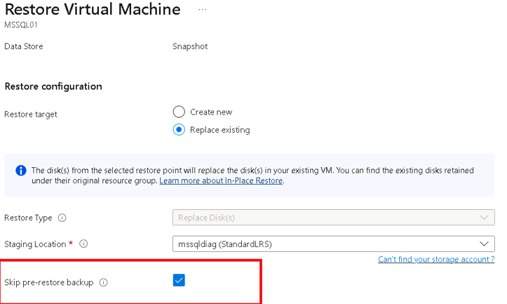

# Restore Azure VMs

This article describes how to restore Azure VM data from the recovery points stored in [Azure Backup](backup-overview.md) Recovery Services vaults.

## Restore options

Azure Backup provides a number of ways to restore a VM.

**Restore option** | **Details**
--- | ---
**Create a new VM** | Quickly creates and gets a basic VM up and running from a restore point.   You can specify a name for the VM, select the resource group and virtual network (VNet) in which it will be placed, and specify a storage account for the restored VM.
**Restore disk** | Restores a VM disk which can then be used to create a new VM.   Azure Backup provides a template to help you customize and create a VM.    The restore job generates a template that you can download and use to specify custom VM settings, and create a VM.   The disks are copied to the storage account you specify.   Alternatively, you can attach the disk to an existing VM, or create a new VM using PowerShell.   This option is useful if you want to customize the VM, add configuration settings that weren't there at the time of backup, or add settings that must be configured using the template or PowerShell.
**Replace existing** | You can restore a disk, and use it to replace a disk on the existing VM.   The current VM must exist. If it's been deleted this option can't be used.   Azure Backup takes a snapshot of the existing VM before replacing the disk, and stores it in the staging location you specify. Existing disks connected to the VM are replaced with the selected restore point.   The snapshot is copied to the vault, and retained in accordance with the retention policy.    Replace existing is supported for unencrypted managed VMs. It's not supported for unmanaged disks, [generalized VMs](https://docs.microsoft.com/azure/virtual-machines/windows/capture-image-resource), or for VMs [created using custom images](https://azure.microsoft.com/resources/videos/create-a-custom-virtual-machine-image-in-azure-resource-manager-with-powershell/).   If the restore point has more or less disks than the current VM, then the number of disks in the restore point will only reflect the VM configuration.  

> [!NOTE]
> You can also recover specific files and folders on an Azure VM. [Learn more](backup-azure-restore-files-from-vm.md).
>
> If you're running the [latest version](backup-instant-restore-capability.md) of Azure Backup for Azure VMs (known as Instant Restore), snapshots are kept for up to seven days, and you can restore a VM from snapshots before the backup data is sent to the vault. If you want to restore a VM from a backup from the last seven days, it's quicker to restore from the snapshot and not from the vault.

## Storage accounts

Some details about storage accounts:

- **Create VM**: When you create a new VM, the VM will be placed in the storage account you specify.
- **Restore disk**: When you restore a disk, the disk is copied to the storage account you specify. The restore job generates a template that you can download and use to specify custom VM settings. This template is placed in the specified storage account.
- **Replace disk**: When you replace a disk on an existing VM, Azure Backup takes a snapshot of the existing VM before replacing the disk. The snapshot is stored in the staging location (storage account) you specify. This storage account is used to temporarily store the snapshot during the restore process, and we recommend that you create a new account to do this, that can be easily removed afterwards.
- **Storage account location** : The storage account must be in the same region as the vault. Only these accounts are displayed. If there are no storage accounts in the location, you need to create one.
- **Storage type** : Blob storage isn't supported.
- **Storage redundancy**: Zone redundant storage (ZRS) isn't supported. The replication and redundancy information for the account is shown in parentheses after the account name. 
- **Premium storage**:
    - When restoring non-premium VMs, premium storage accounts aren't supported.
    - When restoring managed VMs, premium storage accounts configured with network rules aren't supported.

## Before you start

To restore a VM (create a new VM) make sure you have the correct role-based access control (RBAC) [permissions](backup-rbac-rs-vault.md#mapping-backup-built-in-roles-to-backup-management-actions) for the Restore VM operation.

If you don't have permissions, you can [restore a disk](#restore-disks), and then after the disk is restored, you can [use the template](#use-templates-to-customize-a-restored-vm) that was generated as part of the restore operation to create a new VM.

## Select a restore point

1. In the vault associated with the VM you want to restore, click **Backup items** > **Azure Virtual Machine**.
2. Click a VM. By default on the VM dashboard, recovery points from the last 30 days are displayed. You can display recovery points older than 30 days, or filter to find recovery points based on dates, time ranges, and different types of snapshot consistency.
3. To restore the VM, click **Restore VM**.

    

4. Select a restore point to use for the recovery.

## Choose a VM restore configuration

1. In **Restore configuration**, select a restore option:
    - **Create new**: Use this option if you want to create a new VM. You can create a VM with simple settings, or restore a disk and create a customized VM.
    - **Replace existing**: Use this option if you want to replace disks on an existing VM.

        

2. Specify settings for your selected restore option.

## Create a VM

As one of the [restore options](#restore-options), you can create a VM quickly with basic settings from a restore point.

1. In **Restore configuration** > **Create new** > **Restore Type**, select **Create a virtual machine**.
2. In **Virtual machine name**, specify a VM which doesn’t exist in the subscription.
3. In **Resource group**, select an existing resource group for the new VM, or create a new one with a globally unique name. If you assign a name that already exists, Azure assigns the group the same name as the VM.
4. In **Virtual network**, select the VNet in which the VM will be placed. All VNets associated with the subscription are displayed. Select the subnet. The first subnet is selected by default.
5. In **Storage Location**, specify the storage account for the VM. [Learn more](#storage-accounts).

    

6. In **Restore configuration**, select **OK**. In **Restore**, click **Restore** to trigger the restore operation.

## Restore disks

As one of the [restore options](#restore-options), you can create a disk from a restore point. Then with the disk, you can do one of the following:

- Use the template that is generated during the restore operation to customize settings, and trigger VM deployment. You edit the default template settings, and submit the template for VM deployment.
- [Attach restored disks](https://docs.microsoft.com/azure/virtual-machines/windows/attach-managed-disk-portal) to an existing VM.
- [Create a new VM](https://docs.microsoft.com/azure/backup/backup-azure-vms-automation#create-a-vm-from-restored-disks) from the restored disks using PowerShell.

1. In **Restore configuration** > **Create new** > **Restore Type**, select **Restore disks**.
2. In **Resource group**, select an existing resource group for the restored disks, or create a new one with a globally unique name.
3. In **Storage account**, specify the account to which to copy the VHDs. [Learn more](#storage-accounts).

    

4. In **Restore configuration**, select **OK**. In **Restore**, click **Restore** to trigger the restore operation.

During the VM restore, Azure Backup doesn’t use storage account. But in case of **Restore disks** and **Instant Restore**, storage account is used for storing template.

### Use templates to customize a restored VM

After the disk is restored, use the template that was generated as part of the restore operation to customize and create a new VM:

1. Open **Restore Job Details** for the relevant job.

2. In **Restore Job Details**, select **Deploy Template** to initiate template deployment.

    

3. To customize the VM setting provided in the template, click **Edit template**. If you want to add more customizations, click **Edit parameters**.
    - [Learn more](../azure-resource-manager/resource-group-template-deploy-portal.md#deploy-resources-from-custom-template) about deploying resources from a custom template.
    - [Learn more](../azure-resource-manager/resource-group-authoring-templates.md) about authoring templates.

   

4. Enter the custom values for the VM, accept the **Terms and Conditions** and click **Purchase**.

   

## Replace existing disks

As one of the [restore options](#restore-options), you can replace an existing VM disk with the selected restore point. [Review](#restore-options) all restore options.

1. In **Restore configuration**, click **Replace existing**.
2. In **Restore Type**, select **Replace disk/s**. This is the restore point that will be used replace existing VM disks.
3. In **Staging Location**, specify where snapshots of the current managed disks should be saved during the restore process. [Learn more](#storage-accounts).

   

## Restore VMs with special configurations

There are a number of common scenarios in which you might need to restore VMs.

**Scenario** | **Guidance**
--- | ---
**Restore VMs using Hybrid Use Benefit** | If a Windows VM uses [Hybrid Use Benefit (HUB) licensing](../virtual-machines/windows/hybrid-use-benefit-licensing.md), restore the disks, and create a new VM using the provided template (with **License Type** set to **Windows_Server**), or PowerShell.  This setting can also be applied after creating the VM.
**Restore VMs during an Azure datacenter disaster** | If the vault uses GRS and the primary datacenter for the VM goes down, Azure Backup supports restoring backed-up VMs to the paired datacenter. You select a storage account in the paired datacenter, and restore as normal. Azure Backup uses the compute service in the paired location to create the restored VM. [Learn more](../resiliency/resiliency-technical-guidance-recovery-loss-azure-region.md) about datacenter resiliency.
**Restore single domain controller VM in single domain** | Restore the VM like any other VM. Note that:   From an Active Directory perspective, the Azure VM is like any other VM.   Directory Services Restore Mode (DSRM) is also available, so all Active Directory recovery scenarios are viable. [Learn more](https://docs.microsoft.com/windows-server/identity/ad-ds/get-started/virtual-dc/virtualized-domain-controllers-hyper-v) about backup and restore considerations for virtualized domain controllers.
**Restore multiple domain controller VMs in single domain** | If other domain controllers in the same domain can be reached over the network, the domain controller can be restored like any VM. If it's the last remaining domain controller in the domain, or a recovery in an isolated network is performed, use a [forest recovery](https://docs.microsoft.com/windows-server/identity/ad-ds/manage/ad-forest-recovery-single-domain-in-multidomain-recovery).
**Restore multiple domains in one forest** | We recommend a [forest recovery](https://docs.microsoft.com/windows-server/identity/ad-ds/manage/ad-forest-recovery-single-domain-in-multidomain-recovery).
**Bare-metal restore** | The major difference between Azure VMs and on-premises hypervisors is that there's no VM console available in Azure. A console is required for certain scenarios, such as recovering by using a bare-metal recovery (BMR)-type backup. However, VM restore from the vault is a full replacement for BMR.
**Restore VMs with special network configurations** | Special network configurations include VMs using internal or external load balancing, using multiple NICS, or multiple reserved IP addresses. You restore these VMs by using the [restore disk option](#restore-disks). This option makes a copy of the VHDs into the specified storage account, and you can then create a VM with an [internal](https://azure.microsoft.com/documentation/articles/load-balancer-internal-getstarted/) or [external](https://azure.microsoft.com/documentation/articles/load-balancer-internet-getstarted/) load balancer, [multiple NICS](../virtual-machines/windows/multiple-nics.md), or [multiple reserved IP addresses](../virtual-network/virtual-network-multiple-ip-addresses-powershell.md), in accordance with your configuration.
**Network Security Group (NSG) on NIC/Subnet** | Azure VM backup supports Backup and Restore of NSG information at vnet, subnet, and NIC level.
**Zone Pinned VMs** | Azure Backup supports backup and restore of zoned pinned VMs. [Learn more](https://azure.microsoft.com/global-infrastructure/availability-zones/)

## Track the restore operation
After you trigger the restore operation, the backup service creates a job for tracking. Azure Backup displays notifications about the job in the portal. If they aren't visible, click on the **Notifications** symbol to see them.

 Track restore as follows:

1. To view operations for the job, click the notifications hyperlink. Alternatively, in the vault, click **Backup jobs**, and then click the relevant VM.

    

2. To monitor restore progress, click any restore job with a status of **In-progress**. This displays the progress bar which displays information about the restore progress:

    - **Estimated time of restore**: Initially provides the time taken to complete the restore operation. As the operation progresses, the time taken reduces and reaches zero when the restore operation finishes.
    - **Percentage of restore**. Shows the percentage of restore operation that's done.
    - **Number of bytes transferred**: If you're restoring by creating a new VM, it shows the bytes that were transferred against the total number of bytes to be transferred.

## Post-restore steps

There are a number of things to note after restoring a VM:

- Extensions present during the backup configuration are installed, but not enabled. If you see an issue, reinstall the extensions.
- If the backed-up VM had a static IP address, the restored VM will have a dynamic IP address to avoid conflict. You can [add a static IP address to the restored VM](../virtual-network/virtual-networks-reserved-private-ip.md#how-to-add-a-static-internal-ip-to-an-existing-vm).
- A restored VM doesn't have an availability set. If you use the restore disk option, then you can [specify an availability set](../virtual-machines/windows/tutorial-availability-sets.md) when you create a VM from the disk using the provided template or PowerShell.
- If you use a cloud-init-based Linux distribution, such as Ubuntu, for security reasons the password is blocked after the restore. Use the VMAccess extension on the restored VM to [reset the password](../virtual-machines/linux/reset-password.md). We recommend using SSH keys on these distributions, so you don't need to reset the password after the restore.

## Backing up restored VMs

- If you restored a VM to the same resource group with the same name as the originally backed-up VM, backup continues on the VM after restore.
- If you restored the VM to a different resource group or you specified a different name for the restored VM, you need to set up backup for the restored VM.

## Next steps

- If you experience difficulties during the restore process, [review](backup-azure-vms-troubleshoot.md#restore) common issues and errors.
- After the VM is restored, learn about [managing virtual machines](backup-azure-manage-vms.md)
