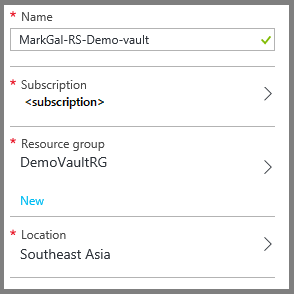

---
title: 'Azure Backup: Prepare to back up virtual machines'
description: Make sure your environment is prepared for backing up virtual machines in Azure.
services: backup
author: markgalioto
manager: carmonm
keywords: backups; backing up;
ms.service: backup
ms.topic: conceptual
ms.date: 9/10/2018
ms.author: markgal
---
# Prepare your environment to back up Resource Manager-deployed virtual machines

This article provides the steps for preparing your environment to back up an Azure Resource Manager-deployed virtual machine (VM). The steps shown in the procedures use the Azure portal. When you back up a virtual machine, the backup data or recovery points, are stored in a Recovery Services vault. Recovery Services vaults store backup data for classic and Resource Manager-deployed virtual machines.

> [!NOTE]
> Azure has two deployment models for creating and working with resources: [Resource Manager and classic](../azure-resource-manager/resource-manager-deployment-model.md).

Before you protect (or back up) a Resource Manager-deployed virtual machine, make sure these prerequisites exist:

* Create or identify a Recovery Services vault *in the same region as your virtual machine*.
* Select a scenario, define the backup policy, and define items to protect.
* Check the installation of a VM agent (extension) on the virtual machine.
* Check network connectivity.
* For Linux VMs, if you want to customize your backup environment for application-consistent backups, follow the [steps to configure pre-snapshot and post-snapshot scripts](https://docs.microsoft.com/azure/backup/backup-azure-linux-app-consistent).

If these conditions already exist in your environment, proceed to the [Back up your VMs](backup-azure-arm-vms.md) article. If you need to set up or check any of these prerequisites, this article leads you through the steps.

## Supported operating systems for backup

 * **Linux**: Azure Backup supports [a list of distributions that Azure endorses](../virtual-machines/linux/endorsed-distros.md?toc=%2fazure%2fvirtual-machines%2flinux%2ftoc.json), except CoreOS Linux. For the list of Linux operating systems that support restoring files, see [Recover files from virtual machine backup](backup-azure-restore-files-from-vm.md#for-linux-os).

    > [!NOTE]
    > Other bring-your-own-Linux distributions might work, as long as the VM agent is available on the virtual machine, and support for Python exists. However, those distributions are not supported.
    >
 * **Windows Server**, **Windows client**:  Versions older than Windows Server 2008 R2 or Windows 7, are not supported.


## Limitations when backing up and restoring a VM
Before you prepare your environment, be sure to understand these limitations:

* Backing up virtual machines with more than 32 data disks is not supported.
* Backing up virtual machines with a reserved IP address and no defined endpoint is not supported.
* Backing up Linux VMs encrypted through Linux Unified Key Setup (LUKS) encryption is not supported.
* We don't recommend backing up VMs that contain Cluster Shared Volumes (CSV) or Scale-Out File Server configuration. If done, failure of CSV writers is expected. They require involving all VMs included in the cluster configuration during a snapshot task. Azure Backup doesn't support multi-VM consistency.
* Backup data doesn't include network mounted drives attached to a VM.
* Replacing an existing virtual machine during restore is not supported. If you attempt to restore the VM when the VM exists, the restore operation fails.
* Cross-region back up and restore are not supported.
* While configuring back up, make sure the **Firewalls and virtual networks** storage account settings allow access from All networks.
* For selected networks, after you configure firewall and virtual network settings for your storage account, select **Allow trusted Microsoft services to access this storage account** as an exception to enable Azure Backup service to access the network restricted storage account. Item level recovery is not supported for network restricted storage accounts.
* You can back up virtual machines in all public regions of Azure. (See the [checklist](https://azure.microsoft.com/regions/#services) of supported regions.) If the region that you're looking for is unsupported today, it will not appear in the drop-down list during vault creation.
* Restoring a domain controller (DC) VM that is part of a multi-DC configuration is supported only through PowerShell. To learn more, see [Restoring a multi-DC domain controller](backup-azure-arm-restore-vms.md#restore-domain-controller-vms).
* Snapshot on the Write Accelerator enabled disk is not supported. This restriction blocks Azure Backup service ability to perform an application consistent snapshot of all disks of the virtual machine.
* Restoring virtual machines that have the following special network configurations is supported only through PowerShell. VMs created through the restore workflow in the UI will not have these network configurations after the restore operation is complete. To learn more, see [Restoring VMs with special network configurations](backup-azure-arm-restore-vms.md#restore-vms-with-special-network-configurations).
  * Virtual machines under load balancer configuration (internal and external)
  * Virtual machines with multiple reserved IP addresses
  * Virtual machines with multiple network adapters

  > [!NOTE]
  > Azure Backup supports [Standard SSD Managed Disks](https://azure.microsoft.com/blog/announcing-general-availability-of-standard-ssd-disks-for-azure-virtual-machine-workloads/), a new type of durable storage for Microsoft Azure virtual machines. It is supported for managed disks on [Azure VM Backup stack V2](backup-upgrade-to-vm-backup-stack-v2.md).

## Create a Recovery Services vault for a VM
A Recovery Services vault is an entity that stores the backups and recovery points that have been created over time. The Recovery Services vault also contains the backup policies that are associated with the protected virtual machines.

To create a Recovery Services vault:

1. Sign in to the [Azure portal](https://portal.azure.com/).
1. On the **Hub** menu, select **Browse**, and then type **Recovery Services**. As you begin typing, your input filters the list of resources. Select **Recovery Services vaults**.

     <br/>

    The list of Recovery Services vaults appears.
1. On the **Recovery Services vaults** menu, select **Add**.

    

    The **Recovery Services vaults** pane opens. It prompts you to provide information for **Name**, **Subscription**, **Resource group**, and **Location**.

    
1. For **Name**, enter a friendly name to identify the vault. The name needs to be unique for the Azure subscription. Type a name that contains 2 to 50 characters. It must start with a letter, and it can contain only letters, numbers, and hyphens.
1. Select **Subscription** to see the available list of subscriptions. If you're not sure which subscription to use, use the default (or suggested) subscription. There are multiple choices only if your work or school account is associated with multiple Azure subscriptions.
1. Select **Resource group** to see the available list of resource groups, or select **New** to create a new resource group. For complete information on resource groups, see [Azure Resource Manager overview](../azure-resource-manager/resource-group-overview.md).
1. Select **Location** to select the geographic region for the vault. The vault *must* be in the same region as the virtual machines that you want to protect.

   > [!IMPORTANT]
   > If you're unsure of the location in which your VM exists, close the vault creation dialog box and go to the list of virtual machines in the portal. If you have virtual machines in multiple regions, you need to create a Recovery Services vault in each region. Create the vault in the first location before going to the next location. There is no need to specify storage accounts to store the backup data. The Recovery Services vault and the Azure Backup service handle that automatically.
   >
   >

1. Select **Create**. It can take a while for the Recovery Services vault to be created. Monitor the status notifications in the upper-right area of the portal. After your vault is created, it appears in the list of Recovery Services vaults. If you don't see your vault, select **Refresh**.

    

Now that you've created your vault, learn how to set the storage replication.

## Set storage replication
The storage replication option enables you to choose between geo-redundant storage and locally redundant storage. By default, your vault has geo-redundant storage. Leave the option setting as geo-redundant storage for your primary backup. If you want a cheaper option that isn't as durable, choose locally redundant storage.

To edit the storage replication setting:

1. On the **Recovery Services vaults** pane, select your vault.
    When you select your vault, the **Settings** pane (which has the name of the vault at the top) and the vault details pane open.

   

1. On the **Settings** pane, use the vertical slider to scroll down to the **Manage** section, and select **Backup Infrastructure**. In the **General** section, select **Backup Configuration**. On the **Backup Configuration** pane, choose the storage replication option for your vault. By default, your vault has geo-redundant storage.

   

   If you're using Azure as a primary backup storage endpoint, continue using geo-redundant storage. If you're using Azure as a non-primary backup storage endpoint, choose locally redundant storage. Read more about storage options in the [Azure Storage replication overview](../storage/common/storage-redundancy.md).

1. If you changed the storage replication type, select **Save**.

After you choose the storage option for your vault, you're ready to associate the VM with the vault. To begin the association, you should discover and register the Azure virtual machines.

## Select a backup goal, set policy, and define items to protect
Before you register a virtual machine with a Recovery Services vault, run the discovery process to identify any new virtual machines added to the subscription. The discovery process queries Azure for the list of virtual machines in the subscription. If new virtual machines are found, the portal displays the cloud service name and associated region. In the Azure portal, the *scenario* is what you enter in the Recovery Services vault. *Policy* is the schedule for how often and when recovery points are taken. Policy also includes the retention range for the recovery points.

1. If you already have a Recovery Services vault open, proceed to step 2. If you don't have a Recovery Services vault open, open the [Azure portal](https://portal.azure.com/). On the **Hub** menu, select **More services**.

   a. In the list of resources, type **Recovery Services**. As you begin typing, your input filters the list. When you see **Recovery Services vaults**, select it.

       <br/>

      The list of Recovery Services vaults appears. If there are no vaults in your subscription, this list is empty.

      

   b. From the list of Recovery Services vaults, select a vault.

      The **Settings** pane and the vault dashboard for the chosen vault open.

      
1. On the vault dashboard menu, select **Backup**.

   

   The **Backup** and **Backup Goal** panes open.

1. On the **Backup Goal** pane, set **Where is your workload running?** as **Azure** and **What do you want to backup?** as **Virtual machine**. Then select **OK**.

   

   This step registers the VM extension with the vault. The **Backup Goal** pane closes, and the **Backup policy** pane opens.

   
1. On the **Backup policy** pane, select the backup policy that you want to apply to the vault.

   

   The details of the default policy are listed under the drop-down menu. If you want to create a new policy, select **Create New** from the drop-down menu. For instructions on defining a backup policy, see [Defining a backup policy](backup-azure-vms-first-look-arm.md#defining-a-backup-policy).
    Select **OK** to associate the backup policy with the vault.

   The **Backup policy** pane closes, and the **Select virtual machines** pane opens.
1. On the **Select virtual machines** pane, choose the virtual machines to associate with the specified policy and select **OK**.

   

   The selected virtual machine is validated. If you don't see the expected virtual machines, check that the virtual machines are in the same Azure region as the Recovery Services vault. If you still don't see the virtual machines, check that they are not already protected with another vault. The vault dashboard shows the region where the Recovery Services vault exists.

1. Now that you have defined all settings for the vault, on the **Backup** pane, select **Enable backup**. This step deploys the policy to the vault and the VMs. This step does not create the initial recovery point for the virtual machine.

   

After you successfully enable the backup, your backup policy will run on schedule. If you want to generate an on-demand backup job to back up the virtual machines now, see [Triggering the backup job](./backup-azure-vms-first-look-arm.md#initial-backup).

If you have problems registering the virtual machine, see the following information on installing the VM agent and on network connectivity. You probably don't need the following information if you are protecting virtual machines created in Azure. But if you migrated your virtual machines to Azure, be sure that you properly installed the VM agent and that your virtual machine can communicate with the virtual network.

## Install the VM agent on the virtual machine
For the Backup extension to work, the Azure [VM agent](../virtual-machines/extensions/agent-windows.md) must be installed on the Azure virtual machine. If your VM was created from the Azure Marketplace, the VM agent is already present on the virtual machine.

The following information is provided for situations where you are *not* using a VM created from the Azure Marketplace. **For example, you migrated a VM from an on-premises datacenter. In such a case, the VM agent needs to be installed in order to protect the virtual machine.**

**Note**: After installing the VM agent, you must also use Azure PowerShell to update the ProvisionGuestAgent property so Azure knows the VM has the agent installed.

If you have problems backing up the Azure VM, use the following table to check that the Azure VM agent is correctly installed on the virtual machine. The table provides additional information about the VM agent for Windows and Linux VMs.

| **Operation** | **Windows** | **Linux** |
| --- | --- | --- |
| Installing the VM Agent |Download and install the [agent MSI](http://go.microsoft.com/fwlink/?LinkID=394789&clcid=0x409). You will need Administrator privileges to complete the installation. |<li> Install the latest [Linux agent](../virtual-machines/extensions/agent-linux.md). You will need Administrator privileges to complete the installation. We recommend installing agent from your distribution repository. We **do not recommend** installing Linux VM agent directly from github.  |
| Updating the VM Agent |Updating the VM Agent is as simple as reinstalling the [VM Agent binaries](http://go.microsoft.com/fwlink/?LinkID=394789&clcid=0x409). <br>Ensure that no backup operation is running while the VM agent is being updated. |Follow the instructions on [updating the Linux VM Agent](../virtual-machines/linux/update-agent.md?toc=%2fazure%2fvirtual-machines%2flinux%2ftoc.json). We recommend updating agent from your distribution repository. We **do not recommend** updating Linux VM agent directly from github.<br>Ensure that no backup operation is running while the VM Agent is being updated. |
| Validating the VM Agent installation |<li>Navigate to the *C:\WindowsAzure\Packages* folder in the Azure VM. <li>You should find the WaAppAgent.exe file present.<li> Right-click the file, go to **Properties**, and then select the **Details** tab. The Product Version field should be 2.6.1198.718 or higher. |N/A |

### Backup extension
After the VM agent is installed on the virtual machine, the Azure Backup service installs the backup extension to the VM agent. The Backup service seamlessly upgrades and patches the backup extension.

The Backup service installs the backup extension whether or not the VM is running. A running VM provides the greatest chance of getting an application-consistent recovery point. However, the Backup service continues to back up the VM even if it is turned off and the extension could not be installed. This is known as *offline VM*. In this case, the recovery point will be *crash consistent*.

## Establish network connectivity
To manage the VM snapshots, the backup extension needs connectivity to the Azure public IP addresses. Without the right internet connectivity, the virtual machine's HTTP requests time out and the backup operation fails. If your deployment has access restrictions in place--through a network security group (NSG), for example--choose one of these options to provide a clear path for backup traffic:

* [Whitelist the Azure datacenter IP ranges](http://www.microsoft.com/en-us/download/details.aspx?id=41653).
* Deploy an HTTP proxy server for routing traffic.

When you're deciding which option to use, the trade-offs are between manageability, granular control, and cost.

| Option | Advantages | Disadvantages |
| --- | --- | --- |
| Whitelist IP ranges |No additional costs.<br><br>For opening access in an NSG, use the **Set-AzureNetworkSecurityRule** cmdlet. |Complex to manage as the affected IP ranges change over time.<br><br>Provides access to the whole of Azure, and not just storage. |
| Use an HTTP proxy |Granular control in the proxy over the storage URLs is allowed.<br><br>Single point of internet access to VMs.<br><br>Not subject to Azure IP address changes. |Additional costs for running a VM with the proxy software. |

### Whitelist the Azure datacenter IP ranges
To whitelist the Azure datacenter IP ranges, see the [Azure website](http://www.microsoft.com/en-us/download/details.aspx?id=41653) for details on the IP ranges and instructions.

You can allow connections to storage of the specific region by using [service tags](../virtual-network/security-overview.md#service-tags). Make sure that the rule that allows access to the storage account has higher priority than the rule that blocks internet access.


The following video walks you through the step by step procedure to configure service tags:

>[!VIDEO https://www.youtube.com/embed/1EjLQtbKm1M]

> [!NOTE]
> For a list of storage service tags and regions, see [Service tags for Storage](../virtual-network/security-overview.md#service-tags).

### Use an HTTP proxy for VM backups
When you're backing up a VM, the backup extension on the VM sends the snapshot management commands to Azure Storage by using an HTTPS API. Route the backup extension traffic through the HTTP proxy, because it's the only component configured for access to the public internet.

> [!NOTE]
> We don't recommend specific proxy software that you should use. Ensure that you pick a proxy that is compatible with the configuration steps that follow.
>
>

The following example image shows the three configuration steps necessary to use an HTTP proxy:

* The app VM routes all HTTP traffic bound for the public internet through the proxy VM.
* The proxy VM allows incoming traffic from VMs in the virtual network.
* The network security group named NSF-lockdown needs a security rule that allows outbound internet traffic from the proxy VM.

To use an HTTP proxy to communicate with the public internet, complete the following steps.

> [!NOTE]
> These steps use specific names and values for this example. When you're entering (or pasting) details into your code, use the names and values for your deployment.

#### Step 1: Configure outgoing network connections
###### For Windows machines
This procedure sets up the proxy server configuration for the local system account.

1. Download [PsExec](https://technet.microsoft.com/sysinternals/bb897553).
1. Open Internet Explorer by running the following command from an elevated prompt:

    ```
    psexec -i -s "c:\Program Files\Internet Explorer\iexplore.exe"
    ```

1. In Internet Explorer, go to **Tools** > **Internet Options** > **Connections** > **LAN settings**.
1. Verify the proxy settings for the system account. Set the proxy IP and port.
1. Close Internet Explorer.

The following script sets up a machine-wide proxy configuration and uses it for any outgoing HTTP or HTTPS traffic. If you have set up a proxy server on a current user account (not a local system account), use this script to apply them to SYSTEMACCOUNT.

```
   $obj = Get-ItemProperty -Path Registry::”HKEY_CURRENT_USER\Software\Microsoft\Windows\CurrentVersion\Internet Settings\Connections"
   Set-ItemProperty -Path Registry::”HKEY_USERS\S-1-5-18\Software\Microsoft\Windows\CurrentVersion\Internet Settings\Connections" -Name DefaultConnectionSettings -Value $obj.DefaultConnectionSettings
   Set-ItemProperty -Path Registry::”HKEY_USERS\S-1-5-18\Software\Microsoft\Windows\CurrentVersion\Internet Settings\Connections" -Name SavedLegacySettings -Value $obj.SavedLegacySettings
   $obj = Get-ItemProperty -Path Registry::”HKEY_CURRENT_USER\Software\Microsoft\Windows\CurrentVersion\Internet Settings"
   Set-ItemProperty -Path Registry::”HKEY_USERS\S-1-5-18\Software\Microsoft\Windows\CurrentVersion\Internet Settings" -Name ProxyEnable -Value $obj.ProxyEnable
   Set-ItemProperty -Path Registry::”HKEY_USERS\S-1-5-18\Software\Microsoft\Windows\CurrentVersion\Internet Settings" -Name Proxyserver -Value $obj.Proxyserver
```

> [!NOTE]
> If you observe "(407) Proxy Authentication Required" in the proxy server log, check that your authentication is set up correctly.
>
>

###### For Linux machines
Add the following line to the ```/etc/environment``` file:

```
http_proxy=http://<proxy IP>:<proxy port>
```

Add the following lines to the ```/etc/waagent.conf``` file:

```
HttpProxy.Host=<proxy IP>
HttpProxy.Port=<proxy port>
```

#### Step 2: Allow incoming connections on the proxy server
1. On the proxy server, open Windows Firewall. The easiest way to access the firewall is to search for **Windows Firewall with Advanced Security**.
1. In the **Windows Firewall with Advanced Security** dialog box, right-click **Inbound Rules** and select **New Rule**.
1. In the New Inbound Rule Wizard, on the **Rule Type** page, select the **Custom** option and select **Next**.
1. On the **Program** page, select **All Programs** and select **Next**.
1. On the **Protocol and Ports** page, enter the following information and select **Next**:
   * For **Protocol type**, select **TCP**.
   * For **Local port**, select **Specific Ports**. In the following box, specify the number of the proxy port that has been configured.
   * For **Remote port**, select **All Ports**.

For the rest of the wizard, accept the default settings until you get to the end. Then give this rule a name.

#### Step 3: Add an exception rule to the NSG
The following command adds an exception to the NSG. This exception allows TCP traffic from any port on 10.0.0.5 to any internet address on port 80 (HTTP) or 443 (HTTPS). If you require a specific port on the public internet, be sure to add that port to ```-DestinationPortRange```.

In an Azure PowerShell command prompt, enter the following command:

```
Get-AzureNetworkSecurityGroup -Name "NSG-lockdown" |
Set-AzureNetworkSecurityRule -Name "allow-proxy " -Action Allow -Protocol TCP -Type Outbound -Priority 200 -SourceAddressPrefix "10.0.0.5/32" -SourcePortRange "*" -DestinationAddressPrefix Internet -DestinationPortRange "80-443"
```

## Questions?
If you have questions, or if there is any feature that you want to see included, [send us feedback](http://aka.ms/azurebackup_feedback).

## Next steps
Now that you have prepared your environment for backing up your VM, your next logical step is to create a backup. The planning article provides more detailed information about backing up VMs.

* [Back up virtual machines](backup-azure-arm-vms.md)
* [Plan your VM backup infrastructure](backup-azure-vms-introduction.md)
* [Manage virtual machine backups](backup-azure-manage-vms.md)
