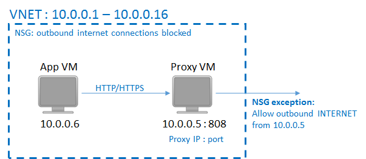
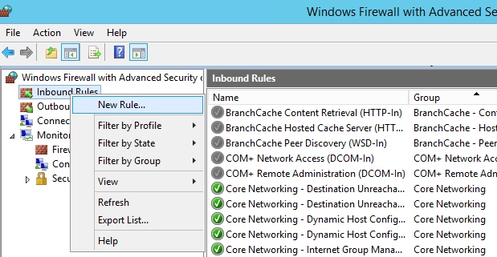
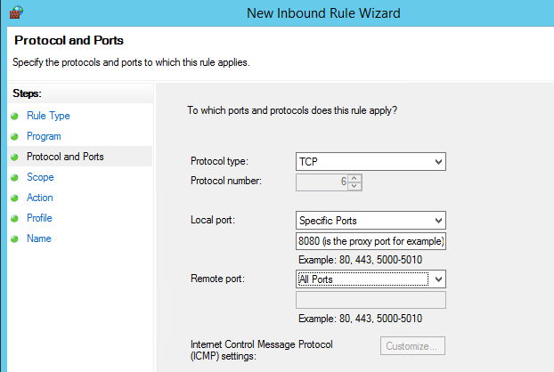

<properties
	pageTitle="Preparing your environment to back up Resource Manager-deployed virtual machines | Microsoft Azure"
	description="Make sure your environment is prepared for backing up virtual machines in Azure"
	services="backup"
	documentationCenter=""
	authors="markgalioto"
	manager="cfreeman"
	editor=""
	keywords="backups; backing up;"/>

<tags
	ms.service="backup"
	ms.workload="storage-backup-recovery"
	ms.tgt_pltfrm="na"
	ms.devlang="na"
	ms.topic="article"
	ms.date="08/01/2016"
	ms.author="trinadhk; jimpark; markgal;"/>


# Prepare your environment to back up Resource Manager-deployed virtual machines

> [AZURE.SELECTOR]
- [Resource manager model](backup-azure-arm-vms-prepare.md)
- [Classic model](backup-azure-vms-prepare.md)

This article provides the steps for preparing your environment to back up a Resource Manager-deployed virtual machine (VM). The steps shown in the procedures use the Azure portal.  

The Azure Backup service has two types of vaults (back up vaults and recovery services vaults) for protecting your VMs. A backup vault protects VMs deployed using the Classic deployment model. A recovery services vault protects ** both Classic-deployed or Resource Manager-deployed VMs** . You must use a Recovery Services vault to protect a Resource Manager-deployed VM.

>[AZURE.NOTE] Azure has two deployment models for creating and working with resources: [Resource Manager and Classic](../resource-manager-deployment-model.md). See [Prepare your environment to back up Azure virtual machines](backup-azure-vms-prepare.md) for details on working with Classic deployment model VMs.

Before you can protect or back up a Resource Manager-deployed virtual machine (VM), make sure these prerequisites exist:

- Create a recovery services vault (or identify an existing recovery services vault) *in the same location as your VM*.
- Select a scenario, define the backup policy, and define items to protect.
- Check the installation of VM Agent on virtual machine.
- Check network connectivity

If you know these conditions already exist in your environment then proceed to the [Back up your VMs article](backup-azure-vms.md). If you need to set up, or check, any of these prerequisites, this article leads you through the steps to prepare that prerequisite.


## Limitations when backing up and restoring a VM

Before you prepare your environment, please understand the limitations.

- Backing up virtual machines with more than 16 data disks is not supported.
- Backing up virtual machines with a reserved IP address and no defined endpoint is not supported.
- Replacing an existing virtual machine during restore is not supported. If you attempt to restore the VM when the VM exists, the restore operation fails.
- Cross-region backup and restore is not supported.
- You can back up virtual machines in all public regions of Azure (see the [checklist](https://azure.microsoft.com/regions/#services) of supported regions). If the region that you are looking for is unsupported today, it will not appear in the dropdown list during vault creation.
- You can back up virtual machines only for select operating system versions:
  - **Linux**: Azure Backup supports  [a list of distributions that are endorsed by Azure](../virtual-machines/virtual-machines-linux-endorsed-distros.md) except Core OS Linux.  Other Bring-Your-Own-Linux distributions also might work as long as the VM agent is available on the virtual machine and support for Python exists.
  - **Windows Server**:  Versions older than Windows Server 2008 R2 are not supported.
- Restoring a domain controller (DC) VM that is part of a multi-DC configuration is supported only through PowerShell. Read more about [restoring a multi-DC domain controller](backup-azure-restore-vms.md#restoring-domain-controller-vms).
- Restoring virtual machines that have the following special network configurations is supported only through PowerShell. VMs created using the restore workflow in the UI will not have these network configurations after the restore operation is complete. To learn more, see [Restoring VMs with special network configurations](backup-azure-restore-vms.md#restoring-vms-with-special-netwrok-configurations).
  - Virtual machines under load balancer configuration (internal and external)
  - Virtual machines with multiple reserved IP addresses
  - Virtual machines with multiple network adapters

## Create a recovery services vault for a VM

A recovery services vault is an entity that stores the backups and recovery points that have been created over time. The recovery services vault also contains the backup policies associated with the protected virtual machines.

To create a recovery services vault:

1. Sign in to the [Azure portal](https://portal.azure.com/).

2. On the Hub menu, click **Browse** and in the list of resources, type **Recovery Services**. As you begin typing, the list will filter based on your input. Click **Recovery Services vault**.

     <br/>

    The list of Recovery Services vaults is displayed.

3. On the **Recovery Services vaults** menu, click **Add**.

    

    The Recovery Services vault blade opens, prompting you to provide a **Name**, **Subscription**, **Resource group**, and **Location**.

    

4. For **Name**, enter a friendly name to identify the vault. The name needs to be unique for the Azure subscription. Type a name that contains between 2 and 50 characters. It must start with a letter, and can contain only letters, numbers, and hyphens.

5. Click **Subscription** to see the available list of subscriptions. If you are not sure which subscription to use, use the default (or suggested) subscription. There will be multiple choices only if your organizational account is associated with multiple Azure subscriptions.

6. Click **Resource group** to see the available list of Resource groups, or click **New** to create a new Resource group. For complete information on Resource groups, see [Azure Resource Manager overview](../resource-group-overview.md)

7. Click **Location** to select the geographic region for the vault. The vault **must** be in the same region as the virtual machines that you want to protect.

    >[AZURE.IMPORTANT] If you are unsure of the location in which your VM exists, close out of the vault creation dialog, and go to the list of Virtual Machines in the portal. If you have virtual machines in multiple regions, you will need to create a Recovery Services vault in each region. Create the vault in the first location before going to the next location. There is no need to specify storage accounts to store the backup data--the Recovery Services vault and the Azure Backup service handle this automatically.

8. Click **Create**. It can take a while for the Recovery Services vault to be created. Monitor the status notifications in the upper right-hand area in the portal. Once your vault is created, it appears in the list of Recovery Services vaults.

    

    Now that you've created your vault, learn how to set the storage replication.

## Set Storage Replication

The storage replication option allows you to choose between geo-redundant storage and locally redundant storage. By default, your vault has geo-redundant storage. Leave the option set to geo-redundant storage if this is your primary backup. Choose locally redundant storage if you want a cheaper option that isn't quite as durable. Read more about [geo-redundant](../storage/storage-redundancy.md#geo-redundant-storage) and [locally redundant](../storage/storage-redundancy.md#locally-redundant-storage) storage options in the [Azure Storage replication overview](../storage/storage-redundancy.md).

To edit the storage replication setting:

1. Select your vault to open the vault dashboard and the Settings blade. If the **Settings** blade doesn't open, click **All settings** in the vault dashboard.

2. On the **Settings** blade, click **Backup Infrastructure** > **Backup Configuration** to open the **Backup Configuration** blade. On the **Backup Configuration** blade, choose the storage replication option for your vault.

    

    After choosing the storage option for your vault, you are ready to associate the VM with the vault. To begin the association, you should discover and register the Azure virtual machines.


## Select a backup goal, set policy and define items to protect

Before registering a VM with a vault, run the discovery process to ensure that any new virtual machines that have been added to the subscription are identified. The process queries Azure for the list of virtual machines in the subscription, along with additional information like the cloud service name and the region. In the Azure portal, scenario refers to what you are going to put into the recovery services vault. Policy is the schedule for how often and when recovery points are taken. Policy also includes the retention range for the recovery points.

1. If you already have a Recovery Services vault open, proceed to step 2. If you do not have a Recovery Services vault open, but are in the Azure portal,
on the Hub menu, click **Browse**.

  - In the list of resources, type **Recovery Services**.
  - As you begin typing, the list will filter based on your input. When you see **Recovery Services vaults**, click it.

     <br/>

    The list of Recovery Services vaults appears.
  - From the list of Recovery Services vaults, select a vault.

    The selected vault dashboard opens.

    

2. From the vault dashboard menu click **Backup** to open the Backup blade.

    

    When the blade opens, the Backup service searches for any new VMs in the subscription.

    

3. On the Backup blade, click **Backup goal** to open the Backup Goal blade.

    

4. On the Backup Goal blade, set **Where is your workload running** to Azure and  **What do you want to backup** to Virtual machine, then click **OK**.

    The Backup Goal blade closes and the Backup policy blade opens.

    

5. On the Backup policy blade, select the backup policy you want to apply to the vault and click **OK**.

    

    The details of the default policy is listed in the details. If you want to create a new policy, select **Create New** from the drop-down menu. The drop-down menu also provides an option to switch the time when the snapshot is taken, to 7PM. For instructions on defining a backup policy, see [Defining a backup policy](backup-azure-vms-first-look-arm.md#defining-a-backup-policy). Once you click **OK**, the backup policy is associated with the vault.

    Next choose the VMs to associate with the vault.

6. Choose the virtual machines to associate with the specified policy and click **Select**.

    

    If you do not see the desired VM, check that it exists in the same Azure location as the Recovery Services vault.

7. Now that you have defined all settings for the vault, in the Backup blade click **Enable Backup** at the bottom of the page. This deploys the policy to the vault and the VMs.

    

The next phase in preparation is installing the VM Agent or making sure the VM Agent is installed.


## Install the VM Agent on the virtual machine

The Azure VM Agent must be installed on the Azure virtual machine for the Backup extension to work. If your VM was created from the Azure gallery, then the VM Agent is already present on the virtual machine. This information is provided for the situations where you are *not* using a VM created from the Azure gallery - for example you migrated a VM from an on-premises datacenter. In such a case, the VM Agent needs to be installed in order to protect the virtual machine.

Learn about the [VM Agent](https://go.microsoft.com/fwLink/?LinkID=390493&clcid=0x409) and [how to install the VM Agent](../virtual-machines/virtual-machines-windows-classic-manage-extensions.md).

If you have problems backing up the Azure VM, check that the Azure VM Agent is correctly installed on the virtual machine (see the table below). If you created a custom VM, [ensure that the **Install the VM Agent** check box is selected](../virtual-machines/virtual-machines-windows-classic-agents-and-extensions.md) before the virtual machine is provisioned.

The following table provides additional information about the VM Agent for Windows and Linux VMs.

| **Operation** | **Windows** | **Linux** |
| --- | --- | --- |
| Installing the VM Agent | <li>Download and install the [agent MSI](http://go.microsoft.com/fwlink/?LinkID=394789&clcid=0x409). You will need Administrator privileges to complete the installation. <li>[Update the VM property](http://blogs.msdn.com/b/mast/archive/2014/04/08/install-the-vm-agent-on-an-existing-azure-vm.aspx) to indicate that the agent is installed. | <li> Install the latest [Linux agent](https://github.com/Azure/WALinuxAgent) from GitHub. You will need Administrator privileges to complete the installation. <li> [Update the VM property](http://blogs.msdn.com/b/mast/archive/2014/04/08/install-the-vm-agent-on-an-existing-azure-vm.aspx) to indicate that the agent is installed. |
| Updating the VM Agent | Updating the VM Agent is as simple as reinstalling the [VM Agent binaries](http://go.microsoft.com/fwlink/?LinkID=394789&clcid=0x409). <br>Ensure that no backup operation is running while the VM agent is being updated. | Follow the instructions on [updating the Linux VM Agent ](../virtual-machines-linux-update-agent.md). <br>Ensure that no backup operation is running while the VM Agent is being updated. |
| Validating the VM Agent installation | <li>Navigate to the *C:\WindowsAzure\Packages* folder in the Azure VM. <li>You should find the WaAppAgent.exe file present.<li> Right-click the file, go to **Properties**, and then select the **Details** tab. The Product Version field should be 2.6.1198.718 or higher. | N/A |


### Backup extension

Once the VM Agent is installed on the virtual machine, the Azure Backup service installs the backup extension to the VM Agent. The Azure Backup service seamlessly upgrades and patches the backup extension.

The backup extension is installed by the Backup service whether or not the VM is running. A running VM provides the greatest chance of getting an application-consistent recovery point. However, the Azure Backup service continues to back up the VM even if it is turned off, and the extension could not be installed. This is known as Offline VM. In this case, the recovery point will be *crash consistent*.


## Network connectivity

In order to manage the VM snapshots, the backup extension needs connectivity to the Azure public IP addresses. Without the right Internet connectivity, the virtual machine's HTTP requests time out and the backup operation fails. If your deployment has access restrictions in place (through a network security group (NSG), for example), then choose one of these options for providing a clear path for backup traffic:

- [Whitelist the Azure datacenter IP ranges](http://www.microsoft.com/en-us/download/details.aspx?id=41653) - see the article for instructions on how to whitelist the IP addresses.
- Deploy an HTTP proxy server for routing traffic.

When deciding which option to use, the trade-offs are between manageability, granular control, and cost.

|Option|Advantages|Disadvantages|
|------|----------|-------------|
|Whitelist IP ranges| No additional costs.<br><br>For opening access in an NSG, use the <i>Set-AzureNetworkSecurityRule</i> cmdlet. | Complex to manage as the impacted IP ranges change over time.<br><br>Provides access to the whole of Azure, and not just Storage.|
|HTTP proxy| Granular control in the proxy over the storage URLs allowed.<br>Single point of Internet access to VMs.<br>Not subject to Azure IP address changes.| Additional costs for running a VM with the proxy software.|

### Whitelist the Azure datacenter IP ranges

To whitelist the Azure datacenter IP ranges, please see the [Azure website](http://www.microsoft.com/en-us/download/details.aspx?id=41653) for details on the IP ranges, and instructions.

### Using an HTTP proxy for VM backups
When backing up a VM, the backup extension on the VM sends the snapshot management commands to Azure Storage using an HTTPS API. Route the backup extension traffic through the HTTP proxy since it is the only component configured for access to the public Internet.

>[AZURE.NOTE] There is no recommendation for the proxy software that should be used. Ensure that you pick a proxy that is compatible with the configuration steps below.

The example image below shows the three configuration steps necessary to use an HTTP proxy:

- App VM routes all HTTP traffic bound for the public Internet through Proxy VM.
- Proxy VM allows incoming traffic from VMs in the virtual network.
- The Network Security Group (NSG) named NSF-lockdown needs a security rule allowing outbound Internet traffic from Proxy VM.



To use an HTTP proxy to communicating to the public Internet, follow these steps:

#### Step 1. Configure outgoing network connections

###### For Windows machines
This will setup proxy server configuration for Local System Account.

1. Download [PsExec](https://technet.microsoft.com/sysinternals/bb897553)
2. Run following command from elevated prompt,

     ```
     psexec -i -s "c:\Program Files\Internet Explorer\iexplore.exe"
     ```
     It will open internet explorer window.
3. Go to Tools -> Internet Options -> Connections -> LAN settings.
4. Verify proxy settings for System account. Set Proxy IP and port.
5. Close Internet Explorer.

This will set up a machine-wide proxy configuration, and will be used for any outgoing HTTP/HTTPS traffic.

If you have setup a proxy server on a current user account(not a Local System Account), use the following script to apply them to SYSTEMACCOUNT:

```
   $obj = Get-ItemProperty -Path Registry::”HKEY_CURRENT_USER\Software\Microsoft\Windows\CurrentVersion\Internet Settings\Connections"
   Set-ItemProperty -Path Registry::”HKEY_USERS\S-1-5-18\Software\Microsoft\Windows\CurrentVersion\Internet Settings\Connections" -Name DefaultConnectionSettings -Value $obj.DefaultConnectionSettings
   Set-ItemProperty -Path Registry::”HKEY_USERS\S-1-5-18\Software\Microsoft\Windows\CurrentVersion\Internet Settings\Connections" -Name SavedLegacySettings -Value $obj.SavedLegacySettings
   $obj = Get-ItemProperty -Path Registry::”HKEY_CURRENT_USER\Software\Microsoft\Windows\CurrentVersion\Internet Settings"
   Set-ItemProperty -Path Registry::”HKEY_USERS\S-1-5-18\Software\Microsoft\Windows\CurrentVersion\Internet Settings" -Name ProxyEnable -Value $obj.ProxyEnable
   Set-ItemProperty -Path Registry::”HKEY_USERS\S-1-5-18\Software\Microsoft\Windows\CurrentVersion\Internet Settings" -Name Proxyserver -Value $obj.Proxyserver
```

>[AZURE.NOTE] If you observe "(407)Proxy Authentication Required" in proxy server log, check your authrntication is setup correctly.

######For Linux machines

Add the following line to the ```/etc/environment``` file:

```
http_proxy=http://<proxy IP>:<proxy port>
```

Add the following lines to the ```/etc/waagent.conf``` file:

```
HttpProxy.Host=<proxy IP>
HttpProxy.Port=<proxy port>
```

#### Step 2. Allow incoming connections on the proxy server:

1. On the proxy server, open Windows Firewall. The easiest way to access the firewall is to search for Windows Firewall with Advanced Security.

    

2. In the Windows Firewall dialog, right-click  **Inbound Rules** and click **New Rule...**.

    

3. In the **New Inbound Rule Wizard**, choose the **Custom** option for the **Rule Type** and click **Next**.
4. On the page to select the **Program**, choose **All Programs** and click **Next**.

5. On the **Protocol and Ports** page, enter the following information and click **Next**:

    

    - for *Protocol type* choose *TCP*
    - for *Local port* choose *Specific Ports*, in the field below specify the ```<Proxy Port>``` that has been configured.
    - for *Remote port* select *All Ports*

    For the rest of the wizard, click all the way to the end and give this rule a name.

#### Step 3. Add an exception rule to the NSG:

In an Azure PowerShell command prompt, enter the following command:

The following command adds an exception to the NSG. This exception allows TCP traffic from any port on 10.0.0.5 to any Internet address on port 80 (HTTP) or 443 (HTTPS). If you require a specific port in the public Internet, be sure to add that port to the ```-DestinationPortRange``` as well.

```
Get-AzureNetworkSecurityGroup -Name "NSG-lockdown" |
Set-AzureNetworkSecurityRule -Name "allow-proxy " -Action Allow -Protocol TCP -Type Outbound -Priority 200 -SourceAddressPrefix "10.0.0.5/32" -SourcePortRange "*" -DestinationAddressPrefix Internet -DestinationPortRange "80-443"
```


*These steps use specific names and values for this example. Please use the names and values for your deployment when entering, or cutting and pasting details into your code.*


Now that you know you have network connectivity, you are ready to back up your VM. See [Back up Resource Manager-deployed VMs](backup-azure-arm-vms.md).

## Questions?
If you have questions, or if there is any feature that you would like to see included, [send us feedback](http://aka.ms/azurebackup_feedback).

## Next steps
Now that you have prepared your environment for backing up your VM, your next logical step is to create a backup. The planning article provides more detailed information about backing up VMs.

- [Back up virtual machines](backup-azure-vms.md)
- [Plan your VM backup infrastructure](backup-azure-vms-introduction.md)
- [Manage virtual machine backups](backup-azure-manage-vms.md)
