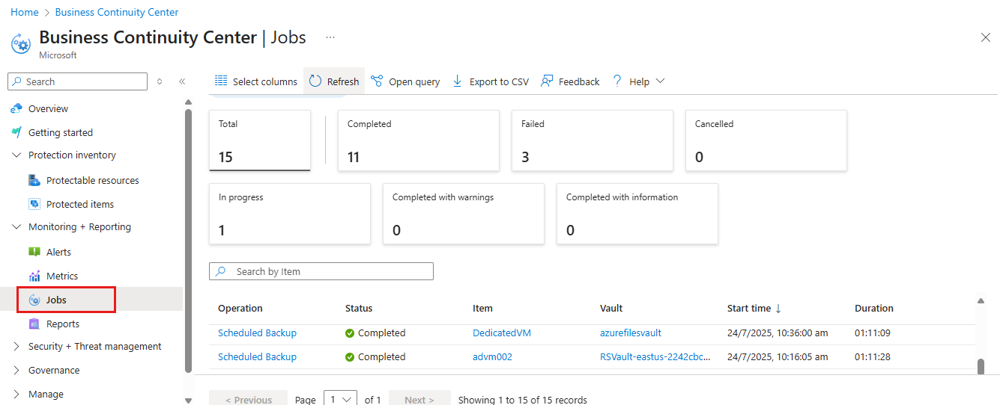

# Back up Azure VMs in a Recovery Services vault

This article describes how to back up Azure VMs in a Recovery Services vault, using the [Azure Backup](backup-overview.md) service.

In this article, you learn how to:

> [!div class="checklist"]
>
> * Prepare Azure VMs.
> * Create a vault.
> * Discover VMs and configure a backup policy.
> * Enable backup for Azure VMs.
> * Run the initial backup.

> [!NOTE]
> This article describes how to set up a vault and select VMs to back up. It's useful if you want to back up multiple VMs. Alternatively, you can [back up a single Azure VM](backup-azure-vms-first-look-arm.md) directly from the VM settings.

## Before you start

* [Review](backup-architecture.md#architecture-built-in-azure-vm-backup) the Azure VM backup architecture.
* [Learn about](backup-azure-vms-introduction.md) Azure VM backup, and the backup extension.
* [Review the support matrix](backup-support-matrix-iaas.md) before you configure backup.

In addition, there are a couple of things that you might need to do in some circumstances:

* **Install the VM agent on the VM**: Azure Backup backs up Azure VMs by installing an extension to the Azure VM agent running on the machine. If your VM was created from an Azure marketplace image, the agent is installed and running. If you create a custom VM, or you migrate an on-premises machine, you might need to [install the agent manually](#install-the-vm-agent).
* **Explicitly allow outbound access**: Generally, you don't need to explicitly allow outbound network access for an Azure VM in order for it to communicate with Azure Backup. However, some VMs might experience connection issues, showing the **ExtensionSnapshotFailedNoNetwork** error when attempting to connect. If this happens, you should [explicitly allow outbound access](#explicitly-allow-outbound-access), so the Azure Backup extension can communicate with Azure public IP addresses for backup traffic.

## Create a vault

 A vault stores backups and recovery points created over time, and stores backup policies associated with backed up machines. Create a vault as follows:

1. Sign in to the [Azure portal](https://portal.azure.com/).
2. In search, type **Recovery Services**. Under **Services**, click **Recovery Services vaults**.

      <br/>

3. In **Recovery Services vaults** menu, click **+Add**.

     

4. In **Recovery Services vault**, type in a friendly name to identify the vault.
    * The name needs to be unique for the Azure subscription.
    * It can contain 2 to 50 characters.
    * It must start with a letter, and it can contain only letters, numbers, and hyphens.
5. Select the Azure subscription, resource group, and geographic region in which the vault should be created. Then click **Create**.
    * It can take a while for the vault to be created.
    * Monitor the status notifications in the upper-right area of the portal.

After the vault is created, it appears in the Recovery Services vaults list. If you don't see your vault, select **Refresh**.


>[!NOTE]
> Azure Backup now allows customization of the resource group name created by the Azure Backup service. For more information, see [Azure Backup resource group for Virtual Machines](backup-during-vm-creation.md#azure-backup-resource-group-for-virtual-machines).

### Modify storage replication

By default, vaults use [geo-redundant storage (GRS)](https://docs.microsoft.com/azure/storage/common/storage-redundancy-grs).

* If the vault is your primary backup mechanism, we recommend you use GRS.
* You can use [locally-redundant storage (LRS)](https://docs.microsoft.com/azure/storage/common/storage-redundancy-lrs?toc=%2fazure%2fstorage%2fblobs%2ftoc.json) for a cheaper option.

Modify storage replication type as follows:

1. In the new vault, click **Properties** in the **Settings** section.
2. In **Properties**, under **Backup Configuration**, click **Update**.
3. Select the storage replication type, and click **Save**.

      

> [!NOTE]
   > You can't modify the storage replication type after the vault is set up and contains backup items. If you want to do this you need to recreate the vault.

## Apply a backup policy

Configure a backup policy for the vault.

1. In the vault, click **+Backup** in the **Overview** section.

   

2. In **Backup Goal** > **Where is your workload running?** select **Azure**. In **What do you want to back up?** select **Virtual machine** >  **OK**. This registers the VM extension in the vault.

   

3. In **Backup policy**, select the policy that you want to associate with the vault.
    * The default policy backs up the VM once a day. The daily backups are retained for 30 days. Instant recovery snapshots are retained for two days.
    * If you don't want to use the default policy, select **Create New**, and create a custom policy as described in the next procedure.

      

4. In **Select virtual machines**, select the VMs you want to back up using the policy. Then click **OK**.

   * The selected VMs are validated.
   * You can only select VMs in the same region as the vault.
   * VMs can only be backed up in a single vault.

     

5. In **Backup**, click **Enable backup**. This deploys the policy to the vault and to the VMs, and installs the backup extension on the VM agent running on the Azure VM.

     

After enabling backup:

* The Backup service installs the backup extension whether or not the VM is running.
* An initial backup will run in accordance with your backup schedule.
* When backups run, note that:
  * A VM that's running have the greatest chance for capturing an application-consistent recovery point.
  * However, even if the VM is turned off it's backed up. Such a VM is known as an offline VM. In this case, the recovery point will be crash-consistent.

### Create a custom policy

If you selected to create a new backup policy, fill in the policy settings.

1. In **Policy name**, specify a meaningful name.
2. In **Backup schedule**, specify when backups should be taken. You can take daily or weekly backups for Azure VMs.
3. In **Instant Restore**, specify how long you want to retain snapshots locally for instant restore.
    * When you restore, backed up VM disks are copied from storage, across the network to the recovery storage location. With instant restore, you can leverage locally-stored snapshots taken during a backup job, without waiting for backup data to be transferred to the vault.
    * You can retain snapshots for instant restore for between one to five days. Two days is the default setting.
4. In **Retention range**, specify how long you want to keep your daily or weekly backup points.
5. In **Retention of monthly backup point**, specify whether you want to keep a monthly backup of your daily or weekly backups.
6. Click **OK** to save the policy.

    

> [!NOTE]
   > Azure Backup doesn't support automatic clock adjustment for daylight-saving changes for Azure VM backups. As time changes occur, modify backup policies manually as required.

## Trigger the initial backup

The initial backup will run in accordance with the schedule, but you can run it immediately as follows:

1. In the vault menu, click **Backup items**.
2. In **Backup Items**, click **Azure Virtual Machine**.
3. In the **Backup Items** list, click the ellipses (...).
4. Click **Backup now**.
5. In **Backup Now**, use the calendar control to select the last day that the recovery point should be retained. Then click **OK**.
6. Monitor the portal notifications. You can monitor the job progress in the vault dashboard > **Backup Jobs** > **In progress**. Depending on the size of your VM, creating the initial backup may take a while.

## Verify Backup job status

The Backup job details for each VM backup consist of two phases, the **Snapshot** phase followed by the **Transfer data to vault** phase.<br/>
The snapshot phase guarantees the availability of a recovery point stored along with the disks for **Instant Restores** and are available for a maximum of five days depending on the snapshot retention configured by the user. Transfer data to vault creates a recovery point in the vault for long-term retention. Transfer data to vault only starts after the snapshot phase is completed.

  

There are two **Sub Tasks** running at the backend, one for front-end backup job that can be checked from the **Backup Job** details blade as given below:

  

The **Transfer data to vault** phase can take multiple days to complete depending on the size of the disks, churn per disk and several other factors.

Job status can vary depending on the following scenarios:

**Snapshot** | **Transfer data to vault** | **Job Status**
--- | --- | ---
Completed | In progress | In progress
Completed | Skipped | Completed
Completed | Completed | Completed
Completed | Failed | Completed with warning
Failed | Failed | Failed

Now with this capability, for the same VM, two backups can run in parallel, but in either phase (snapshot, transfer data to vault) only one sub task can be running. So in scenarios were a backup job in progress resulted in the next day’s backup to fail will be avoided with this decoupling functionality. Subsequent day’s backups can have snapshot completed while **Transfer data to vault** skipped if an earlier day’s backup job is in progress state.
The incremental recovery point created in the vault will capture all the churn from the last recovery point created in the vault. There is no cost impact on the user.

## Optional steps (install agent/allow outbound)

### Install the VM agent

Azure Backup backs up Azure VMs by installing an extension to the Azure VM agent running on the machine. If your VM was created from an Azure Marketplace image, the agent is installed and running. If you create a custom VM, or you migrate an on-premises machine, you might need to install the agent manually, as summarized in the table.

**VM** | **Details**
--- | ---
**Windows** | 1. [Download and install](https://go.microsoft.com/fwlink/?LinkID=394789&clcid=0x409) the agent MSI file.<br/><br/> 2. Install with admin permissions on the machine.<br/><br/> 3. Verify the installation. In *C:\WindowsAzure\Packages* on the VM, right-click **WaAppAgent.exe** > **Properties**. On the **Details** tab, **Product Version** should be 2.6.1198.718 or higher.<br/><br/> If you're updating the agent, make sure that no backup operations are running, and [reinstall the agent](https://go.microsoft.com/fwlink/?LinkID=394789&clcid=0x409).
**Linux** | Install by using an RPM or a DEB package from your distribution's package repository. This is the preferred method for installing and upgrading the Azure Linux agent. All the [endorsed distribution providers](https://docs.microsoft.com/azure/virtual-machines/linux/endorsed-distros) integrate the Azure Linux agent package into their images and repositories. The agent is available on [GitHub](https://github.com/Azure/WALinuxAgent), but we don't recommend installing from there.<br/><br/> If you're updating the agent, make sure no backup operations are running, and update the binaries.

### Explicitly allow outbound access

The backup extension running on the VM needs outbound access to Azure public IP addresses.

* Generally you don't need to explicitly allow outbound network access for an Azure VM in order for it to communicate with Azure Backup.
* If you do run into difficulties with VMs connecting, or if you see the error **ExtensionSnapshotFailedNoNetwork** when attempting to connect, you should explicitly allow access so the backup extension can communicate to Azure public IP addresses for backup traffic. Access methods are summarized in the following table.

**Option** | **Action** | **Details**
--- | --- | ---
**Set up NSG rules** | Allow the [Azure datacenter IP ranges](https://www.microsoft.com/download/details.aspx?id=41653).<br/><br/> Instead of allowing and managing every address range, you can add a rule that allows access to the Azure Backup service using a [service tag](backup-azure-arm-vms-prepare.md#set-up-an-nsg-rule-to-allow-outbound-access-to-azure). | [Learn more](../virtual-network/security-overview.md#service-tags) about service tags.<br/><br/> Services tags simplify access management, and don't incur additional costs.
**Deploy a proxy** | Deploy an HTTP proxy server for routing traffic. | Provides access to the whole of Azure, and not just storage.<br/><br/> Granular control over the storage URLs is allowed.<br/><br/> Single point of internet access for VMs.<br/><br/> Additional costs for proxy.
**Set up Azure Firewall** | Allow traffic through the Azure Firewall on the VM, using an FQDN tag for the Azure Backup service | Simple to use if you have Azure Firewall set up in a VNet subnet.<br/><br/> You can't create your own FQDN tags, or modify FQDNs in a tag.<br/><br/> If your Azure VMs have managed disks, you might need to open an additional port (8443) on the firewalls.

#### Establish network connectivity

Establish connectivity with NSG, by proxy, or through the firewall

##### Set up an NSG rule to allow outbound access to Azure

If an NSG manages the VM access, allow outbound access for the backup storage to the required ranges and ports.

1. In the VM properties > **Networking**, select **Add outbound port rule**.
2. In **Add outbound security rule**, select **Advanced**.
3. In **Source**, select **VirtualNetwork**.
4. In **Source port ranges**, enter an asterisk (*) to allow outbound access from any port.
5. In **Destination**, select **Service Tag**. From the list, select **Storage.region**. The region is where the vault, and the VMs that you want to back up, are located.
6. In **Destination port ranges**, select the port.
    * VM using unmanaged disks with unencrypted storage account: 80
    * VM using unmanaged disks with encrypted storage account: 443 (default setting)
    * VM using managed disks: 8443.
7. In **Protocol**, select **TCP**.
8. In **Priority**, specify a priority value less than any higher deny rules.

   If you have a rule that denies access, the new allow rule must be higher. For example, if you have a **Deny_All** rule set at priority 1000, your new rule must be set to less than 1000.
9. Provide a name and description for the rule, and select **OK**.

You can apply the NSG rule to multiple VMs to allow outbound access. This video walks you through the process.

>[!VIDEO https://www.youtube.com/embed/1EjLQtbKm1M]

##### Route backup traffic through a proxy

You can route backup traffic through a proxy, and then give the proxy access to the required Azure ranges. Configure the proxy VM to allow the following:

* The Azure VM should route all HTTP traffic bound for the public internet through the proxy.
* The proxy should allow incoming traffic from VMs in the applicable virtual network.
* The NSG **NSF-lockdown** needs a rule that allows outbound internet traffic from the proxy VM.

###### Set up the proxy

If you don't have a system account proxy, set one up as follows:

1. Download [PsExec](https://technet.microsoft.com/sysinternals/bb897553).
2. Run **PsExec.exe -i -s cmd.exe** to run the command prompt under a system account.
3. Run the browser in system context. For example, use **%PROGRAMFILES%\Internet Explorer\iexplore.exe** for Internet Explorer.  
4. Define the proxy settings.
   * On Linux machines:
     * Add this line to the **/etc/environment** file:
       * **http_proxy=http:\//proxy IP address:proxy port**
     * Add these lines to the **/etc/waagent.conf** file:
         * **HttpProxy.Host=proxy IP address**
         * **HttpProxy.Port=proxy port**
   * On Windows machines, in the browser settings, specify that a proxy should be used. If you're currently using a proxy on a user account, you can use this script to apply the setting at the system account level.

       ```powershell
      $obj = Get-ItemProperty -Path Registry::"HKEY_CURRENT_USER\Software\Microsoft\Windows\CurrentVersion\Internet Settings\Connections"
      Set-ItemProperty -Path Registry::"HKEY_USERS\S-1-5-18\Software\Microsoft\Windows\CurrentVersion\Internet Settings\Connections" -Name DefaultConnectionSettings -Value $obj.DefaultConnectionSettings
      Set-ItemProperty -Path Registry::"HKEY_USERS\S-1-5-18\Software\Microsoft\Windows\CurrentVersion\Internet Settings\Connections" -Name SavedLegacySettings -Value $obj.SavedLegacySettings
      $obj = Get-ItemProperty -Path Registry::"HKEY_CURRENT_USER\Software\Microsoft\Windows\CurrentVersion\Internet Settings"
      Set-ItemProperty -Path Registry::"HKEY_USERS\S-1-5-18\Software\Microsoft\Windows\CurrentVersion\Internet Settings" -Name ProxyEnable -Value $obj.ProxyEnable
      Set-ItemProperty -Path Registry::"HKEY_USERS\S-1-5-18\Software\Microsoft\Windows\CurrentVersion\Internet Settings" -Name Proxyserver -Value $obj.Proxyserver

       ```

###### Allow incoming connections on the proxy

Allow incoming connections in the proxy settings.

1. In Windows Firewall, open **Windows Firewall with Advanced Security**.
2. Right-click **Inbound Rules** > **New Rule**.
3. In **Rule Type**, select **Custom** > **Next**.
4. In **Program**, select **All Programs** > **Next**.
5. In **Protocols and Ports**:
   * Set the type to **TCP**.
   * Set **Local Ports** to **Specific Ports**.
   * Set **Remote port** to **All Ports**.

6. Finish the wizard and specify a name for the rule.

###### Add an exception rule to the NSG for the proxy

On the NSG **NSF-lockdown**, allow traffic from any port on 10.0.0.5 to any internet address on port 80 (HTTP) or 443 (HTTPS).

The following PowerShell script provides an example for allowing traffic.
Instead of allowing outbound to all public internet addresses, you can specify an IP address range (`-DestinationPortRange`), or use the storage.region service tag.

```powershell
Get-AzureNetworkSecurityGroup -Name "NSG-lockdown" |
Set-AzureNetworkSecurityRule -Name "allow-proxy " -Action Allow -Protocol TCP -Type Outbound -Priority 200 -SourceAddressPrefix "10.0.0.5/32" -SourcePortRange "*" -DestinationAddressPrefix Internet -DestinationPortRange "80-443"
```

##### Allow firewall access with an FQDN tag

You can set up Azure Firewall to allow outbound access for network traffic to Azure Backup.

* [Learn about](https://docs.microsoft.com/azure/firewall/tutorial-firewall-deploy-portal) deploying Azure Firewall.
* [Read about](https://docs.microsoft.com/azure/firewall/fqdn-tags) FQDN tags.

>[!NOTE]
> Azure Backup now supports selective disk backup and restore using the Azure Virtual Machine backup solution.
>
>Today, Azure Backup supports backing up all the disks (Operating System and data) in a VM together using the Virtual Machine backup solution. With exclude-disk functionality, you get an option to backup one or a few from the many data disks in a VM. This provides an efficient and cost-effective solution for your backup and restore needs. Each recovery point contains data of the disks included in the backup operation, which further allows you to have a subset of disks restored from the given recovery point during the restore operation. This applies to restore both from the snapshot and the vault.
>
> This solution is particularly useful in the following scenarios:
>  
>1. You have critical data to be backed up in only one disk and you don’t want to back up the rest of the disks attached to a VM. This minimizes the backup storage costs.  
>2. You have other backup solutions for part of your VM data. For example, you back up your databases or data with a different workload backup solution, and you want to use Azure VM level backup for the rest of your disks and data to build an efficient and robust system utilizing the best capabilities available.
>
>To sign up for the preview, write to us at AskAzureBackupTeam@microsoft.com

## Next steps

* Troubleshoot any issues with [Azure VM agents](backup-azure-troubleshoot-vm-backup-fails-snapshot-timeout.md) or [Azure VM backup](backup-azure-vms-troubleshoot.md).
* [Restore](backup-azure-arm-restore-vms.md) Azure VMs.
