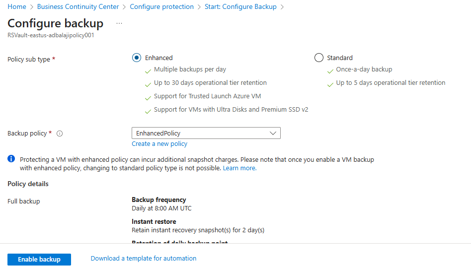

# Back up Azure VMs in a Recovery Services vault

This article describes how to back up Azure VMs in a Recovery Services vault, using the [Azure Backup](backup-overview.md) service.

In this article, you learn how to:

> [!div class="checklist"]
>
> * Prepare Azure VMs.
> * Create a vault.
> * Discover VMs and configure a backup policy.
> * Enable backup for Azure VMs.
> * Run the initial backup.

> [!NOTE]
> This article describes how to set up a vault and select VMs to back up. It's useful if you want to back up multiple VMs. Alternatively, you can [back up a single Azure VM](backup-azure-vms-first-look-arm.md) directly from the VM settings.

## Before you start

* [Review](backup-architecture.md#architecture-built-in-azure-vm-backup) the Azure VM backup architecture.
* [Learn about](backup-azure-vms-introduction.md) Azure VM backup, and the backup extension.
* [Review the support matrix](backup-support-matrix-iaas.md) before you configure backup.

In addition, there are a couple of things that you might need to do in some circumstances:

* **Install the VM agent on the VM**: Azure Backup backs up Azure VMs by installing an extension to the Azure VM agent running on the machine. If your VM was created from an Azure Marketplace image, the agent is installed and running. If you create a custom VM, or you migrate an on-premises machine, you might need to [install the agent manually](#install-the-vm-agent).

[!INCLUDE [How to create a Recovery Services vault](../../includes/backup-create-rs-vault.md)]

### Modify storage replication

By default, vaults use [geo-redundant storage (GRS)](../storage/common/storage-redundancy.md).

* If the vault is your primary backup mechanism, we recommend you use GRS.
* You can use [locally redundant storage (LRS)](../storage/common/storage-redundancy.md?toc=/azure/storage/blobs/toc.json) for a cheaper option.

Modify the storage replication type as follows:

1. In the new vault, select **Properties** in the **Settings** section.
2. In **Properties**, under **Backup Configuration**, select **Update**.
3. Select the storage replication type, and select **Save**.
s
      

> [!NOTE]
   > You can't modify the storage replication type after the vault is set up and contains backup items. If you want to do this you need to recreate the vault.

## Apply a backup policy

Configure a backup policy for the vault.

1. In the vault, select **+Backup** in the **Overview** section.

   

1. In **Backup Goal** > **Where is your workload running?** select **Azure**. In **What do you want to back up?** select **Virtual machine** >  **OK**. This registers the VM extension in the vault.

   

1. In **Backup policy**, select the policy that you want to associate with the vault.
    * The default policy backs up the VM once a day. The daily backups are retained for 30 days. Instant recovery snapshots are retained for two days.

      

    * If you don't want to use the default policy, select **Create New**, and create a custom policy as described in the next procedure.

1. Under **Virtual Machines**, select **Add**.

      

1. The **Select virtual machines** pane will open. Select the VMs you want to back up using the policy. Then select **OK**.

   * The selected VMs are validated.
   * You can only select VMs in the same region as the vault.
   * VMs can only be backed up in a single vault.

     

    >[!NOTE]
    > All the VMs in the same region and subscription as that of the vault are available to configure backup. When configuring backup, you can browse to the virtual machine name and its resource group, even though you don’t have the required permission on those VMs.  

1. In **Backup**, select **Enable backup**. This deploys the policy to the vault and to the VMs, and installs the backup extension on the VM agent running on the Azure VM.

After enabling backup:

* The Backup service installs the backup extension whether or not the VM is running.
* An initial backup will run in accordance with your backup schedule.
* When backups run, note that:
  * A VM that's running has the greatest chance for capturing an application-consistent recovery point.
  * However, even if the VM is turned off, it's backed up. Such a VM is known as an offline VM. In this case, the recovery point will be crash-consistent.
* Explicit outbound connectivity isn't required to allow backup of Azure VMs.

### Create a custom policy

If you selected to create a new backup policy, fill in the policy settings.

1. In **Policy name**, specify a meaningful name.
2. In **Backup schedule**, specify when backups should be taken. You can take daily or weekly backups for Azure VMs.
3. In **Instant Restore**, specify how long you want to retain snapshots locally for instant restore.
    * When you restore, backed up VM disks are copied from storage, across the network to the recovery storage location. With instant restore, you can leverage locally stored snapshots taken during a backup job, without waiting for backup data to be transferred to the vault.
    * You can retain snapshots for instant restore for between one to five days. Two days is the default setting.
4. In **Retention range**, specify how long you want to keep your daily or weekly backup points.
5. In **Retention of monthly backup point** and **Retention of yearly backup point**, specify whether you want to keep a monthly or yearly backup of your daily or weekly backups.
6. Select **OK** to save the policy.

    

> [!NOTE]
   > Azure Backup doesn't support automatic clock adjustment for daylight-saving changes for Azure VM backups. As time changes occur, modify backup policies manually as required.

## Trigger the initial backup

The initial backup will run in accordance with the schedule, but you can run it immediately as follows:

1. In the vault menu, select **Backup items**.
2. In **Backup Items**, select **Azure Virtual Machine**.
3. In the **Backup Items** list, select the ellipses (...).
4. Select **Backup now**.
5. In **Backup Now**, use the calendar control to select the last day that the recovery point should be retained. Then select **OK**.
6. Monitor the portal notifications. You can monitor the job progress in the vault dashboard > **Backup Jobs** > **In progress**. Depending on the size of your VM, creating the initial backup may take a while.

## Verify Backup job status

The Backup job details for each VM backup consist of two phases, the **Snapshot** phase followed by the **Transfer data to vault** phase. 
The snapshot phase guarantees the availability of a recovery point stored along with the disks for **Instant Restores** and are available for a maximum of five days depending on the snapshot retention configured by the user. Transfer data to vault creates a recovery point in the vault for long-term retention. Transfer data to vault only starts after the snapshot phase is completed.

  

There are two **Sub Tasks** running at the backend, one for front-end backup job that can be checked from the **Backup Job** details pane as given below:

  

The **Transfer data to vault** phase can take multiple days to complete depending on the size of the disks, churn per disk and several other factors.

Job status can vary depending on the following scenarios:

**Snapshot** | **Transfer data to vault** | **Job Status**
--- | --- | ---
Completed | In progress | In progress
Completed | Skipped | Completed
Completed | Completed | Completed
Completed | Failed | Completed with warning
Failed | Failed | Failed

Now with this capability, for the same VM, two backups can run in parallel, but in either phase (snapshot, transfer data to vault) only one sub task can be running. So in scenarios where a backup job in progress resulted in the next day’s backup to fail, it will be avoided with this decoupling functionality. Subsequent days' backups can have the snapshot completed, while **Transfer data to vault** is skipped if an earlier day’s backup job is in progress state.
The incremental recovery point created in the vault will capture all the churn from the last recovery point created in the vault. There's no cost impact on the user.

## Optional steps

### Install the VM agent

Azure Backup backs up Azure VMs by installing an extension to the Azure VM agent running on the machine. If your VM was created from an Azure Marketplace image, the agent is installed and running. If you create a custom VM, or you migrate an on-premises machine, you might need to install the agent manually, as summarized in the table.

**VM** | **Details**
--- | ---
**Windows** | 1. [Download and install](https://go.microsoft.com/fwlink/?LinkID=394789&clcid=0x409) the agent MSI file.   2. Install with admin permissions on the machine.   3. Verify the installation. In *C:\WindowsAzure\Packages* on the VM, right-click **WaAppAgent.exe** > **Properties**. On the **Details** tab, **Product Version** should be 2.6.1198.718 or higher.   If you're updating the agent, make sure that no backup operations are running, and [reinstall the agent](https://go.microsoft.com/fwlink/?LinkID=394789&clcid=0x409).
**Linux** | Install by using an RPM or a DEB package from your distribution's package repository. This is the preferred method for installing and upgrading the Azure Linux agent. All the [endorsed distribution providers](../virtual-machines/linux/endorsed-distros.md) integrate the Azure Linux agent package into their images and repositories. The agent is available on [GitHub](https://github.com/Azure/WALinuxAgent), but we don't recommend installing from there.   If you're updating the agent, make sure no backup operations are running, and update the binaries.

>[!NOTE]
> **Azure Backup now supports selective disk backup and restore using the Azure Virtual Machine backup solution.**
>
>Today, Azure Backup supports backing up all the disks (Operating System and data) in a VM together using the Virtual Machine backup solution. With exclude-disk functionality, you get an option to backup one or a few from the many data disks in a VM. This provides an efficient and cost-effective solution for your backup and restore needs. Each recovery point contains data of the disks included in the backup operation, which further allows you to have a subset of disks restored from the given recovery point during the restore operation. This applies to restore both from the snapshot and the vault.
>
>To sign up for the preview, write to us at AskAzureBackupTeam@microsoft.com

## Next steps

* Troubleshoot any issues with [Azure VM agents](backup-azure-troubleshoot-vm-backup-fails-snapshot-timeout.md) or [Azure VM backup](backup-azure-vms-troubleshoot.md).
* [Restore](backup-azure-arm-restore-vms.md) Azure VMs.
