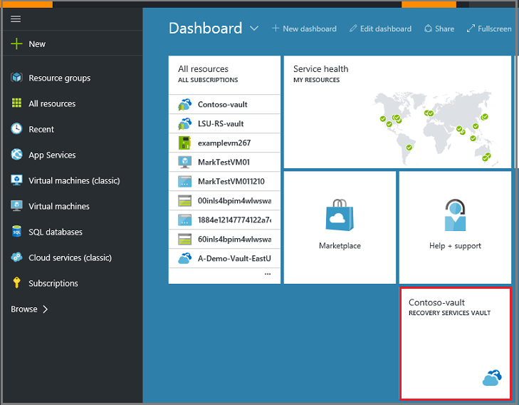

<properties
	pageTitle="Back up Azure Resource Manager virtual machines | Microsoft Azure"
	description="Discover, register, and back up your ARM virtual machines to a recovery services vault with these procedures for Azure virtual machine backup."
	services="backup"
	documentationCenter=""
	authors="markgalioto"
	manager="jwhit"
	editor=""
	keywords="virtual machine backup; back up virtual machine; backup and disaster recovery; arm vm backup"/>

<tags
	ms.service="backup"
	ms.workload="storage-backup-recovery"
	ms.tgt_pltfrm="na"
	ms.devlang="na"
	ms.topic="article"
	ms.date="05/04/2016"
	ms.author="trinadhk; jimpark; markgal;"/>

# Back up Azure Resource Manager (ARM) virtual machines

> [AZURE.SELECTOR]
- [Back up ARM VMs to Azure](backup-azure-arm-vms.md)
- [Back up Azure virtual machines](backup-azure-vms.md)

This article provides the procedure for backing up Azure Resource Manager (ARM) virtual machines (VMs) to a Recovery Services vault. The majority of work for backing up an ARM VM goes into the preparation. Before you can back up or protect an Azure virtual machine, you must complete the [prerequisites](backup-azure-arm-vms-prepare.md) to prepare your environment for protecting your VMs. Once you have completed the prerequisites, then you can initiate the back up operation to take snapshots of your VM.

>[AZURE.NOTE] Azure has two deployment models for creating and working with resources: [Resource Manager and Classic](../resource-manager-deployment-model.md). This article is for use with Resource Manager and ARM-based VMs. See [Back up Azure virtual machines](backup-azure-vms.md) for details on working with Classic deployment model VMs.

For additional information, see the articles on [planning your VM backup infrastructure in Azure](backup-azure-vms-introduction.md) and [Azure virtual machines](https://azure.microsoft.com/documentation/services/virtual-machines/).

## Triggering the back up job

The back up policy associated with the Recovery Services vault, defines how often and when the backup operation runs. By default, the first scheduled backup is the initial backup. Until the initial backup occurs, the Last Backup Status on the **Backup Jobs** blade shows as **Warning(initial backup pending)**.

Unless your initial backup is due to begin very soon, it is recommended that you run **Back up Now**. The following procedure starts from the vault dashboard. If you are not in the vault dashboard, see [Access a Recovery Services vault](backup-azure-arm-vms.md#access-a-recovery-services-vault). 

To run a backup job:

1. On the vault dashboard, on the **Backup** tile, click **Azure Virtual Machines**  
    

    The **Backup Items** blade opens.

2. On the **Backup Items** blade, right-click the vault you want to back up, and click **Backup now**.

    

    The Backup job is triggered.  

    

3. To view that your initial backup has completed, on the vault dashboard, on the **Backup Jobs** tile, click **Azure virtual machines**.

    

    The Backup Jobs blade opens.

4. In the Backup jobs blade, you can see the status of all jobs.

    

    >[AZURE.NOTE] As a part of the backup operation, the Azure Backup service issues a command to the backup extension in each virtual machine to flush all writes and take a consistent snapshot.

    When the backup job is finished, the status is *Completed*.

## Access a Recovery Services vault

There are two ways to quickly access your Recovery Services vaults - open the vault pinned to your dashboard, or open the list of Recovery Services vaults. By default, when you create a Recovery Services vault, it should be pinned to the Azure dashboard.

To open a vault from the dashboard, click the Recovery Services tile.

The vault dashboard opens.

To open a vault from the Recovery Services list

1. In the Azure portal, on the Hub menu, click **Browse**.

    - In the list of resources, type **Recovery Services**.
    - As you begin typing, the list will filter based on your input. When you see **Recovery Services vaults**, click it.

      

    The list of Recovery Services vaults appears.

2. From the list of Recovery Services vaults, select a vault.

    The selected vault dashboard opens.

    

2. From the vault dashboard menu click **Backup** to open the Backup blade.

    

    When the blade opens, the Backup service searches for any new VMs in the subscription.

    

## Troubleshooting errors
If you run into issues while backing up your virtual machine, look at the [VM troubleshooting article](backup-azure-vms-troubleshoot.md) for help.

## Next steps

- [Manage and monitor your virtual machines](backup-azure-manage-vms.md)
- [Restore virtual machines](backup-azure-arm-restore-vms.md)
