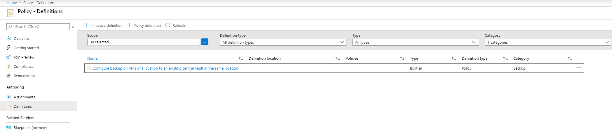
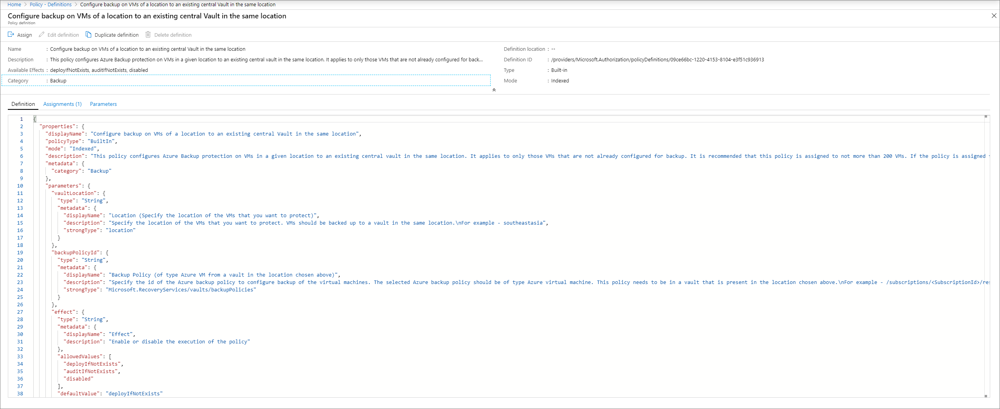
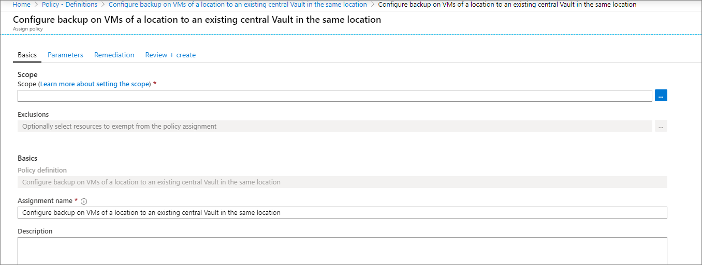
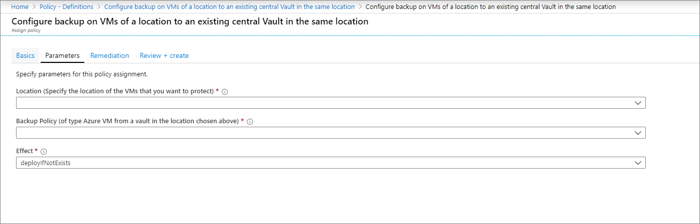

# Auto-Enable Backup on VM Creation using Azure Policy

One of the key responsibilities of a Backup or Compliance Admin in an organization is to ensure that all business-critical machines are backed up with the appropriate retention.

Today, Azure Backup provides a built-in policy (using Azure Policy) that can be assigned to **all Azure VMs in a specified location within a subscription or resource group**. When this policy is assigned to a given scope, all new VMs created in that scope are automatically configured for backup to an **existing vault in the same location and subscription**. The user can specify the vault and the retention policy to which the backed up VMs should be associated.

## Supported Scenarios

* The built-in policy is currently supported only for Azure VMs. Users must take care to ensure that the retention policy specified during assignment is a VM retention policy. Refer to [this](https://docs.microsoft.com/azure/backup/backup-azure-policy-supported-skus) document to see all the VM SKUs supported by this policy.

* The policy can be assigned to a single location and subscription at a time. To enable backup for VMs across locations and subscriptions, multiple instances of the policy assignment need to be created, one for each combination of location and subscription.

* The specified vault and the VMs configured for backup can be under different resource groups.

* Management Group scope is currently unsupported.

* The built-in policy is currently not available in national clouds.

## Using the built-in policy

To assign the policy to the required scope, please follow the below steps:

1. Sign in to the Azure Portal and navigate to the **Policy** Dashboard.
2. Select **Definitions** in the left menu to get a list of all built-in policies across Azure Resources.
3. Filter the list for **Category=Backup**. You will see the list filtered down to a single policy named 'Configure backup on VMs of a location to an existing central Vault in the same location'.

4. Click on the name of the policy. You will be redirected to the detailed definition for this policy.

5. Click on the **Assign** button at the top of the blade. This redirects you to the **Assign Policy** blade.
6. Under **Basics**, click on the three dots next to the **Scope** field. This opens up a right context blade where you can select the subscription for the policy to be applied on. You can also optionally select a resource group, so that the policy is applied only for VMs in a particular resource group.

7. In the **Parameters** tab, choose a location from the drop-down, and select the vault and backup policy to which the VMs in the scope must be associated.

8. Ensure that **Effect** is set to deployIfNotExists.
9. Navigate to **Review+create** and click **Create**.

> [!NOTE]
>
> Azure Policy can also be used on existing VMs, using [remediation](https://docs.microsoft.com/azure/governance/policy/how-to/remediate-resources).

> [!NOTE]
>
> It is recommended that this policy is not assigned to more than 200 VMs at a time. If the policy is assigned to more than 200 VMs, it can result in the backup getting triggered a few hours later than that specified by the schedule.

## Next Steps

[Learn more about Azure Policy](https://docs.microsoft.com/azure/governance/policy/overview)
