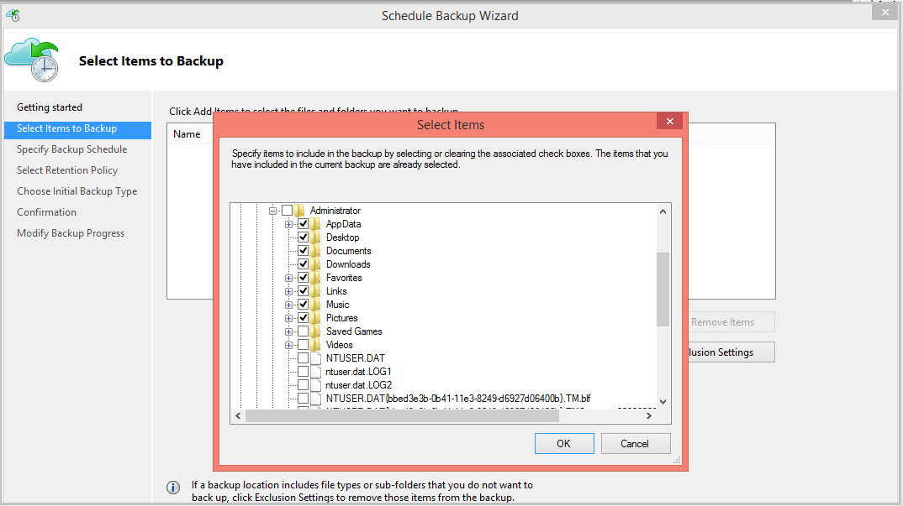
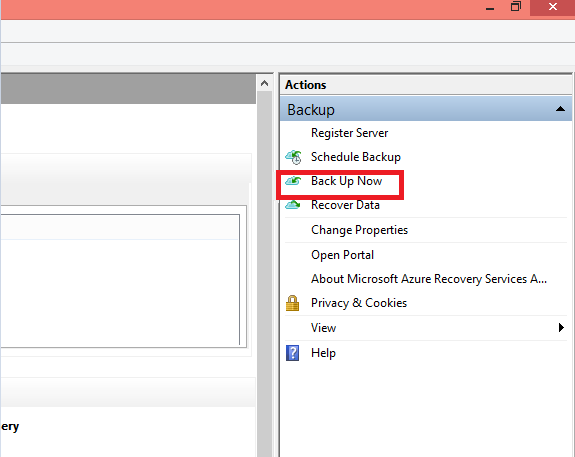
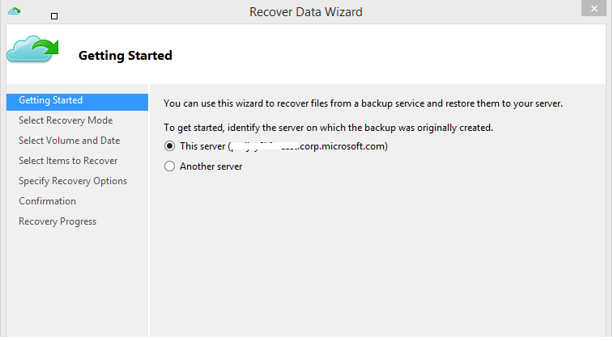
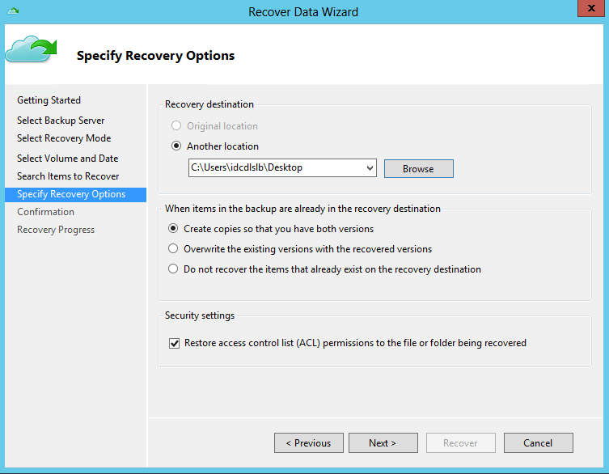

<properties
   pageTitle="Azure Backup - backup and restore from a Windows Server or Windows Client" | Microsoft Azure
   description="Learn how to backup and restore from a Windows Server or Windows Client. The article also covers alternate server recovery"
   services="backup"
   documentationCenter=""
   authors="aashishr"
   manager="jwhit"
   editor=""/>

<tags
   ms.service="backup"
   ms.workload="storage-backup-recovery"
	 ms.tgt_pltfrm="na"
	 ms.devlang="na"
	 ms.topic="article"
	 ms.date="08/18/2015"
	 ms.author="jimpark"; "aashishr"/>

# Back up and restore from a Windows server or Windows client machine
This article covers the steps required to back up from a Windows server or a Windows client machine. It also covers the steps required to restore the backed up files on the same machine and the steps required to restore the backed up files on any other machine.

## Backup files

1. Once the machine is registered, open the Microsoft Azure Backup mmc snap-in.

    

2. Click on **Schedule Backup**

    

3. Select the items which you wish to back up. Azure Backup on a Windows Server/Windows Client (i.e without System Center Data Protection Manager) enables you to protect files and folders.

    

4. Specify the backup schedule and retention policy which is explained in detail in the following [article](backup-azure-backup-cloud-as-tape.md)

5. Choose the method of sending the initial backup. Your choice of completing the initial seeding is dependent on the amount of data you wish to back up and your internet upload link speed. If you plan to back up GB’s/TB’s of data over a high latency, low bandwidth connection, it is recommended that you complete the initial backup by shipping a disk to the nearest Azure data center. This is called “Offline Backup” and is covered in detail in this [article](backup-azure-backup-import-export.md). If you have a sufficient bandwidth connection we recommend that you complete the initial backup over the network.

    

6. Once the process completes, go back to the mmc snap in and click **Back up Now** to complete the initial seeding over the network.

    

7. Once the initial seeding is completed, the **Jobs** view in the Azure Backup console indicates the status.

    

## Recover data on the same machine
If you accidentally deleted a file and wish to restore the file/volume on the same machine (from which the backup is taken), the following steps will help you recover the data.

1. Open the **Microsoft Azure Backup** snap in.

2. Click **Recover Data** to initiate the workflow.

    

3. Select **This server (*yourmachinename*)** option as you plan to restore the backed up file on the same machine.

    

4. You can choose to **Browse for files** or **Search for files**. Leave the default option if you plan to restore one or more files whose path is known. If you are not sure about the folder structure but would like to search for a file, pick the **Search for files** option. For the purpose of this section, we will proceed with the default option.

    

5. Select the volume from which you wish to restore the file. The screen enables you restore from any point in time. Dates which appear in **bold** in the calendar control indicate the availability of a restore point. Once a date is selected, based on your backup schedule (and the success of a backup operation), you can select a point in time from the **Time** drop down.

    

6. Select the items you wish to recover. You can multi-select folders/files which you wish to restore.

    

7. Specify the recovery parameters.

    

  - You have an option of restoring to the original location (in which the file/folder would be overwritten) or to another location in the same machine.
  - If the file/folder which you wish to restore, exists in the target location, you have the option to either create copies (two versions of the same file), or overwrite the files in the target location or skip the recovery of the files which exist in the target.
  - It is highly recommended that you leave the default option of restoring the ACLs on the files which are being recovered.

8. Once these inputs are provided, the recovery workflow starts which restores the files to this machine.

## Recover to an alternate machine
If your entire server is lost, you can still recover the file/volume in a different machine. The following steps illustrate the workflow.  

The nomenclature used in the steps are as follows:
- *Source machine* – The original machine from which the backup was taken and which is currently unavailable.
- *Target machine* – The machine on which the data is being retrieved.
- *Sample vault* – The Backup vault to which the *Source machine* and *Target machine* are registered.  

> [AZURE.NOTE] Backups taken from a machine cannot be restored on a machine which is running an earlier version of the operating system. For example, if backups are taken from a Windows 7 machine, it can be restored on a Windows 8 or above machine. However the vice-versa does not hold true.

1. Open the **Microsoft Azure Backup** snap in the *Target machine*.

2. Ensure that the *Target machine* and the *Source machine* are restored to the same backup vault.

3. Click **Recover Data** to initiate the workflow.

    

4. Select **Another server**

    

5. Provide the vault credential file which corresponds to the *Sample vault*. If the vault credential file is invalid (or expired), download a new vault credential file from the *Sample vault* in the Azure portal. Once the vault credential file is provided, the backup vault against the vault credential file is displayed.

6. Select the *Source machine* from the list of displayed machines.

    

7. As before, select either the **Search for files** or **Browse for files** option. For the purpose of this section, we will use the **Search for files** option.

    

8. Select the volume and date in the next screen. Search for the folder/file name you wish to restore.

    

9. Select the location to which the files need to be restored.

    

10. Provide the encryption passphrase that was provided during *Source machine’s* registration to *Sample vault*.

    

11. Once the input is provided, click on the **Recover** button which triggers the restore of the backed up files in the destination provided.

## Video walkthrough

Here's a video walkthrough of this tutorial.

[AZURE.VIDEO azurebackuprestoreserverandclient]

## Next Steps
- [Azure Backup FAQ](backup-azure-backup-faq.md)
