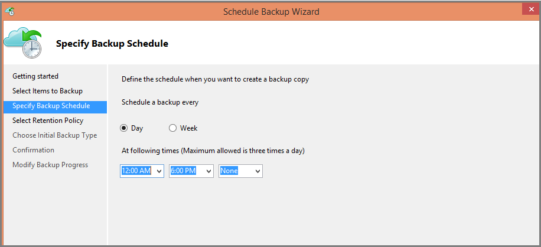
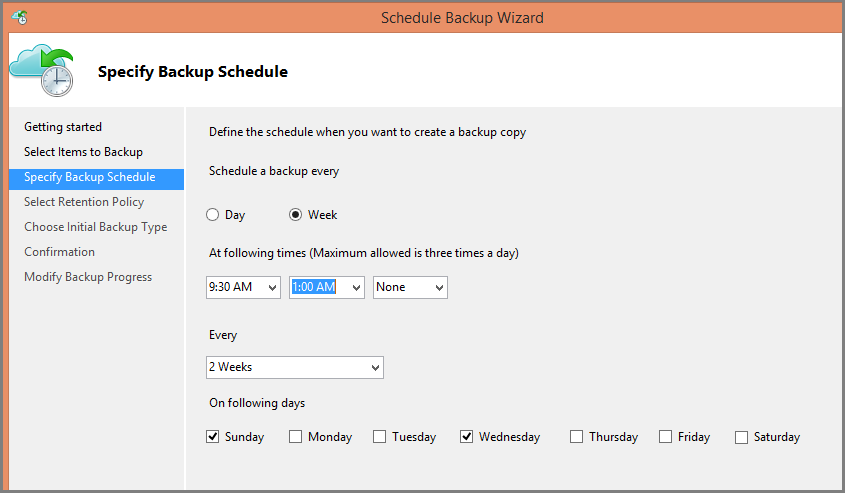
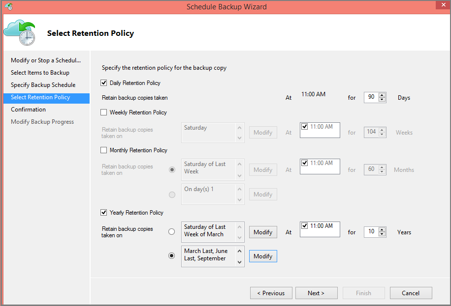
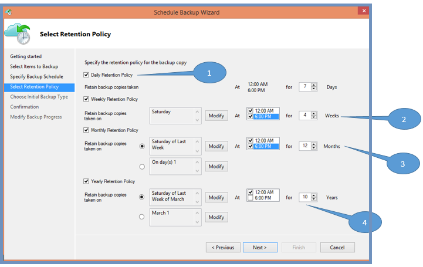
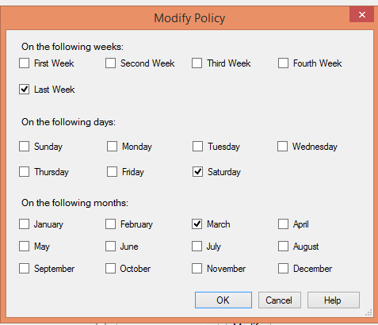

<properties
   pageTitle="Use Azure Backup to replace your tape infrastructure | Microsoft Azure"
   description="Learn how Azure Backup provides tape-like semantics which enables you to backup and restore data in Azure"
   services="backup"
   documentationCenter=""
   authors="trinadhk"
   manager="vijayts"
   editor=""/>
<tags
   ms.service="backup"
   ms.devlang="na"
   ms.topic="article"
   ms.tgt_pltfrm="na"
   ms.workload="storage-backup-recovery"
   ms.date="06/08/2016"
   ms.author="jimpark;trinadhk;markgal"/>

# Use Azure Backup to replace your tape infrastructure
Azure Backup and System Center Data Protection Manager customers can:

- Back up data in schedules which best suit their organization needs
- Retain the backup data for longer periods
- Make Azure a part of their long term retention needs (instead of tape).

This article explains how customers can enable backup and retention policies. Customers who use tapes to address their long-term-retention needs now have a powerful and viable alternative with the availability of this feature. The feature is enabled in the latest release of the Azure Backup (which is available [here](http://aka.ms/azurebackup_agent)). SCDPM customers will need to move to UR5 before using this feature.

## What is the Backup Schedule?
The backup schedule indicates the frequency of the backup operation. For example, the settings in the screen below indicate that backups will be taken daily at 6pm and at midnight.

Customers can also schedule a weekly backup. For example, the settings in the screen below indicate that backups will be taken every alternate Sunday & Wednesday at 9.30am and 1am.

## What is the Retention Policy?
The retention policy specifies the duration for which the backup must be stored. Rather than just specifying a “flat policy” for all backup points, customers can specify different retention policies based on when the backup is taken. For example, the backup point taken at the end of each quarter may need to be preserved for a longer duration for audit purposes while the backup point taken daily, which serves as an operational recovery point, needs to be preserved for 90 days.

The total number of “retention points” specified in this policy is 90 (daily points) + 40 (one each quarter for 10 years) = 130.

## Example – Putting both together

1. **Daily retention policy**: Backups taken daily are stored for 7 days.
2. **Weekly retention policy**: Backups taken every day at midnight and 6pm Saturday will be preserved for 4 weeks
3. **Monthly retention policy**: Backups taken at midnight and 6pm on the last Saturday of each month will be preserved for 12months
4. **Yearly retention policy**: Backups taken at midnight on the last Saturday of every March will be preserved for 10 years

The total number of “retention points” (points from which a customer can restore data) in the above diagram is computed as follows:

- 2 points per day for 7 days = 14 recovery points
- 2 points per week for 4 weeks = 8 recovery points
- 2 points per month for 12 months = 24 recovery points
- 1 point per year per 10 years = 10 recovery points

The total number of recovery points is 56.

> [AZURE.NOTE] Azure backup doesn't have a restriction on number of recovery points.

## Advanced configuration
By clicking **Modify** in the above screen, customers have further flexibility in specifying retention schedules.

## Next Steps
For more information about Azure Backup see

- [Introduction to Azure Backup](backup-introduction-to-azure-backup.md)
- [Try Azure Backup](backup-try-azure-backup-in-10-mins.md)
