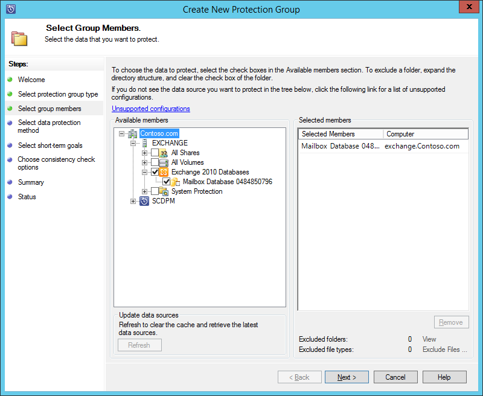
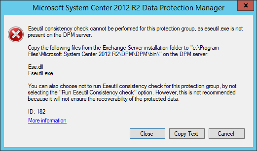
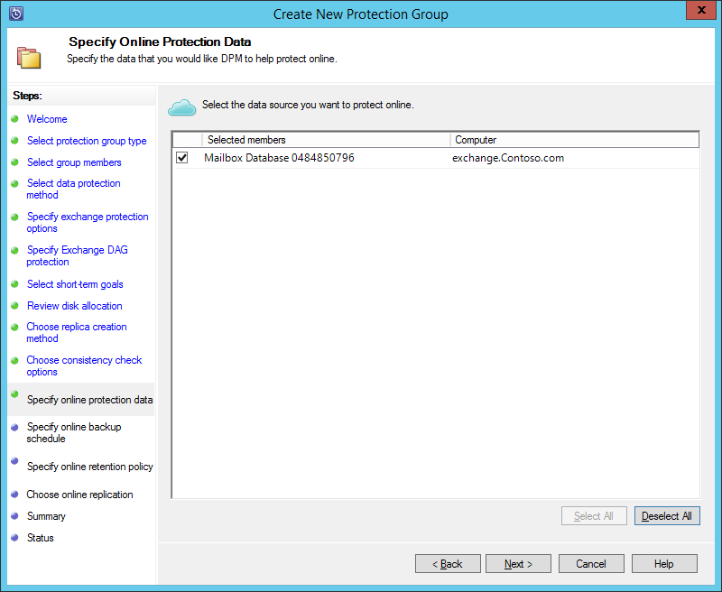
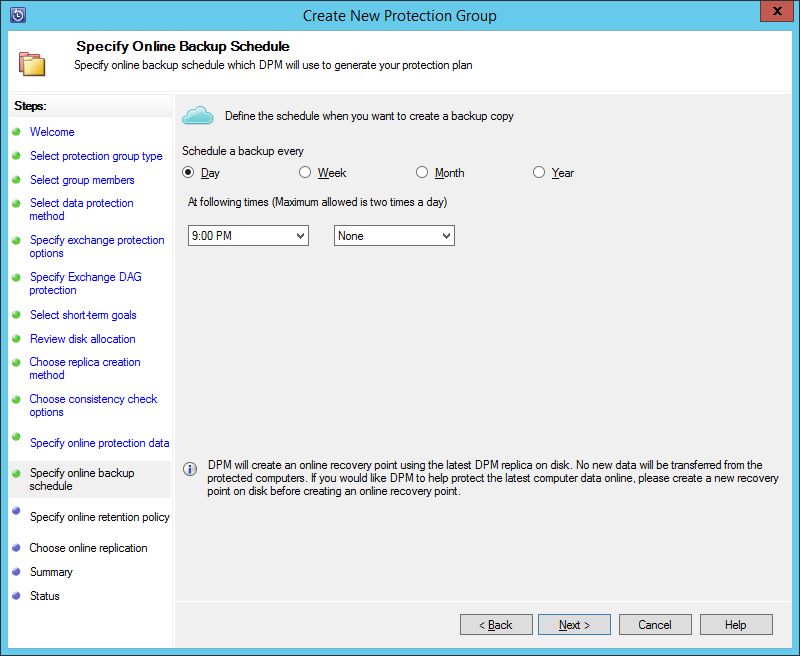
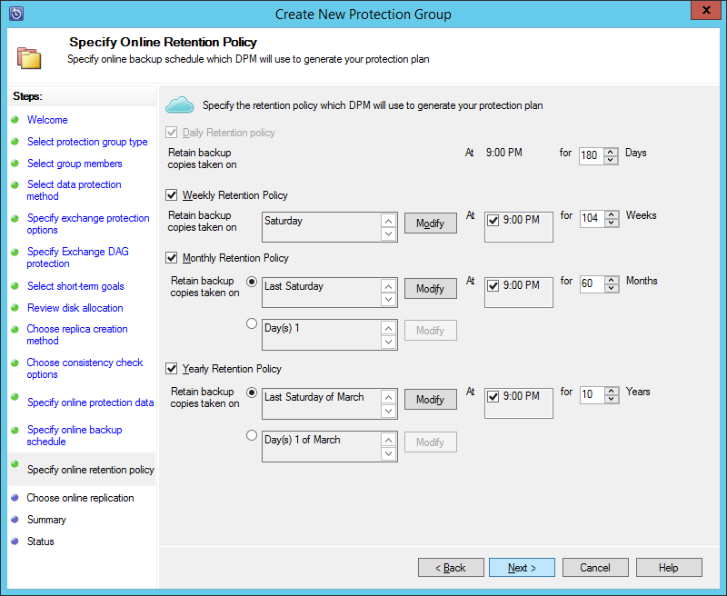
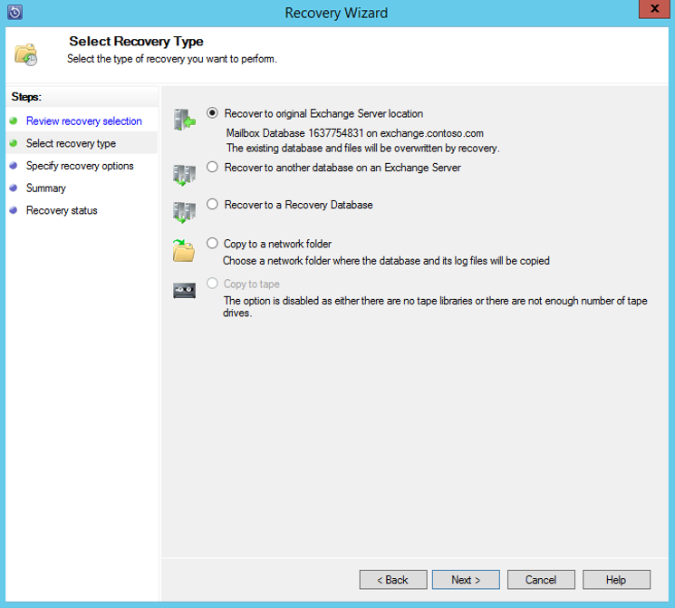

# Back up an Exchange server to Azure Backup with System Center 2012 R2 DPM

This article describes how to configure a System Center 2012 R2 Data Protection Manager (DPM) server to back up a Microsoft Exchange server to Azure Backup.  

## Updates

To successfully register the DPM server with Azure Backup, you must install the latest update rollup for System Center 2012 R2 DPM and the latest version of the Azure Backup Agent. Get the latest update rollup from the [Microsoft Catalog](https://catalog.update.microsoft.com/v7/site/Search.aspx?q=System%20Center%202012%20R2%20Data%20protection%20manager).

> [!NOTE]
> For the examples in this article, version 2.0.8719.0 of the Azure Backup Agent is installed, and Update Rollup 6 is installed on System Center 2012 R2 DPM.
>
>

## Prerequisites

Before you continue, make sure that all the [prerequisites](backup-azure-dpm-introduction.md#prerequisites-and-limitations) for using Microsoft Azure Backup to protect workloads have been met. These prerequisites include the following:

* A backup vault on the Azure site has been created.
* Agent and vault credentials have been downloaded to the DPM server.
* The agent is installed on the DPM server.
* The vault credentials were used to register the DPM server.
* If you are protecting Exchange 2016, please upgrade to DPM 2012 R2 UR9 or later

## DPM protection agent

To install the DPM protection agent on the Exchange server, follow these steps:

1. Make sure that the firewalls are correctly configured. See [Configure firewall exceptions for the agent](https://docs.microsoft.com/system-center/dpm/configure-firewall-settings-for-dpm?view=sc-dpm-2019).
2. Install the agent on the Exchange server by clicking **Management > Agents > Install** in DPM Administrator Console. See [Install the DPM protection agent](https://docs.microsoft.com/system-center/dpm/deploy-dpm-protection-agent?view=sc-dpm-2019) for detailed steps.

## Create a protection group for the Exchange server

1. In the DPM Administrator Console, click **Protection**, and then click **New** on the tool ribbon to open the **Create New Protection Group** wizard.
2. On the **Welcome** screen of the wizard, click **Next**.
3. On the **Select protection group type** screen, select **Servers** and click **Next**.
4. Select the Exchange server database that you want to protect and click **Next**.

   > [!NOTE]
   > If you are protecting Exchange 2013, check the [Exchange 2013 prerequisites](https://docs.microsoft.com/system-center/dpm/back-up-exchange?view=sc-dpm-2016).
   >
   >

    In the following example, the Exchange 2010 database is selected.

    
5. Select the data protection method.

    Name the protection group, and then select both of the following options:

   * I want short-term protection using Disk.
   * I want online protection.
6. Click **Next**.
7. Select the **Run Eseutil to check data integrity** option if you want to check the integrity of the Exchange Server databases.

    After you select this option, backup consistency checking will be run on the DPM server to avoid the I/O traffic that's generated by running the **eseutil** command on the Exchange server.

   > [!NOTE]
   > To use this option, you must copy the Ese.dll and Eseutil.exe files to the C:\Program Files\Microsoft System Center 2012 R2\DPM\DPM\bin directory on the DPM server. Otherwise, the following error is triggered:  
   > 
   >
   >
8. Click **Next**.
9. Select the database for **Copy Backup**, and then click **Next**.

   > [!NOTE]
   > If you do not select "Full backup" for at least one DAG copy of a database, logs will not be truncated.
   >
   >
10. Configure the goals for **Short-Term backup**, and then click **Next**.
11. Review the available disk space, and then click **Next**.
12. Select the time at which the DPM server will create the initial replication, and then click **Next**.
13. Select the consistency check options, and then click **Next**.
14. Choose the database that you want to back up to Azure, and then click **Next**. For example:

    
15. Define the schedule for **Azure Backup**, and then click **Next**. For example:

    

    > [!NOTE]
    > Note Online recovery points are based on express full recovery points. Therefore, you must schedule the online recovery point after the time that's specified for the express full recovery point.
    >
    >
16. Configure the retention policy for **Azure Backup**, and then click **Next**.
17. Choose an online replication option and click **Next**.

    If you have a large database, it could take a long time for the initial backup to be created over the network. To avoid this issue, you can create an offline backup.  

    
18. Confirm the settings, and then click **Create Group**.
19. Click **Close**.

## Recover the Exchange database

1. To recover an Exchange database, click **Recovery** in the DPM Administrator Console.
2. Locate the Exchange database that you want to recover.
3. Select an online recovery point from the *recovery time* drop-down list.
4. Click **Recover** to start the **Recovery Wizard**.

For online recovery points, there are five recovery types:

* **Recover to original Exchange Server location:** The data will be recovered to the original Exchange server.
* **Recover to another database on an Exchange Server:** The data will be recovered to another database on another Exchange server.
* **Recover to a Recovery Database:** The data will be recovered to an Exchange Recovery Database (RDB).
* **Copy to a network folder:** The data will be recovered to a network folder.
* **Copy to tape:** If you have a tape library or a stand-alone tape drive attached and configured on the DPM server, the recovery point will be copied to a free tape.

    

## Next steps

* [Azure Backup FAQ](backup-azure-backup-faq.md)
