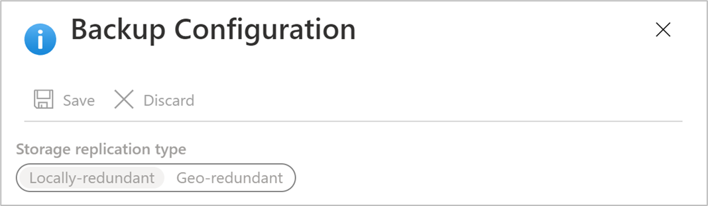

# Azure Backup - Frequently asked questions

This article answers common questions about the Azure Backup service.

## Recovery services vault

### Is there any limit on the number of vaults that can be created in each Azure subscription?

Yes. You can create up to 500 Recovery Services vaults, per supported region of Azure Backup, per subscription. If you need additional vaults, create an additional subscription.

### Are there limits on the number of servers/machines that can be registered against each vault?

You can register up to 1000 Azure Virtual machines per vault. If you're using the Microsoft Azure Backup Agent, you can register up to 50 MARS agents per vault. And you can register 50 MABS servers/DPM servers to a vault.

### How many datasources/items can be protected in a vault?

You can protect up to 2000 datasources/items across all workloads (IaaS VM, SQL, AFS, etc.) in a vault.
For example, if you've already protected 500 VMs and 400 Azure Files shares in the vault, you can only protect up to 1100 SQL databases in it.

### How many policies can I create per vault?

You can only have up to 200 policies per vault.

### If my organization has one vault, how can I isolate data from different servers in the vault when restoring data?

Server data that you want to recover together should use the same passphrase when you set up backup. If you want to isolate recovery to a specific server or servers, use a passphrase for that server or servers only. For example, human resources servers could use one encryption passphrase, accounting servers another, and storage servers a third.

### Can I move my vault between subscriptions?

Yes. To move a Recovery Services vault, refer this [article](backup-azure-move-recovery-services-vault.md)

### Can I move backup data to another vault?

No. Backup data stored in a vault can't be moved to a different vault.

### Can I change from GRS to LRS after a backup?

The storage replication type by default is set to geo-redundant storage (GRS). Once you configure the backup, the option to modify is disabled and can't be changed.

Before deciding to move from GRS to locally redundant storage (LRS), review the trade-offs between lower cost and higher data durability that fit your scenario. If you must move from GRS to LRS, then you have two choices. They depend on your business requirements to retain the backup data:

- [Don’t need to preserve previous backed-up data](#dont-need-to-preserve-previous-backed-up-data)
- [Must preserve previous backed-up data](#must-preserve-previous-backed-up-data)

### Don’t need to preserve previous backed-up data

To protect workloads in a new LRS vault, the current protection and data will need to be deleted in the GRS vault and backups configured again.

>[!WARNING]
>The following operation is destructive and can't be undone. All backup data and backup items associated with the protected server will be permanently deleted. Proceed with caution.

Stop and delete current protection on the GRS vault:

1. Disable soft delete in the GRS vault properties. Follow [these steps](backup-azure-security-feature-cloud.md#disabling-soft-delete-using-azure-portal) to disable soft delete.

1. Stop protection and delete backups from the existing GRS vault. In the Vault dashboard menu, select **Backup Items**. Items listed here that need to be moved to the LRS vault must be removed along with their backup data. See how to [delete protected items in the cloud](backup-azure-delete-vault.md#delete-protected-items-in-the-cloud) and [delete protected items on premises](backup-azure-delete-vault.md#delete-protected-items-on-premises).

1. If you're planning to move AFS (Azure file shares), SQL servers or SAP HANA servers, then you'll need also to unregister them. In the vault dashboard menu, select **Backup Infrastructure**. See how to [unregister the SQL server](manage-monitor-sql-database-backup.md#unregister-a-sql-server-instance), [unregister a storage account associated with Azure file shares](manage-afs-backup.md#unregister-a-storage-account), and [unregister an SAP HANA instance](sap-hana-db-manage.md#unregister-an-sap-hana-instance).

1. Once they're removed from the GRS vault, continue to configure the backups for your workload in the new LRS vault.

### Must preserve previous backed-up data

If you need to keep the current protected data in the GRS vault and continue the protection in a new LRS vault, there are limited options for some of the workloads:

- For MARS, you can [stop protection with retain data](backup-azure-manage-mars.md#stop-protecting-files-and-folder-backup) and register the agent in the new LRS vault.

  - Azure Backup service will continue to retain all the existing recovery points of the GRS vault.
  - You'll need to pay to keep the recovery points in the GRS vault.
  - You'll be able to restore the backed-up data only for unexpired recovery points in the GRS vault.
  - A new initial replica of the data will need to be created on the LRS vault.

- For an Azure VM, you can [stop protection with retain data](backup-azure-manage-vms.md#stop-protecting-a-vm) for the VM in the GRS vault, move the VM to another resource group, and then protect the VM in the LRS vault. See [guidance and limitations](https://docs.microsoft.com/azure/azure-resource-manager/management/move-limitations/virtual-machines-move-limitations) for moving a VM to another resource group.

  A VM can be protected in only one vault at a time. However, the VM in the new resource group can be protected on the LRS vault as it is considered a different VM.

  - Azure Backup service will retain the recovery points that have been backed up on the GRS vault.
  - You'll need to pay to keep the recovery points in the GRS vault (see [Azure Backup pricing](azure-backup-pricing.md) for details).
  - You'll be able to restore the VM, if needed, from the GRS vault.
  - The first backup on the LRS vault of the VM in the new resource will be an initial replica.

### Can I do an Item Level Restore (ILR) for VMs backed up to a Recovery Services vault?

- ILR is supported for Azure VMs backed up by Azure VM backup. For more information, see [article](backup-azure-restore-files-from-vm.md)
- ILR isn't supported for online recovery points of on-premises VMs backed up by Azure backup Server or System Center DPM.

## Azure Backup agent

### Where can I find common questions about the Azure Backup agent for Azure VM backup?

- For the agent running on Azure VMs, read this [FAQ](backup-azure-vm-backup-faq.md).
- For the agent used to back up Azure file folders, read this [FAQ](backup-azure-file-folder-backup-faq.md).

## General backup

### Are there limits on backup scheduling?

Yes.

- You can back up Windows Server or Windows machines up to three times a day. You can set the scheduling policy to daily or weekly schedules.
- You can back up DPM up to twice a day. You can set the scheduling policy to daily, weekly, monthly, and yearly.
- You back up Azure VMs once a day.

### What operating systems are supported for backup?

Azure Backup supports these operating systems for backing up files and folders, and apps protected by Azure Backup Server and DPM.

**OS** | **SKU** | **Details**
--- | --- | ---
Workstation | |
Windows 10 64 bit | Enterprise, Pro, Home | Machines should be running the latest services packs and updates.
Windows 8.1 64 bit | Enterprise, Pro | Machines should be running the latest services packs and updates.
Windows 8 64 bit | Enterprise, Pro | Machines should be running the latest services packs and updates.
Windows 7 64 bit | Ultimate, Enterprise, Professional, Home Premium, Home Basic, Starter | Machines should be running the latest services packs and updates.
Server | |
Windows Server 2019 64 bit | Standard, Datacenter, Essentials | With the latest service packs/updates.
Windows Server 2016 64 bit | Standard, Datacenter, Essentials | With the latest service packs/updates.
Windows Server 2012 R2 64 bit | Standard, Datacenter, Foundation | With the latest service packs/updates.
Windows Server 2012 64 bit | Datacenter, Foundation, Standard | With the latest service packs/updates.
Windows Storage Server 2016 64 bit | Standard, Workgroup | With the latest service packs/updates.
Windows Storage Server 2012 R2 64 bit | Standard, Workgroup, Essential | With the latest service packs/updates.
Windows Storage Server 2012 64 bit | Standard, Workgroup | With the latest service packs/updates.
Windows Server 2008 R2 SP1 64 bit | Standard, Enterprise, Datacenter, Foundation | With the latest updates.
Windows Server 2008 64 bit | Standard, Enterprise, Datacenter | With latest updates.

Azure Backup doesn't support 32-bit operating systems.

For Azure VM Linux backups, Azure Backup supports [the list of distributions endorsed by Azure](../virtual-machines/linux/endorsed-distros.md), except Core OS Linux and 32-bit operating system. Other bring-your-own Linux distributions might work as long as the VM agent is available on the VM, and support for Python exists.

### Are there size limits for data backup?

Sizes limits are as follows:

OS/machine | Size limit of data source
--- | ---
Windows 8 or later | 54,400 GB
Windows 7 |1700 GB
Windows Server 2012 or later | 54,400 GB
Windows Server 2008, Windows Server 2008 R2 | 1700 GB
Azure VM | See the [support matrix for Azure VM backup](https://docs.microsoft.com/azure/backup/backup-support-matrix-iaas#vm-storage-support)

### How is the data source size determined?

The following table explains how each data source size is determined.

**Data source** | **Details**
--- | ---
Volume |The amount of data being backed up from single volume VM being backed up.
SQL Server database |Size of single database size being backed up.
SharePoint | Sum of the content and configuration databases within a SharePoint farm being backed up.
Exchange |Sum of all Exchange databases in an Exchange server being backed up.
BMR/System state |Each individual copy of BMR or system state of the machine being backed up.

### Is there a limit on the amount of data backed up using a Recovery Services vault?

There is no limit on the total amount of data you can back up using a Recovery Services vault. The individual data sources (other than Azure VMs), can be a maximum of 54,400 GB in size. For more information about limits, see the [vault limits section in the support matrix](https://docs.microsoft.com/azure/backup/backup-support-matrix#vault-support).

### Why is the size of the data transferred to the Recovery Services vault smaller than the data selected for backup?

Data backed up from Azure Backup Agent, DPM, and Azure Backup Server is compressed and encrypted before being transferred. With compression and encryption is applied, the data in the vault is 30-40% smaller.

### Can I delete individual files from a recovery point in the vault?

No, Azure Backup doesn't support deleting or purging individual items from stored backups.

### If I cancel a backup job after it starts, is the transferred backup data deleted?

No. All data that was transferred into the vault before the backup job was canceled remains in the vault.

- Azure Backup uses a checkpoint mechanism to occasionally add checkpoints to the backup data during the backup.
- Because there are checkpoints in the backup data, the next backup process can validate the integrity of the files.
- The next backup job will be incremental to the data previously backed up. Incremental backups only transfer new or changed data, which equates to better utilization of bandwidth.

If you cancel a backup job for an Azure VM, any transferred data is ignored. The next backup job transfers incremental data from the last successful backup job.

## Retention and recovery

### Are the retention policies for DPM and Windows machines without DPM the same?

Yes, they both have daily, weekly, monthly, and yearly retention policies.

### Can I customize retention policies?

Yes, you have customize policies. For example, you can configure weekly and daily retention requirements, but not yearly and monthly.

### Can I use different times for backup scheduling and retention policies?

No. Retention policies can only be applied on backup points. For example, this image shows a retention policy for backups taken at 12am and 6pm.

### If a backup is kept for a long time, does it take more time to recover an older data point?

No. The time to recover the oldest or the newest point is the same. Each recovery point behaves like a full point.

### If each recovery point is like a full point, does it impact the total billable backup storage?

Typical long-term retention point products store backup data as full points.

- The full points are storage *inefficient* but are easier and faster to restore.
- Incremental copies are storage *efficient* but require you to restore a chain of data, which impacts your recovery time

Azure Backup storage architecture gives you the best of both worlds by optimally storing data for fast restores and incurring low storage costs. This ensures that your ingress and egress bandwidth is used efficiently. The amount of data storage, and the time needed to recover the data, is kept to a minimum. Learn more about [incremental backups](https://azure.microsoft.com/blog/microsoft-azure-backup-save-on-long-term-storage/).

### Is there a limit on the number of recovery points that can be created?

You can create up to 9999 recovery points per protected instance. A protected instance is a computer, server (physical or virtual), or workload that backs up to Azure.

- Learn more about [backup and retention](./backup-support-matrix.md).

### How many times can I recover data that's backed up to Azure?

There is no limit on the number of recoveries from Azure Backup.

### When restoring data, do I pay for the egress traffic from Azure?

No. Recovery is free and you aren't charged for the egress traffic.

### What happens when I change my backup policy?

When a new policy is applied, schedule and retention of the new policy is followed.

- If retention is extended, existing recovery points are marked to keep them according to new policy.
- If retention is reduced, they are marked for pruning in the next cleanup job and subsequently deleted.

## Encryption

### Is the data sent to Azure encrypted?

Yes. Data is encrypted on the on-premises machine using AES256. The data is sent over a secure HTTPS link. The data transmitted in cloud is protected by HTTPS link only between storage and recovery service. iSCSI protocol secures the data transmitted between recovery service and user machine. Secure tunneling is used to protect the iSCSI channel.

### Is the backup data on Azure encrypted as well?

Yes. The data in Azure is encrypted-at-rest.

- For on-premises backup, encryption-at-rest is provided using the passphrase you provide when backing up to Azure.
- For Azure VMs, data is encrypted-at-rest using Storage Service Encryption (SSE).

Microsoft does not decrypt the backup data at any point.

### What is the minimum length of the encryption key used to encrypt backup data?

The encryption key should be at least 16 characters when you are using Azure backup agent. For Azure VMs, there is no limit to length of keys used by Azure KeyVault.

### What happens if I misplace the encryption key? Can I recover the data? Can Microsoft recover the data?

The key used to encrypt the backup data is present only on your site. Microsoft does not maintain a copy in Azure and does not have any access to the key. If you misplace the key, Microsoft can't recover the backup data.

## Next steps

Read the other FAQs:

- [Common questions](backup-azure-vm-backup-faq.md) about Azure VM backups.
- [Common questions](backup-azure-file-folder-backup-faq.md) about the Azure Backup agent
