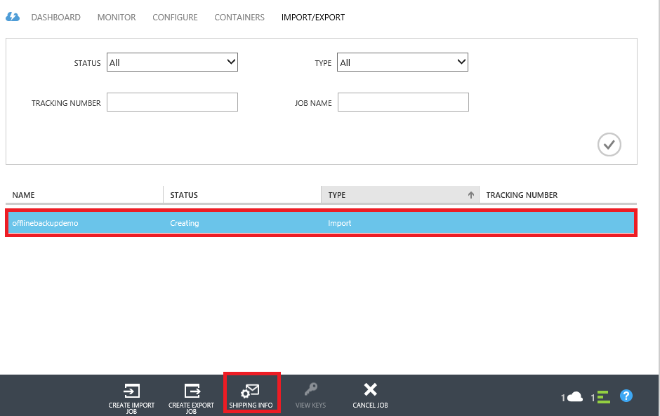
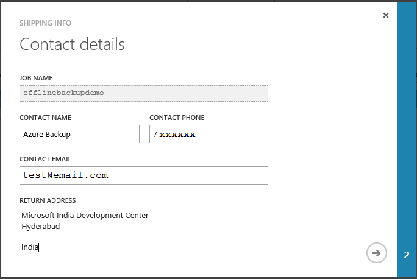
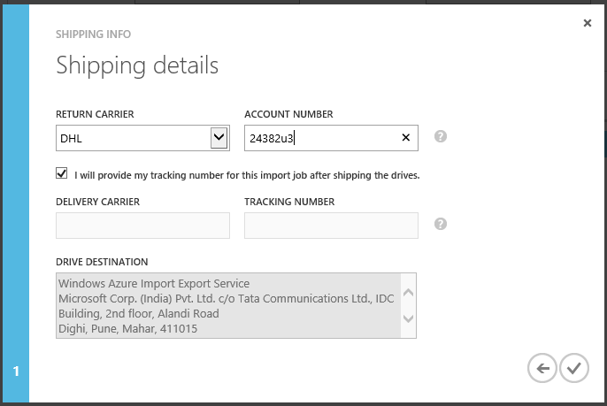
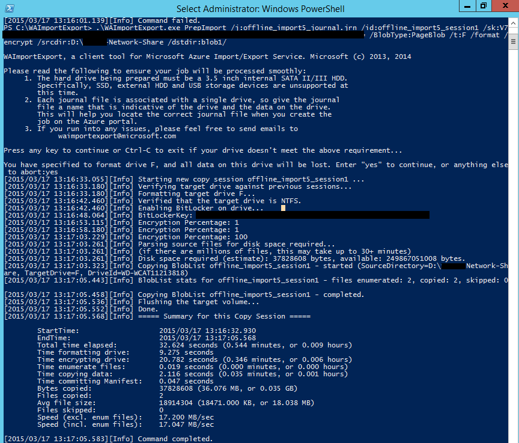
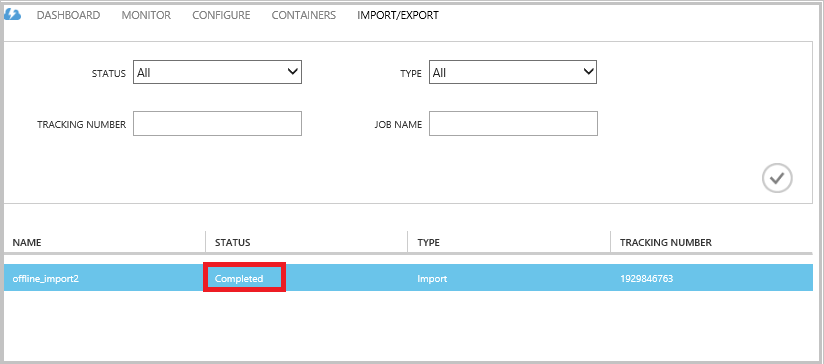

# Offline-backup workflow in Azure Backup
Azure Backup has several built-in efficiencies that save network and storage costs during the initial full backups of data to Azure. Initial full backups typically transfer large amounts of data and require more network bandwidth when compared to subsequent backups that transfer only the deltas/incrementals. Azure Backup compresses the initial backups. Through the process of offline seeding, Azure Backup can use disks to upload the compressed initial backup data offline to Azure.  

The offline-seeding process of Azure Backup is tightly integrated with the [Azure Import/Export service](../storage/storage-import-export-service.md) that enables you to transfer data to Azure by using disks. If you have terabytes (TBs) of initial backup data that needs to be transferred over a high-latency and low-bandwidth network, you can use the offline-seeding workflow to ship the initial backup copy on one or more hard drives to an Azure datacenter. This article provides an overview of the steps that complete this workflow.

## Overview
With the offline-seeding capability of Azure Backup and Azure Import/Export, it is simple to upload the data offline to Azure by using disks. Instead of transferring the initial full copy over the network, the backup data is written to a *staging location*. After the copy to the staging location is completed by using the Azure Import/Export tool, this data is written to one or more SATA drives, depending on the amount of data. These drives are eventually shipped to the nearest Azure datacenter.

The [August 2016 update of Azure Backup (and later)](http://go.microsoft.com/fwlink/?LinkID=229525) includes the *Azure Disk Preparation tool*, named AzureOfflineBackupDiskPrep, that:

* Helps you prepare your drives for Azure Import by using the Azure Import/Export tool.
* Automatically creates an Azure Import job for the Azure Import/Export service on the [Azure classic portal](https://manage.windowsazure.com) as opposed to creating the same manually with older versions of Azure Backup.

After the upload of the backup data to Azure is finished, Azure Backup copies the backup data to the backup vault and the incremental backups are scheduled.

> [!NOTE]
> To use the Azure Disk Preparation tool, ensure that you have installed the August 2016 update of Azure Backup (or later), and perform all the steps of the workflow with it. If you are using an older version of Azure Backup, you can prepare the SATA drive by using the Azure Import/Export tool as detailed in later sections of this article.
>
>

## Prerequisites
* [Familiarize yourself with the Azure Import/Export workflow](../storage/storage-import-export-service.md).
* Before initiating the workflow, ensure the following:
  * An Azure Backup vault has been created.
  * Vault credentials have been downloaded.
  * The Azure Backup agent has been installed on either Windows Server/Windows client or System Center Data Protection Manager server, and the computer is registered with the Azure Backup vault.
* [Download the Azure Publish file settings](https://manage.windowsazure.com/publishsettings) on the computer from which you plan to back up your data.
* Prepare a staging location, which might be a network share or additional drive on the computer. The staging location is transient storage and is used temporarily during this workflow. Ensure that the staging location has enough disk space to hold your initial copy. For example, if you are trying to back up a 500-GB file server, ensure that the staging area is at least 500 GB. (A smaller amount is used due to compression.)
* Make sure that you’re using a supported drive. Only 2.5 inch SSD, or 2.5 or 3.5-inch SATA II/III internal hard drives are supported for use with the Import/Export service. You can use hard drives up to 10 TB. Check the [Azure Import/Export service documentation](../storage/storage-import-export-service.md#hard-disk-drives) for the latest set of drives that the service supports.
* Enable BitLocker on the computer to which the SATA drive writer is connected.
* [Download the Azure Import/Export tool](http://go.microsoft.com/fwlink/?LinkID=301900&clcid=0x409) to the computer to which the SATA drive writer is connected. This step is not required if you have downloaded and installed the August 2016 update of Azure Backup (or later).

## Workflow
The information in this section helps you complete the offline-backup workflow so that your data can be delivered to an Azure datacenter and uploaded to Azure Storage. If you have questions about the Import service or any aspect of the process, see the [Import service overview](../storage/storage-import-export-service.md) documentation referenced earlier.

### Initiate offline backup
1. When you schedule a backup, you see the following screen (in Windows Server, Windows client, or System Center Data Protection Manager).

    

    Here's the corresponding screen in System Center Data Protection Manager:  
    

    The description of the inputs is as follows:

    * **Staging Location**: The temporary storage location to which the initial backup copy is written. This might be on a network share or a local computer. If the copy computer and source computer are different, we recommended that you specify the full network path of the staging location.
    * **Azure Import Job Name**: The unique name by which Azure Import service and Azure Backup track the transfer of data sent on disks to Azure.
    * **Azure Publish Settings**: An XML file that contains information about your subscription profile. It also contains secure credentials that are associated with your subscription. You can [download the file](https://manage.windowsazure.com/publishsettings). Provide the local path to the publish settings file.
    * **Azure Subscription ID**: The Azure subscription ID for the subscription where you plan to initiate the Azure Import job. If you have multiple Azure subscriptions, use the ID of the subscription that you want to associate with the import job.
    * **Azure Storage Account**: The classic type storage account in the provided Azure subscription that will be associated with the Azure Import job.
    * **Azure Storage Container**: The name of the destination storage blob in the Azure storage account where this job’s data is imported.

    > [!NOTE]
    > If you have registered your server to an Azure Recovery Services vault from the [Azure portal](https://portal.azure.com) for your backups and are not on a Cloud Solution Provider (CSP) subscription, you can still create a classic type storage account from the Azure portal and use it for the offline-backup workflow.
    >
    >

     Save all this information because you need to enter it again in following steps. Only the *staging location* is required if you used the Azure Disk Preparation tool to prepare the disks.    
2. Complete the workflow, and then select **Back Up Now** in the Azure Backup management console to initiate the offline-backup copy. The initial backup is written to the staging area as part of this step.

    

    To complete the corresponding workflow in System Center Data Protection Manager, right-click the **Protection Group**, and then choose the **Create recovery point** option. You then choose the **Online Protection** option.

    

    After the operation finishes, the staging location is ready to be used for disk preparation.

    

### Prepare a SATA drive and create an Azure Import job by using the Azure Disk Preparation tool
The Azure Disk Preparation tool is available in installation directory of the Recovery Services agent (August 2016 update and later) in the following path.

   *\Microsoft* *Azure* *Recovery* *Services* *Agent\Utils\*

1. Go to the directory, and copy the **AzureOfflineBackupDiskPrep** directory to a copy computer on which the drives to be prepared are mounted. Ensure the following with regard to the copy computer:

    * The copy computer can access the staging location for the offline-seeding workflow by using the same network path that was provided in the **Initiate offline backup** workflow.
    * BitLocker is enabled on the computer.
    * The computer can access the Azure portal.

    If necessary, the copy computer can be the same as the source computer.
2. Open an elevated command prompt on the copy computer with the Azure Disk Preparation tool directory as the current directory, and run the following command:

    `*.\AzureOfflineBackupDiskPrep.exe*   s:<*Staging Location Path*>   [p:<*Path to PublishSettingsFile*>]`

    | Parameter | Description |
    | --- | --- |
    | s:&lt;*Staging Location Path*&gt; |Mandatory input that's used to provide the path to the staging location that you entered in the **Initiate offline backup** workflow. |
    | p:&lt;*Path to PublishSettingsFile*&gt; |Optional input that's used to provide the path to the **Azure Publish Settings** file that you entered in the **Initiate offline backup** workflow. |

    > [!NOTE]
    > The &lt;Path to PublishSettingFile&gt; value is mandatory when the copy computer and source computer are different.
    >
    >

    When you run the command, the tool requests the selection of the Azure Import job that corresponds to the drives that need to be prepared. If only a single import job is associated with the provided staging location, you see a screen like the one that follows.

      
3. Enter the drive letter without the trailing colon for the mounted disk that you want to prepare for transfer to Azure. Provide confirmation for the formatting of the drive when prompted.

    The tool then begins to prepare the disk with the backup data. You may need to attach additional disks when prompted by the tool in case the provided disk does not have sufficient space for the backup data.  

    At the end of successful execution of the tool, one or more disks that you provided are prepared for shipping to Azure. In addition, an import job with the name you provided during the **Initiate offline backup** workflow is created on the Azure classic portal. Finally, the tool displays the shipping address to the Azure datacenter where the disks need to be shipped and the link to locate the import job on the Azure classic portal.

     

4. Ship the disks to the address that the tool provided and keep the tracking number for future reference. 

5. When you go to the link that the tool displayed, you see the Azure storage account that you specified in the **Initiate offline backup** workflow. Here you can see the newly created import job on the **IMPORT/EXPORT** tab of the storage account.

     

6. Click **SHIPPING INFO** at the bottom of the page to update your contact details as shown in the following screen. Microsoft uses this info to ship your disks back to you after the import job is finished.

     

7. Enter the shipping details on the next screen. Provide the **Delivery Carrier** and **Tracking Number** details that correspond to the disks that you shipped to the Azure datacenter.

     

### Complete the workflow
After the import job finishes, initial backup data is available in your storage account. The Recovery Services agent then copies the contents of the data from this account to the Backup vault or Recovery Services vault, whichever is applicable. In the next scheduled backup time, the Azure Backup agent performs the incremental backup over the initial backup copy.

> [!NOTE]
> The following sections apply to users of earlier versions of Azure Backup who do not have access to the Azure Disk Preparation tool.
>
>

### Prepare a SATA drive
1. Download the [Microsoft Azure Import/Export Tool](http://go.microsoft.com/fwlink/?linkid=301900&clcid=0x409) to the copy computer. Ensure that the staging location is accessible from the computer in which you plan to run the next set of commands. If necessary, the copy computer can be the same as the source computer.

2. Unzip the WAImportExport.zip file. Run the WAImportExport tool that formats the SATA drive, writes the backup data to the SATA drive, and encrypts it. Before you run the following command, ensure that BitLocker is enabled on the computer.  

    `*.\WAImportExport.exe PrepImport /j:<*JournalFile*>.jrn /id: <*SessionId*> /sk:<*StorageAccountKey*> /BlobType:**PageBlob** /t:<*TargetDriveLetter*> /format /encrypt /srcdir:<*staging location*> /dstdir: <*DestinationBlobVirtualDirectory*>/*`

    > [!NOTE]
    > If you have installed the August 2016 update of Azure Backup (or later), ensure that the staging location that you entered is the same as the one on the **Back Up Now** screen and contains AIB and Base Blob files.
    >
    >

| Parameter | Description |
| --- | --- |
| /j:<*JournalFile*> |The path to the journal file. Each drive must have exactly one journal file. The journal file must not be on the target drive. The journal file extension is .jrn and is created as part of running this command. |
| /id:<*SessionId*> |The session ID identifies a copy session. It is used to ensure accurate recovery of an interrupted copy session. Files that are copied in a copy session are stored in a directory named after the session ID on the target drive. |
| /sk:<*StorageAccountKey*> |The account key for the storage account to which the data is imported. The key needs to be the same as it was entered during backup policy/protection group creation. |
| /BlobType |The type of blob. This workflow succeeds only if **PageBlob** is specified. This is not the default option and should be mentioned in this command. |
| /t:<*TargetDriveLetter*> |The drive letter without the trailing colon of the target hard drive for the current copy session. |
| /format |The option to format the drive. Specify this parameter when the drive needs to be formatted; otherwise, omit it. Before the tool formats the drive, it prompts for a confirmation from the console. To suppress the confirmation, specify the /silentmode parameter. |
| /encrypt |The option to encrypt the drive. Specify this parameter when the drive has not yet been encrypted with BitLocker and needs to be encrypted by the tool. If the drive has already been encrypted with BitLocker, omit this parameter, specify the /bk parameter, and provide the existing BitLocker key. If you specify the /format parameter, you must also specify the /encrypt parameter. |
| /srcdir:<*SourceDirectory*> |The source directory that contains files to be copied to the target drive. Ensure that the specified directory name has a full rather than relative path. |
| /dstdir:<*DestinationBlobVirtualDirectory*> |The path to the destination virtual directory in your Azure storage account. Be sure to use valid container names when you specify the destination virtual directories or blobs. Keep in mind that container names must be lowercase.  This container name should be the one that you entered during backup policy/protection group creation. |

> [!NOTE]
> A journal file is created in the WAImportExport folder that captures the entire information of the workflow. You need this file when you create an import job in the Azure portal.
>
>

  

### Create an import job in the Azure portal
1. Go to your storage account in the [Azure classic portal](https://manage.windowsazure.com/), click **Import/Export**, and then **Create Import Job** in the task pane.

    

2. In step 1 of the wizard, indicate that you have prepared your drive and that you have the drive journal file available.

3. In step 2 of the wizard, provide contact information for the person who's responsible for this import job.

4. In step 3, upload the drive journal files that you obtained in the previous section.

5. In step 4, enter a descriptive name for the import job that you entered during backup policy/protection group creation. The name that you enter may contain only lowercase letters, numbers, hyphens, and underscores, must start with a letter, and cannot contain spaces. The name that you choose is used to track your jobs while they are in progress and after they are completed.

6. Next, select your datacenter region from the list. The datacenter region indicates the datacenter and address to which you must ship your package.

    

7. In step 5, select your return carrier from the list, and enter your carrier account number. Microsoft uses this account to ship your drives back to you after your import job is completed.

8. Ship the disk and enter the tracking number to track the status of the shipment. After the disk arrives in the datacenter, it is copied to the storage account, and the status is updated.

    

### Complete the workflow
After the initial backup data is available in your storage account, the Microsoft Azure Recovery Services agent copies the contents of the data from this account to the Backup vault or Recovery Services vault, whichever is applicable. In the next schedule backup time, the Azure Backup agent performs the incremental backup over the initial backup copy.

## Next steps
* For any questions on the Azure Import/Export workflow, refer to [Use the Microsoft Azure Import/Export service to transfer data to Blob storage](../storage/storage-import-export-service.md).
* Refer to the offline-backup section of the Azure Backup [FAQ](backup-azure-backup-faq.md) for any questions about the workflow.
