# Offline backup workflow in Azure Backup

Azure Backup has several built-in efficiencies that save network and storage costs during the initial full backups of data to Azure. Initial full backups typically transfer large amounts of data and require more network bandwidth when compared to subsequent backups that transfer only the deltas/incrementals. Through the process of offline seeding, Azure Backup can use disks to upload the offline backup data to Azure.

The Azure Backup offline-seeding process is tightly integrated with the [Azure Import/Export service](../storage/common/storage-import-export-service.md). You can use this service to transfer initial backup data to Azure by using disks. If you have terabytes (TBs) of initial backup data that need to be transferred over a high-latency and low-bandwidth network, you can use the offline-seeding workflow to ship the initial backup copy, on one or more hard drives to an Azure datacenter. The following image provides an overview of the steps in the workflow.

  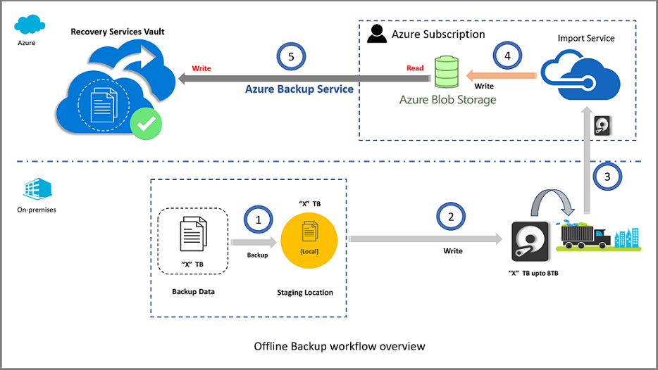

The offline backup process involves these steps:

1. Instead of sending the backup data over the network, write the backup data to a staging location.
1. Use the *AzureOfflineBackupDiskPrep* utility to write the data in the staging location to one or more SATA disks.
1. As part of the preparatory work, the *AzureOfflineBackupDiskPrep* utility creates an Azure import job. Send the SATA drives to the nearest Azure datacenter, and reference the import job to connect the activities.
1. At the Azure datacenter, the data on the disks is copied to an Azure storage account.
1. Azure Backup copies the backup data from the storage account to the Recovery Services vault, and incremental backups are scheduled.

## Supported configurations

The following Azure Backup features or workloads support the use of offline backup for:

> [!div class="checklist"]
>
> * Backup of files and folders with the Microsoft Azure Recovery Services (MARS) Agent, also referred to as the Azure Backup Agent.
> * Backup of all workloads and files with System Center Data Protection Manager (DPM).
> * Backup of all workloads and files with Microsoft Azure Backup Server.

   > [!NOTE]
   > Offline backup isn't supported for system state backups done by using the Azure Backup Agent.

[!INCLUDE [backup-upgrade-mars-agent.md](../../includes/backup-upgrade-mars-agent.md)]

## Prerequisites

  > [!NOTE]
  > The following prerequisites and workflow apply only to offline backup of files and folders using the [latest Azure Recovery Services Agent](https://aka.ms/azurebackup_agent). To perform offline backups for workloads using System Center DPM or Azure Backup Server, see [Offline backup workflow for DPM and Azure Backup Server](backup-azure-backup-server-import-export.md).

Before you start the offline backup workflow, complete the following prerequisites:

* Create a [Recovery Services vault](backup-azure-recovery-services-vault-overview.md). To create a vault, follow the steps in [Create a Recovery Services vault](tutorial-backup-windows-server-to-azure.md#create-a-recovery-services-vault).
* Make sure that only the [latest version of the Azure Backup Agent](https://aka.ms/azurebackup_agent) is installed on the Windows Server or Windows client, as applicable, and the computer is registered with the Recovery Services vault.
* Azure PowerShell 3.7.0 is required on the computer running the Azure Backup Agent. Download and [install the 3.7.0 version of Azure PowerShell](https://github.com/Azure/azure-powershell/releases/tag/v3.7.0-March2017).
* On the computer running the Azure Backup Agent, make sure that Microsoft Edge or Internet Explorer 11 is installed and JavaScript is enabled.
* Create an Azure storage account in the same subscription as the Recovery Services vault.
* Make sure you have the [necessary permissions](../active-directory/develop/howto-create-service-principal-portal.md) to create the Azure Active Directory application. The offline backup workflow creates an Azure Active Directory application in the subscription associated with the Azure storage account. The goal of the application is to provide Azure Backup with secure and scoped access to the Azure Import/Export service, which is required for the offline backup workflow.
* Register the *Microsoft.ImportExport* resource provider with the subscription that contains the Azure storage account. To register the resource provider:
    1. On the main menu, select **Subscriptions**.
    1. If you're subscribed to multiple subscriptions, select the subscription you plan to use for the offline backup. If you use only one subscription, then your subscription appears.
    1. On the subscription menu, select **Resource providers** to view the list of providers.
    1. In the list of providers, scroll down to *Microsoft.ImportExport*. If the **Status** is **NotRegistered**, select **Register**.

        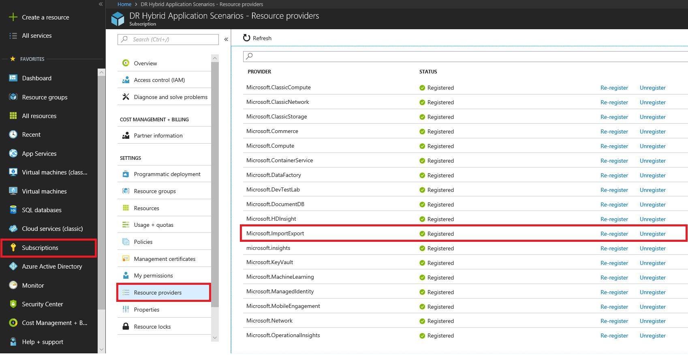

* A staging location, which might be a network share or any additional drive on the computer, internal or external, with enough disk space to hold your initial copy, is created. For example, if you want to back up a 500-GB file server, ensure that the staging area is at least 500 GB. (A smaller amount is used due to compression.)
* When you send disks to Azure, use only 2.5-inch SSD or 2.5-inch or 3.5-inch SATA II/III internal hard drives. You can use hard drives up to 10 TB. Check the [Azure Import/Export service documentation](../storage/common/storage-import-export-requirements.md#supported-hardware) for the latest set of drives that the service supports.
* The SATA drives must be connected to a computer (referred to as a *copy computer*) from where the copy of backup data from the staging location to the SATA drives is done. Ensure that BitLocker is enabled on the copy computer.

## Workflow

This section describes the offline backup workflow so that your data can be delivered to an Azure datacenter and uploaded to Azure Storage. If you have questions about the import service or any aspect of the process, see the [Azure Import/Export service overview documentation](../storage/common/storage-import-export-service.md).

## Initiate offline backup

1. When you schedule a backup on the Recovery Services Agent, you see this page.

    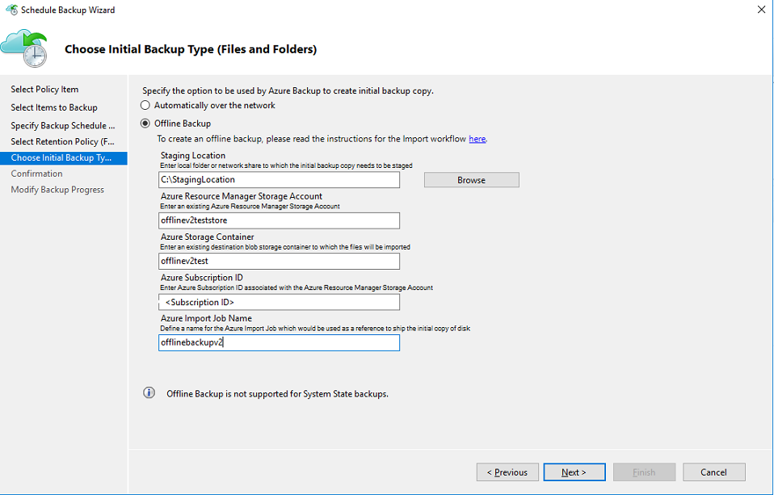

1. Select the option **Transfer using my own disks**.

    > [!NOTE]
    > Use the Azure Data Box option to transfer initial backup data offline. This option saves the effort required to procure your own Azure-compatible disks. It delivers Microsoft-proprietary, secure, and tamperproof Azure Data Box devices to which backup data can be directly written to by the Recovery Services Agent.

1. Select **Next**, and fill in the boxes carefully.

    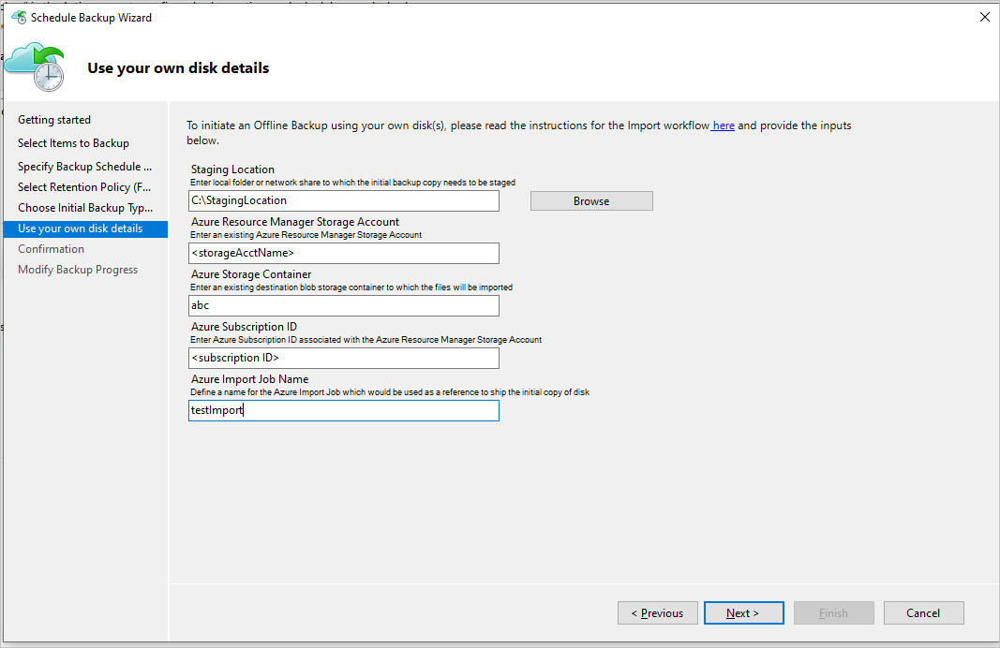

   The boxes that you fill in are:

    * **Staging Location**: The temporary storage location to which the initial backup copy is written. The staging location might be on a network share or a local computer. If the copy computer and source computer are different, specify the full network path of the staging location.
    * **Azure Resource Manager Storage Account**: The name of the Resource Manager type storage account (general purpose v1 or general purpose v2) in any Azure subscription.
    * **Azure Storage Container**: The name of the destination storage blob in the Azure storage account where the backup data is imported before being copied to the Recovery Services vault.
    * **Azure Subscription ID**: The ID for the Azure subscription where the Azure storage account is created.
    * **Azure Import Job Name**: The unique name by which the Azure Import/Export service and Azure Backup track the transfer of data sent on disks to Azure.
  
   After you fill in the boxes, select **Next**. Save the **Staging Location** and the **Azure Import Job Name** information. It's required to prepare the disks.

1. When prompted, sign in to your Azure subscription. You must sign in so that Azure Backup can create the Azure Active Directory application. Enter the required permissions to access the Azure Import/Export service.

    

1. Finish the workflow. On the Azure Backup Agent console, select **Back Up Now**.

    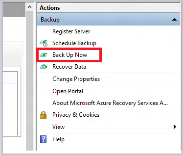

1. On the **Confirmation** page of the wizard, select **Back Up**. The initial backup is written to the staging area as part of the setup.

   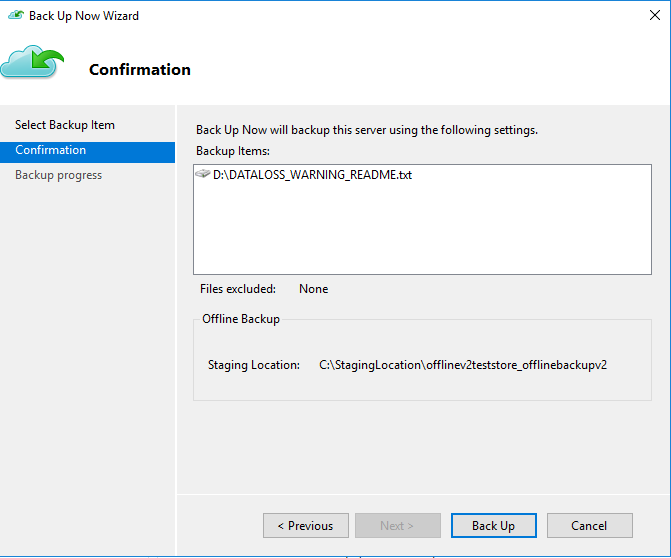

    After the operation finishes, the staging location is ready to be used for disk preparation.

   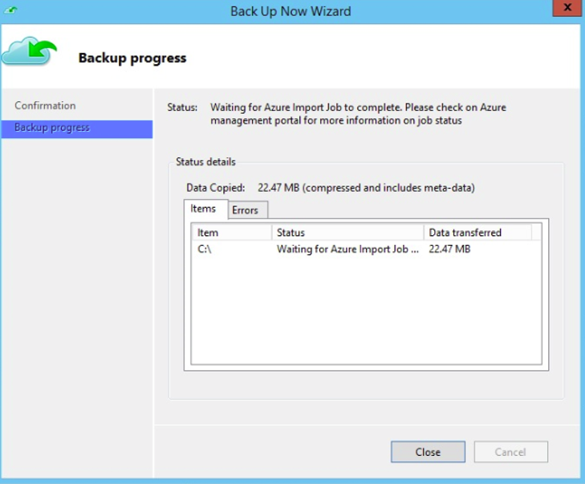

## Prepare SATA drives and ship to Azure

The *AzureOfflineBackupDiskPrep* utility prepares the SATA drives that are sent to the nearest Azure datacenter. This utility is available in the Azure Backup Agent installation directory in the following path:

```*\Microsoft Azure Recovery Services Agent\Utils\\*```

1. Go to the directory, and copy the *AzureOfflineBackupDiskPrep* directory to another computer where the SATA drives are connected. On the computer with the connected SATA drives, ensure that:

   * The copy computer can access the staging location for the offline-seeding workflow by using the same network path that was provided in the workflow in the "Initiate offline backup" section.
   * BitLocker is enabled on the copy computer.
   * Azure PowerShell 3.7.0 is installed.
   * The latest compatible browsers (Microsoft Edge or Internet Explorer 11) are installed, and JavaScript is enabled.
   * The copy computer can access the Azure portal. If necessary, the copy computer can be the same as the source computer.

     > [!IMPORTANT]
     > If the source computer is a virtual machine, then the copy computer must be a different physical server or client machine from the source computer.

1. Open an elevated command prompt on the copy computer with the *AzureOfflineBackupDiskPrep* utility directory as the current directory. Run the following command:

    ```.\AzureOfflineBackupDiskPrep.exe s:<Staging Location Path>```

    | Parameter | Description |
    | --- | --- |
    | s:&lt;*Staging Location Path*&gt; |This mandatory input is used to provide the path to the staging location that you entered in the workflow in the "Initiate offline backup" section. |
    | p:&lt;*Path to PublishSettingsFile*&gt; |This optional input is used to provide the path to the Azure publish settings file that you entered in the workflow in the "Initiate offline backup" section. |

    When you run the command, the utility requests the selection of the Azure import job that corresponds to the drives that need to be prepared. If only a single import job is associated with the provided staging location, you see a page like this one.

     <br/>

1. Enter the drive letter without the trailing colon for the mounted disk that you want to prepare for transfer to Azure.
1. Provide confirmation for the formatting of the drive when prompted.
1. You're prompted to sign in to your Azure subscription. Enter your credentials.

    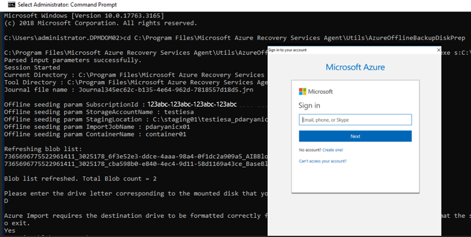 <br/>

    The tool then begins to prepare the disk and copy the backup data. You might need to attach additional disks when prompted by the tool in case the provided disk doesn't have sufficient space for the backup data. <br/>

    At the end of successful execution of the tool, the command prompt provides three pieces of information:

   1. One or more disks you provided are prepared for shipping to Azure.
   1. You receive confirmation that your import job was created. The import job uses the name you provided.
   1. The tool displays the shipping address for the Azure datacenter.

      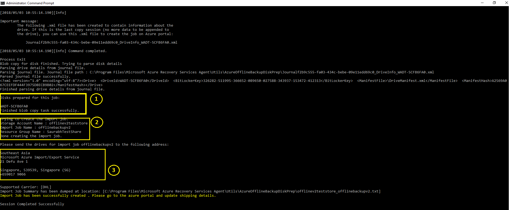<br/>

1. At the end of the command execution, you can update the shipping information.

1. Ship the disks to the address that the tool provided. Keep the tracking number for future reference.

   > [!IMPORTANT]
   > No two Azure import jobs can have the same tracking number. Ensure that drives prepared by the utility under a single Azure import job are shipped together in a single package and that there's a single unique tracking number for the package. Don't combine drives prepared as part of separate Azure import jobs in a single package.

## Update shipping details on the Azure import job

The following procedure updates the Azure import job shipping details. This information includes details about:

* The name of the carrier that delivers the disks to Azure.
* Return shipping details for your disks.

1. Sign in to your Azure subscription.
1. On the main menu, select **All services**. In the **All services** dialog box, enter **Import**. When you see **Import/export jobs**, select it.

    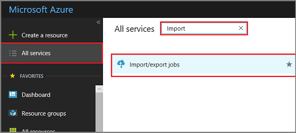<br/>

    The **Import/export jobs** menu opens, and the list of all import/export jobs in the selected subscription appears.

1. If you have multiple subscriptions, select the subscription used to import the backup data. Then select the newly created import job to open its details.

    <br/>

1. On the **Settings** menu for the import job, select **Manage shipping info**. Enter the return shipping details.

    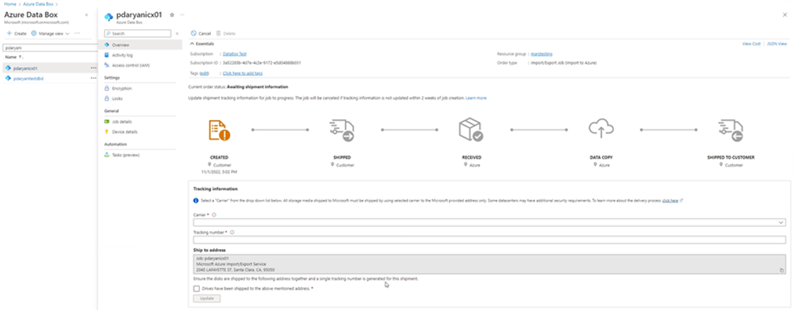<br/>

1. When you have the tracking number from your shipping carrier, select the banner in the Azure import job overview page and enter the following details.

   > [!IMPORTANT]
   > Ensure that the carrier information and tracking number are updated within two weeks of Azure import job creation. Failure to verify this information within two weeks can result in the job being deleted and drives not being processed.

   <br/>

   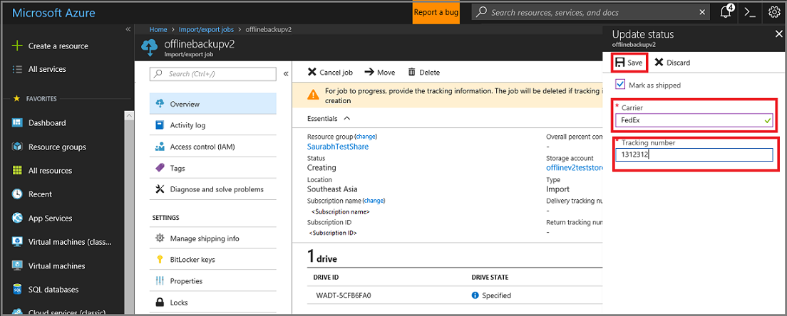

### Time to process the drives

The amount of time it takes to process an Azure import job varies. Process time is based on factors like shipping time, job type, type and size of the data being copied, and the size of the disks provided. The Azure Import/Export service doesn't have an SLA. After disks are received, the service strives to complete the backup data copy to your Azure storage account in 7 to 10 days.

### Monitor Azure import job status

You can monitor the status of your import job from the Azure portal. Go to the **Import/Export jobs** page and select your job. For more information on the status of the import jobs, see [What is the Azure Import/Export service?](../storage/common/storage-import-export-service.md).

### Finish the workflow

After the import job successfully completes, initial backup data is available in your storage account. At the time of the next scheduled backup, Azure Backup copies the contents of the data from the storage account to the Recovery Services vault.

   <br/>

At the time of the next scheduled backup, Azure Backup performs an incremental backup.

### Clean up resources

After the initial backup is finished, you can safely delete the data imported to the Azure Storage container and the backup data in the staging location.

## Next steps

* For any questions about the Azure Import/Export service workflow, see [Use the Microsoft Azure Import/Export service to transfer data to Blob storage](../storage/common/storage-import-export-service.md).
