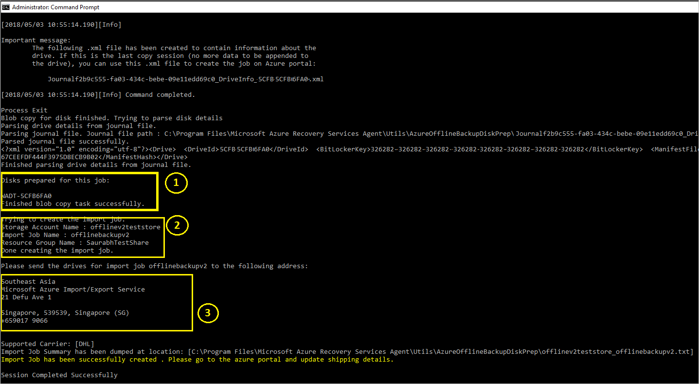

# Offline backup workflow for DPM and Azure Backup Server (MABS)

>[!IMPORTANT]
> These steps are applicable for DPM 2019 UR1 (or above) and MABS v3 UR1 (or above).

System Center Data Protection Manager and Azure Backup Server (MABS) integrate with Azure Backup and use several built-in efficiencies that save network and storage costs during the initial full backups of data to Azure. Initial full backups typically transfer large amounts of data and require more network bandwidth when compared to subsequent backups that transfer only the deltas/incrementals. Azure Backup compresses the initial backups. Through the process of offline seeding, Azure Backup can use disks to upload the compressed initial backup data offline to Azure.

The offline-seeding process of Azure Backup is tightly integrated with the [Azure Import/Export service](https://docs.microsoft.com/azure/storage/common/storage-import-export-service) that enables you to transfer data to Azure by using disks. If you have terabytes (TBs) of initial backup data that needs to be transferred over a high-latency and low-bandwidth network, you can use the offline-seeding workflow to ship the initial backup copy on one or more hard drives to an Azure datacenter. This article provides an overview and further details steps that complete this workflow for System Center DPM and Microsoft Azure Backup Server (MABS).

> [!NOTE]
> The process of Offline backup for the Microsoft Azure Recovery Services (MARS) agent is distinct from System Center DPM or MABS. For information on using Offline backup with MARS agent, see [this article](https://docs.microsoft.com/azure/backup/backup-azure-backup-import-export). Offline Backup is not supported for System State backups done using the Azure Backup agent.

## Overview

With the offline-seeding capability of Azure Backup and Azure Import/Export, it's simple to upload the data offline to Azure by using disks. The Offline Backup process involves the following steps:

> [!div class="checklist"]
>
> * The backup data, instead of being sent over the network, is written to a *staging location*
> * The data on the *staging location* is then written to one or more SATA disks using the *AzureOfflineBackupDiskPrep* utility
> * An Azure Import job is automatically created by the utility
> * The SATA drives are then sent to the nearest Azure datacenter
> * After the upload of the backup data to Azure is finished, Azure Backup copies the backup data to the backup vault and the incremental backups are scheduled.

## Prerequisites

Ensure that the following prerequisites are met before initiating the Offline Backup workflow.

* A [Recovery Services vault](https://docs.microsoft.com/azure/backup/backup-azure-recovery-services-vault-overview) has been created. To create one, refer to the steps in [this article](https://docs.microsoft.com/azure/backup/tutorial-backup-windows-server-to-azure#create-a-recovery-services-vault).
* Ensure that only the [latest version of Microsoft Azure Recovery Services agent](https://aka.ms/azurebackup_agent) is installed on the SC DPM or MABS and registered to Recovery Services Vault.
* Update Rollup 1 is installed on SC DPM 2019 or MABS v3.

  > [!NOTE]
  > With DPM 2019 UR1 and MABS v3 UR1 the offline seeding authenticates using Azure Active Directory.

* On the DPM or MABS server, make sure Microsoft Edge or Internet Explorer 11 is installed, and JavaScript is enabled.
* Create an Azure Storage account in the same subscription as the Recovery Services vault.
* Make sure you have the [necessary permissions](https://docs.microsoft.com/azure/active-directory/develop/howto-create-service-principal-portal) to create the Azure Active Directory application. The Offline Backup workflow creates an Azure Active Directory application in the subscription associated with the Azure Storage account. The goal of the application is to provide Azure Backup with secure and scoped access to the Azure Import Service, required for the Offline Backup workflow.
* Register the Microsoft.ImportExport resource provider with the subscription containing the Azure Storage account. To register the resource provider:
    1. In the main menu, Click **Subscriptions**.
    2. If you're subscribed to multiple subscriptions, select the subscription you're using for the offline backup. If you use only one subscription, then your subscription appears.
    3. In the subscription menu, click **Resource Providers** to view the list of providers.
    4. In the list of providers scroll down to Microsoft.ImportExport. If the Status is NotRegistered, click **Register**.

       

* A staging location, which might be a network share or any additional drive on the computer, internal or external, with enough disk space to hold your initial copy, is created. For example, if you're trying to back up a 500-GB file server, ensure that the staging area is at least 500 GB. (A smaller amount is used due to compression.)
* With regards to disks that will be sent to Azure, ensure that only 2.5 inch SSD, or 2.5-inch or 3.5-inch SATA II/III internal hard drives are used. You can use hard drives up to 10 TB. Check the [Azure Import/Export service documentation](https://docs.microsoft.com/azure/storage/common/storage-import-export-requirements#supported-hardware) for the latest set of drives that the service supports.
* The SATA drives have to be connected to a computer (referred to as a *copy computer*) from where the copy of backup data from the *staging location* to the SATA drives is done. Ensure that BitLocker is enabled on the *copy computer*

## Workflow

The information in this section helps you complete the offline-backup workflow so that your data can be delivered to an Azure datacenter and uploaded to Azure Storage. If you have questions about the Import service or any aspect of the process, see the [Import service overview](https://docs.microsoft.com/azure/storage/common/storage-import-export-service) documentation referenced earlier.

## Initiate offline backup

1. When you create a new protection group with online protection or add online protection to existing protection group, you see the following screen. To select Initial online Replication method, select **Transfer using my own disk** and click **Next**.

    

2. The Azure sign in page will open. Sign in using your Azure user account, which has *owner* role permission on the Azure Subscription.

    

3. Provide the inputs on the **Use your Own Disk** page.

   

   The description of the inputs is as follows:

   * **Staging Location**: The temporary storage location to which the initial backup copy is written. Staging location might be on a network share or a local computer. If the copy computer and source computer are different, we recommended that you specify the full network path of the staging location.
   * **Azure Storage Account**: The name of the storage account in the Azure subscription associated with the Azure Publish settings file.
   * **Azure Storage Container**: The name of the destination storage blob in the Azure storage account where the backup data is imported.
   * **Azure Subscription ID**: The Azure subscription ID for the subscription from where you downloaded the Azure Publish settings file.
   * **Azure Import Job Name**: The unique name by which Azure Import service and Azure Backup track the transfer of data sent on disks to Azure.

     Save the *staging location* and the *Azure Import Job Name* you provided as it is required to prepare the disks.

4. Complete the workflow to create or update the protection. And to initiate the offline-backup copy, right-click the **Protection Group**, and then choose the **Create recovery point** option. You then choose the **Online Protection** option.

   

5. Monitor the Online Replica Creation job in the monitoring pane. The job should complete successfully with the warning *Waiting for Azure Import job to finish*.

   

6. After the operation finishes, the staging location is ready to be used for disk preparation.

## Prepare SATA drives and ship to Azure

The *AzureOfflineBackupDiskPrep* utility prepares the SATA drives that are sent to the nearest Azure datacenter. This utility is available in the Azure Backup agent installation directory (in the following path):

    *\Microsoft Azure Recovery Services Agent\Utils\\*

1. Go to the directory and copy the **AzureOfflineBackupDiskPrep** directory to another computer where the SATA drives are connected. On the computer with the connected SATA drives, ensure:

   * The copy computer can access the staging location for the offline-seeding workflow by using the same network path that was provided in the **Initiate offline backup** workflow.
   * BitLocker is enabled on the copy computer.
   * Azure PowerShell 3.7.0 is installed on the Copy computer (not required if you're running the AzureOfflineBackupDiskPrep utility on the DPM or MABS server).
   * The latest compatible browsers (Microsoft Edge or Internet Explorer 11) are installed and JavaScript is enabled.
   * The copy computer can access the Azure portal. If necessary, the copy computer can be the same as the source computer.

     > [!IMPORTANT]
     > If the source computer is a virtual machine, then the copy computer must be a different physical server or client machine from the source computer.

2. Open an elevated command prompt on the copy computer with the *AzureOfflineBackupDiskPrep* utility directory as the current directory, and run the following command:

        ```cmd
        .\AzureOfflineBackupDiskPrep.exe s:<Staging Location Path>
        ```

    | Parameter | Description |
    | --- | --- |
    | s:&lt;*Staging Location Path*&gt; |Mandatory input used to provide the path to the staging location that you entered in the **Initiate offline backup** workflow. |
    | p:&lt;*Path to PublishSettingsFile*&gt; |Optional input that's used to provide the path to the **Azure Publish Settings** file that you entered in the **Initiate offline backup** workflow. |

    When you run the command, the utility requests the selection of the Azure Import job that corresponds to the drives that need to be prepared. If only a single import job is associated with the provided staging location, you see a screen like the one that follows.

      

3. Enter the drive letter without the trailing colon for the mounted disk that you want to prepare for transfer to Azure.
4. Provide confirmation for the formatting of the drive when prompted.
5. You're prompted to sign into your Azure subscription. Provide your credentials.

    

    The tool then begins to prepare the disk and copying the backup data. You may need to attach additional disks when prompted by the tool if the provided disk doesn't have sufficient space for the backup data.

    At the end of successful execution of the tool, the command prompt provides three pieces of information:
    * One or more disks you provided are prepared for shipping to Azure.
    * You receive confirmation that your import job has been created. The  import job uses the name you provided.
    * The tool displays the shipping address for the Azure datacenter.

     

6. At the end of the command execution, you can update the shipping information.

7. Ship the disks to the address that the tool provided and keep the tracking number for future reference.

   > [!IMPORTANT]
   > No two Azure Import Jobs can have the same tracking number. Ensure that drives prepared by the utility under a single Azure Import job are shipped together in a single package and that there is a single unique tracking number for the package. Do not combine drives prepared as part of separate Azure Import jobs in a single package.

## Update shipping details on the Azure Import job

The following procedure updates the Azure Import job shipping details. This information includes details about:

* the name of the carrier who delivers the disks to Azure
* return shipping details for your disks

   1. Sign in to your Azure subscription.
   2. In the main menu, click **All services** and in the All services dialog, type Import. When you see **Import/Export jobs**, click it.
       

       The list of **Import/export jobs** menu opens, and the list of all Import/export jobs in the selected subscription appears.

   3. If you have multiple subscriptions, be sure to select the subscription used to import the backup data. Then select the newly created Import job to open its details.

       

   4. On the Settings menu for the Import job, click **Manage Shipping Info** and enter the return shipping details.

       

   5. When you have the tracking number from your shipping carrier, click the banner in the Azure Import job overview page and enter the following details:

      > [!IMPORTANT]
      > Ensure that the carrier information and tracking number are updated within two weeks of Azure import job creation. Failure to verify this information within two weeks can result in the job being deleted, and drives not being processed.

      

      

### Time to process the drives

The amount of time it takes to process an Azure import job varies depending on different factors such as shipping time, job type, type and size of the data being copied, and the size of the disks provided. The Azure Import/Export service doesn't have an SLA but after the disks are received the service strives to complete the backup data copy to your Azure storage account in 7 to 10 days. The next section details how you can monitor the status of the Azure import job.

### Monitoring Azure Import job status

You can monitor the status of your Import job from the Azure portal by navigating to the **Import/Export jobs** page and selecting your job. For more information on the status of the Import jobs, see the [Storage Import Export service](https://docs.microsoft.com/azure/storage/common/storage-import-export-service) article.

### Complete the workflow

After the import job finishes, initial backup data is available in your storage account. At the time of the next scheduled backup, Azure backup copies the contents of the data from the storage account to the Recovery Services vault.

At the time of the next scheduled online replica creation job, Data Protection Manager performs incremental backup over the initial backup copy.

## Next steps

* For any questions about the Azure Import/Export service workflow, see [Use the Microsoft Azure Import/Export service to transfer data to Blob storage](../storage/common/storage-import-export-service.md).
