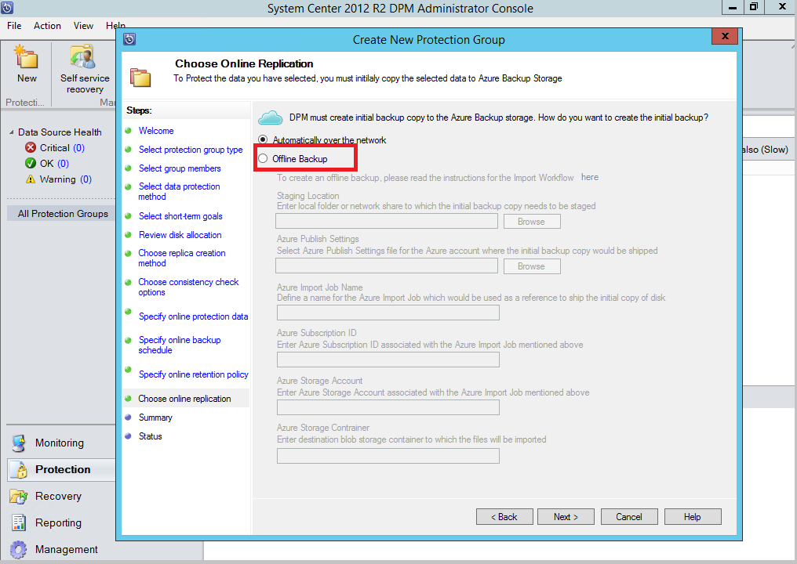
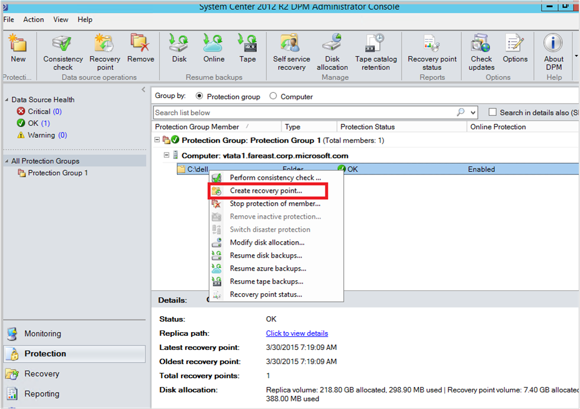
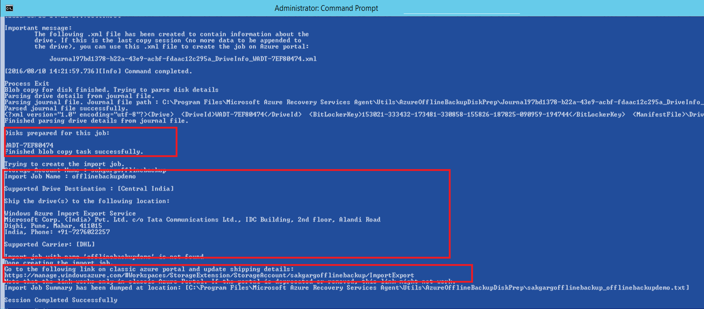
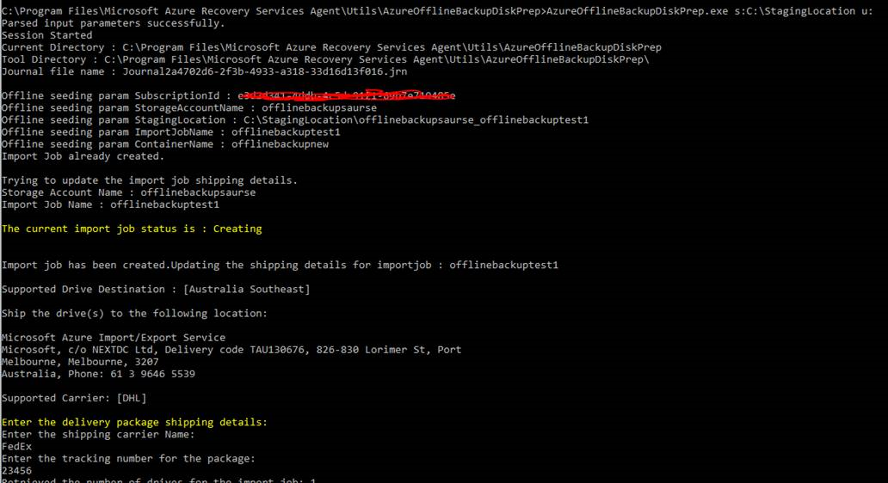
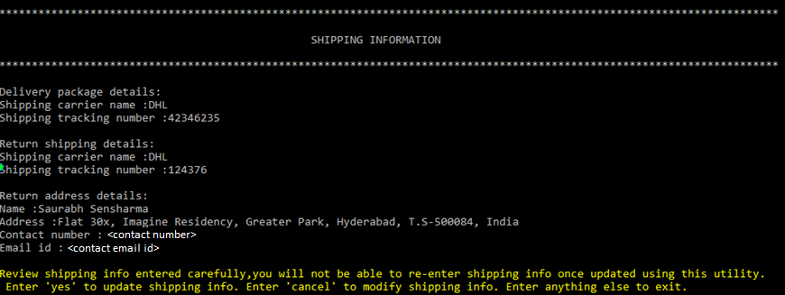
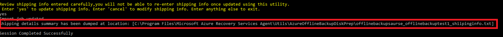
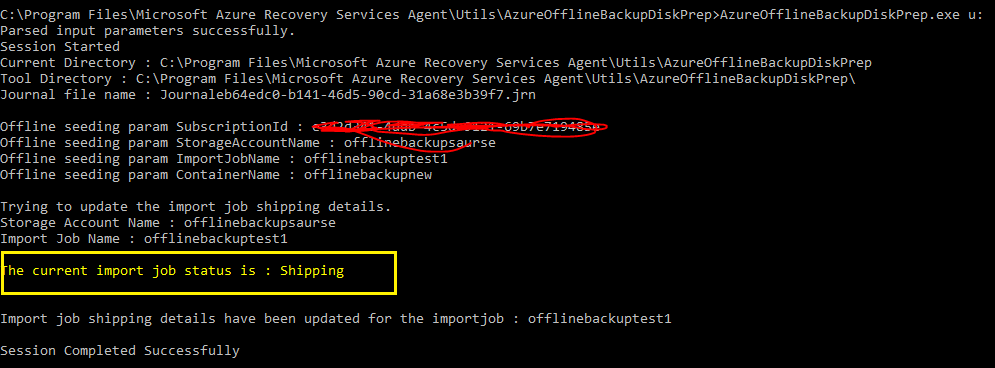

# Offline-backup workflow for DPM and Azure Backup Server
Azure Backup has several built-in efficiencies that save network and storage costs during the initial full backups of data to Azure. Initial full backups typically transfer large amounts of data and require more network bandwidth when compared to subsequent backups that transfer only the deltas/incrementals. Azure Backup compresses the initial backups. Through the process of offline seeding, Azure Backup can use disks to upload the compressed initial backup data offline to Azure.

The offline-seeding process of Azure Backup is tightly integrated with the [Azure Import/Export service](../storage/common/storage-import-export-service.md) that enables you to transfer data to Azure by using disks. If you have terabytes (TBs) of initial backup data that needs to be transferred over a high-latency and low-bandwidth network, you can use the offline-seeding workflow to ship the initial backup copy on one or more hard drives to an Azure datacenter. This article provides an overview and further details steps that complete this workflow for System Center DPM and Azure Backup Server.

> [!NOTE]
> The process of Offline backup for the Microsoft Azure Recovery Services (MARS) agent is distinct from System Center DPM and Azure Backup Server. For information on using Offline backup with MARS agent, see [this article](backup-azure-backup-import-export.md). Offline Backup is not supported for System State backups done using the Azure Backup agent.
>

## Overview
With the offline-seeding capability of Azure Backup and Azure Import/Export, it is simple to upload the data offline to Azure by using disks. The Offline Backup process involves the following steps:

> [!div class="checklist"]
> * The backup data, instead of being sent over the network, is written to a *staging location*
> * The data on the *staging location* is then written to one or more SATA disks using the *AzureOfflineBackupDiskPrep* utility
> * An Azure Import job is automatically created by the utility
> * The SATA drives are then sent to the nearest Azure datacenter
> * After the upload of the backup data to Azure is finished, Azure Backup copies the backup data to the backup vault and the incremental backups are scheduled.

## Supported configurations
Offline Backup is supported for all deployment models of Azure Backup that offsite backup data from on-premises to the Microsoft Cloud. This includes

> [!div class="checklist"]
> * Backup of files and folders with the Microsoft Azure Recovery Services (MARS) Agent or the Azure Backup agent.
> * Backup of all workloads and files with System Center Data Protection Manager (SC DPM)
> * Backup of all workloads and files with Microsoft Azure Backup Server  

## Prerequisites
Ensure that the following prerequisites are met before initiating the Offline Backup workflow
* A [Recovery Services vault](backup-azure-recovery-services-vault-overview.md) has been created. To create one, refer to the steps in [this article](tutorial-backup-windows-server-to-azure.md#create-a-recovery-services-vault)
* Azure Backup agent or Azure Backup Server or SC DPM has been installed on either Windows Server/Windows client, as applicable and the computer is registered with the Recovery Services Vault. Ensure that only the [latest version of Azure Backup](https://go.microsoft.com/fwlink/?linkid=229525) is used.
* [Download the Azure Publish settings file](https://portal.azure.com/#blade/Microsoft_Azure_ClassicResources/PublishingProfileBlade) on the computer from which you plan to back up your data. The subscription from which you download the publish settings file can be different from the subscription that contains the Recovery Services Vault. If your subscription is on sovereign Azure Clouds, then use the following links as appropriate to download the Azure Publish settings file.

    | Sovereign cloud region | Azure Publish settings file link |
    | --- | --- |
    | United States | [Link](https://portal.azure.us#blade/Microsoft_Azure_ClassicResources/PublishingProfileBlade) |
    | China | [Link](https://portal.azure.cn/#blade/Microsoft_Azure_ClassicResources/PublishingProfileBlade) |

* An Azure Storage account with *classic* deployment model has been created in the subscription from which you downloaded the publish settings file as shown below:

  

* A staging location, which might be a network share or any additional drive on the computer, internal or external, with enough disk space to hold your initial copy, is created. For example, if you are trying to back up a 500-GB file server, ensure that the staging area is at least 500 GB. (A smaller amount is used due to compression.)
* With regards to disks that will be sent to Azure, ensure that only 2.5 inch SSD, or 2.5-inch or 3.5-inch SATA II/III internal hard drives are used. You can use hard drives up to 10 TB. Check the [Azure Import/Export service documentation](../storage/common/storage-import-export-requirements.md#supported-hardware) for the latest set of drives that the service supports.
* The SATA drives have to be connected to a computer (referred to as a *copy computer*) from where the copy of backup data from the *staging location* to the SATA drives is done. Ensure that BitLocker is enabled on the *copy computer*

## Workflow
The information in this section helps you complete the offline-backup workflow so that your data can be delivered to an Azure datacenter and uploaded to Azure Storage. If you have questions about the Import service or any aspect of the process, see the [Import service overview](../storage/common/storage-import-export-service.md) documentation referenced earlier.

### Initiate offline backup
1. When you schedule a backup, you see the following screen (in Windows Server, Windows client, or System Center Data Protection Manager).

    

    Here's the corresponding screen in System Center Data Protection Manager:  
    

    The description of the inputs is as follows:

   * **Staging Location**: The temporary storage location to which the initial backup copy is written. Staging location might be on a network share or a local computer. If the copy computer and source computer are different, we recommended that you specify the full network path of the staging location.
   * **Azure Import Job Name**: The unique name by which Azure Import service and Azure Backup track the transfer of data sent on disks to Azure.
   * **Azure Publish Settings**: Provide the local path to the publish settings file.
   * **Azure Subscription ID**: The Azure subscription ID for the subscription from where you downloaded the Azure Publish settings file.
   * **Azure Storage Account**: The name of the storage account in the Azure subscription associated with the Azure Publish settings file.
   * **Azure Storage Container**: The name of the destination storage blob in the Azure storage account where the backup data is imported.

     Save the *staging location* and the *Azure Import Job Name* you provided as it is required to prepare the disks.  

2. Complete the workflow, and to initiate the offline-backup copy, click **Back Up Now** in the Azure Backup agent management console. The initial backup is written to the staging area as part of this step.

    

    To complete the corresponding workflow in System Center Data Protection Manager or Azure Backup server, right-click the **Protection Group**, and then choose the **Create recovery point** option. You then choose the **Online Protection** option.

    

    After the operation finishes, the staging location is ready to be used for disk preparation.

    

### Prepare SATA drives and ship to Azure
The *AzureOfflineBackupDiskPrep* utility is used to prepare the SATA drives that are sent to the nearest Azure Datacenter. This utility is available in installation directory of the Recovery Services agent in the following path:

*\\Microsoft Azure Recovery Services Agent\\Utils\\*

1. Go to the directory, and copy the **AzureOfflineBackupDiskPrep** directory to a copy computer on which the SATA drives to be prepared are connected. Ensure the following with regards to the copy computer:

   * The copy computer can access the staging location for the offline-seeding workflow by using the same network path that was provided in the **Initiate offline backup** workflow.
   * BitLocker is enabled on the copy computer.
   * The copy computer can access the Azure portal.

     If necessary, the copy computer can be the same as the source computer.

     > [!IMPORTANT]
     > If the source computer is a virtual machine, then it is mandatory to use a different physical server or client machine as the copy computer.

2. Open an elevated command prompt on the copy computer with the *AzureOfflineBackupDiskPrep* utility directory as the current directory, and run the following command:

    `*.\AzureOfflineBackupDiskPrep.exe*   s:<*Staging Location Path*>   [p:<*Path to AzurePublishSettingsFile*>]`

    | Parameter | Description |
    | --- | --- |
    | s:&lt;*Staging Location Path*&gt; |Mandatory input that's used to provide the path to the staging location that you entered in the **Initiate offline backup** workflow. |
    | p:&lt;*Path to PublishSettingsFile*&gt; |Optional input that's used to provide the path to the **Azure Publish Settings** file that you entered in the **Initiate offline backup** workflow. |

    > [!NOTE]
    > The &lt;Path to AzurePublishSettingFile&gt; value is mandatory when the copy computer and source computer are different.
    >
    >

    When you run the command, the utility requests the selection of the Azure Import job that corresponds to the drives that need to be prepared. If only a single import job is associated with the provided staging location, you see a screen like the one that follows.

      

3. Enter the drive letter without the trailing colon for the mounted disk that you want to prepare for transfer to Azure. Provide confirmation for the formatting of the drive when prompted.

    The tool then begins to prepare the disk and copying the backup data. You may need to attach additional disks when prompted by the tool in case the provided disk does not have sufficient space for the backup data.  

    At the end of successful execution of the tool, one or more disks that you provided are prepared for shipping to Azure. In addition, an import job with the name you provided during the **Initiate offline backup** workflow is created in Azure. Finally, the tool displays the shipping address to the Azure datacenter where the disks need to be shipped.

     

4. At the end of the command execution you also see the option to update Shipping information as shown below:

     

5. You can enter the details right away. The tool guides you through the process involving a series of inputs. However if you do not have information like tracking number or other details related to Shipping, you can end the session. The steps to update shipping details later are provided in this article.

6. Ship the disks to the address that the tool provided and keep the tracking number for future reference.

   > [!IMPORTANT]
   > No two Azure Import Jobs can have the same tracking number. Ensure that drives prepared by the utility under a single Azure Import Job are shipped together in a single package and that there is a single unique tracking number for the package. Do not combine drives prepared as part of **different** Azure Import Jobs in a single package.

5. When you have the tracking number information, go to the source computer, which is awaiting Import Job completion and run the following command in an elevated command prompt with *AzureOfflineBackupDiskPrep* utility directory as the current directory:

   `*.\AzureOfflineBackupDiskPrep.exe*  u:`

   You can optionally run the following command from a different computer such as the *copy computer*, with *AzureOfflineBackupDiskPrep* utility directory as the current directory:

   `*.\AzureOfflineBackupDiskPrep.exe*  u:  s:<*Staging Location Path*>   p:<*Path to AzurePublishSettingsFile*>`

    | Parameter | Description |
    | --- | --- |
    | u: | Mandatory input used to update shipping details for an Azure Import job |
    | s:&lt;*Staging Location Path*&gt; | Mandatory input when the command is not run on the source computer. Used to provide the path to the staging location that you entered in the **Initiate offline backup** workflow. |
    | p:&lt;*Path to PublishSettingsFile*&gt; | Mandatory input when the command is not run on the source computer. Used to provide the path to the **Azure Publish Settings** file that you entered in the **Initiate offline backup** workflow. |

    The utility automatically detects the Import job that the source computer is waiting on or the import jobs associated with the staging location when the command is run on a different computer. It then provides the option to update shipping information through a series of inputs as shown below:

     

6. Once all the inputs are provided, review the details carefully and commit the shipping info you provided by typing *yes*.

     

7. On updating the Shipping info successfully, the utility provides a local location where the shipping details entered by you are stored as shown below

     

   > [!IMPORTANT]
   > Ensure that the drives reach the Azure Datacenter within two weeks of providing the Shipping information using the *AzureOfflineBackupDiskPrep* utility. Failure to do so can result in the drives not being processed.  

Once you complete the steps above, the Azure Datacenter is ready to receive the drives and further process them to transfer the backup data from the drives to the classic-type Azure storage account you created.

### Time to process the drives
The amount of time it takes to process an Azure import job varies depending on different factors such as shipping time, job type, type and size of the data being copied, and the size of the disks provided. The Azure Import/Export service does not have an SLA but after the disks are received the service strives to complete the backup data copy to your Azure storage account in 7 to 10 days. The next section details how you can monitor the status of the Azure import job.

### Monitoring Azure Import Job status
While your drives are in transit or at the Azure datacenter to be copied to the storage account, the Azure Backup agent or SC DPM or the Azure Backup server console on the source computer shows the following job status for your scheduled backups.

  `Waiting for Azure Import Job to complete. Please check on Azure Management portal for more information on job status`

Follow the steps below, to check the Import Job status.
1. Open an elevated command prompt on the source computer and run the following command:

     `AzureOfflineBackupDiskPrep.exe u:`

2.	The output shows the current status of the Import Job as shown below:

     

For more information on the various states of the Azure import job, see [this article](../storage/common/storage-import-export-view-drive-status.md)

### Complete the workflow
After the import job finishes, initial backup data is available in your storage account. At the time of the next scheduled backup, Azure backup copies the contents of the data from the storage account to the Recovery Services vault as shown below:

    

At the time of the next scheduled backup, Azure Backup performs incremental backup over the initial backup copy.

## Next steps
* For any questions on the Azure Import/Export workflow, refer to [Use the Microsoft Azure Import/Export service to transfer data to Blob storage](../storage/common/storage-import-export-service.md).
* Refer to the offline-backup section of the Azure Backup [FAQ](backup-azure-backup-faq.md) for any questions about the workflow.
