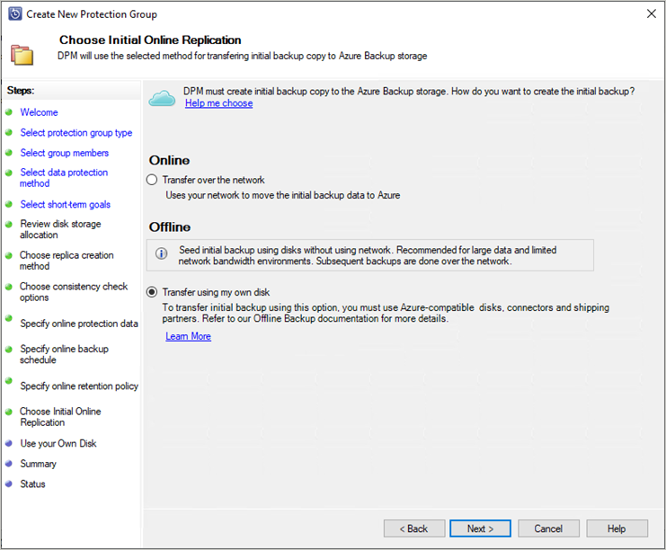
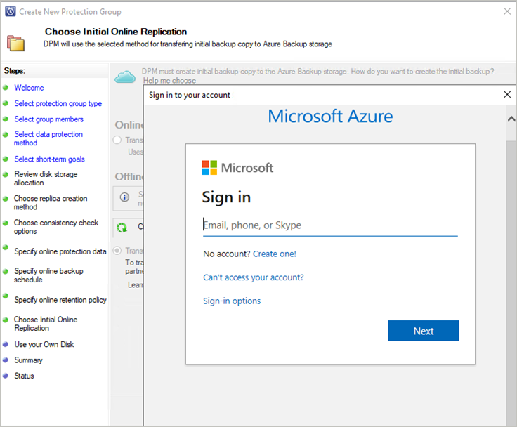
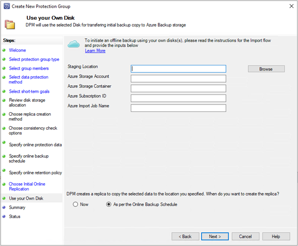
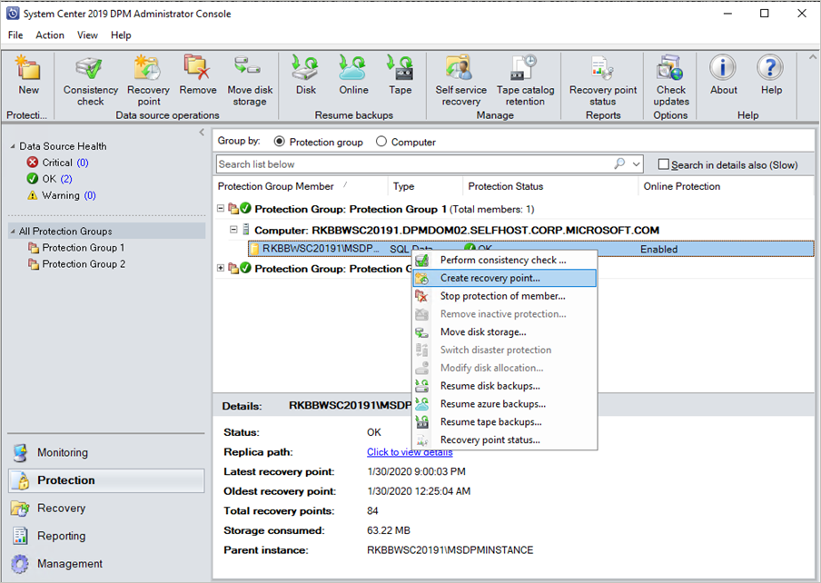
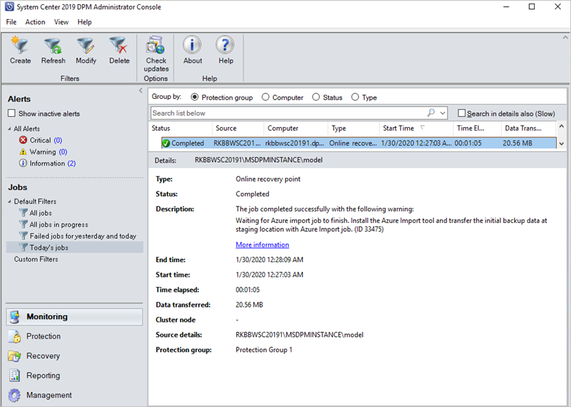

# Offline seeding for DPM/MABS using customer-owned disks with Azure Import/Export

This article describes how to send the initial full backup data from DPM/MABS to Azure using customer-owned disks instead of sending it via the network. Learn about [sending the initial full backup data from MARS to Azure using customer-owned disks](backup-azure-backup-import-export.md).

System Center Data Protection Manager and Azure Backup Server (MABS) integrate with Azure Backup and use several built-in efficiencies that save network and storage costs during the initial full backups of data to Azure. Initial full backups typically transfer large amounts of data and require more network bandwidth when compared to subsequent backups that transfer only the deltas/incrementals. Azure Backup compresses the initial backups. Through the process of offline seeding, Azure Backup can use disks to upload the compressed initial backup data offline to Azure.

In this article, you'll learn about:

> [!div class="checklist"]
> - Offline-seeding process
> - Supported capabilities
> - Prerequisites
> - Workflow
> - How to initiate offline backup
> - How to prepare SATA drives and ship to Azure
> - How to update the tracking and shipping details on the Azure import job

>[!IMPORTANT]
> These steps are applicable for DPM 2019 UR1 (or above) and MABS v3 UR1 (or higher). Ensure that you've the latest MARS agent (version 2.0.9250.0 or higher) before following the below section. [Learn more](backup-azure-mars-troubleshoot.md#mars-offline-seeding-using-customer-owned-disks-importexport-is-not-working).

## Offline-seeding process

The offline-seeding process of Azure Backup is tightly integrated with the [Azure Import/Export service](../import-export/storage-import-export-service.md). You can use this service to transfer data to Azure by using disks. If you have terabytes (TBs) of initial backup data that need to be transferred over a high-latency and low-bandwidth network, you can use the offline-seeding workflow to ship the initial backup copy on one or more hard drives to an Azure datacenter. This article provides an overview and further steps that finish this workflow for System Center Data Protection Manager (DPM) and Microsoft Azure Backup Server (MABS).

> [!NOTE]
> The process of offline backup for the Microsoft Azure Recovery Services (MARS) Agent is distinct from DPM and MABS. For information on using offline backup with the MARS Agent, see [Offline backup workflow in Azure Backup](backup-azure-backup-import-export.md). Offline backup isn't supported for system state backups done by using the Azure Backup Agent.
>
> The MABS UR1 update also brings the preview for Offline Backup using Azure Data Box in MABS. Contact [SystemCenterFeedback@microsoft.com](mailto:SystemCenterFeedback@microsoft.com) to learn more.

## Supported capabilities

With the offline-seeding capability of Azure Backup and the Azure Import/Export service, it's simple to upload the data offline to Azure by using disks. The offline backup process involves the following steps:

* The backup data is written to a staging location instead of being sent over the network.
* The data on the staging location is then written to one or more SATA disks by using the *AzureOfflineBackupDiskPrep* utility.
* An Azure import job is automatically created by the utility.
* The SATA drives are then sent to the nearest Azure datacenter.
* After the upload of the backup data to Azure is finished, Azure Backup copies the backup data to the backup vault and the incremental backups are scheduled.

## Prerequisites

Ensure that the following prerequisites are met before you start the offline backup workflow:

* A [Recovery Services vault](backup-azure-recovery-services-vault-overview.md) has been created. To create one, follow the steps in [Create a Recovery Services vault](tutorial-backup-windows-server-to-azure.md#create-a-recovery-services-vault).
* Ensure that only the [latest version of Microsoft Azure Recovery Services agent](https://aka.ms/azurebackup_agent) is installed on the SC DPM or MABS and registered to Recovery Services vault.
* Update Rollup 1 is installed on SC DPM 2019 or MABS v3, along with the [latest MARS agent](https://aka.ms/azurebackup_agent).

  > [!NOTE]
  > With DPM 2019 UR1 and MABS v3 UR1 the offline seeding authenticates using Microsoft Entra ID.

* On the DPM or MABS server, make sure Microsoft Edge or Internet Explorer 11 is installed, and JavaScript is enabled.
* Create an Azure Storage account in the same subscription as the Recovery Services vault.
* Make sure you have the [necessary permissions](../active-directory/develop/howto-create-service-principal-portal.md) to create the Microsoft Entra application. The Offline Backup workflow creates a Microsoft Entra application in the subscription associated with the Azure Storage account. The goal of the application is to provide Azure Backup with secure and scoped access to the Azure Import Service, required for the Offline Backup workflow.
* Register the Microsoft.DataBox resource provider with the subscription containing the Azure Storage account. To register the resource provider:
    1. In the main menu, select **Subscriptions**.
    2. If you're subscribed to multiple subscriptions, select the subscription you're using for the offline backup. If you use only one subscription, then your subscription appears.
    3. In the subscription menu, select **Resource Providers** to view the list of providers.
    4. In the list of providers scroll down to Microsoft.DataBox. If the Status is NotRegistered, select **Register**.

       :::image type="content" source="./media/backup-azure-backup-import-export/register-import-export-inline.png" alt-text="Screenshot shows how to register the resource provider." lightbox="./media/backup-azure-backup-import-export/register-import-export-expanded.png":::

* A staging location, which might be a network share or any additional drive on the computer, internal or external, with enough disk space to hold your initial copy, is created. For example, if you want to back up a 500-GB file server, ensure that the staging area is at least 500 GB. (A smaller amount is used due to compression.)
* For disks sent to Azure, ensure that only 2.5-inch SSD or 2.5-inch or 3.5-inch SATA II/III internal hard drives are used. You can use hard drives up to 10 TB. Check the [Azure Import/Export service documentation](../import-export/storage-import-export-requirements.md#supported-hardware) for the latest set of drives that the service supports.
* The SATA drives must be connected to a computer (referred to as a *copy computer*) from where the copy of backup data from the staging location to the SATA drives is done. Ensure that BitLocker is enabled on the copy computer.

## Workflow

The information in this section helps you complete the offline-backup workflow so that your data can be delivered to an Azure datacenter and uploaded to Azure Storage. If you have questions about the Import service or any aspect of the process, see the [Import service overview](../import-export/storage-import-export-service.md) documentation referenced earlier.

## Initiate offline backup

1. When you create a new protection group with online protection or add online protection to existing protection group, you see the following screen. To select Initial online Replication method, select **Transfer using my own disk** and select **Next**.

    

2. The Azure sign-in page will open. Sign in using your Azure user account, which has *owner* role permission on the Azure Subscription.

    

3. Provide the inputs on the **Use your Own Disk** page.

   

   The description of the inputs is as follows:

   * **Staging Location**: The temporary storage location to which the initial backup copy is written. The staging location might be on a network share or a local computer. If the copy computer and source computer are different, specify the full network path of the staging location.
   * **Azure Resource Manager Storage Account**: The name of the Resource Manager type storage account (general purpose v1 or general purpose v2) in any Azure subscription.
   * **Azure Storage Container**: The name of the destination blob storage container in the Azure storage account where the backup data is imported.
   * **Azure Subscription ID**: The ID for the Azure subscription where the Azure storage account is created.
   * **Azure Import Job Name**: The unique name by which Azure Import service and Azure Backup track the transfer of data sent on disks to Azure.

    Save the **Staging Location** and the **Azure Import Job Name** information you provided. It's required to prepare the disks.

4. Complete the workflow to create or update the protection. And to initiate the offline-backup copy, right-click the **Protection Group**, and then choose the **Create recovery point** option. You then choose the **Online Protection** option.

   

5. Monitor the Online Replica Creation job in the monitoring pane. The job should complete successfully with the warning *Waiting for Azure Import job to finish*.

   

6. After the operation finishes, the staging location is ready to be used for disk preparation.

## Prepare SATA drives and ship to Azure

The *AzureOfflineBackupDiskPrep* utility prepares the SATA drives that are sent to the nearest Azure datacenter. This utility is available in the Azure Backup agent installation directory (in the following path): `*\Microsoft Azure Recovery Services Agent\Utils\\*`

1. Go to the directory and copy the **AzureOfflineBackupDiskPrep** directory to another computer where the SATA drives are connected. On the computer with the connected SATA drives, ensure:

   * The copy computer can access the staging location for the offline-seeding workflow by using the same network path that was provided in the workflow in the "Initiate offline backup" section.
   * BitLocker is enabled on the copy computer.
   * Azure PowerShell 3.7.0 is installed on the Copy computer (not required if you're running the AzureOfflineBackupDiskPrep utility on the DPM or MABS server).
   * The latest compatible browsers (Microsoft Edge or Internet Explorer 11) are installed and JavaScript is enabled.
   * The copy computer can access the Azure portal. If necessary, the copy computer can be the same as the source computer.

     > [!IMPORTANT]
     > If the source computer is a virtual machine, then it's mandatory to use a different physical server or client machine as the copy computer.

1. Open an elevated command prompt on the copy computer with the *AzureOfflineBackupDiskPrep* utility directory as the current directory. Run the following command:

    ```console
    .\AzureOfflineBackupDiskPrep.exe s:<Staging Location Path>
    ```

    | Parameter | Description |
    | --- | --- |
    | s:&lt;*Staging Location Path*&gt; |This mandatory input is used to provide the path to the staging location that you entered in the workflow in the "Initiate offline backup" section. |    

    When you run the command, the utility requests the selection of the Azure Import job that corresponds to the drives that need to be prepared. If only a single import job is associated with the provided staging location, you see a screen like the one that follows.

      :::image type="content" source="./media/backup-azure-backup-import-export/diskprepconsole0_1.png" alt-text="Screenshot shows the Azure disk preparation tool input.":::

1. Enter the drive letter without the trailing colon for the mounted disk that you want to prepare for transfer to Azure.
1. Provide confirmation for the formatting of the drive when prompted.
1. You're prompted to sign into your Azure subscription. Provide your credentials.

    :::image type="content" source="./media/backup-azure-backup-import-export/signindiskprep.png" alt-text="Screenshot shows the Azure subscription sign-in process.":::

    The tool then begins to prepare the disk and copy the backup data. You might need to attach additional disks when prompted by the tool if the provided disk doesn't have sufficient space for the backup data. <br/>

1. After the successful copy of the data from the staging location to the disks, the tool shows the following details:

   - The list of disks prepared for seeding.
   - The name of the storage account, resource group, and country/region of the Import/Export Job.

   The tool lists the fields required to create the Import/Export Job.* Enter the following details:

   | Required Parameter | Detail|
   | --- | --- |
   | Contact Name | Name of the contact for the Import/Export Job |
   | Contact Number | Phone number of the contact for the Import/Export Job |
   | Valid Email Id | Email ID to notify for the Import/Export Job |
   | Shipping Address | The return shipping address |
   | Country | Return shipping country/region |
   | Postal Code | Return shipping postal code |

   **All fields are required.*


   You can [edit these parameters](#update-the-tracking-and-shipping-details-on-the-azure-import-job) in future in the Azure portal for the *Import/Export Job*.    

   :::image type="content" source="./media/backup-azure-backup-import-export/create-import-export-jobs-inline.png" alt-text="Screenshot shows how to create the import/export jobs." lightbox="./media/backup-azure-backup-import-export/create-import-export-jobs-expanded.png":::

   After you enter these parameters and run the tool successfully, you receive a confirmation of the successful creation of the import job.

   :::image type="content" source="./media/backup-azure-backup-import-export/confirmation-after-successful-tool-run-inline.png" alt-text="Screenshot shows the confirmation after tool is run successfully." lightbox="./media/backup-azure-backup-import-export/confirmation-after-successful-tool-run-expanded.png":::

   >[!Important]
   >The tool also displays the Azure data centre address to which the disks need to be shipped along with a list of supported carriers.

Ship the disks to the address that the tool provided. Keep the tracking number for future reference and update it in the Azure portal as soon as possible.

> [!IMPORTANT]
> No two Azure import jobs can have the same tracking number. Ensure that drives prepared by the utility under a single Azure import job are shipped together in a single package and that there's a single unique tracking number for the package. Don't combine drives prepared as part of different Azure import jobs in a single package.

## Update the tracking and shipping details on the Azure import job

This section helps you update the Azure import job shipping details, which include details about:

* The name of the carrier that delivers the disks to Azure.
* Return-shipping details for your disks.
* Modify the notification email for the import job.

### Update the tracking details

To update the tracking details, follow these steps:

1. Sign in to the Azure subscription.
1. On the main menu, select **All services**.
1. On the **All services** pane, enter **Azure Data Box** in the search box, and then select it from the search result.

    :::image type="content" source="./media/backup-azure-backup-import-export/search-import-job-inline.png" alt-text="Screenshot shows how to enter shipping information." lightbox="./media/backup-azure-backup-import-export/search-import-job-expanded.png":::

    On the **Azure Data Box** menu, the list of all Azure Data Box jobs under the selected subscription appears (including **Import/Export**).

1. Enter *Import/Export* on the search box to filter the *Import/Export jobs*, or enter the job name directly, and then select the newly created import job to view its details.

   If you've multiple subscriptions, select the subscription used to import the backup data.

    :::image type="content" source="./media/backup-azure-backup-import-export/import-job-found-inline.png" alt-text="Screenshot shows how to review shipping information." lightbox="./media/backup-azure-backup-import-export/import-job-found-expanded.png":::

1. Select the job, and then on the **Overview** pane, add the *Carrier and Tracking Number* to update the *Tracking information*.


    :::image type="content" source="./media/backup-azure-backup-import-export/shipping-information-inline.png" alt-text="Screenshot shows how to store shipping information." lightbox="./media/backup-azure-backup-import-export/shipping-information-expanded.png":::

### Add return-shipping details 

To add the return-shipping details, follow these steps:

1. Select **Job Details** under **General**, and then **Edit Address**.
1. Update the *carrier*, *carrier account number*, *contact details*, and the *return shipping address details*
1. Select **Save**.

 :::image type="content" source="./media/backup-azure-backup-import-export/add-tracking-information-inline.png" alt-text="Screenshot shows how to add return shipping details." lightbox="./media/backup-azure-backup-import-export/add-tracking-information-expanded.png":::

### Edit notification email

To update the email addresses that are notified on the Import job progress, select **Edit notification details**.
 
:::image type="content" source="./media/backup-azure-backup-import-export/edit-notification-email-inline.png" alt-text="Screenshot shows to how to edit notification email." lightbox="./media/backup-azure-backup-import-export/edit-notification-email-expanded.png":::

> [!IMPORTANT]
> Ensure that the carrier information and tracking number are updated within two weeks of Azure import job creation. Failure to verify this information within two weeks can result in the job being deleted and drives not being processed.

### Time to process the drives

The amount of time it takes to process an Azure import job varies. The process time depends on factors like shipping time, job type, type and size of the data being copied, and the size of the disks provided. The Azure Import/Export service doesn't have an SLA. After disks are received, the service strives to finish the backup data copy to your Azure storage account in 7 to 10 days. The next section describes how you can monitor the status of the Azure import job.

### Monitor Azure import job status

You can monitor the status of your Import job from the Azure portal by navigating to the **Import/Export jobs** page and selecting your job. For more information on the status of the Import jobs, see the [Azure Data Box](../import-export/storage-import-export-view-drive-status.md?tabs=azure-portal-preview) page.

### Complete the workflow

After the import job finishes, initial backup data is available in your storage account. At the time of the next scheduled backup, Azure Backup copies the contents of the data from the storage account to the Recovery Services vault.

At the time of the next scheduled online replica creation job, Data Protection Manager performs incremental backup over the initial backup copy.

## Next steps

* For any questions about the Azure Import/Export service workflow, see [Use the Microsoft Azure Import/Export service to transfer data to Blob storage](../import-export/storage-import-export-service.md).
