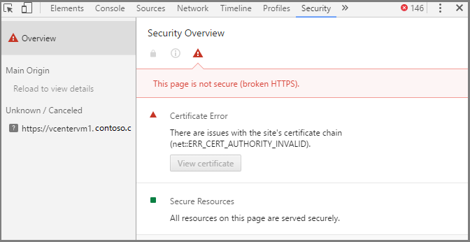
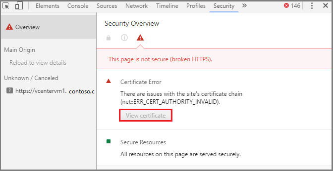
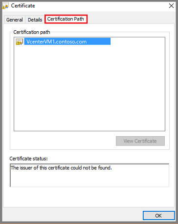
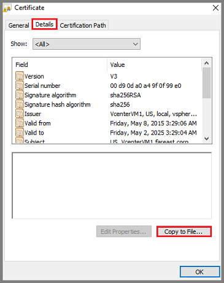
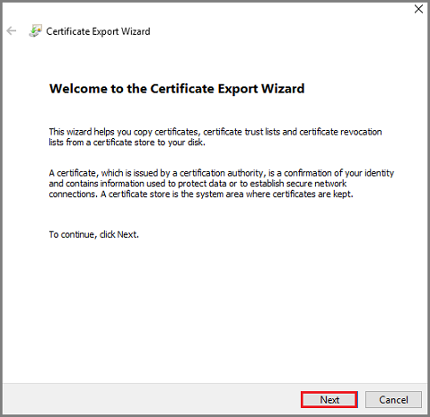
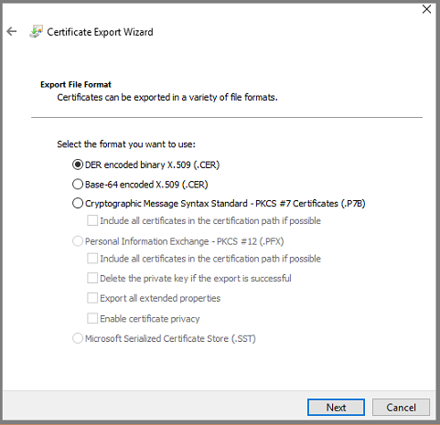
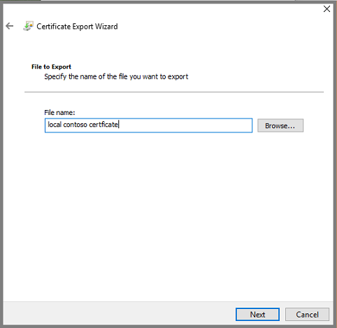
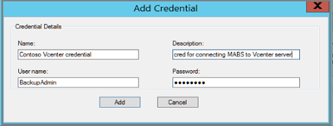
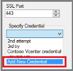

# Back up VMware server to Azure

## Create secure connection to VMware server

To protect a VMware Server, Azure Backup Server must be able to securely connect to the VMware Server. To enable the secure connection, install a valid certificate on the VMware Server and Azure Backup Server.

When you connect to the Vmware server, if the URL is not secure, then you'll need to export the certificate so the connection to the site is secure.

1. Click https (with the strike through), and then on the pop-up menu, click the Details link.

  Depending on your browser, you may need to click **Settings** > **More Tools** > **Developer Tools**, and select the Security tab.

  

2. In the details information on the Security tab, click **View Certificate**.

  

  The Certificate dialog opens.

3. In the Certificate dialog, click the Certification Path tab.  

  

  The highlighted certificate is not trusted because in this certificate's case, the issuer could not be found. There may be other reasons why the certificate is not trusted.

4. To export the certificate to your local machine, click the Details tab, and then click Copy to File.

  

  The Certificate Export Wizard opens.

  

  Click **Next** to move through the wizard.

5. On the Export File Format screen, specify the format you prefer for the certificate. If you don't have a preferred format, accept the default file format for the certificate and click **Next**.

  

6. On the File to Export screen, give your certificate a name, and then click Browse to choose the location to store the certificate on your local computer. Save the certificate where you can find it.

  

7. After exporting the certificate, go to the location where you saved it, right-click the certificate and from the menu, select **Install Certificate**.

  The Certificate Import Wizard opens.

  

8. On the Certificate Import Wizard, select **Local Machine** as the destination for the certificate, and click **Next** to continue.

9. On the Certificate Store screen, select **Place all certificates in the following store** and click **Browse**.

  

  The Select Certificate Store dialog opens.

  

  Choose the destination folder for the certificates, and click **OK**. If you don't know which folder to use, choose Trusted Root Certification Authorities. The chosen destination folder appears in the Certificate store dialog. Click **Next** to import the certificate.

10. On the Completing the Certificate Import Wizard screen, verify the certificate is in the desired folder, and click Finish to complete the wizard.

  

  A dialog appears letting you if the import was successful.

10. Log into the Vcenter VM to check that you have secure connection to the VMware server. The Azure Backup Server connects to the VMware server over a secure HTTPs channel. If you have secure boundaries within your organization, and don't want to enable HTTPs protocol between Azure Backup Server and the VMware server, then disable the secure communication via the registry. However, it is recommended that you install certificates on Azure Backup Server and VMware server to enable secure communication.

## Create role and user account on VMware server

Azure Backup Server communicates with a remote VMware Server by authenticating a specified VMware user's credentials. Azure Backup Server authenticates the VMware user's credentials for all backup operations. To enable Azure Backup Server to securely communicate with the VMware server:

- Create a user role that has assigned privileges
- Create a user account with credentials - a username and password
- Add the VMware server user account to Azure Backup Server

, when going through the Production Server Addition Wizard. The username and password pair are stored as a credential.

### Create user role and add privileges
The VMware user account, which is specified in the Azure Backup Server credential, must have certain associated privileges. However, privileges are associated with a user role, so we'll first create a user role and then add specific privileges to that role. The privileges that are associated with the user role are for a backup administrator.

1. To create a new VMware user role, log into your Vcenter server, and on the **Navigator** panel click **Administration**.

  

2. To create a new role, in the **Administration** section, select **Roles** and in the **Roles** panel click the Add role icon, (the + symbol).

  

  The **Create Role** dialog opens.

  

3. In the **Create Role** dialog, in the **Role name** field, type a name for the role. In this example, we'll use the name, *BackupAdminRole*. The role name can be whatever you like, but the name should be recognizable for the role.

4. Select the privileges to apply them to the user role. Select the privileges in the following list. When selecting the privileges, click the chevron on the parent label to expand the parent and view the child privileges. You don't need to select all child privileges within a parent privilege.

  

  - Privilege.Datastore.AllocateSpace.label
  - Privilege.Global.ManageCustomerFields.label
  - privilege.Network.Assign.label
  - Privilege.VirtualMachine.Config.AddNewDisk.label
  - Privilege.VirtualMachine.Config.AdvanceConfig.label
  - Privilege.VirtualMachine.Config.ChangeTracking.label
  - Privilege.VirtualMachine.Config.HostUSBDevice.label
  - Privilege.VirtualMachine.Config.SwapPlacement.label  
  - Privilege.VirtualMachine.Interact.PowerOff.label
  - Privilege.VirtualMachine.Inventory.Create.label
  - Privilege.VirtualMachine.Provisioning.DiskRandomRead.summary
  - Privilege.VirtualMachine.State.CreateSnapshot.label
  - Privilege.VirtualMachine.State.RemoveSnapshot.label
 

  Once you have selected the privileges, click **OK**. The new role appears in the list on the Roles panel.

### Create a user account and assign permissions

Once you have defined the user role with privileges, create a user account. As you create the user account, you assign it to a specific user role, which gives the account the associated privileges. The user account has a name and password, which provides the credentials used for authentication.

1. To create a new user account, on the VMware server, on the Navigator pane, click **Users and Groups**.

  

  The Users and Groups panel appears.

  

2. In the vCenter Users and Groups panel, on the Users tab, click the Add users icon (the + symbol).

  The New User dialog opens.

3. The user account that you create, contains the user name and password pair that is used as credentials. In the New User dialog, fill out the fields and click **OK**.

  

  The new user account appears in the list.

4. Now that you've created the user account, associate it with the user role (that has the desired permissions). On the Navigator pane, click **Global Permissions**. On the Global Permissions panel, click the **Manage** tab and then click the Add icon (the + symbol).

  

  The Global Permissions Root - Add Permission dialog opens.

5. In the **Global Permission Root - Add Permission** dialog, click **Add** to choose the user or group.

  

  The Select Users/Groups dialog opens.

6. In the **Select Users/Groups** dialog, select the user account that you created, and click **Add**. The selected user account appears in the Users field. The user name appears in the Users field in the format *domain*`\`*user name*.

  

  Click **OK** to add the selected users to the Add Permission dialog.

7. Now that you've identified the user, assign the user to the role. In the Assigned Role area, from the drop-down menu, select the role and click **OK**.

  

  On the Manage tab of the Global Permissions, the new user account and the associated role appear in the list.

### Add the VMware user account credentials to Azure Backup Server

Before you add the Vcenter server to Azure Backup Server, be sure that you have installed [Update 1 for Microsoft Azure Backup Server](https://support.microsoft.com/help/3175529/update-1-for-microsoft-azure-backup-server).

1. Click the following icon (located on the server desktop) to open the Azure Backup Server console.

  

  If you can't find the icon on the desktop, you can open the Azure Backup Server from the list of installed apps. In the list of installed apps, the Azure Backup Server app is named Microsoft Azure Backup.

2. In the Azure Backup Server console, click **Management**, then click **Production Servers**, and then in the tool ribbon, click **Manage VMware**.

  

  The Manage Credentials dialog opens.

  

3. In the Manage Credentials dialog, click **Add** to open the Add Credentials dialog.

4. In the Add Credentials dialog, type a name and description for the new credential. The user name and password should be the same as you used when creating the user account in the Vcenter server.

  

  Click **Add** to add the new credential to Azure Backup Server. The new credential appears in the list in the Manage Credentials dialog.
  

5. Click the **X** in the upper-right hand corner to close the Manage Credentials dialog.

## Add VMware server to Azure Backup Server

to open the Production Server Addition wizard

1. In the Azure Backup Server console, click **Management**, click **Production Server**, and then click **Add** .

  

  The Production Server Addition Wizard opens.

  

2. On the Select Production Server type screen, select VMware Servers, and click **Next**.

3. In the Server Name/IP address, specify the fully qualified domain name (FQDN) or IP address of the VMware server. You can enter the Vcenter name if all the ESXi servers are managed by the same Vcenter.

  

4. In the **SSL Port** dialog, enter the port used to communicate with the VMware server. Use port 443, which is the default port, unless you know that a different port is required.

5. In the **Specify Credential** dialog, you can create a new credential, or select an existing credential. In the previous section, you created a credential. Select this credential.

  If there isn't an available credential, or you need to create a new credential, click **Add New Credential**, create the new credential, and click **OK**.

  

6. Click **Add** to add the VMware server to the list of **Added VMware Servers**, and click **Next to move to the next screen in the wizard.

  

7. In the **Tasks** screen, click **Add** to add the specified VMware server to the Azure Backup Server.

  

  Since the VMware server backup is an agentless backup. Adding the new server happens in seconds. You can add multiple VMware servers to the Azure Backup Server by repeating the preceding steps in this section.

Now that you have added a VMware server to the Azure Backup Server, the next step is to create a protection group. The protection group specifies the various details for short or long-term retention, and it is where you define and apply the backup policy. The backup policy is the schedule for when backups are taken, and what is backed up.

## Configure a protection group to back up VMware server

If you have not used System Center Data Protection Manager or Azure Backup Server before, see the topic, [Plan for disk backups](https://technet.microsoft.com/en-us/library/hh758026.aspx), to prepare your hardware environment. Once you've checked that you have proper storage, use the Create New Protection Group wizard to add the specific VMs.

1. In the Azure Backup Server console, click **Protection**, and in the tool ribbon, click **New** to open the Create New Protection Group wizard.

  

  The Create New Protection Group wizard opens.

  

  Click **Next** to advance to the **Select protection group type** screen.

2. On the Select Protection Group Type screen, select **Servers** and click **Next**.

3. On the Select Group Members screen, you can see the available members and the members that have been selected. Select the members you want to protect and click **Next**.

  

  When selecting a member, if you select a folder that contains other folders or VMs, those folders and VMs are also selected. The inclusion of the folders and VMs in the parent folder is called folder-level protection. You can exclude any folder or VM by de-selecting the checkbox.

  If a VM, or a folder containing a VM, is already protected to Azure, you cannot select that VM again. That is, once a VM is protected to Azure, it cannot be protected again, which prevents duplicate recovery points from being created for one VM. If you want to see which Azure Backup Server already protects a member, hover your mouse over the member, to see the name of the protecting server.

4. On the Select Data Protection Method screen, type a name for the protection group. Then, for **Protection method**, select where you want to back up your data. Data is backed up to disk for short-term protection. Data is backed up to the Cloud (Azure) for long-term protection. Click **Next** to proceed to the short-term protection range.

  

5. On the Specify Short-Term Goals screen, for **Retention Range**, specify the number of days you want to retain recovery points *stored to disk*. If you want to change the time and days when recovery points are taken, click **Modify**. The short-term recovery points are full backups. They are not incremental backups. When you are satisfied with the short-term goals, click **Next**.

  

6. On the Review Disk Allocation screen, review and if necessary, modify the disk space for the VMs. The recommended disk allocations are based on the retention range specified in the previous screen, the type of workload and the size of the protected data (identified in step 3).  

  - Data size - Size of the data in the protection group.
  - Disk space - The amount of disk space recommended for the protection group. If you want to modify this setting, you should allocate total space that is slightly larger than the amount you estimate each data source will grow.
  - Colocate data - If you enable colocation, multiple data source in the protection can map to a single replica and recovery point volume. Colocation isn't supported for all workloads.
  - Automatically grow - If you enable this setting, if data in the protected group outgrows the initial allocation, DPM tries to increase the disk size by 25%.
  - Storage pool details - Shows the current status of the storage pool, including total and remaining disk size.

    

  When you have finished, click **Next**.

7. On the Choose Replica Creation Method screen, specify how you want to generate the initial copy, or replica, of the protected data on the Azure Backup Server.

  The default is **Automatically over the network** and **Now**. If you use the default, it is recommended you specify an off-peak time - choose **Later** and specify a day and time.

  For large amounts of data or less-than-optimal network conditions, consider replicating the data offline using removable media.

  Once you have made your choices, click **Next**.

  

8. On the **Consistency Check Options** screen, select how and when to automate consistency checks. You can run consistency checks when replica data becomes inconsistent, or according to a set schedule.

  If you don't want to configure automatic consistency checking, you can run a manual check any time by right-clicking the protection group in the Protection area of the Azure Backup Server console, and selecting Perform Consistency Check.

  Click **Next** to move to the next screen.

9. On the **Specify Online Protection Data** screen, select the data source(s) that you want to protect. You can select the members individually, or click **Select All** to choose all members. Once you choose the members, click **Next*.

  

10. On the **Specify Online Backup Schedule** screen, specify the schedule for generating recovery points from the disk backup. Once the recovery point is generated, it is transferred to the Recovery Services vault in Azure. When you are satisfied with the online backup schedule, click **Next**.

  

11. On the Specify Online Retention Policy screen, indicate how long you want to retain the backup data in Azure. After defining the policy, click **Next**.

  

  There is no time limit for how long you can keep data in Azure. When storing recovery point data in Azure, the only limit is you cannot have more than 9999 recovery points per protected instance. In this example, the protected instance is the VMware server.

12. On the Summary screen, review the details for your protection group. Note the group members and the settings. When you are satisfied with the settings, click ** Create Group**.

  

## Next steps
If you use Azure Backup Server to protect VMware workloads, you may be interested in using Azure Backup Server to protect [Microsft Exchange server](./backup-azure-exchange-mabs.md), a [Microsoft SharePoint farm](./backup-azure-backup-sharepoint-mabs.md), or a [SQL Server](./backup-azure-sql-mabs.md).

See [Troubleshoot Azure Backup Server](./backup-azure-mabs-troubleshoot.md) for information on problems registering the agent, configuring the protection group, and problems with backup jobs.
