# Back up VMware VMs with Azure Backup Server

This article explains how to back up VMware VMs running on VMware ESXi hosts/vCenter Server to Azure using Azure Backup Server.

This article explains how to:

- Set up a secure channel so that Azure Backup Server can communicate with VMware servers over HTTPS.
- Set up a VMware account that Azure Backup Server uses to access the VMware server.
- Add the account credentials to Azure Backup.
- Add the vCenter or ESXi server to Azure Backup Server.
- Set up a protection group that contains the VMware VMs you want to back up, specify backup settings, and schedule the backup.

## Before you start

- Verify that you're running a version of vCenter/ESXi that's supported for backup. Refer to the support matrix [here](https://docs.microsoft.com/azure/backup/backup-mabs-protection-matrix).
- Make sure you've set up Azure Backup Server. If you haven't, [do that](backup-azure-microsoft-azure-backup.md) before you start. You should be running Azure Backup Server with the latest updates.

## Create a secure connection to the vCenter Server

By default, Azure Backup Server communicates with VMware servers over HTTPS. To set up the HTTPS connection, download the VMware Certificate Authority (CA) certificate, and import it on the Azure Backup Server.

### Before you begin

- If you don't want to use HTTPS, you can [disable HTTPS certificate validation for all VMware servers](backup-azure-backup-server-vmware.md#disable-https-certificate-validation).
- You typically connect from a browser on the Azure Backup Server machine to the vCenter/ESXi server using the vSphere Web Client. The first time you do this, the connection isn't secure and will show the following.
- It's important to understand how Azure Backup Server handles backups.
  - As a first step Azure Backup Server backs up data to local disk storage. Azure Backup Server uses a storage pool, a set of disks and volumes on which Azure Backup Server stores disk recovery points for its protected data. The storage pool can be directly attached storage (DAS), a fiber channel SAN, or iSCSI storage device or SAN. It's important to ensure that you have sufficient storage for local backup of your VMware VM data.
  - Azure Backup Server then backs up from the local disk storage to Azure.
  - [Get help](https://docs.microsoft.com/system-center/dpm/create-dpm-protection-groups?view=sc-dpm-1807#figure-out-how-much-storage-space-you-need) to figure out how much storage space you need. The information is for DPM but can be used for Azure Backup Server too.

### Set up the certificate

Set up a secure channel as follows:

1. In the browser on Azure Backup Server, enter the vSphere Web Client URL. If the login page doesn't appear, verify the connection and browser proxy settings.

    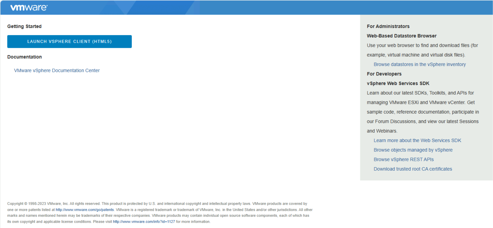

2. On the vSphere Web Client login page, click **Download trusted root CA certificates**.

    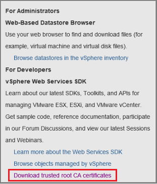

3. A file named **download** is downloaded. Depending on your browser, you receive a message that asks whether to open or save the file.

    

4. Save the file on the Azure Backup Server machine with a .zip extension.

5. Right-click **download.zip** > **Extract All**. The .zip file extracts its contents to the **certs** folder, which contains:
   - The root certificate file with an extension that begins with a numbered sequence like .0 and .1.
   - The CRL file has an extension that begins with a sequence like .r0 or .r1. The CRL file is associated with a certificate.

    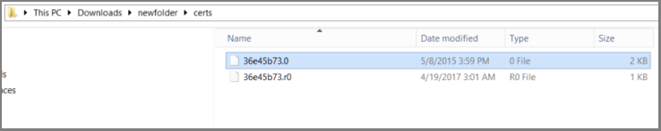

6. In the **certs** folder, right-click the root certificate file > **Rename**.

    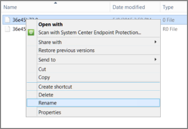

7. Change the root certificate's extension to .crt, and confirm. The file icon changes to one that represents a root certificate.

8. Right-click the root certificate and from the pop-up menu, select **Install Certificate**.

9. In **Certificate Import Wizard**, select **Local Machine** as the destination for the certificate, and then click **Next**. Confirm if you're asked if you want to allow changes to the computer.

    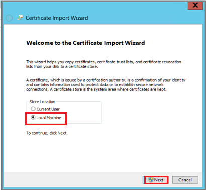

10. On the **Certificate Store** page, select **Place all certificates in the following store**, and then click **Browse** to choose the certificate store.

    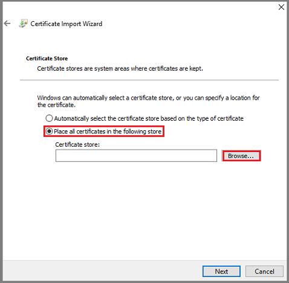

11. In **Select Certificate Store**, select **Trusted Root Certification Authorities** as the destination folder for the certificates, and then click **OK**.

    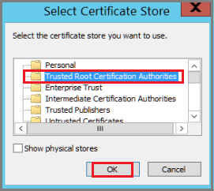

12. In **Completing the Certificate Import Wizard**, verify the folder, and then click **Finish**.

    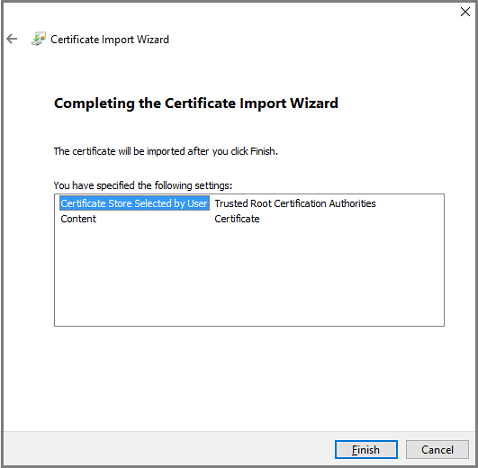

13. After the certificate import is confirmed, sign in to the vCenter Server to confirm that your connection is secure.

### Disable HTTPS certificate validation

If you have secure boundaries within your organization, and don't want to use the HTTPS protocol between VMware servers and the Azure Backup Server machine, disable HTTPS as follows:

1. Copy and paste the following text into a .txt file.

```text
Windows Registry Editor Version 5.00
[HKEY_LOCAL_MACHINE\SOFTWARE\Microsoft\Microsoft Data Protection Manager\VMWare]
"IgnoreCertificateValidation"=dword:00000001
```

2. Save the file on the Azure Backup Server machine with the name **DisableSecureAuthentication.reg**.

3. Double-click the file to activate the registry entry.

## Create a VMware role

The Azure Backup Server needs a user account with permissions to access v-Center Server/ESXi host. Create a VMware role with specific privileges, and then associate a user account with the role.

1. Sign in to the vCenter Server (or ESXi host if you're not using vCenter Server).
2. In the **Navigator** panel, click **Administration**.

    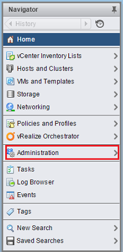

3. In **Administration** > **Roles**, click the add role icon (the + symbol).

    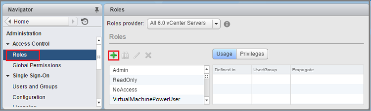

4. In **Create Role** > **Role name**, enter *BackupAdminRole*. The role name can be whatever you like, but it should be recognizable for the role's purpose.

5. Select the privileges as summarized in the table below, and then click **OK**.  The new role appears on the list in the **Roles** panel.
   - Click the icon next to the parent label to expand the parent and view the child privileges.
   - To select the VirtualMachine privileges, you need to go several levels into the parent child hierarchy.
   - You don't need to select all child privileges within a parent privilege.

    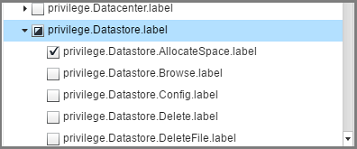

### Role permissions

| **Privileges for vCenter 6.5 and above user account**        | **Privileges for vCenter 6.0 user account**               | **Privileges for vCenter 5.5 user account** |
| ------------------------------------------------------------ | --------------------------------------------------------- | ------------------------------------------- |
| Datastore.AllocateSpace                                      |                                                           |                                             |
| Datastore.Browse datastore                                   | Datastore.AllocateSpace                                   | Network.Assign                              |
| Datastore.Low-level file operations                          | Global.Manage custom attributes                           | Datastore.AllocateSpace                     |
| Datastore cluster.Configure a datatstore cluster             | Global.Set custom attribute                               | VirtualMachine.Config.ChangeTracking        |
| Global.Disable methods                                       | Host.Local operations.Create virtual machine              | VirtualMachine.State.RemoveSnapshot         |
| Global.Enable methods                                        | Network. Assign network                                   | VirtualMachine.State.CreateSnapshot         |
| Global.Licenses                                              | Resource. Assign virtual machine to resource pool         | VirtualMachine.Provisioning.DiskRandomRead  |
| Global.Log event                                             | Virtual machine.Configuration.Add new disk                | VirtualMachine.Interact.PowerOff            |
| Global.Manage custom attributes                              | Virtual machine.Configuration.Advanced                    | VirtualMachine.Inventory.Create             |
| Global.Set custom attribute                                  | Virtual machine.Configuration.Disk change tracking        | VirtualMachine.Config.AddNewDisk            |
| Network.Assign network                                       | Virtual machine.Configuration.Host USB device             | VirtualMachine.Config.HostUSBDevice         |
| Resource. Assign virtual machine to resource pool            | Virtual machine.Configuration.Query unowned files         | VirtualMachine.Config.AdvancedConfig        |
| Virtual machine.Configuration.Add new disk                   | Virtual machine.Configuration.Swapfile placement          | VirtualMachine.Config.SwapPlacement         |
| Virtual machine.Configuration.Advanced                       | Virtual machine.Interaction.Power Off                     | Global.ManageCustomFields                   |
| Virtual machine.Configuration.Disk change tracking           | Virtual machine.Inventory. Create new                     |                                             |
| Virtual machine.Configuration.Disk lease                     | Virtual machine.Provisioning.Allow disk access            |                                             |
| Virtual machine.Configuration.Extend virtual disk            | Virtual machine.Provisioning. Allow read-only disk access |                                             |
| Virtual machine.Guest Operations.Guest Operation Modifications | Virtual machine.Snapshot management.Create snapshot       |                                             |
| Virtual machine.Guest Operations.Guest Operation Program Execution | Virtual machine.Snapshot management.Remove Snapshot       |                                             |
| Virtual machine.Guest Operations.Guest Operation Queries     |                                                           |                                             |
| Virtual machine .Interaction .Device connection              |                                                           |                                             |
| Virtual machine .Interaction .Guest operating system management by VIX API |                                                           |                                             |
| Virtual machine .Inventory.Register                          |                                                           |                                             |
| Virtual machine .Inventory.Remove                            |                                                           |                                             |
| Virtual machine .Provisioning.Allow disk access              |                                                           |                                             |
| Virtual machine .Provisioning.Allow read-only disk access    |                                                           |                                             |
| Virtual machine .Provisioning.Allow virtual machine download |                                                           |                                             |
| Virtual machine .Snapshot management. Create snapshot        |                                                           |                                             |
| Virtual machine .Snapshot management.Remove Snapshot         |                                                           |                                             |
| Virtual machine .Snapshot management.Revert to snapshot      |                                                           |                                             |
| vApp.Add virtual machine                                     |                                                           |                                             |
| vApp.Assign resource pool                                    |                                                           |                                             |
| vApp.Unregister                                              |                                                           |                                             |

## Create a VMware account

1. In vCenter Server **Navigator** panel, click **Users and Groups**. If you don't use vCenter Server, create the account on the appropriate ESXi host.

    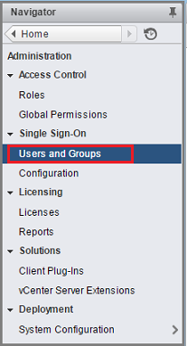

    The **vCenter Users and Groups** panel appear.

2. In the **vCenter Users and Groups** panel, select the **Users** tab, and then click the add users icon (the + symbol).

    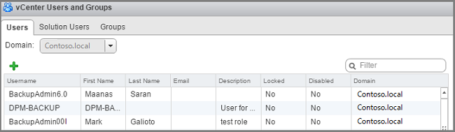

3. In **New User** dialog box, add the user information > **OK**. In this procedure, the username is BackupAdmin.

    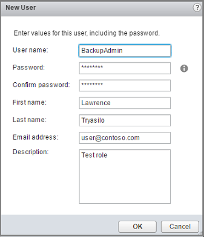

4. To associate the user account with the role, in the **Navigator** panel, click **Global Permissions**. In the **Global Permissions** panel, select the **Manage** tab, and then click the add icon (the + symbol).

    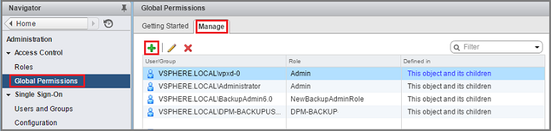

5. In **Global Permission Root - Add Permission**, click **Add** to choose the user or group.

    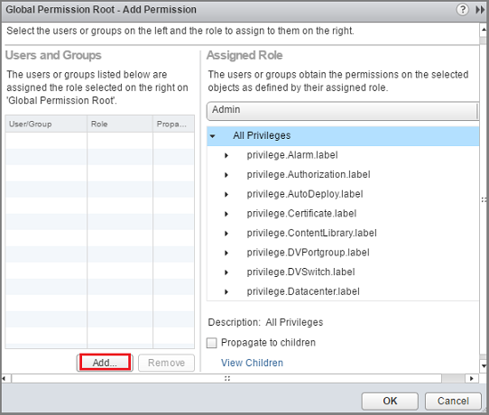

6. In **Select Users/Groups**, choose **BackupAdmin** > **Add**. In **Users**, the *domain\username* format is used for the user account. If you want to use a different domain, choose it from the **Domain** list. Click **OK** to add the selected users to the **Add Permission** dialog box.

    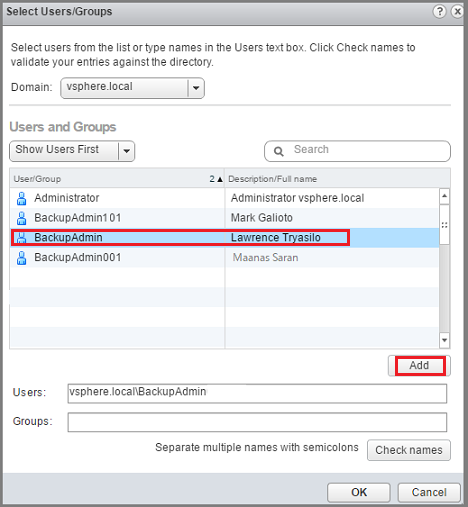

7. In **Assigned Role**, from the drop-down list, select **BackupAdminRole** > **OK**.

    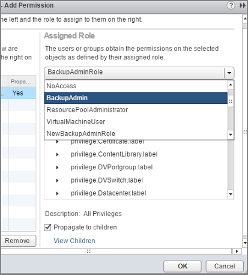

On the **Manage** tab in the **Global Permissions** panel, the new user account and the associated role appear in the list.

## Add the account on Azure Backup Server

1. Open Azure Backup Server. If you can't find the icon on the desktop, open  Microsoft Azure Backup from the apps list.

    

2. In the Azure Backup Server console, click **Management** >  **Production Servers** > **Manage VMware**.

    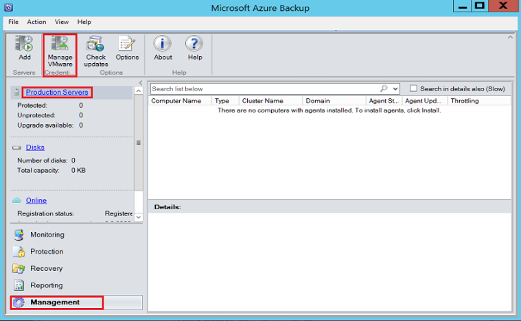

3. In the **Manage Credentials** dialog box, click **Add**.

    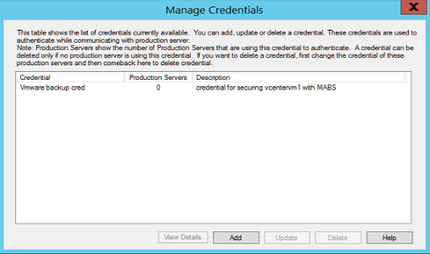

4. In **Add Credential**, enter a name and a description for the new credential, and specify the username and password you defined on the VMware server. The name, *Contoso Vcenter credential* is used to identify the credential in this procedure. If the VMware server and Azure Backup Server aren't in the same domain, specify the domain in the user name.

    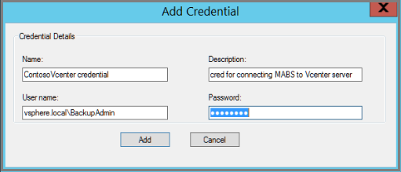

5. Click **Add** to add the new credential.

    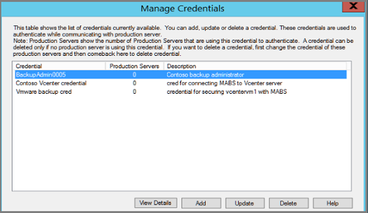

## Add the vCenter Server

Add the vCenter Server to Azure Backup Server.

1. In the Azure Backup Server console, click **Management** > **Production Servers** > **Add**.

    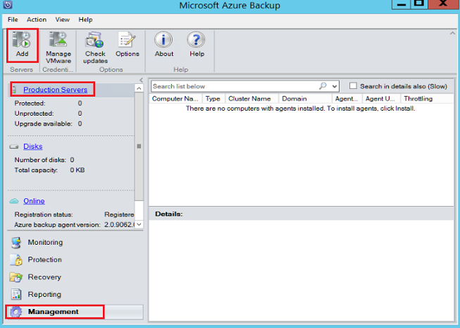

2. In **Production Server Addition Wizard** > **Select Production Server type** page, select **VMware Servers**, and then click **Next**.

    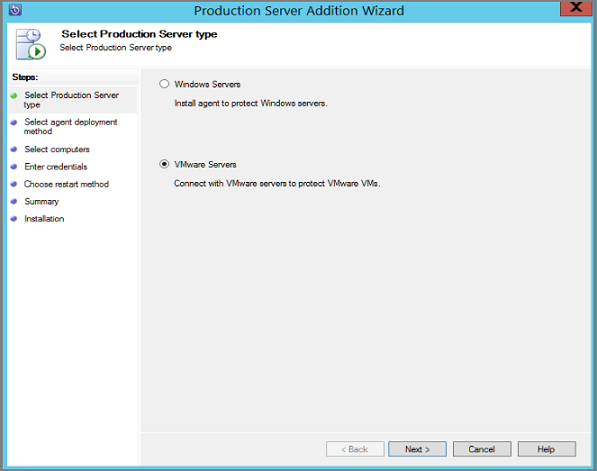

3. In **Select Computers**  **Server Name/IP Address**, specify the FQDN or IP address of the VMware server. If all the  ESXi servers are managed by the same vCenter, specify the vCenter name. Otherwise, add the ESXi host.

    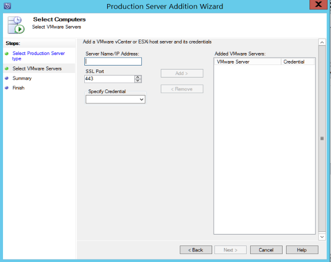

4. In **SSL Port**, enter the port that's used to communicate with the VMware server. 443 is the default port, but you can change it if your VMware server listens on a different port.

5. In **Specify Credential**, select the credential that you created earlier.

    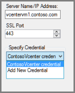

6. Click **Add** to add the VMware server to the servers list. Then click **Next**.

    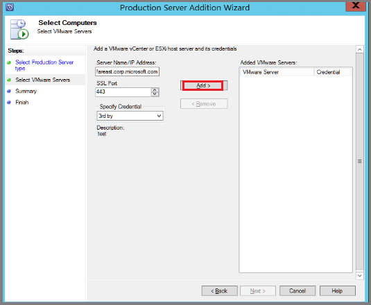

7. In the **Summary** page, click **Add** to add the VMware server to Azure Backup Server. The new server is added immediately, no agent is needed on the VMware server.

    

8. Verify settings on the **Finish** page.

   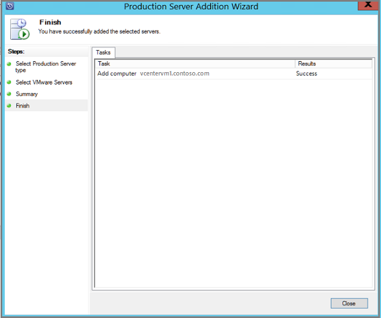

If you have multiple ESXi hosts that aren't managed by vCenter server, or you have multiple instances of vCenter Server, you need to rerun the wizard to add the servers.

## Configure a protection group

Add VMware VMs for backup. Protection groups gather multiple VMs and apply the same data retention and backup settings to all VMs in the group.

1. In the Azure Backup Server console, click **Protection**, > **New**.

    

1. In the **Create New Protection Group** wizard welcome page, click **Next**.

    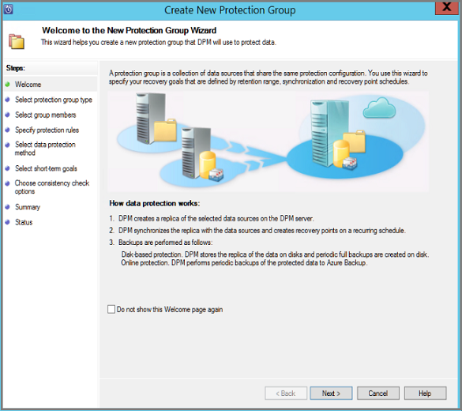

1. On the **Select Protection group type** page, select **Servers** and then click **Next**. The **Select group members** page appears.

1. In **Select group members**, select the VMs (or VM folders) that you want to back up. Then click **Next**.

    - When you select a folder, or VMs or folders inside that folder are also selected for backup. You can uncheck folders or VMs you don't want to back up.
1. If a VM or folder is already being backed up, you can't select it. This ensures that duplicate recovery points aren't created for a VM.

    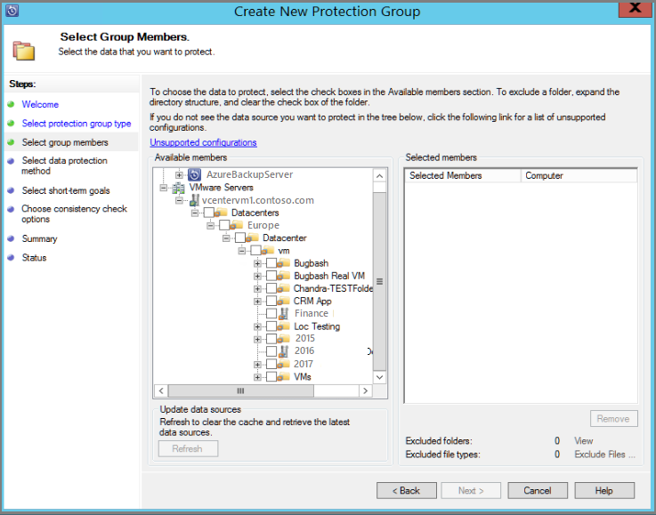

1. In **Select Data Protection Method** page, enter a name for the protection group, and protection settings. To back up to Azure, set short-term protection to **Disk** and enable online protection. Then click **Next**.

    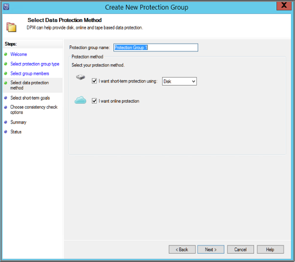

1. In **Specify Short-Term Goals**, specify how long you want to keep data backed up to disk.
   - In **Retention Range**, specify how many days disk recovery points should be kept.
   - In **Synchronization frequency**, specify how often disk recovery points are taken.
       - If you don't want to set a backup interval, you can check **Just before a recovery point** so that a backup runs just before each recovery point is scheduled.
       - Short-term backups are full backups and not incremental.
       - Click **Modify** to change the times/dates when short-term backups occur.

         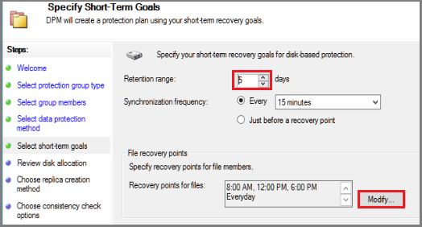

1. In **Review Disk Allocation**, review the disk space provided for the VM backups. for the VMs.

   - The recommended disk allocations are based on the retention range you specified, the type of workload, and the size of the protected data. Make any changes required, and then click **Next**.
   - **Data size:** Size of the data in the protection group.
   - **Disk space:** The recommended amount of disk space for the protection group. If you want to modify this setting, you should allocate total space that is slightly larger than the amount that you estimate each data source grows.
   - **Colocate data:** If you turn on colocation, multiple data sources in the protection can map to a single replica and recovery point volume. Colocation isn't supported for all workloads.
   - **Automatically grow:** If you turn on this setting, if data in the protected group outgrows the initial allocation, Azure Backup Server tries to increase the disk size by 25 percent.
   - **Storage pool details:** Shows the status of the storage pool, including total and remaining disk size.

    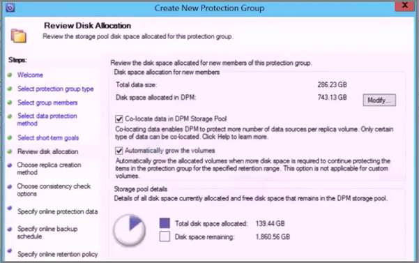

1. In **Choose Replica Creation Method** page, specify how you want to take the initial backup, and then click **Next**.
   - The default is **Automatically over the network** and **Now**.
   - If you use the default, we recommend that you specify an off-peak time. Choose **Later** and specify a day and time.
   - For large amounts of data or less-than-optimal network conditions, consider replicating the data offline by using removable media.

    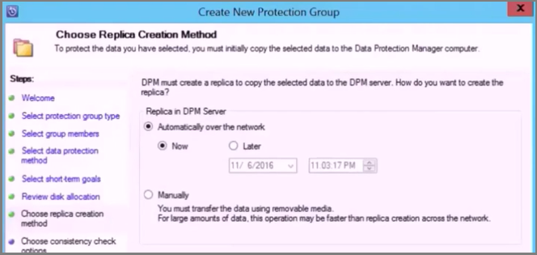

1. In **Consistency Check Options**, select how and when to automate the consistency checks. Then click **Next**.
      - You can run consistency checks when replica data becomes inconsistent, or on a set schedule.
      - If you don't want to configure automatic consistency checks, you can run a manual check. To do this, right-click the protection group > **Perform Consistency Check**.

1. In **Specify Online Protection Data** page, select the VMs or VM folders that you want to back up. You can select the members individually, or click **Select All** to choose all members. Then click **Next**.

    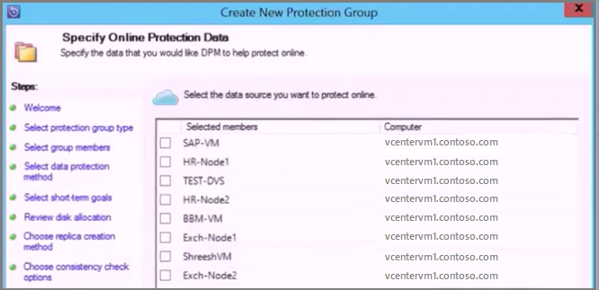

1. On the **Specify Online Backup Schedule** page, specify how often you want to back up data from local storage to Azure.

    - Cloud recovery points for the data will be generated according to the schedule. Then click **Next**.
    - After the recovery point is generated, it is transferred to the Recovery Services vault in Azure.

    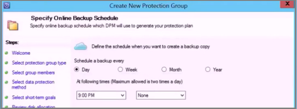

1. On the **Specify Online Retention Policy** page, indicate how long you want to keep the recovery points that are created from the daily/weekly/monthly/yearly backups to Azure. then click **Next**.

    - There's no time limit for how long you can keep data in Azure.
    - The only limit is that you can't have more than 9999 recovery points per protected instance. In this example, the protected instance is the VMware server.

    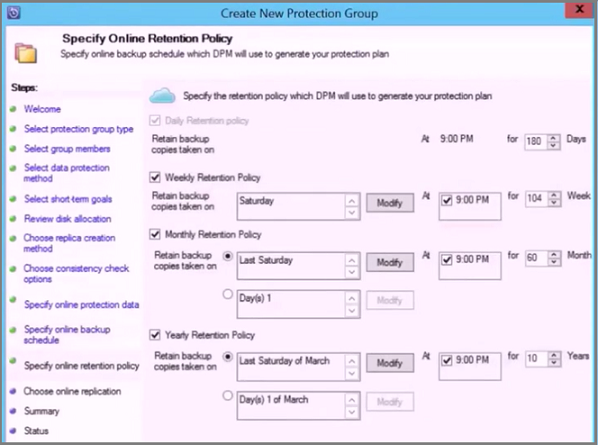

1. On the **Summary** page, review the settings, and then click **Create Group**.

    

## VMWare vSphere 6.7

To back up vSphere 6.7, do the following:

- Enable TLS 1.2 on DPM Server

>[!NOTE]
>VMWare 6.7 onwards had TLS enabled as communication protocol.

- Set the registry keys as follows:

```text
Windows Registry Editor Version 5.00

[HKEY_LOCAL_MACHINE\SOFTWARE\WOW6432Node\Microsoft\.NETFramework\v2.0.50727]
"SystemDefaultTlsVersions"=dword:00000001
"SchUseStrongCrypto"=dword:00000001

[HKEY_LOCAL_MACHINE\SOFTWARE\WOW6432Node\Microsoft\.NETFramework\v4.0.30319]
"SystemDefaultTlsVersions"=dword:00000001
"SchUseStrongCrypto"=dword:00000001

[HKEY_LOCAL_MACHINE\SOFTWARE\Microsoft\.NETFramework\v2.0.50727]
"SystemDefaultTlsVersions"=dword:00000001
"SchUseStrongCrypto"=dword:00000001

[HKEY_LOCAL_MACHINE\SOFTWARE\Microsoft\.NETFramework\v4.0.30319]
"SystemDefaultTlsVersions"=dword:00000001
"SchUseStrongCrypto"=dword:00000001
```

## Next steps

For troubleshooting issues when setting up backups, review the [troubleshooting guide for Azure Backup Server](./backup-azure-mabs-troubleshoot.md).
