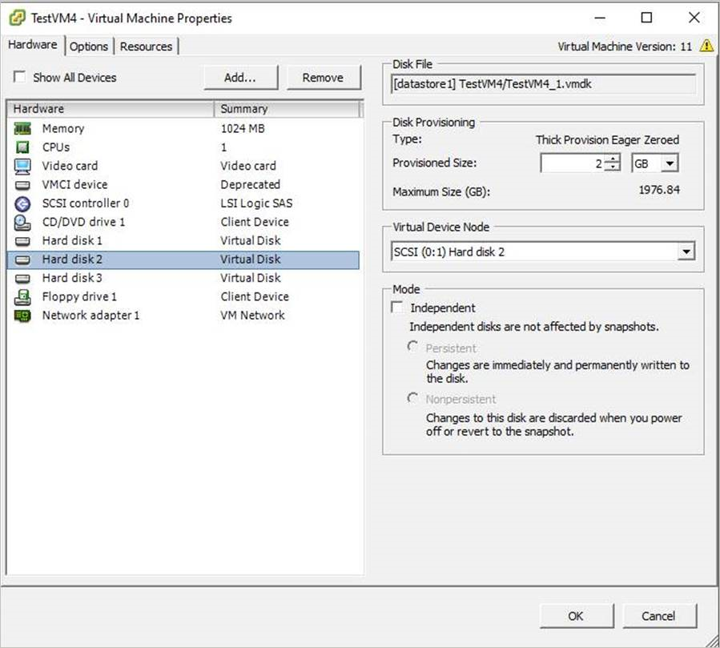

# Back up VMware VMs with Azure Backup Server

This article describes how to back up VMware VMs running on VMware ESXi hosts/vCenter Server to Azure using Azure Backup Server (MABS).

## VMware VM protection workflow

To protect VMware VM using Azure Backup you need to:

1. Set up a secure channel so that Azure Backup Server can communicate with VMware servers over HTTPS.
1. Set up a VMware account that Azure Backup Server uses to access the VMware server.
1. Add the account credentials to Azure Backup.
1. Add the vCenter or ESXi server to Azure Backup Server.
1. Set up a protection group that contains the VMware VMs you want to back up, specify backup settings, and schedule the backup.

## Support matrix

This section provides the supported scenarios to protect VMware VMs.

### Supported VMware features

MABS provides the following features when backing up VMware virtual machines:

- Agentless backup: MABS doesn't require an agent to be installed on the vCenter or ESXi server, to back up the virtual machine. Instead, just provide the IP address or fully qualified domain name (FQDN), and sign-in credentials used to authenticate the VMware server with MABS.
- Cloud Integrated Backup: MABS protects workloads to disk and cloud. MABS's backup and recovery workflow helps you manage long-term retention and offsite backup.
- Detect and protect VMs managed by vCenter: MABS detects and protects VMs deployed on a VMware server (vCenter or ESXi server). As your deployment size grows, use vCenter to manage your VMware environment. MABS also detects VMs managed by vCenter, allowing you to protect large deployments.
- Folder level auto protection: vCenter lets you organize your VMs in VM folders. MABS detects these folders and lets you protect VMs at the folder level and includes all subfolders. When you're protecting folders, MABS not only protects the VMs in that folder, but also protects VMs added later. MABS detects new VMs on a daily basis and protects them automatically. As you organize your VMs in recursive folders, MABS automatically detects and protects the new VMs deployed in the recursive folders.
- MABS protects VMs stored on a local disk, network file system (NFS), or cluster storage.
- MABS protects VMs migrated for load balancing: As VMs are migrated for load balancing, MABS automatically detects and continues VM protection.
- MABS can recover files/folders from a Windows VM without recovering the entire VM, which helps recover necessary files faster.

### Supported MABS versions

| MABS versions | Supported VMware VM versions for backup |
| --- | --- |
| MABS v4     | VMware server 8.0, 7.0, 6.7, or 6.5 (Licensed version) |
| MABS v3 UR2 | VMware server 7.0, 6.7, 6.5, or 6.0 (Licensed Version) |
| MABS v3 UR1 | VMware server 6.7, 6.5, 6.0, or 5.5 (Licensed Version) |

## Prerequisites and limitations

Before you start backing up a VMware virtual machine, review the following list of limitations and prerequisites.

- If you have been using MABS to protect a vCenter server (running on Windows) as a Windows Server using the FQDN of the server, you can't protect that vCenter server as a VMware server using the FQDN of the server.
  - You can use the static IP address of vCenter Server as a workaround.
  - If you want to use the FQDN, you should stop the protection as a Windows Server, remove the protection agent, and then add as a VMware Server using FQDN.
- If you use vCenter to manage ESXi servers in your environment, add vCenter (and not ESXi) to the MABS protection group.
- You can't back up user snapshots before the first MABS backup. Once MABS completes the first backup, then you can back up user snapshots.
- MABS can't protect VMware VMs with pass-through disks and physical raw device mappings (pRDM).
- MABS can't detect or protect VMware vApps.
- MABS can't protect VMware VMs with existing snapshots.
- MABS v4 doesn't support the *DataSets* feature for VMware 8.0.

## Before you start

- Verify that you're running a version of vCenter/ESXi that's supported for backup. Refer to the support matrix [here](./backup-mabs-protection-matrix.md).
- Make sure you've set up Azure Backup Server. If you haven't, [do that](backup-azure-microsoft-azure-backup.md) before you start. You should be running Azure Backup Server with the latest updates.
- Ensure the following network ports are open:
  - TCP 443 between MABS and vCenter
  - TCP 443 and TCP 902 between MABS and ESXi host

## Create a secure connection to the vCenter Server

By default, Azure Backup Server communicates with VMware servers over HTTPS. To set up the HTTPS connection, download the VMware Certificate Authority (CA) certificate, and import it on the Azure Backup Server.

### Before you begin

- If you don't want to use HTTPS, you can [disable HTTPS certificate validation for all VMware servers](backup-azure-backup-server-vmware.md#disable-https-certificate-validation).
- You typically connect from a browser on the Azure Backup Server machine to the vCenter/ESXi server using the vSphere Web Client. The first time you do this, the connection isn't secure and will show the following.
- It's important to understand how Azure Backup Server handles backups.
  - As a first step Azure Backup Server backs up data to local disk storage. Azure Backup Server uses a storage pool, a set of disks and volumes on which Azure Backup Server stores disk recovery points for its protected data. The storage pool can be directly attached storage (DAS), a fiber channel SAN, or iSCSI storage device or SAN. It's important to ensure that you have sufficient storage for local backup of your VMware VM data.
  - Azure Backup Server then backs up from the local disk storage to Azure.
  - [Get help](/system-center/dpm/create-dpm-protection-groups#figure-out-how-much-storage-space-you-need) to figure out how much storage space you need. The information is for DPM but can be used for Azure Backup Server too.

### Set up the certificate

Set up a secure channel as follows:

1. In the browser on Azure Backup Server, enter the vSphere Web Client URL. If the sign-in page doesn't appear, verify the connection and browser proxy settings.

    

2. On the vSphere Web Client sign-in page, select **Download trusted root CA certificates**.

    

3. A file named **download** is downloaded. Depending on your browser, you receive a message that asks whether to open or save the file.

    

4. Save the file on the Azure Backup Server machine with a .zip extension.

5. Right-click **download.zip** > **Extract All**. The .zip file extracts its contents to the **certs** folder, which contains:
   - The root certificate file with an extension that begins with a numbered sequence like .0 and .1.
   - The CRL file has an extension that begins with a sequence like `.r0` or `.r1`. The CRL file is associated with a certificate.

    

6. In the **certs** folder, right-click the root certificate file > **Rename**.

    

7. Change the root certificate's extension to .crt, and confirm. The file icon changes to one that represents a root certificate.

8. Right-click the root certificate and from the pop-up menu, select **Install Certificate**.

9. In **Certificate Import Wizard**, select **Local Machine** as the destination for the certificate, and then select **Next**. Confirm if you're asked if you want to allow changes to the computer.

    

10. On the **Certificate Store** page, select **Place all certificates in the following store**, and then select **Browse** to choose the certificate store.

    

11. On **Select Certificate Store**, select **Trusted Root Certification Authorities** as the destination folder for the certificates, and then select **OK**.

    

12. On **Completing the Certificate Import Wizard**, verify the folder, and then select **Finish**.

    

13. After the certificate import is confirmed, sign in to the vCenter Server to confirm that your connection is secure.

### Disable HTTPS certificate validation

If you have secure boundaries within your organization, and don't want to use the HTTPS protocol between VMware servers and the Azure Backup Server machine, disable HTTPS as follows:

1. Copy and paste the following text into a .txt file.

    ```text
    Windows Registry Editor Version 5.00
    [HKEY_LOCAL_MACHINE\SOFTWARE\Microsoft\Microsoft Data Protection Manager\VMWare]
    "IgnoreCertificateValidation"=dword:00000001
    ```

2. Save the file on the Azure Backup Server machine with the name **DisableSecureAuthentication.reg**.

3. Double-click the file to activate the registry entry.

## Create a VMware role

The Azure Backup Server needs a user account with permissions to access v-Center Server/ESXi host. Create a VMware role with specific privileges, and then associate a user account with the role.

1. Sign in to the vCenter Server (or ESXi host if you're not using vCenter Server).
2. On the **Navigator** pane, select **Administration**.

    

3. On **Administration** > **Roles**, select the add role icon (the + symbol).

    

4. On **Create Role** > **Role name**, enter *BackupAdminRole*. The role name can be whatever you like, but it should be recognizable for the role's purpose.

5. Select the privileges as summarized in the table below, and then select **OK**.  The new role appears on the list in the **Roles** panel.
   - Select the icon next to the parent label to expand the parent and view the child privileges.
   - To select the VirtualMachine privileges, you need to go several levels into the parent child hierarchy.
   - You don't need to select all child privileges within a parent privilege.

    

### Role permissions

The following table captures the privileges that you need to assign to the user account that you create:

| Privileges for vCenter 6.5 user account                          | Privileges for vCenter 6.7 (and later) user account                            |
|----------------------------------------------------------------------------|----------------------------------------------------------------------------|
| `Datastore cluster.Configure a datastore cluster`                           | `Datastore cluster.Configure a datastore cluster`                           |
| `Datastore.AllocateSpace`                                                    | `Datastore.AllocateSpace`                                                    |
| `Datastore.Browse datastore`                                                 | `Datastore.Browse datastore`                                                 |
| `Datastore.Low-level file operations`                                        | `Datastore.Low-level file operations`                                        |
| `Global.Disable methods`                                                     | `Global.Disable methods`                                                     |
| `Global.Enable methods`                                                      | `Global.Enable methods`                                                      |
| `Global.Licenses`                                                            | `Global.Licenses`                                                            |
| `Global.Log event`                                                           | `Global.Log event`                                                           |
| `Global.Manage custom attributes`                                            | `Global.Manage custom attributes`                                            |
| `Global.Set custom attribute`                                                | `Global.Set custom attribute`                                                |
| `Host.Local operations.Create virtual machine`                               | `Host.Local operations.Create virtual machine`                               |
| `Network.Assign network`                                                     | `Network.Assign network`                                                     |
| `Resource. Assign virtual machine to resource pool`                          | `Resource. Assign virtual machine to resource pool`                          |
| `vApp.Add virtual machine`                                                   | `vApp.Add virtual machine`                                                   |
| `vApp.Assign resource pool`                                                  | `vApp.Assign resource pool`                                                  |
| `vApp.Unregister`                                                            | `vApp.Unregister`                                                            |
| `VirtualMachine.Configuration. Add Or Remove Device`                         | `VirtualMachine.Configuration. Add Or Remove Device`                         |
| `Virtual machine.Configuration.Disk lease`                                   | `Virtual machine.Configuration.Acquire disk lease`                           |
| `Virtual machine.Configuration.Add new disk`                                 | `Virtual machine.Configuration.Add new disk`                                 |
| `Virtual machine.Configuration.Advanced`                                     | `Virtual machine.Configuration.Advanced configuration`                       |
| `Virtual machine.Configuration.Disk change tracking`                         | `Virtual machine.Configuration.Toggle disk change tracking`                  |
| `Virtual machine.Configuration.Host USB device`                              | `Virtual machine.Configuration.Configure Host USB device`                    |
| `Virtual machine.Configuration.Extend virtual disk`                          | `Virtual machine.Configuration.Extend virtual disk`                          |
| `Virtual machine.Configuration.Query unowned files`                          | `Virtual machine.Configuration.Query unowned files`                          |
| `Virtual machine.Configuration.Swapfile placement`                           | `Virtual machine.Configuration.Change Swapfile placement`                    |
| `Virtual machine.Guest Operations.Guest Operation Program Execution`         | `Virtual machine.Guest Operations.Guest Operation Program Execution`         |
| `Virtual machine.Guest Operations.Guest Operation Modifications`             | `Virtual machine.Guest Operations.Guest Operation Modifications`             |
| `Virtual machine.Guest Operations.Guest Operation Queries`                   | `Virtual machine.Guest Operations.Guest Operation Queries`                   |
| `Virtual machine .Interaction .Device connection`                            | `Virtual machine .Interaction .Device connection`                            |
| `Virtual machine .Interaction .Guest operating system management by VIX API` | `Virtual machine .Interaction .Guest operating system management by VIX API` |
| `Virtual machine .Interaction .Power Off`                                    | `Virtual machine .Interaction .Power Off`                                    |
| `Virtual machine .Inventory.Create new`                                      | `Virtual machine .Inventory.Create new`                                      |
| `Virtual machine .Inventory.Remove`                                          | `Virtual machine .Inventory.Remove`                                          |
| `Virtual machine .Inventory.Register`                                        | `Virtual machine .Inventory.Register`                                        |
| `Virtual machine .Provisioning.Allow disk access`                            | `Virtual machine .Provisioning.Allow disk access`                            |
| `Virtual machine .Provisioning.Allow file access`                            | `Virtual machine .Provisioning.Allow file access`                            |
| `Virtual machine .Provisioning.Allow read-only disk access`                  | `Virtual machine .Provisioning.Allow read-only disk access`                  |
| `Virtual machine .Provisioning.Allow virtual machine download`               | `Virtual machine .Provisioning.Allow virtual machine download`               |
| `Virtual machine .Snapshot management. Create snapshot`                      | `Virtual machine .Snapshot management. Create snapshot`                      |
| `Virtual machine .Snapshot management.Remove Snapshot`                       | `Virtual machine .Snapshot management.Remove Snapshot`                       |
| `Virtual machine .Snapshot management.Revert to snapshot`                    | `Virtual machine .Snapshot management.Revert to snapshot`                    |

> [!NOTE]
> The following table lists the privileges for vCenter 6.0 and vCenter 5.5 user accounts.

| Privileges for vCenter 6.0 user account | Privileges for vCenter 5.5 user account |
| --- | --- |
| `Datastore.AllocateSpace` | `Network.Assign` |
| `Global.Manage custom attributes` | `Datastore.AllocateSpace` |
| `Global.Set custom attribute` | `VirtualMachine.Config.ChangeTracking` |
| `Host.Local operations.Create virtual machine` | `VirtualMachine.State.RemoveSnapshot` |
| `Network. Assign network` | `VirtualMachine.State.CreateSnapshot` |
| `Resource. Assign virtual machine to resource pool` | `VirtualMachine.Provisioning.DiskRandomRead` |
| `Virtual machine.Configuration.Add new disk` | `VirtualMachine.Interact.PowerOff` |
| `Virtual machine.Configuration.Advanced` | `VirtualMachine.Inventory.Create` |
| `Virtual machine.Configuration.Disk change tracking` | `VirtualMachine.Config.AddNewDisk` |
| `Virtual machine.Configuration.Host USB device` | `VirtualMachine.Config.HostUSBDevice` |
| `Virtual machine.Configuration.Query unowned files` | `VirtualMachine.Config.AdvancedConfig` |
| `Virtual machine.Configuration.Swapfile placement` | `VirtualMachine.Config.SwapPlacement` |
| `Virtual machine.Interaction.Power Off` | `Global.ManageCustomFields` |
| `Virtual machine.Inventory. Create new` |   |
| `Virtual machine.Provisioning.Allow disk access` |   |
| `Virtual machine.Provisioning. Allow read-only disk access` |   |
| `Virtual machine.Snapshot management.Create snapshot` |   |
| `Virtual machine.Snapshot management.Remove Snapshot` |   |

## Create a VMware account

To create a VMware account, follow these steps:

1. On vCenter Server **Navigator** pane, select **Users and Groups**. If you don't use vCenter Server, create the account on the appropriate ESXi host.

    

    The **vCenter Users and Groups** panel appear.

2. On the **vCenter Users and Groups** pane, select the **Users** tab, and then select the add users icon (the + symbol).

    

3. On **New User** dialog box, add the user information > **OK**. In this procedure, the username is BackupAdmin.

    

4. To associate the user account with the role, in the **Navigator** pane, select **Global Permissions**.

   On the **Global Permissions** pane, select the **Manage** tab, and then select the add icon (the + symbol).

    

5. On **Global Permission Root - Add Permission**, select **Add** to choose the user or group.

    

6. On **Select Users/Groups**, choose **BackupAdmin** > **Add**. In **Users**, the *domain\username* format is used for the user account. If you want to use a different domain, choose it from the **Domain** list. Select **OK** to add the selected users to the **Add Permission** dialog box.

    

7. On **Assigned Role**, from the drop-down list, select **BackupAdminRole** > **OK**.

    

On the **Manage** tab on the **Global Permissions** pane, the new user account and the associated role appear in the list.

## Add the account on Azure Backup Server

To add the account on the Azure Backup Server, follow these steps:

1. Open Azure Backup Server.

   If you can't find the icon on the desktop, open  Microsoft Azure Backup from the apps list.

    

2. On the Azure Backup Server console, select **Management** >  **Production Servers** > **Manage VMware**.

    

3. On the **Manage Credentials** dialog box, select **Add**.

    

4. On **Add Credential**, enter a name and a description for the new credential, and specify the username and password you defined on the VMware server. The name, *Contoso Vcenter credential* is used to identify the credential in this procedure. If the VMware server and Azure Backup Server aren't in the same domain, specify the domain in the user name.

    

5. Select **Add** to add the new credential.

    

## Add the vCenter Server

To add the vCenter Server to Azure Backup Server, follow these steps:

1. On the Azure Backup Server console, select **Management** > **Production Servers** > **Add**.

    

2. On **Production Server Addition Wizard** > **Select Production Server type** page, select **VMware Servers**, and then select **Next**.

    

3. On **Select Computers**, under **Server Name/IP Address**, specify the FQDN or IP address of the VMware server. If all the  ESXi servers are managed by the same vCenter, specify the vCenter name. Otherwise, add the ESXi host.

    

4. On **SSL Port**, enter the port that's used to communicate with the VMware server. 443 is the default port, but you can change it if your VMware server listens on a different port.

5. On **Specify Credential**, select the credential that you created earlier.

    

6. Select **Add** to add the VMware server to the servers list. Then select **Next**.

    

7. On the **Summary** page, select **Add** to add the VMware server to Azure Backup Server. The new server is added immediately, no agent is needed on the VMware server.

    

8. Verify settings on the **Finish** page.

   

If you have multiple ESXi hosts that aren't managed by vCenter server, or you have multiple instances of vCenter Server, you need to rerun the wizard to add the servers.

## Configure a protection group

To add VMware VMs for backup. Protection groups gather multiple VMs and apply the same data retention and backup settings to all VMs in the group, follow these steps:

1. On the Azure Backup Server console, select **Protection** > **New**.

    

1. On the **Create New Protection Group** wizard welcome page, select **Next**.

    

1. On the **Select Protection group type** page, select **Servers** and then select **Next**. The **Select group members** page appears.

1. On **Select group members**, select the VMs (or VM folders) that you want to back up. Then select **Next**.

    - When you select a folder, or VMs or folders inside that folder are also selected for backup. You can uncheck folders or VMs you don't want to back up.
1. If a VM or folder is already being backed up, you can't select it. This ensures that duplicate recovery points aren't created for a VM.

    

1. On **Select Data Protection Method** page, enter a name for the protection group, and protection settings. To back up to Azure, set short-term protection to **Disk** and enable online protection. Then select **Next**.

    

1. On **Specify Short-Term Goals**, specify how long you want to keep data backed up to disk.
   - On **Retention Range**, specify how many days disk recovery points should be kept.
   - On **Synchronization frequency**, specify how often disk recovery points are taken.
       - If you don't want to set a backup interval, you can check **Just before a recovery point** so that a backup runs just before each recovery point is scheduled.
       - Short-term backups are full backups and not incremental.
       - Select **Modify** to change the times/dates when short-term backups occur.

         

1. On **Review Disk Allocation**, review the disk space provided for the VM backups. for the VMs.

   - The recommended disk allocations are based on the retention range you specified, the type of workload, and the size of the protected data. Make any required changes, and then select **Next**.
   - **Data size:** Size of the data in the protection group.
   - **Disk space:** The recommended amount of disk space for the protection group. If you want to modify this setting, you should allocate total space that's slightly larger than the amount that you estimate each data source grows.
   - **Colocate data:** If you turn on colocation, multiple data sources in the protection can map to a single replica and recovery point volume. Colocation isn't supported for all workloads.
   - **Automatically grow:** If you turn on this setting, if data in the protected group outgrows the initial allocation, Azure Backup Server tries to increase the disk size by 25 percent.
   - **Storage pool details:** Shows the status of the storage pool, including total and remaining disk size.

    

1. On **Choose Replica Creation Method** page, specify how you want to take the initial backup, and then select **Next**.
   - The default is **Automatically over the network** and **Now**.
   - If you use the default, we recommend that you specify an off-peak time. Choose **Later** and specify a day and time.
   - For large amounts of data or less-than-optimal network conditions, consider replicating the data offline by using removable media.

    

1. On **Consistency Check Options**, select how and when to automate the consistency checks. Then select **Next**.
      - You can run consistency checks when replica data becomes inconsistent, or on a set schedule.
      - If you don't want to configure automatic consistency checks, you can run a manual check. To do this, right-click the protection group > **Perform Consistency Check**.

1. On **Specify Online Protection Data** page, select the VMs or VM folders that you want to back up. You can select the members individually, or select **Select All** to choose all members. Then select **Next**.

    

1. On the **Specify Online Backup Schedule** page, specify how often you want to back up data from local storage to Azure.

    - Cloud recovery points for the data will be generated according to the schedule. Then select **Next**.
    - After the recovery point is generated, it's transferred to the Recovery Services vault in Azure.

    

1. On the **Specify Online Retention Policy** page, indicate how long you want to keep the recovery points that are created from the daily/weekly/monthly/yearly backups to Azure. then select **Next**.

    - There's no time limit for how long you can keep data in Azure.
    - The only limit is that you can't have more than 9999 recovery points per protected instance. In this example, the protected instance is the VMware server.

    

1. On the **Summary** page, review the settings, and then select **Create Group**.

    

## VMware parallel backups

>[!NOTE]
> This feature is applicable for MABS V3 UR1 (and later).

With earlier versions of MABS, parallel backups were performed only across protection groups. With MABS V3 UR1 (and later), all your VMware VMs backups within a single protection group are parallel, leading to faster VM backups. All VMware delta replication jobs run in parallel. By default, the number of jobs to run in parallel is set to 8.

You can modify the number of jobs by using the registry key as shown below (not present by default, you need to add it):

**Key Path**: `Software\Microsoft\Microsoft Data Protection Manager\Configuration\ MaxParallelIncrementalJobs\VMware`<BR>
**Key Type**: DWORD (32-bit) value.

> [!NOTE]
> You can modify the number of jobs to a higher value. If you set the jobs number to 1, replication jobs run serially. To increase the number to a higher value, you must consider the VMware performance. Consider the number of resources in use and additional usage required on VMWare vSphere Server, and determine the number of delta replication jobs to run in parallel. Also, this change will affect only the newly created protection groups. For existing protection groups you must temporarily add another VM to the protection group. This should update the protection group configuration accordingly. You can remove this VM from the protection group after the procedure is completed.

## VMware vSphere 6.7, 7.0, and 8.0

To back up vSphere 6.7, 7.0, and 8.0, follow these steps:

- Enable TLS 1.2 on the MABS Server

>[!NOTE]
>VMware 6.7 onwards had TLS enabled as communication protocol.

- Set the registry keys as follows:

```text
Windows Registry Editor Version 5.00

[HKEY_LOCAL_MACHINE\SOFTWARE\WOW6432Node\Microsoft\.NETFramework\v2.0.50727]
"SystemDefaultTlsVersions"=dword:00000001
"SchUseStrongCrypto"=dword:00000001

[HKEY_LOCAL_MACHINE\SOFTWARE\WOW6432Node\Microsoft\.NETFramework\v4.0.30319]
"SystemDefaultTlsVersions"=dword:00000001
"SchUseStrongCrypto"=dword:00000001

[HKEY_LOCAL_MACHINE\SOFTWARE\Microsoft\.NETFramework\v2.0.50727]
"SystemDefaultTlsVersions"=dword:00000001
"SchUseStrongCrypto"=dword:00000001

[HKEY_LOCAL_MACHINE\SOFTWARE\Microsoft\.NETFramework\v4.0.30319]
"SystemDefaultTlsVersions"=dword:00000001
"SchUseStrongCrypto"=dword:00000001
```

## Exclude disk from VMware VM backup

With MABS V3 UR1 (and later), you can exclude the specific disk from VMware VM backup. The configuration script **ExcludeDisk.ps1** is located in the `C:\Program Files\Microsoft Azure Backup Server\DPM\DPM\bin folder`.

To configure the disk exclusion, follow these steps:

### Identify the VMware VM and disk details to be excluded

  1. On the VMware console, go to VM settings for which you want to exclude the disk.
  2. Select the disk that you want to exclude and note the path for that disk.

     For example, to exclude the Hard Disk 2 from the TestVM4, the path for Hard Disk 2 is **[datastore1] TestVM4/TestVM4\_1.vmdk**.

     

### Configure MABS Server

Navigate to the MABS server where the VMware VM is configured for protection to configure disk exclusion.

  1. Get the details of the VMware host that's protected on the MABS server.

     ```powershell
     $psInfo = get-DPMProductionServer
     $psInfo
     ```

     ```output
     ServerName   ClusterName     Domain            ServerProtectionState
     ----------   -----------     ------            ---------------------
     Vcentervm1                   Contoso.COM       NoDatasourcesProtected
     ```

  2. Select the VMware host and list the VMs protection for the VMware host.

     ```powershell
     $vmDsInfo = get-DPMDatasource -ProductionServer $psInfo[0] -Inquire
     $vmDsInfo
     ```

     ```output
     Computer     Name     ObjectType
     --------     ----     ----------
     Vcentervm1  TestVM2      VMware
     Vcentervm1  TestVM1      VMware
     Vcentervm1  TestVM4      VMware
     ```

  3. Select the VM for which you want to exclude a disk.

     ```powershell
     $vmDsInfo[2]
     ```

     ```output
     Computer     Name      ObjectType
     --------     ----      ----------
     Vcentervm1   TestVM4   VMware
     ```

  4. To exclude the disk, navigate to the `Bin` folder and run the *ExcludeDisk.ps1* script with the following parameters:

     > [!NOTE]
     > Before running this command, stop the DPMRA service on the MABS server. Otherwise, the script returns success, but doesn't update the exclusion list. Ensure there are no jobs in progress before stopping the service.

     **To add/remove the disk from exclusion, run the following command:**

     ```powershell
     ./ExcludeDisk.ps1 -Datasource $vmDsInfo[0] [-Add|Remove] "[Datastore] vmdk/vmdk.vmdk"
     ```

     **Example**:

     To add the disk exclusion for TestVM4, run the following command:

     ```powershell
     C:\Program Files\Microsoft Azure Backup Server\DPM\DPM\bin> ./ExcludeDisk.ps1 -Datasource $vmDsInfo[2] -Add "[datastore1] TestVM4/TestVM4\_1.vmdk"
     ```

     ```output
     Creating C:\Program Files\Microsoft Azure Backup Server\DPM\DPM\bin\excludedisk.xml
     Disk : [datastore1] TestVM4/TestVM4\_1.vmdk, has been added to disk exclusion list.
     ```

  5. Verify that the disk has been added for exclusion.

     **To view the existing exclusion for specific VMs, run the following command:**

     ```powershell
     ./ExcludeDisk.ps1 -Datasource $vmDsInfo[0] [-view]
     ```

     **Example**

     ```powershell
     C:\Program Files\Microsoft Azure Backup Server\DPM\DPM\bin> ./ExcludeDisk.ps1 -Datasource $vmDsInfo[2] -view
     ```

     ```output
     <VirtualMachine>
       <UUID>52b2b1b6-5a74-1359-a0a5-1c3627c7b96a</UUID>
       <ExcludeDisk>[datastore1] TestVM4/TestVM4\_1.vmdk</ExcludeDisk>
     </VirtualMachine>
     ```

     Once you configure the protection for this VM, the excluded disk won't be listed during protection.

     > [!NOTE]
     > If you are performing these steps for an already protected VM, you need to run the consistency check manually after adding the disk for exclusion.

### Remove the disk from exclusion

To remove the disk from exclusion, run the following command:

```powershell
C:\Program Files\Microsoft Azure Backup Server\DPM\DPM\bin> ./ExcludeDisk.ps1 -Datasource $vmDsInfo[2] -Remove "[datastore1] TestVM4/TestVM4\_1.vmdk"
```

## Next steps

For troubleshooting issues when setting up backups, review the [troubleshooting guide for Azure Backup Server](./backup-azure-mabs-troubleshoot.md).
