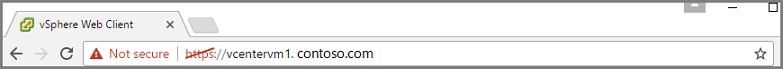
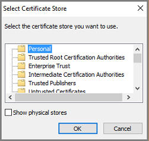
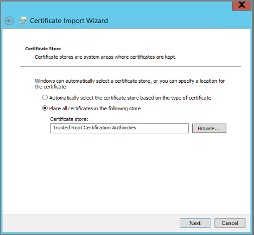
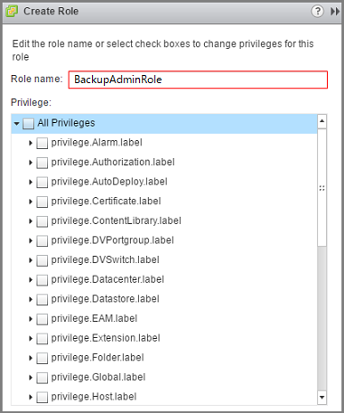

# Back up a VMware server to Azure

This article explains how to configure Azure Backup Server to help protect VMware server workloads. This article assumes you already have Azure Backup Server installed. If you don't have Azure Backup Server installed, see [Prepare to back up workloads using Azure Backup Server](backup-azure-microsoft-azure-backup.md).

Azure Backup Server can back up, or help protect, VMware vCenter Server version 6.0 and 5.5.


## Create a secure connection to the vCenter Server

By default, Azure Backup Server communicates with each vCenter Server via an HTTPS channel. To turn on the secure communication, we recommend that you install the VMware Certificate Authority (CA) certificate on Azure Backup Server. If you don't require secure communication, and would prefer to disable the HTTPS requirement, see [Disable secure communication protocol](backup-azure-backup-server-vmware.md#disable-secure-communication-protocol). To create a secure connection between Azure Backup Server and the vCenter Server, import the trusted certificate on Azure Backup Server.

Typically, you use a browser on the Azure Backup Server machine to connect to the vCenter Server via the vSphere Web Client. The first time you use the Azure Backup Server browser to connect to the vCenter Server, the connection isn't secure. The following image shows the unsecured connection.



To fix this issue, and create a secure connection, download the trusted root CA certificates.

1. In the browser on Azure Backup Server, enter the URL to the vSphere Web Client. The vSphere Web Client login page appears.

    

    At the bottom of the information for administrators and developers, locate the **Download trusted root CA certificates** link.

    

  If you don't see the vSphere Web Client login page, check your browser's proxy settings.

2. Click **Download trusted root CA certificates**.

    The vCenter Server downloads a file to your local computer. The file's name is named **download**. Depending on your browser, you receive a message that asks whether to open or save the file.

    

3. Save the file to a location on Azure Backup Server. When you save the file, add the .zip file name extension.

    The file is a .zip file that contains the information about the certificates. With the .zip extension, you can use the extraction tools.

4. Right-click **download.zip**, and then select **Extract All** to extract the contents.

    The .zip file extracts its contents to a folder named **certs**. Two types of files appear in the certs folder. The root certificate file has an extension that begins with a numbered sequence like .0 and .1.
    
    The CRL file has an extension that begins with a sequence like .r0 or .r1. The CRL file is associated with a certificate.

    

5. In the **certs** folder, right-click the root certificate file, and then click **Rename**.

    

    Change the root certificate's extension to .crt. When you're asked if you're sure you want to change the extension, click **Yes** or **OK**. Otherwise, you change the file's intended function. The icon for the file changes to an icon that represents a root certificate.

6. Right-click the root certificate and from the pop-up menu, select **Install Certificate**.

    The **Certificate Import Wizard** dialog box appears.

7. In the **Certificate Import Wizard** dialog box, select **Local Machine** as the destination for the certificate, and then click **Next** to continue.

    

    If you're asked if you want to allow changes to the computer, click **Yes** or **OK**, to all the changes.

8. On the **Certificate Store** page, select **Place all certificates in the following store**, and then click **Browse** to choose the certificate store.

    

    The **Select Certificate Store** dialog box appears.

    

9. Select **Trusted Root Certification Authorities** as the destination folder for the certificates, and then click **OK**.

    

    The **Trusted Root Certification Authorities** folder is confirmed as the certificate store. Click **Next**.

    

10. On the **Completing the Certificate Import Wizard** page, verify that the certificate is in the desired folder, and then click **Finish** to complete the wizard.

    

    A dialog box appears, the successful certificate import is confirmed.

11. Sign in to the vCenter Server to confirm that your connection is secure.

  If the certificate import is not successful, and you cannot establish a secure connection, consult the VMware vSphere documentation on [obtaining server certificates](http://pubs.vmware.com/vsphere-60/index.jsp#com.vmware.wssdk.dsg.doc/sdk_sg_server_certificate_Appendixes.6.4.html).

  If you have secure boundaries within your organization, and don't want to turn on the HTTPS protocol, use the following procedure to disable the secure communications.

### Disable secure communication protocol

If your organization doesn't require the HTTPS protocol, use the following steps to disable HTTPS. To disable the default behavior, create a registry key that ignores the default behavior.

1. Copy and paste the following text into a .txt file.

  ```
  Windows Registry Editor Version 5.00
  [HKEY_LOCAL_MACHINE\SOFTWARE\Microsoft\Microsoft Data Protection Manager\VMWare]
  "IgnoreCertificateValidation"=dword:00000001
  ```

2. Save the file to your Azure Backup Server computer. For the file name, use DisableSecureAuthentication.reg.

3. Double-click the file to activate the registry entry.


## Create a role and user account on the vCenter Server

On the vCenter Server, a role is a predefined set of privileges. A vCenter Server administrator creates the roles. To assign permissions, the administrator pairs user accounts with a role. To establish the necessary user credentials to back up the vCenter Server computer, create a role with specific privileges, and then associate the user account with the role.

Azure Backup Server uses a username and password to authenticate with the vCenter Server. Azure Backup Server uses these credentials as authentication for all backup operations.

To add a vCenter Server role and its privileges for a backup administrator:

1. Sign in to the vCenter Server, and then in the vCenter Server **Navigator** panel, click **Administration**.

    

2. In **Administration** select **Roles**, and then in the **Roles** panel click the add role icon (the + symbol).

    

    The **Create Role** dialog box appears.

    

3. In the **Create Role** dialog box, in the **Role name** box, enter *BackupAdminRole*. The role name can be whatever you like, but it should be recognizable for the role's purpose.

4. Select the privileges for the appropriate version of vCenter, and then click **OK**. The following table identifies the required privileges for vCenter 6.0 and vCenter 5.5.

  When you select the privileges, click the icon next to the parent label to expand the parent and view the child privileges. To select the VirtualMachine privileges, you need to go several levels into the parent child hierarchy. You don't need to select all child privileges within a parent privilege.

  

  After you click **OK**, the new role appears in the list on the Roles panel.

|Privileges for vCenter 6.0| Privileges for vCenter 5.5|
|--------------------------|---------------------------|
|Datastore.AllocateSpace   | Datastore.AllocateSpace|
|Global.ManageCustomFields | Global.ManageCustomerFields|
|Global.SetCustomFields    |   |
|Host.Local.CreateVM       | Network.Assign |
|Network.Assign            |  |
|Resource.AssignVMToPool   |  |
|VirtualMachine.Config.AddNewDisk  | VirtualMachine.Config.AddNewDisk   |
|VirtualMachine.Config.AdvanceConfig| VirtualMachine.Config.AdvancedConfig|
|VirtualMachine.Config.ChangeTracking| VirtualMachine.Config.ChangeTracking |
|VirtualMachine.Config.HostUSBDevice||
|VirtualMachine.Config.QueryUnownedFiles|    |
|VirtualMachine.Config.SwapPlacement| VirtualMachine.Config.SwapPlacement |
|VirtualMachine.Interact.PowerOff| VirtualMachine.Interact.PowerOff |
|VirtualMachine.Inventory.Create| VirtualMachine.Inventory.Create |
|VirtualMachine.Provisioning.DiskRandomAccess| |
|VirtualMachine.Provisioning.DiskRandomRead|VirtualMachine.Provisioning.DiskRandomRead |
|VirtualMachine.State.CreateSnapshot| VirtualMachine.State.CreateSnapshot|
|VirtualMachine.State.RemoveSnapshot|VirtualMachine.State.RemoveSnapshot |
</br>


## Create a vCenter Server user account and permissions

After the role with privileges is set up, create a user account. The user account has a name and password, which provides the credentials that are used for authentication.

1. To create a user account, in the vCenter Server **Navigator** panel, click **Users and Groups**.

    

    The **vCenter Users and Groups** panel appears.

    

2. In the **vCenter Users and Groups** panel, select the **Users** tab, and then click the add users icon (the + symbol).

    The **New User** dialog box appears.

3. In the **New User** dialog box, add the user's information and then click **OK**. In this procedure, the username is BackupAdmin.

    

    The new user account appears in the list.

4. To associate the user account with the role, in the **Navigator** panel, click **Global Permissions**. In the **Global Permissions** panel, select the **Manage** tab, and then click the add icon (the + symbol).

    

    The **Global Permissions Root - Add Permission** dialog box appears.

5. In the **Global Permission Root - Add Permission** dialog box, click **Add** to choose the user or group.

    

    The **Select Users/Groups** dialog box appears.

6. In the **Select Users/Groups** dialog box, choose **BackupAdmin** and then click **Add**.

    In **Users**, the *domain\username* format is used for the user account. If you want to use a different domain, choose it from the **Domain** list.

    

    Click **OK** to add the selected users to the **Add Permission** dialog box.

7. Now that you've identified the user, assign the user to the role. In **Assigned Role**, from the drop-down list, select **BackupAdminRole**, and then click **OK**.

    

  On the **Manage** tab in the **Global Permissions** panel, the new user account and the associated role appear in the list.


## Establish vCenter Server credentials on Azure Backup Server

Before you add the VMware server to Azure Backup Server, install [Update 1 for Azure Backup Server](https://support.microsoft.com/help/3175529/update-1-for-microsoft-azure-backup-server).

1. To open Azure Backup Server, double-click the icon on the Azure Backup Server desktop.

    

    If you can't find the icon on the desktop, open Azure Backup Server from the list of installed apps. The Azure Backup Server app name is called Microsoft Azure Backup.

2. In the Azure Backup Server console, click **Management**, click **Production Servers**, and then on the tool ribbon, click **Manage VMware**.

    

    The **Manage Credentials** dialog box appears.

    

3. In the **Manage Credentials** dialog box, click **Add** to open the **Add Credential** dialog box.

4. In the **Add Credential** dialog box, enter a name and a description for the new credential. Then specify the username and password. The *Contoso Vcenter credential* credential name is used to identify the credential in the next procedure. Use the same username and password that is used for the vCenter Server. If the vCenter Server and Azure Backup Server are not in the same domain, in **User name**, specify the domain.

    

    Click **Add** to add the new credential to Azure Backup Server. The new credential appears in the list in the **Manage Credentials** dialog box.
    

5. To close the **Manage Credentials** dialog box, click the **X** in the upper-right corner.


## Add the vCenter Server to Azure Backup Server

Production Server Addition Wizard is used to add the vCenter Server to Azure Backup Server.

To open Production Server Addition Wizard, complete the following procedure:

1. In the Azure Backup Server console, click **Management**, click **Production Servers**, and then click **Add**.

    

    The **Production Server Addition Wizard** dialog box appears.

    

2. On the **Select Production Server type** page, select **VMware Servers**, and then click **Next**.

3. In **Server Name/IP Address**, specify the fully qualified domain name (FQDN) or IP address of the VMware server. If all the ESXi servers are managed by the same vCenter, you can use the vCenter name.

    

4. In **SSL Port**, enter the port that is used to communicate with the VMware server. Use port 443, which is the default port, unless you know that a different port is required.

5. In **Specify Credential**, select the credential that you created earlier.

    

6. Click **Add** to add the VMware server to the list of **Added VMware Servers**, and then click **Next** to move to the next page in the wizard.

    

7. In the **Summary** page, click **Add** to add the specified VMware server to Azure Backup Server.

    

  The VMware server backup is an agentless backup, and the new server is added immediately. The **Finish** page shows you the results.

  

  To add multiple instances of vCenter Server to Azure Backup Server, repeat the previous steps in this section.

After you add the vCenter Server to Azure Backup Server, the next step is to create a protection group. The protection group specifies the various details for short or long-term retention, and it is where you define and apply the backup policy. The backup policy is the schedule for when backups occur, and what is backed up.


## Configure a protection group

If you have not used System Center Data Protection Manager or Azure Backup Server before, see [Plan for disk backups](https://technet.microsoft.com/library/hh758026.aspx) to prepare your hardware environment. After you check that you have proper storage, use the Create New Protection Group wizard to add VMware virtual machines.

1. In the Azure Backup Server console, click **Protection**, and in the tool ribbon, click **New** to open the Create New Protection Group wizard.

    

    The **Create New Protection Group** wizard dialog box appears.

    

    Click **Next** to advance to the **Select protection group type** page.

2. On the **Select Protection group type** page, select **Servers** and then click **Next**. The **Select group members** page appears.

3. On the **Select group members** page, the available members and the selected members appear. Select the members that you want to protect, and then click **Next**.

    

    When you select a member, if you select a folder that contains other folders or VMs, those folders and VMs are also selected. The inclusion of the folders and VMs in the parent folder is called folder-level protection. To remove a folder or VM, clear the check box.

    If a VM, or a folder containing a VM, is already protected to Azure, you cannot select that VM again. That is, after a VM is protected to Azure, it cannot be protected again, which prevents duplicate recovery points from being created for one VM. If you want to see which Azure Backup Server instance already protects a member, point to the member to see the name of the protecting server.

4. On the **Select Data Protection Method** page, enter a name for the protection group. Short-term protection (to disk) and online protection are selected. If you want to use online protection (to Azure), you must use short-term protection to disk. Click **Next** to proceed to the short-term protection range.

    

5. On the **Specify Short-Term Goals** page, for **Retention Range**, specify the number of days that you want to retain recovery points that are *stored to disk*. If you want to change the time and days when recovery points are taken, click **Modify**. The short-term recovery points are full backups. They are not incremental backups. When you are satisfied with the short-term goals, click **Next**.

    

6. On the **Review Disk Allocation** page, review and if necessary, modify the disk space for the VMs. The recommended disk allocations are based on the retention range that is specified in the **Specify Short-Term Goals** page, the type of workload, and the size of the protected data (identified in step 3).  

  - **Data size:** Size of the data in the protection group.
  - **Disk space:** The recommended amount of disk space for the protection group. If you want to modify this setting, you should allocate total space that is slightly larger than the amount that you estimate each data source grows.
  - **Colocate data:** If you turn on colocation, multiple data sources in the protection can map to a single replica and recovery point volume. Colocation isn't supported for all workloads.
  - **Automatically grow:** If you turn on this setting, if data in the protected group outgrows the initial allocation, System Center Data Protection Manager tries to increase the disk size by 25 percent.
  - **Storage pool details:** Shows the status of the storage pool, including total and remaining disk size.

    

    When you are satisfied with the space allocation, click **Next**.

7. On the **Choose Replica Creation Method** page, specify how you want to generate the initial copy, or replica, of the protected data on Azure Backup Server.

    The default is **Automatically over the network** and **Now**. If you use the default, we recommend that you specify an off-peak time. Choose **Later** and specify a day and time.

    For large amounts of data or less-than-optimal network conditions, consider replicating the data offline by using removable media.

    After you have made your choices, click **Next**.

    

8. On the **Consistency Check Options** page, select how and when to automate the consistency checks. You can run consistency checks when replica data becomes inconsistent, or on a set schedule.

    If you don't want to configure automatic consistency checks, you can run a manual check. In the protection area of the Azure Backup Server console, right-click the protection group and then select **Perform Consistency Check**.

    Click **Next** to move to the next page.

9. On the **Specify Online Protection Data** page, select one or more data sources that you want to protect. You can select the members individually, or click **Select All** to choose all members. After you choose the members, click **Next**.

    

10. On the **Specify Online Backup Schedule** page, specify the schedule to generate recovery points from the disk backup. After the recovery point is generated, it is transferred to the Recovery Services vault in Azure. When you are satisfied with the online backup schedule, click **Next**.

    

11. On the **Specify Online Retention Policy** page, indicate how long you want to retain the backup data in Azure. After the policy is defined, click **Next**.

    

    There is no time limit for how long you can keep data in Azure. When you store recovery point data in Azure, the only limit is that you cannot have more than 9999 recovery points per protected instance. In this example, the protected instance is the VMware server.

12. On the **Summary** page, review the details for your protection group members and settings, and then click **Create Group**.

    

## Next steps
If you use Azure Backup Server to protect VMware workloads, you may be interested in using Azure Backup Server to help protect a [Microsoft Exchange server](./backup-azure-exchange-mabs.md), a [Microsoft SharePoint farm](./backup-azure-backup-sharepoint-mabs.md), or a [SQL Server database](./backup-azure-sql-mabs.md).

For information on problems with registering the agent, configuring the protection group, or backing up jobs, see [Troubleshoot Azure Backup Server](./backup-azure-mabs-troubleshoot.md).
