<properties
	pageTitle="DPM/Azure Backup server protection of a SharePoint farm to Azure | Microsoft Azure"
	description="This article provides an overview of DPM/Azure Backup server protection of a SharePoint farm to Azure"
	services="backup"
	documentationCenter=""
	authors="adigan"
	manager="Nkolli1"
	editor=""/>

<tags
	ms.service="backup"
	ms.workload="storage-backup-recovery"
	ms.tgt_pltfrm="na"
	ms.devlang="na"
	ms.topic="article"
	ms.date="07/04/2016"
	ms.author="giridham;jimpark;trinadhk;markgal"/>

# Back up a SharePoint farm to Azure
You back up a SharePoint farm to Microsoft Azure by using System Center Data Protection Manager (DPM) in much the same way that you back up other data sources. Azure Backup provides flexibility in the backup schedule to create daily, weekly, monthly, or yearly backup points and gives you retention policy options for various backup points. DPM provides the capability to store local disk copies for quick recovery-time objectives (RTO) and to store copies to Azure for economical, long term retention.

## SharePoint supported versions and related protection scenarios
Azure Backup for DPM supports the following scenarios.

| Workload | Version | SharePoint deployment | DPM deployment type | DPM - System Center 2012 R2 | Protection and recovery |
| -------- | ------- | --------------------- | ------------------- | --------------------------- | ----------------------- |
| SharePoint | SharePoint 2013, SharePoint 2010, SharePoint 2007, SharePoint 3.0 | SharePoint deployed as a physical server or Hyper-V/VMware virtual machine   --------------   SQL AlwaysOn | Physical server or on-premises Hyper-V virtual machine | Supports backup to Azure from Update Rollup 5 | Protect SharePoint Farm recovery options: Recovery farm, database, and file or list item from disk recovery points.  Farm and database recovery from Azure recovery points. |

## Before you start
There are a few things you need to confirm before you back up a SharePoint farm to Azure.

### Prerequisites
Before you proceed, make sure that you have met all the [prerequisites for using Microsoft Azure Backup](backup-azure-dpm-introduction.md#prerequisites) to protect workloads. Some tasks for prerequisites include: create a backup vault, download vault credentials, install Azure Backup Agent, and register DPM/Azure Backup Server with the vault.

### DPM agent
The DPM agent must be installed on the server that's running SharePoint, the servers that are running SQL Server, and all other servers that are part of the SharePoint farm. For more information about how to set up the protection agent, see [Setup Protection Agent](https://technet.microsoft.com/library/hh758034(v=sc.12).aspx).  The one exception is that you install the agent only on a single web front end (WFE) server. DPM needs the agent on one WFE server only to serve as the entry point for protection.

### SharePoint farm
For every 10 million items in the farm, there must be at least 2 GB of space on the volume where the DPM folder is located. This space is required for catalog generation. For DPM to recover specific items (site collections, sites, lists, document libraries, folders, individual documents, and list items), catalog generation creates a list of the URLs that are contained within each content database. You can view the list of URLs in the recoverable item pane in the **Recovery** task area of DPM Administrator Console.

### SQL Server
DPM runs as a LocalSystem account. To back up SQL Server databases, DPM needs sysadmin privileges on that account for the server that's running SQL Server. Set NT AUTHORITY\SYSTEM to *sysadmin* on the server that's running SQL Server before you back it up.

If the SharePoint farm has SQL Server databases that are configured with SQL Server aliases, install the SQL Server client components on the front-end Web server that DPM will protect.

### SharePoint Server
While performance depends on many factors such as size of SharePoint farm, as general guidance one DPM server can protect a 25 TB SharePoint farm.

### DPM Update Rollup 5
To begin protection of a SharePoint farm to Azure, you need to install DPM Update Rollup 5 or later. Update Rollup 5 provides the ability to protect a SharePoint farm to Azure if the farm is configured by using SQL AlwaysOn.
For more information, see the blog post that introduces [DPM Update Rollup 5]( http://blogs.technet.com/b/dpm/archive/2015/02/11/update-rollup-5-for-system-center-2012-r2-data-protection-manager-is-now-available.aspx)

### What's not supported
- DPM that protects a SharePoint farm does not protect search indexes or application service databases. You will need to configure the protection of these databases separately.
- DPM does not provide backup of SharePoint SQL Server databases that are hosted on scale-out file server (SOFS) shares.

## Configure SharePoint protection
Before you can use DPM to protect SharePoint, you must configure the SharePoint VSS Writer service (WSS Writer service) by using **ConfigureSharePoint.exe**.

You can find **ConfigureSharePoint.exe** in the [DPM Installation Path]\bin folder on the front-end web server. This tool provides the protection agent with the credentials for the SharePoint farm. You run it on a single WFE server. If you have multiple WFE servers, select just one when you configure a protection group.

### To configure the SharePoint VSS Writer service
1. On the WFE server, at a command prompt, go to [DPM installation location]\bin\
2. Enter ConfigureSharePoint -EnableSharePointProtection.
3. Enter the farm administrator credentials. This account should be a member of the local Administrator group on the WFE server. If the farm administrator isn’t a local admin grant the following permissions on the WFE server:
  - Grant the WSS_Admin_WPG group full control to the DPM folder (%Program Files%\Microsoft Data Protection Manager\DPM).
  - Grant the WSS_Admin_WPG group read access to the DPM Registry key (HKEY_LOCAL_MACHINE\SOFTWARE\Microsoft\Microsoft Data Protection Manager).

>[AZURE.NOTE] You’ll need to rerun ConfigureSharePoint.exe whenever there’s a change in the SharePoint farm administrator credentials.

## Back up a SharePoint farm by using DPM
After you have configured DPM and the SharePoint farm as explained previously, SharePoint can be protected by DPM.

### To protect a SharePoint farm
1. From the **Protection** tab of the DPM Administrator Console, click **New**.
    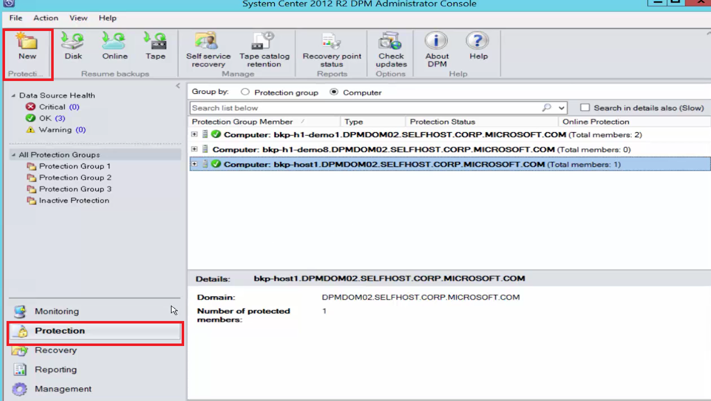

2. On the **Select Protection Group Type** page of the **Create New Protection Group** wizard, select **Servers**, and then click **Next**.

    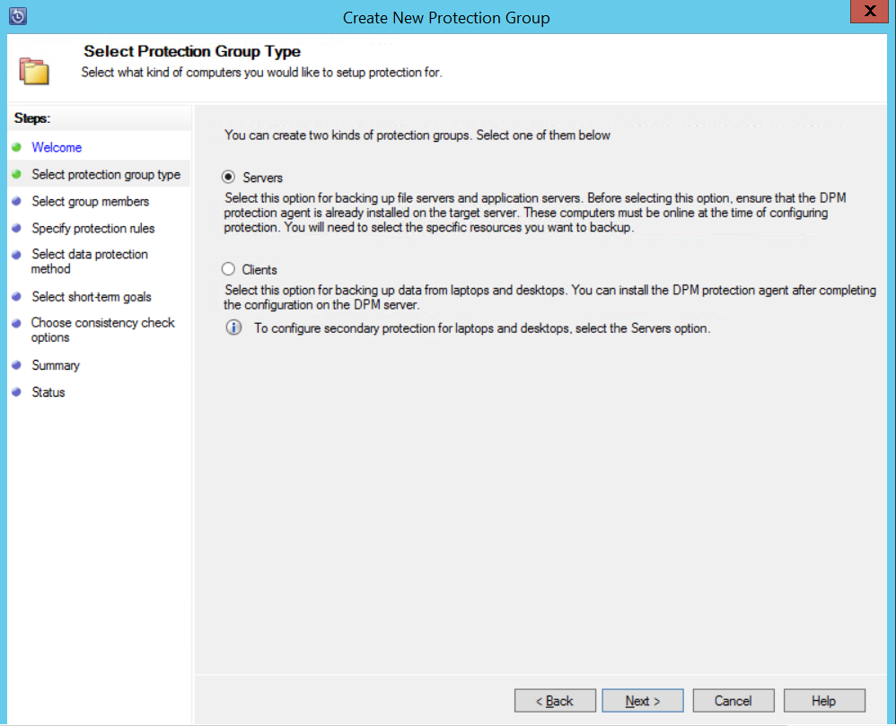

3. On the **Select Group Members** screen, select the check box for the SharePoint server you want to protect and click **Next**.

    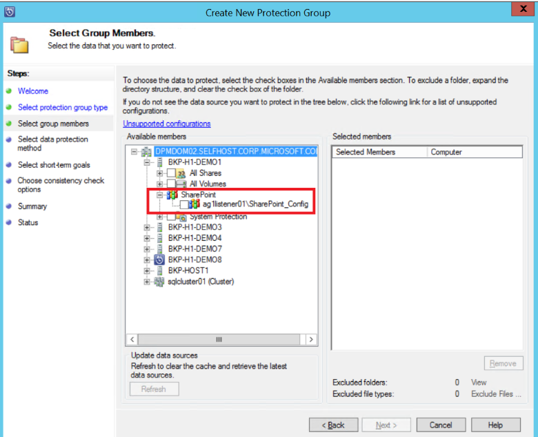

    >[AZURE.NOTE] With the DPM agent installed, you can see the server in the wizard. DPM also shows its structure. Because you ran ConfigureSharePoint.exe, DPM communicates with the SharePoint VSS Writer service and its corresponding SQL Server databases and recognizes the SharePoint farm structure, the associated content databases, and any corresponding items.

4. On the **Select Data Protection Method** page, enter the name of the **Protection Group**, and select your preferred *protection methods*. Click **Next**.

    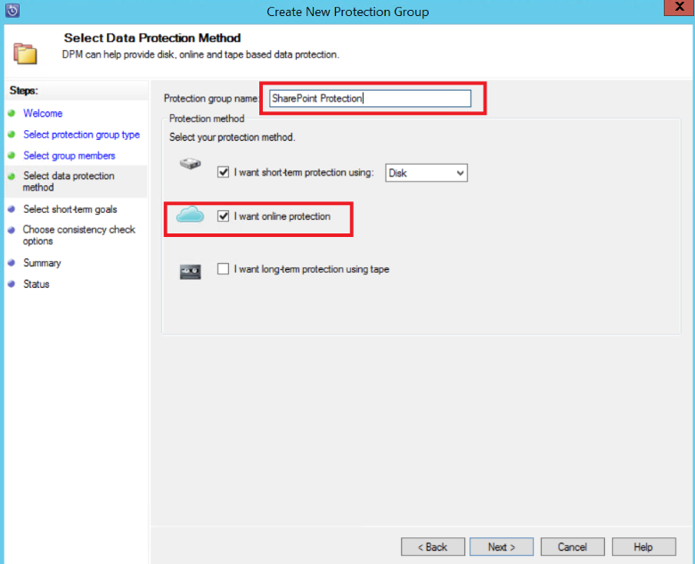

    >[AZURE.NOTE] The disk protection method helps to meet short recovery-time objectives. Azure is an economical, long-term protection target compared to tapes. For more information, see [Use Azure Backup to replace your tape infrastructure](https://azure.microsoft.com/documentation/articles/backup-azure-backup-cloud-as-tape/)

5. On the **Specify Short-Term Goals** page, select your preferred **Retention range** and identify when you want backups to occur.

    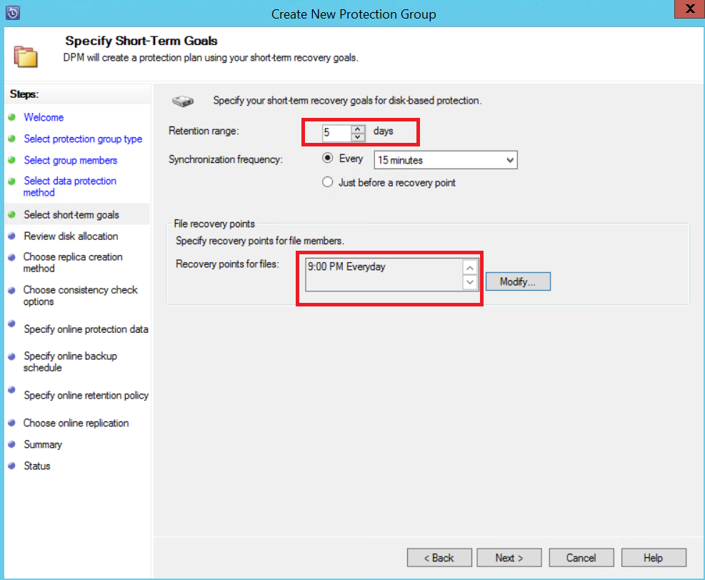

    >[AZURE.NOTE] Because recovery is most often required for data that's less than five days old, we selected a retention range of five days on disk and ensured that the backup happens during non-production hours, for this example.

6. Review the storage pool disk space allocated for the protection group, and click then **Next**.

7. For every protection group, DPM allocates disk space to store and manage replicas. At this point, DPM must create a copy of the selected data. Select how and when you want the replica created, and then click **Next**.

    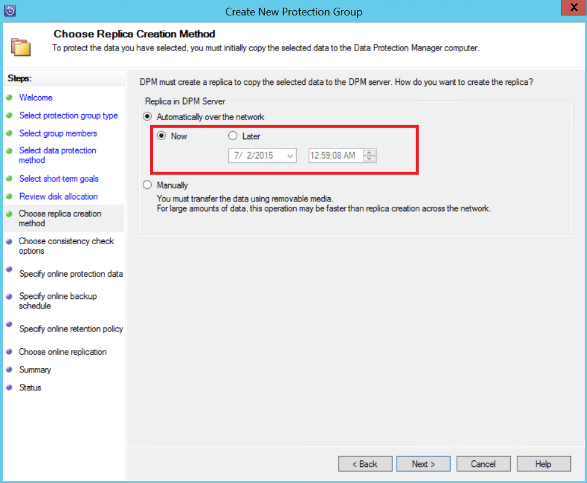

    >[AZURE.NOTE] To make sure that network traffic is not effected, select a time outside production hours.

8. DPM ensures data integrity by performing consistency checks on the replica. There are two available options. You can define a schedule to run consistency checks, or DPM can run consistency checks automatically on the replica whenever it becomes inconsistent. Select your preferred option, and then click **Next**.

    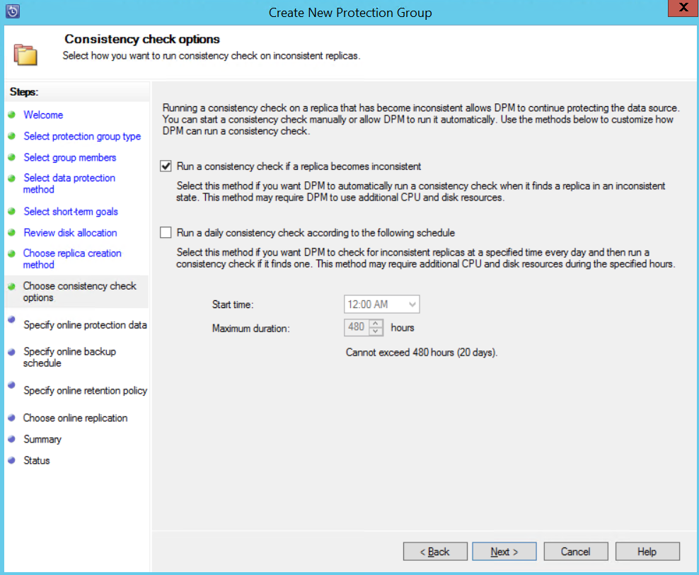

9. On the **Specify Online Protection Data** page, select the SharePoint farm that you want to protect, and then click **Next**.

    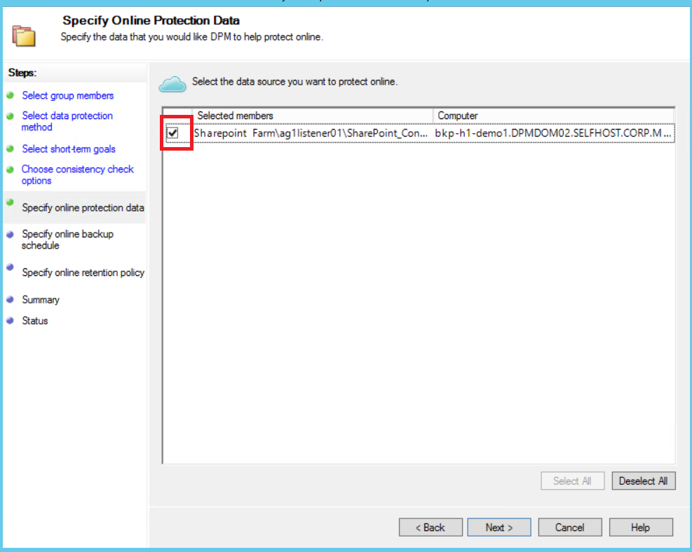

10. On the **Specify Online Backup Schedule** page, select your preferred schedule, and then click **Next**.

    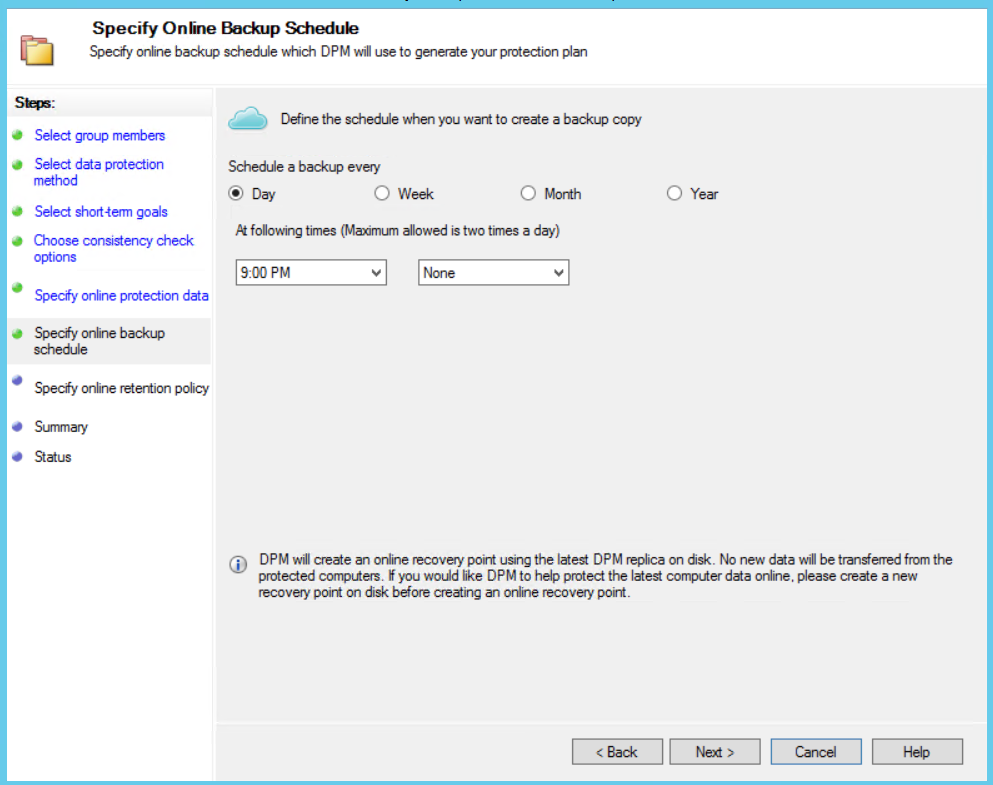

    >[AZURE.NOTE] DPM provides a maximum of two daily backups to Azure at different times. Azure Backup can also control the amount of WAN bandwidth that can be used for backups in peak and off-peak hours by using [Azure Backup Network Throttling](https://azure.microsoft.com/en-in/documentation/articles/backup-configure-vault/#enable-network-throttling).

11. Depending on the backup schedule that you selected, on the **Specify Online Retention Policy** page, select the retention policy for daily, weekly, monthly, and yearly backup points.

    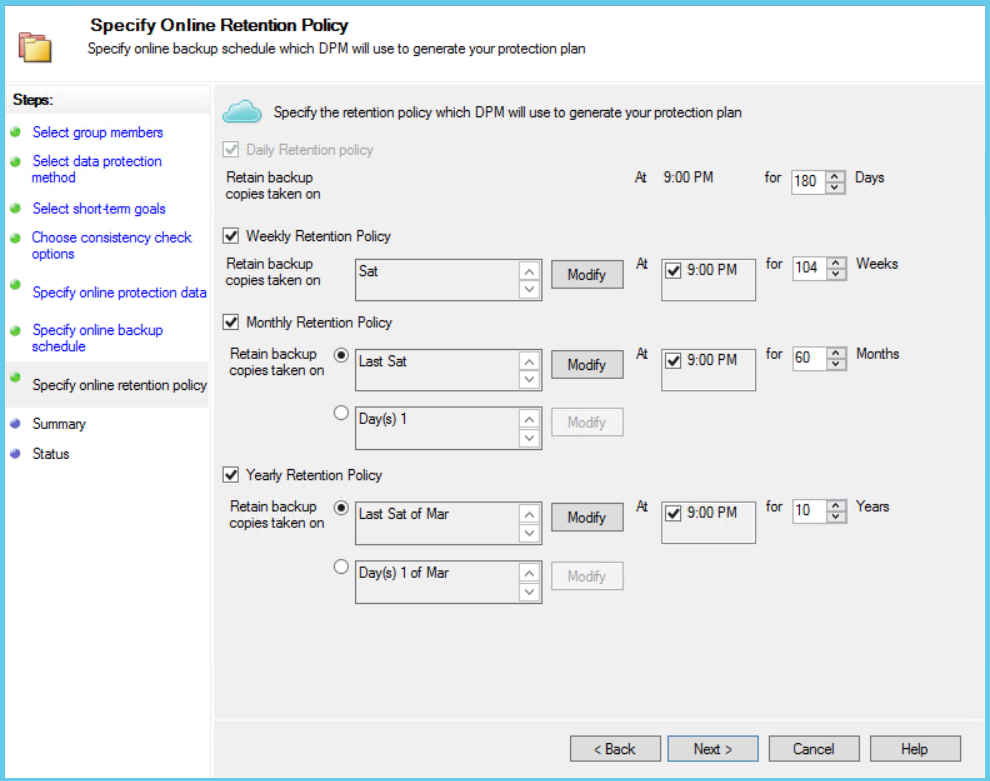

    >[AZURE.NOTE] DPM uses a grandfather-father-son retention scheme in which a different retention policy can be chosen for different backup points.

12. Similar to disk, an initial reference point replica needs to be created in Azure. Select your preferred option to create an initial backup copy to Azure, and then click **Next**.

    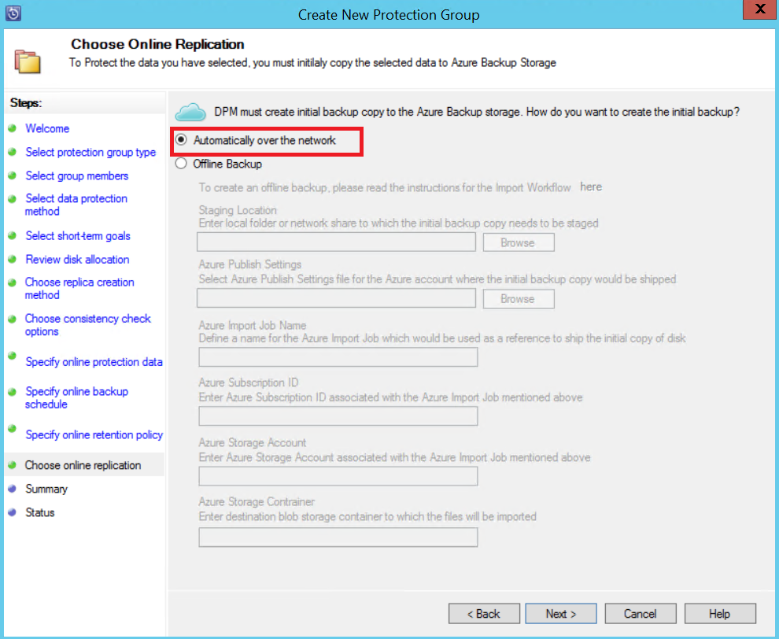

13. Review your selected settings on the **Summary** page, and then click **Create Group**. You will see a success message after the protection group has been created.

    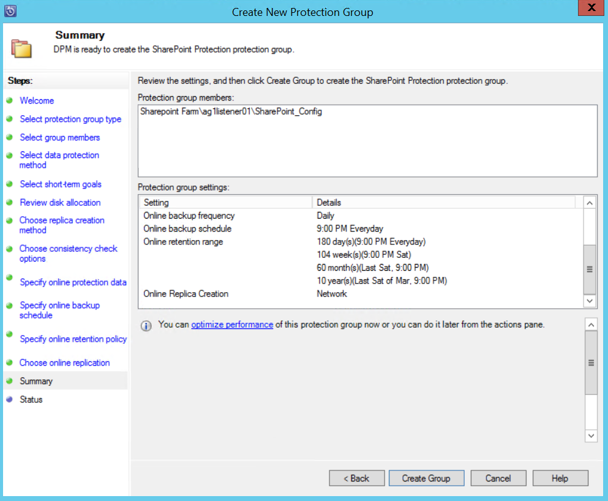

## Restore a SharePoint item from disk by using DPM
In the following example, the *Recovering SharePoint item* has been accidentally deleted and needs to be recovered.

1. Open the **DPM Administrator Console**. All SharePoint farms that are protected by DPM are shown in the **Protection** tab.

    

2. To begin to recover the item, select the **Recovery** tab.

    

3. You can search SharePoint for *Recovering SharePoint item* by using a wildcard-based search within a recovery point range.

    

4. Select the appropriate recovery point from the search results, right click the item, and then select **Recover**.

5. You can also browse through various recovery points and select a database or item to recover. Select **Date > Recovery time**, and then select the correct **Database > SharePoint farm > Recovery point > Item**.

    

6. Right-click the item, and then select **Recover** to open the **Recovery Wizard**. Click **Next**.

    

7. Select the type of recovery that you want to perform, and then click **Next**.

    

    >[AZURE.NOTE] The selection of **Recover to original** in the example recovers the item to the original SharePoint site.

8. Select the **Recovery Process** that you want to use.
    - Select **Recover without using a recovery farm** if the SharePoint farm has not changed and is the same as the recovery point that is being restored.
    - Select **Recover using a recovery farm** if the SharePoint farm has changed since the recovery point was created.

    

9. Provide a staging SQL Server instance location to recover the database temporarily, and provide a staging file share on the DPM server and the server that's running SharePoint to recover the item.

    

    DPM attaches the content database that is hosting the SharePoint item to the temporary SQL Server instance. From the content database, the DPM server recovers the item and puts it on the staging file location on the DPM server. The recovered item that's on the staging location of the DPM server now needs to be exported to the staging location on the SharePoint farm.

    

10. Select **Specify recovery options**, and apply security settings to the SharePoint farm or apply the security settings of the recovery point. Click **Next**.

    

    >[AZURE.NOTE] You can choose to throttle the network bandwidth usage. This minimizes impact to the production server during production hours.

11. Review the summary information, and then click **Recover** to begin recovery of the file.

    

12. Now select the **Monitoring** tab in the **DPM Administrator Console** to view the **Status** of the recovery.

    

    >[AZURE.NOTE] The file is now restored. You can refresh the SharePoint site to check the restored file.

## Restore a SharePoint database from Azure by using DPM

1. To recover a SharePoint content database, browse through various recovery points (as shown previously), and select the recovery point that you want to restore.

    

2. Double-click the SharePoint recovery point to show the available SharePoint catalog information.

    > [AZURE.NOTE] Because the SharePoint farm is protected for long-term retention in Azure, no catalog information (metadata) is available on the DPM server. As a result, whenever a point-in-time SharePoint content database needs to be recovered, you need to catalog the SharePoint farm again.

3. Click **Re-catalog**.

    

    The **Cloud Recatalog** status window opens.

    

    After cataloging is finished, the status changes to *Success*. Click **Close**.

    

4. Click the SharePoint object shown in the DPM **Recovery** tab to get the content database structure. Right-click the item, and then click **Recover**.

    

5. At this point, follow the [recovery steps earlier in this article](#restore-a-sharepoint-item-from-disk-using-dpm) to recover a SharePoint content database from disk.

## FAQs
Q: Which versions of DPM support SQL Server 2014 and SQL 2012 (SP2)? 
A: DPM 2012 R2 with Update Rollup 4 supports both.

Q: Can I recover a SharePoint item to the original location if SharePoint is configured by using SQL AlwaysOn (with protection on disk)? 
A: Yes, the item can be recovered to the original SharePoint site.

Q: Can I recover a SharePoint database to the original location if SharePoint is configured by using SQL AlwaysOn? 
A: Because SharePoint databases are configured in SQL AlwaysOn, they cannot be modified unless the availability group is removed. As a result, DPM cannot restore a database to the original location. You can recover a SQL Server database to another SQL Server instance.

## Next steps
- Learn more about DPM Protection of SharePoint - see [Video Series - DPM Protection of SharePoint](http://channel9.msdn.com/Series/Azure-Backup/Microsoft-SCDPM-Protection-of-SharePoint-1-of-2-How-to-create-a-SharePoint-Protection-Group)
- Review [Release Notes for System Center 2012 - Data Protection Manager](https://technet.microsoft.com/library/jj860415.aspx)
- Review [Release Notes for Data Protection Manager in System Center 2012 SP1](https://technet.microsoft.com/library/jj860394.aspx)
