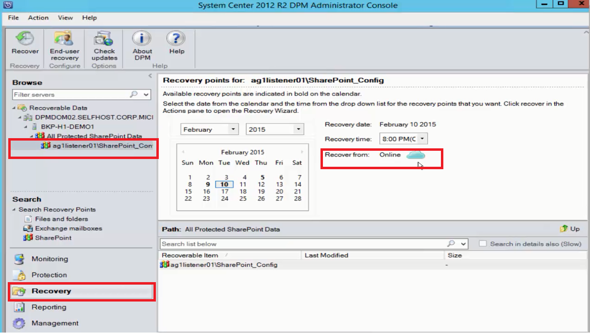
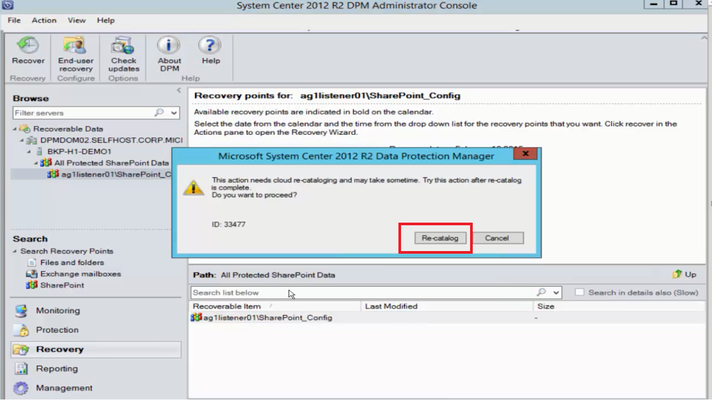
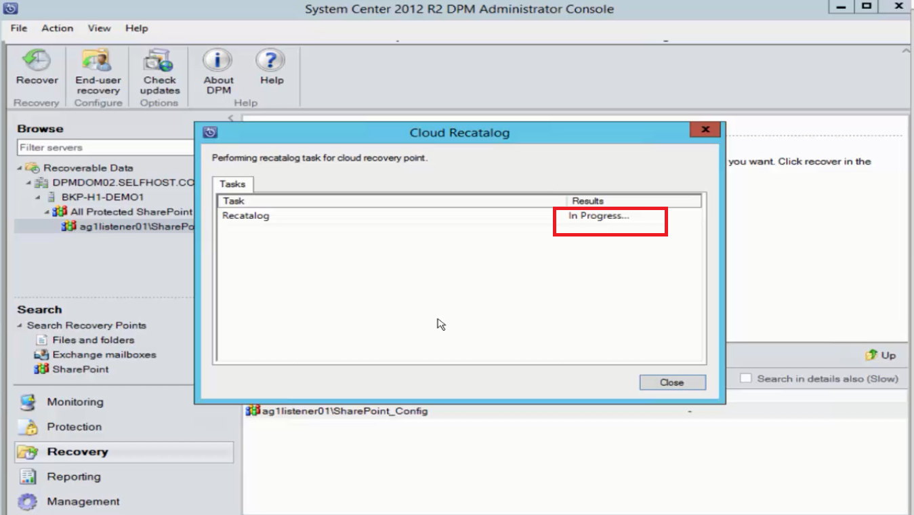
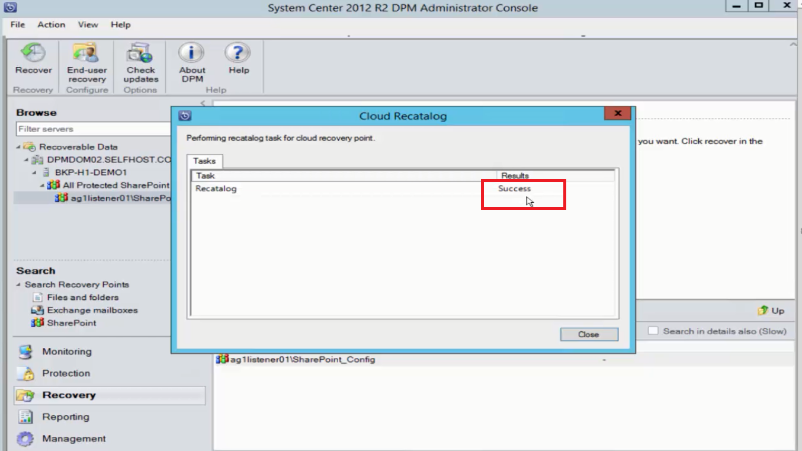
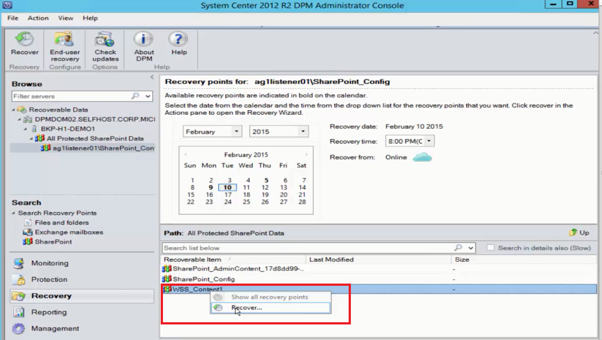

# Back up and restore a SharePoint farm with Azure Backup and DPM

This article describes how to back up and restore a SharePoint farm in Azure by using Azure Backup and System Center Data Protection Manager (DPM). You configure SharePoint protection and a DPM protection group, monitor backup jobs, and recover SharePoint content databases from Azure recovery points.

With DPM, you can keep local disk copies for fast recovery and Azure copies for economical, long-term retention. Azure Backup supports daily, weekly, monthly, and yearly recovery points with configurable retention.

[!INCLUDE [The functionality of Azure Backup trim process.](../../includes/backup-trim-process-notification.md)]

## SharePoint supported scenarios

For information on the supported SharePoint versions and the DPM versions required to back them up, see [this article](/system-center/dpm/dpm-protection-matrix#applications-backup).

## Prerequisites

Before you proceed to back up a SharePoint farm to Azure, ensure that you've met all the [prerequisites for using Microsoft Azure Backup](backup-azure-dpm-introduction.md#prerequisites-and-limitations) to protect workloads. The tasks in prerequisites also include: create a backup vault, download vault credentials, install Azure Backup agent, and register DPM/Azure Backup Server with the vault.

For other prerequisites and limitations, see [Back up SharePoint with DPM](/system-center/dpm/back-up-sharepoint#prerequisites-and-limitations).

## Configure backup

To back up the SharePoint farm, configure protection for SharePoint using *ConfigureSharePoint.exe*, and then create a protection group in DPM. See the DPM documentation to learn [how to configure backup](/system-center/dpm/back-up-sharepoint#configure-backup).

## Monitor operations

To monitor the backup job, see [Monitoring DPM backup](/system-center/dpm/back-up-sharepoint#monitoring).

## Restore SharePoint data

To learn how to restore a SharePoint item from a disk with DPM, see [Restore SharePoint data](/system-center/dpm/back-up-sharepoint#restore-sharepoint-data).

## Restore a SharePoint database from Azure using DPM

To recover a SharePoint content database, follow these steps:

1. Browse through various recovery points (as shown previously), and select the recovery point that you want to restore.

    
2. Double-click the SharePoint recovery point to show the available SharePoint catalog information.

   > [!NOTE]
   > Because the SharePoint farm is protected for long-term retention in Azure, no catalog information (metadata) is available on the DPM server. So, whenever a point-in-time SharePoint content database needs to be recovered, you need to catalog the SharePoint farm again.

3. Select **Re-catalog**.

    

    The **Cloud Recatalog** status window opens.

    

    Once the cataloging is finished and the status changes to *Success*, select **Close**.

    

4. On the DPM **Recovery** tab, select the *SharePoint object* to get the content database structure, right-click the item, and then select **Recover**.

    
5. To recover a SharePoint content database from disk, see [this section](#restore-sharepoint-data).

## Switch the Front-End Web Server

If you've more than one front-end web server, and want to switch the server that DPM uses to protect the farm, see [Switching the Front-End Web Server](/system-center/dpm/back-up-sharepoint#switching-the-front-end-web-server).

## Next steps

* [Azure Backup Server and DPM - FAQ](backup-azure-dpm-azure-server-faq.yml)
* [Troubleshoot System Center Data Protection Manager](backup-azure-scdpm-troubleshooting.md)

## Related content

[Manage backup to Azure for DPM servers via PowerShell](backup-dpm-automation.md).